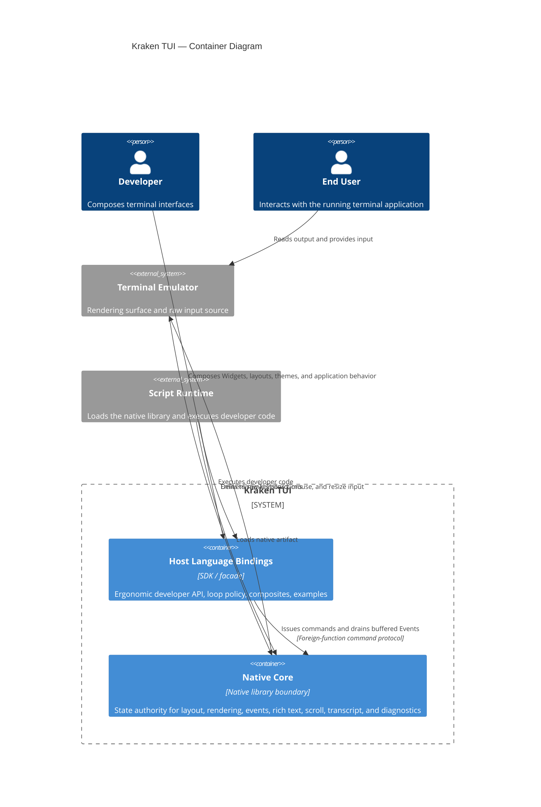
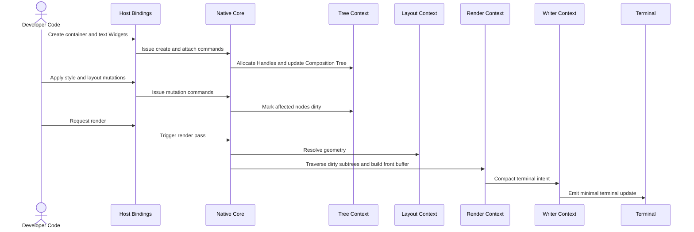
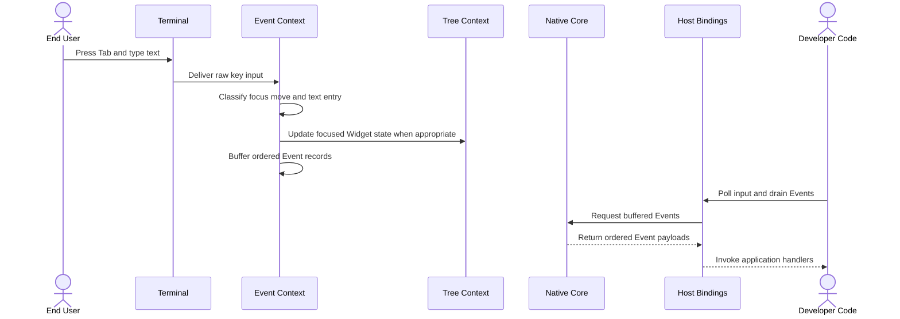
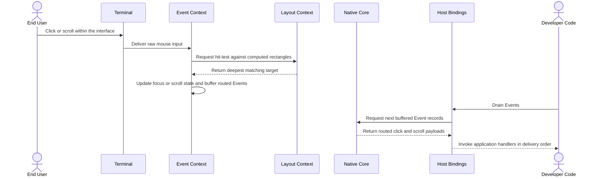
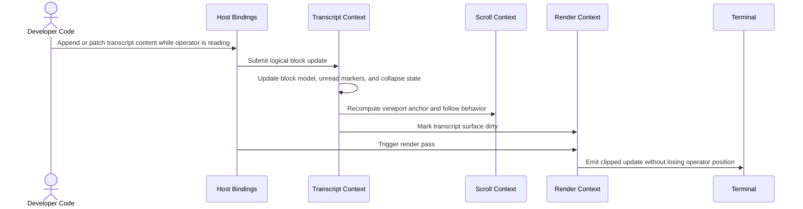

# Solution Architecture

## 0. Version History & Changelog
- v3.2.0 - Reformatted to the current stage-2 framework skeleton and clarified logical boundaries without changing the approved cross-language architecture.
- v3.1.0 - Clarified the architectural emphasis around transcript-heavy surfaces, anchor-aware viewports, developer tooling, and pane-oriented workflows.
- v3.0.0 - Aligned architecture with the v3 implementation wave around writer throughput, text caching, runner ergonomics, staple widgets, release UX, and benchmark gates.
- ... [Older history truncated, refer to git logs]

## 1. Architectural Strategy & Archetype Alignment
- **Architectural Pattern:** Modular monolith with a cross-language facade.
- **Why this pattern fits the PRD:** Kraken is a single-process library rather than a networked product. The PRD asks for native performance, low memory use, and fast developer onboarding; a modular monolith avoids the operational premium of distributed systems while still preserving clean boundaries between the native performance engine and the host-facing API.
- **Core trade-offs accepted:** The architecture favors explicit host-driven control over hidden background orchestration, keeps all mutable UI state in one native authority, and accepts a tighter internal coupling inside the native core in exchange for lower latency and a smaller foreign-function surface.

### 1.1 Core Architectural Invariant
- **Invariant:** The Native Core is the performance engine; Host Language Bindings are the steering layer.
- **Meaning:** Layout computation, tree traversal, buffer diffing, text parsing, hit-testing, scroll semantics, and event classification remain in the Native Core. The Host Layer stays responsible for ergonomics, application loop policy, developer-assigned identifiers, and composition patterns built on top of the command protocol.

### 1.2 Architectural Rationale
- The cross-language split preserves one performance-critical authority while letting Developers work from a familiar host language API.
- The facade boundary prevents internal native module complexity from leaking into application code.
- The host-driven render and event loop model keeps state visibility and terminal lifecycle explicit, which matters for deterministic debugging and long-lived workflows.

### 1.3 Current Architectural Emphasis

| Emphasis | Choice | Why it matters |
| --- | --- | --- |
| **Transcript-heavy surfaces** | Treat long-lived transcript, log, and trace views as a first-class workload within the Native Core rather than as a host-side tree-management pattern. | Streaming, dense, long-running workflows are now product-defining. |
| **Anchor-aware viewports** | Prefer logical viewport anchors, unread markers, and nested-scroll handoff over raw row-offset management. | Operator readability must survive ongoing content churn. |
| **Developer tooling as product work** | Treat overlays, snapshots, traces, and inspection surfaces as architecture-level concerns. | The framework must be inspectable before it can be dependable. |
| **Pane-oriented composition** | Treat multi-region workflows as a primary application shape rather than secondary visual garnish. | Agent consoles, repo inspectors, and ops tools depend on simultaneous navigation, viewing, and inspection. |

## 2. System Containers
### 2.1 Native Core
- **Logical Type:** Native library boundary
- **Responsibility:** Own all mutable Widget state, resolve layout, render to the terminal Surface, classify and buffer Events, manage scroll semantics, process rich text, and expose diagnostics for long-lived terminal workflows.
- **Inputs:** Host-issued commands, layout and style mutations, content updates, render requests, terminal input, terminal resize signals
- **Outputs:** Rendered terminal instructions, buffered Events, diagnostics snapshots and counters, explicit error results
- **Depends on:** Terminal Emulator, Script Runtime load boundary

### 2.2 Host Language Bindings
- **Logical Type:** Host SDK / developer facade
- **Responsibility:** Provide an ergonomic typed API for Developers, translate host-language intent into command calls, own loop policy, maintain developer-assigned ID maps, and assemble higher-level composites and examples without becoming a second source of UI truth.
- **Inputs:** Developer code, application state changes, optional replay streams, userland commands
- **Outputs:** Native command calls, host-facing Widget abstractions, developer-friendly diagnostics, example and composite surfaces
- **Depends on:** Native Core, Script Runtime

### 2.3 Terminal Emulator
- **Logical Type:** External rendering surface
- **Responsibility:** Present visual output, capture raw keyboard and mouse input, and expose terminal capability constraints.
- **Inputs:** Terminal instructions emitted by the Native Core
- **Outputs:** Raw input events, surface dimensions, capability characteristics
- **Depends on:** Operating system terminal primitives

### 2.4 Script Runtime
- **Logical Type:** External execution host
- **Responsibility:** Load the Native Core artifact, execute Developer code, and mediate the foreign-function boundary.
- **Inputs:** Developer program, package artifacts, runtime configuration
- **Outputs:** Process lifecycle, library loading, host-language execution
- **Depends on:** Native Core artifact, operating system process model

### 2.5 Native Core Bounded Contexts

| Bounded Context | Responsibility | Depends on |
| --- | --- | --- |
| **Tree** | Composition Tree CRUD, Handle allocation, parent-child relationships, subtree mutation, and dirty propagation | None |
| **Layout** | Constraint resolution, computed geometry, resize adaptation, and hit-test rectangles | Tree |
| **Theme** | Named style defaults, subtree bindings, and inherited theme resolution | Tree |
| **Style** | Explicit style application plus resolution against theme defaults | Tree, Theme |
| **Animation** | Time-based property transitions and animation-state progression | Tree, Style |
| **Text** | Rich text parsing, syntax highlighting, and wrap resolution | Style, Text Cache |
| **Text Cache** | Bounded reuse of parse, highlight, and wrap artifacts | Text |
| **Transcript** | Ordered logical blocks, streaming patch semantics, collapse state, unread markers, and viewport anchor semantics | Tree, Text, Scroll, Render |
| **Render** | Buffer generation, dirty diffing, clipping, and render-pass orchestration | Tree, Layout, Style, Text, Scroll |
| **Writer** | Terminal-intent compaction and efficient emission of cursor and style deltas | Render |
| **Event** | Input capture, classification, focus management, and buffered event delivery | Tree, Layout |
| **Scroll** | Scroll state, nested-scroll handoff rules, and clipping-relevant viewport data | Tree, Layout, Render |
| **Devtools** | Overlays, snapshots, traces, and diagnostic views for layout, focus, viewport, and render behavior | Tree, Layout, Render, Event |

### 2.6 Container Relationship Summary
- Host Language Bindings communicate with the Native Core through a flat command protocol and explicit event-drain model.
- The Native Core communicates with the Terminal Emulator through terminal output and raw input handling.
- The Script Runtime loads the Native Core and executes the Host Layer, but the Native Core never calls back into the Host Layer.

## 3. Container Diagram (Mermaid)

```mermaid
C4Container
    title Kraken TUI — Container Diagram

    Person(developer, "Developer", "Composes terminal interfaces")
    Person(enduser, "End User", "Interacts with the running terminal application")

    System_Boundary(kraken, "Kraken TUI") {
        Container(host, "Host Language Bindings", "SDK / facade", "Ergonomic developer API, loop policy, composites, examples")
        Container(core, "Native Core", "Native library boundary", "State authority for layout, rendering, events, rich text, scroll, transcript, and diagnostics")
    }

    System_Ext(terminal, "Terminal Emulator", "Rendering surface and raw input source")
    System_Ext(runtime, "Script Runtime", "Loads the native library and executes developer code")

    Rel(developer, host, "Composes Widgets, layouts, themes, and application behavior")
    Rel(host, core, "Issues commands and drains buffered Events", "Foreign-function command protocol")
    Rel(core, terminal, "Emits terminal instructions")
    Rel(terminal, core, "Delivers raw keyboard, mouse, and resize input")
    Rel(enduser, terminal, "Reads output and provides input")
    Rel(runtime, host, "Executes developer code")
    Rel(runtime, core, "Loads native artifact")
```

## 4. Critical Execution Flows
### 4.1 Widget Composition and First Render
- **Maps to PRD capability:** Epic 1 - Widget Composition; Epic 2 - Spatial Layout; Epic 3 - Visual Styling

```mermaid
sequenceDiagram
    actor Dev as Developer Code
    participant Host as Host Bindings
    participant Core as Native Core
    participant Tree as Tree Context
    participant Layout as Layout Context
    participant Render as Render Context
    participant Writer as Writer Context
    participant Term as Terminal

    Dev->>Host: Create container and text Widgets
    Host->>Core: Issue create and attach commands
    Core->>Tree: Allocate Handles and update Composition Tree
    Dev->>Host: Apply style and layout mutations
    Host->>Core: Issue mutation commands
    Core->>Tree: Mark affected nodes dirty
    Dev->>Host: Request render
    Host->>Core: Trigger render pass
    Core->>Layout: Resolve geometry
    Core->>Render: Traverse dirty subtrees and build front buffer
    Render->>Writer: Compact terminal intent
    Writer->>Term: Emit minimal terminal update
```

### 4.2 Keyboard Input and Focus Traversal
- **Maps to PRD capability:** Epic 4 - Input & Focus

```mermaid
sequenceDiagram
    actor EU as End User
    participant Term as Terminal
    participant Event as Event Context
    participant Tree as Tree Context
    participant Core as Native Core
    participant Host as Host Bindings
    actor Dev as Developer Code

    EU->>Term: Press Tab and type text
    Term->>Event: Deliver raw key input
    Event->>Event: Classify focus move and text entry
    Event->>Tree: Update focused Widget state when appropriate
    Event->>Event: Buffer ordered Event records
    Dev->>Host: Poll input and drain Events
    Host->>Core: Request buffered Events
    Core-->>Host: Return ordered Event payloads
    Host-->>Dev: Invoke application handlers
```

### 4.3 Mouse Hit-Testing and Routed Interaction
- **Maps to PRD capability:** Epic 4 - Input & Focus; Epic 5 - Scrollable Regions

```mermaid
sequenceDiagram
    actor EU as End User
    participant Term as Terminal
    participant Event as Event Context
    participant Layout as Layout Context
    participant Core as Native Core
    participant Host as Host Bindings
    actor Dev as Developer Code

    EU->>Term: Click or scroll within the interface
    Term->>Event: Deliver raw mouse input
    Event->>Layout: Request hit-test against computed rectangles
    Layout-->>Event: Return deepest matching target
    Event->>Event: Update focus or scroll state and buffer routed Events
    Dev->>Host: Drain Events
    Host->>Core: Request next buffered Event records
    Core-->>Host: Return routed click and scroll payloads
    Host-->>Dev: Invoke application handlers in delivery order
```

### 4.4 Streaming Transcript Update with Stable Viewport
- **Maps to PRD capability:** Epic 5 - Scrollable Regions; current product emphasis on long-lived developer and agent workflows

```mermaid
sequenceDiagram
    actor Dev as Developer Code
    participant Host as Host Bindings
    participant Transcript as Transcript Context
    participant Scroll as Scroll Context
    participant Render as Render Context
    participant Term as Terminal

    Dev->>Host: Append or patch transcript content while operator is reading
    Host->>Transcript: Submit logical block update
    Transcript->>Transcript: Update block model, unread markers, and collapse state
    Transcript->>Scroll: Recompute viewport anchor and follow behavior
    Transcript->>Render: Mark transcript surface dirty
    Host->>Render: Trigger render pass
    Render->>Term: Emit clipped update without losing operator position
```

## 5. Resilience & Cross-Cutting Concerns
### 5.1 Security / Identity Strategy
- Kraken is a local, in-process library with no network authentication boundary in its primary architecture.
- The primary security-sensitive boundary is the host-to-native facade, so correctness centers on Handle validation, panic containment, string validation, and explicit copy semantics rather than identity or session management.

### 5.2 Failure Handling Strategy

| Failure Class | Why it matters | Logical mitigation |
| --- | --- | --- |
| **Native panic at the facade boundary** | A panic crossing the boundary could crash the host unpredictably. | The facade boundary converts failures into explicit status results rather than letting failures escape across language boundaries. |
| **Invalid or stale Handles** | Incorrect handle use could corrupt tree state or produce undefined behavior. | Every command validates Handle legitimacy before mutating state. |
| **Terminal capability mismatch** | Color depth, mouse support, and resize behavior vary by terminal. | Rendering and input handling degrade gracefully rather than assuming maximal capability. |
| **Render budget pressure** | Long-lived dense views can exceed interactive budgets. | The architecture keeps heavy work in one native authority, exposes diagnostics, and treats frame skipping as informational rather than catastrophic. |
| **Viewport churn during streaming updates** | Operators can lose context in transcript-heavy workflows. | Scroll semantics are anchor-based and nested-scroll rules are explicit. |
| **Malformed string or payload input** | Invalid host-provided data can poison the render or event pipeline. | The facade treats incoming payloads as untrusted and validates before use. |

### 5.3 Observability Strategy
- The architecture exposes human-readable error diagnostics through the facade boundary.
- Performance counters and debug traces are architecture-level capabilities rather than incidental debug logging.
- Developer tooling includes overlays, snapshots, and trace streams so layout, focus, dirty propagation, and viewport behavior are inspectable under real workloads.

### 5.4 Configuration Strategy
- The Host Layer owns loop policy, render cadence, example wiring, developer-assigned identifiers, and optional dev-session orchestration.
- The Native Core owns stateful runtime behavior such as render semantics, theme resolution, transcript anchor behavior, and event buffering.
- Experimental behavior remains opt-in and must not silently change the default synchronous contract.

### 5.5 Data Integrity / Consistency Notes
- The Composition Tree and all widget-affecting state have one native source of truth.
- Event delivery is ordered and explicit: ingress, buffering, and host-driven draining are separate concerns.
- Copy semantics are favored at the boundary so internal pointers and mutable aliases do not leak into host space.

## 6. Logical Risks & Technical Debt
### Risk 1 - Centralized Native State Remains a Scaling Constraint
- **Why it matters:** A single native authority keeps semantics simple, but it also means the render and mutation pipeline must remain carefully budgeted as workload density increases.
- **Mitigation or follow-up:** Preserve clear module boundaries, keep diagnostics strong, and treat any move toward background orchestration as an evidence-driven exception rather than a default.

### Risk 2 - Rich Text Extensibility Can Reintroduce Host-Side Latency
- **Why it matters:** Built-in formats fit the architecture well, but developer-defined pre-processing can shift expensive work back to the Host Layer.
- **Mitigation or follow-up:** Keep built-in formats native-first and document custom-format caching expectations clearly.

### Risk 3 - Handle Space and Lifecycle Discipline Depend on Long-Lived Hygiene
- **Why it matters:** Opaque Handle systems simplify the boundary, but they also make leak detection and lifecycle discipline essential for long-running applications.
- **Mitigation or follow-up:** Preserve explicit destroy semantics, leak warnings, and strong diagnostics around invalid-handle usage.

### Risk 4 - Terminal Backend and Capability Variation Remain a Hard External Dependency
- **Why it matters:** The product depends on real terminal behavior that Kraken does not control.
- **Mitigation or follow-up:** Keep backend abstraction, degrade gracefully, and continue using examples and replay fixtures to catch capability-sensitive regressions.

### Risk 5 - Layout and Pane Density Can Push the Intended Workload Envelope
- **Why it matters:** Deeply nested or pane-heavy application shapes are now central to the product identity, which increases pressure on layout and clipping correctness.
- **Mitigation or follow-up:** Preserve subtree invalidation, measure dense examples continuously, and resist feature additions that bypass the existing layout model without evidence.

### Risk 6 - Cross-Language Maintenance Cost Is Real Even When Performance Wins
- **Why it matters:** A cross-language library gains performance and ergonomics, but it also carries more boundary contracts, packaging surface, and testing responsibility than a single-language framework.
- **Mitigation or follow-up:** Keep the facade narrow, maintain strong integration tests, and document the boundary contract rigorously.

### Risk 7 - Background Rendering Remains Tempting but Semantically Expensive
- **Why it matters:** Background rendering can look attractive under benchmark pressure but can easily undermine event ordering, state visibility, and terminal lifecycle guarantees.
- **Mitigation or follow-up:** Preserve synchronous rendering as the default contract and require benchmark, semantic, and shutdown parity before any promotion of experimental threading.

## Appendix A: Architectural Continuity Notes
### A.1 Upstream Decision Consistency

| Historical Decision | Architectural impact retained today |
| --- | --- |
| Retained-mode rendering with dirty diffing | Render path remains double-buffered and dirty-aware. |
| Native layout ownership | Constraint resolution and geometry stay inside the Native Core. |
| Opaque Handle model | Host-facing references remain opaque and invalid sentinel handling stays explicit. |
| Imperative API first, reactive layer later | Declarative bindings continue to wrap the same command protocol rather than replacing it. |
| Backend abstraction | Terminal I/O remains behind an internal boundary rather than hard-coded into every context. |

### A.2 Cross-Version Core Decisions

| Decision | Choice | Rationale |
| --- | --- | --- |
| **Event delivery model** | Hybrid buffer-poll model with native capture and host-driven drain | Avoids callback-heavy foreign-function complexity while keeping latency inside PRD limits. |
| **State ownership** | Native Core owns all mutable UI state | Preserves a single source of truth and keeps heavy compute in the performance layer. |
| **Render topology** | Batched-synchronous render pass triggered by the host | Makes timing explicit and minimizes boundary crossings. |
| **Rich text location** | Built-in formats handled natively; custom formats enter as pre-processed host input | Keeps CPU-heavy parsing native-first without requiring callbacks. |
| **Hit-testing strategy** | Event routing depends on layout-owned geometry | Keeps visual stacking and interaction semantics aligned. |
| **Animation tick model** | Host-driven render cadence with native time-based progression | Preserves explicit control and keeps the Native Core timer-free by default. |
| **Theme architecture** | Dedicated theme context separate from direct style mutation | Prevents style resolution and theme inheritance from collapsing into one concern. |
| **Developer-assigned IDs** | Host-layer concern only | Keeps the Native Core focused on Handles and computational ownership. |
| **Headless runtime path** | Test utility rather than production lifecycle contract | Preserves deterministic testing without redefining the production architecture. |

### A.3 Resolved Open Questions Preserved for Continuity

| Question | Resolution |
| --- | --- |
| High-frequency input flooding the host side | The native event buffer absorbs bursty input; the host drains on its own cadence. |
| Layout caching and invalidation | Layout recomputation stays scoped to dirty subtrees rather than full-tree redraws. |
| String interning | Remains an implementation-time optimization, not an architecture-layer commitment. |
| Developer-facing Widget IDs | Remain host-managed and invisible to the Native Core. |
