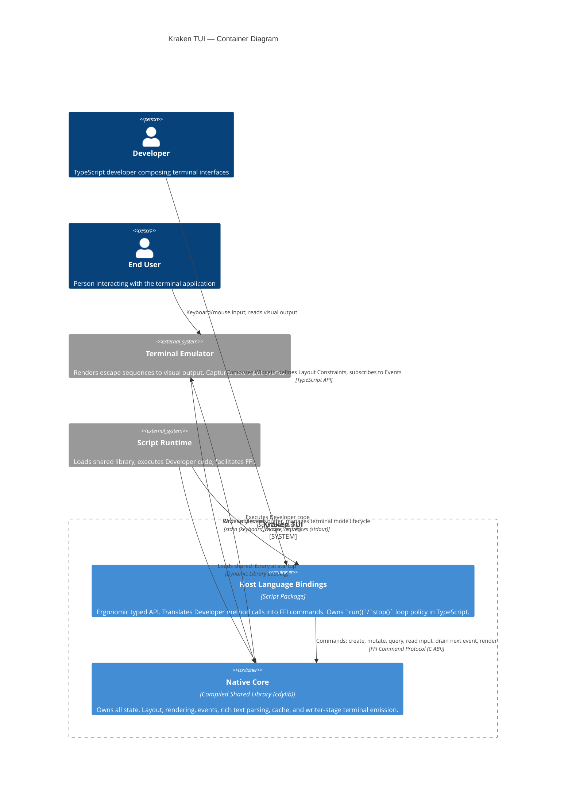
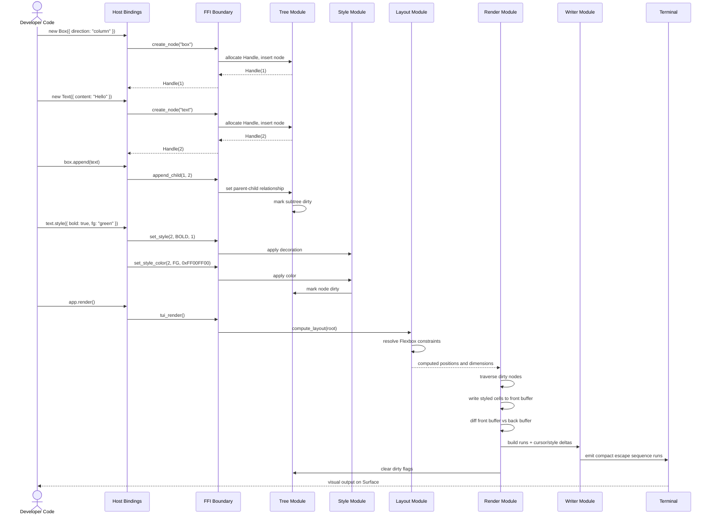
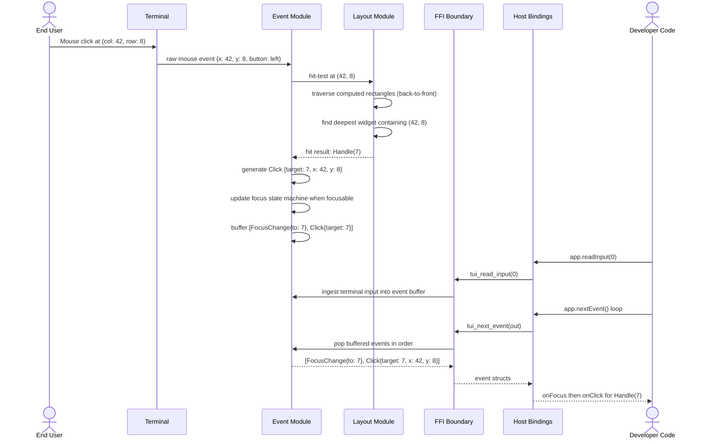

# Architecture Document

## Kraken TUI

**Version**: 3.1
**Status**: Draft (v3 baseline, v4 emphasis)
**Date**: March 2026
**Source of Truth**: [PRD.md](./PRD.md)
**Upstream Decisions**: [ADR-001 through ADR-005](./architecture/)

**Changelog**:

- v3.1 — Clarified the next-phase logical emphasis without changing the core architectural invariant: transcript-heavy surfaces for long-lived applications, anchor-aware viewport behavior, developer tooling/inspection, and pane-oriented workflows are now the primary logical extensions of the existing Native Core and Host Layer split.
- v3.0 — Aligned Architecture with v3 TechSpec scope: terminal writer stage (ADR-T24), rich-text wrap cache (ADR-T25), host Runner API (ADR-T26), dashboard staple widgets (ADR-T27), editor-grade TextArea extensions (ADR-T28), distribution prebuild strategy (ADR-T29), deterministic golden and benchmark gates (ADR-T30), and conditional background render thread policy (ADR-T31). Updated FFI contract semantics and event drain flows (`tui_read_input` + `tui_next_event`).
- v2.3 — Added v2 scope: Tree Module operations (subtree destruction, indexed insertion), v2 module additions (Reconciler Layer), new Appendix B decisions for v2. Resolved Risk 1 with safe concurrency primitives. Added Risk 7 (background render thread — explicitly descoped to v3). Updated Appendix A with ADR-004 amendment. **v2 COMPLETE — March 2026**.
- v2.2 — Removed §6 Performance Budgets (implementation-level detail; migrated to TechSpec §5.5). Removed stale `lrsa-320` marker. Fixed duplicate §6 numbering — Logical Risks & Technical Debt is now the sole §6 per the Architecture output standard.

---

## 1. ARCHITECTURAL STRATEGY

### The Pattern

**Modular Monolith with Cross-Language Facade.**

Kraken TUI is a single-process library composed of two language layers connected by a Foreign Function Interface (FFI) boundary:

- **Native Core** — A compiled shared library containing all state, computation, and rendering logic. Internally decomposed into strictly bounded modules.
- **Host Language Bindings** — A thin ergonomic wrapper that translates Developer intent into FFI commands. Contains zero business logic.

The FFI boundary enforces the **Facade pattern** (GoF): the Host Layer sees a flat command protocol, not the internal module structure. Internal to the Native Core, modules communicate through shared in-process state, with boundaries enforced by the language's visibility system.

The render pipeline follows **Pipe-and-Filter**: mutation commands accumulate → animation advancement → layout resolution → dirty-flag diffing → writer run compaction → minimal terminal I/O. The input subsystem follows **Event-Driven**: terminal input is captured, buffered, classified, and drained by the Host Layer through `tui_read_input()` and `tui_next_event()` each tick.

The current architectural emphasis is not generic widget breadth. It is the support of long-lived, streaming, information-dense terminal applications where transcript behavior, scrolling correctness, pane layout, and internal inspectability matter more than broad ecosystem polish.

### Core Architectural Invariant

**Rust is the performance engine; TypeScript is the steering wheel.**

All CPU-intensive work — layout computation, tree traversal, buffer diffing, text parsing, hit-testing, event classification — executes in the Native Core. The Host Layer's sole responsibility is ergonomic command dispatch. This invariant governs every architectural decision in this document.

### Justification

Per **Martin Fowler** (_Patterns of Enterprise Application Architecture_), the "Microservices Premium" — the operational overhead of distributed systems — is inappropriate for a single-process library. A Modular Monolith provides clean separation of concerns with zero deployment, serialization, or network overhead.

Per **Uncle Bob** (_Clean Architecture_), dependencies point inward: the Host Layer depends on the Native Core's command protocol, never the reverse. The Native Core has zero knowledge of TypeScript, Bun, or any host runtime. This satisfies the **Dependency Rule** and ensures the core is independently testable.

Per **Eric Evans** (_Domain-Driven Design_), the FFI boundary is the primary **Bounded Context** separator. The Native Core's domain (widget trees, layout computation, rendering) and the Host Layer's domain (Developer-facing API ergonomics) are decoupled by the command protocol. Data structures do not leak across this boundary — only opaque Handles and serialized descriptors cross it.

---

## 2. SYSTEM CONTAINERS (C4 Level 2)

| Container                  | Logical Type                     | Responsibility                                                                                                                                                                                                                     |
| -------------------------- | -------------------------------- | ---------------------------------------------------------------------------------------------------------------------------------------------------------------------------------------------------------------------------------- |
| **Native Core**            | Compiled Shared Library (cdylib) | Owns all widget state, performs layout computation, renders to terminal, processes input events, parses rich text, and applies writer-stage terminal emission optimization. The single performance-critical artifact.              |
| **Host Language Bindings** | Script Package                   | Provides an ergonomic, type-safe API for Developers. Translates method calls into FFI commands. Contains zero rendering, layout, or widget-state business logic. Owns loop policy via host-level runner APIs (`run()` / `stop()`). |
| **Terminal Emulator**      | External System                  | The rendering surface. Receives escape sequences from the Native Core and presents visual output to the End User. Provides raw input events.                                                                                       |
| **Script Runtime**         | External System                  | Loads the Native Core shared library, executes Developer code, and facilitates the FFI boundary.                                                                                                                                   |

### Internal Modules (Native Core Decomposition)

These are not independently deployable containers but are architecturally significant bounded contexts within the Native Core. Each module has a single responsibility and communicates through the shared `TuiContext` state.

| Module                | Responsibility                                                                                                                                                                                                                                                                                                             | Key Dependencies                   |
| --------------------- | -------------------------------------------------------------------------------------------------------------------------------------------------------------------------------------------------------------------------------------------------------------------------------------------------------------------------- | ---------------------------------- |
| **Tree Module**       | Composition Tree CRUD operations. Handle allocation (per ADR-003). Parent-child relationships. Dirty-flag propagation. v2: cascading subtree destruction and indexed child insertion. v3: expanded node taxonomy (`Table`, `List`, `Tabs`, `Overlay`) and per-widget optional state attachment at node level.              | None (foundational)                |
| **Layout Module**     | Flexbox constraint resolution (per ADR-002). Resize handling. Caches computed positions and dimensions. Provides hit-test geometry.                                                                                                                                                                                        | Tree Module                        |
| **Theme Module**      | _(v1)_ Owns named theme definitions (collections of style defaults). Maintains theme-to-subtree bindings. Resolves applicable theme per node via ancestry traversal. Provides built-in light and dark themes. v2: constraint-based inheritance for nested subtrees, per-NodeType style defaults.                           | Tree Module                        |
| **Style Module**      | Color resolution (named, hex, 256-palette). Text decoration (bold, italic, underline). Border computation. v0: explicit styles only. v1: merges with Theme defaults (explicit styles win).                                                                                                                                 | Tree Module (v0); Tree, Theme (v1) |
| **Animation Module**  | _(v1)_ Manages active animation registry. Advances timed property transitions each render cycle using elapsed time. Applies interpolated values to target widgets and marks them dirty. Degrades gracefully when frame budget is exceeded (skips interpolation frames). v2: position animation and choreography timelines. | Tree, Style Modules                |
| **Text Module**       | Rich text parsing: Markdown to styled spans, syntax highlighting, and wrap resolution. Built-in parsers are native. Custom formats are pre-processed in the Host Layer and arrive as styled span descriptors. v3: resolves cache keys and delegates bounded storage concerns to Text Cache Module.                         | Style, Text Cache Modules          |
| **Text Cache Module** | _(v3)_ Owns bounded LRU cache for parse/highlight/wrap artifacts keyed by content hash, format, language hash, wrap width, and style fingerprint. Enforces byte-cap accounting and eviction policy.                                                                                                                        | Text Module                        |
| **Transcript Module** | _(v4 focus)_ Owns ordered transcript/log-style content blocks, streaming append-or-patch updates, group collapse state, unread markers, and logical viewport anchors for long-lived surfaces.                                                                                                                               | Tree, Text, Scroll, Render Modules |
| **Render Module**     | Double-buffered cell grid. Dirty-flag diffing (per ADR-001). Produces terminal-intent runs from changed cells and delegates terminal emission to Writer Module. Terminal capability detection and graceful degradation are preserved.                                                                                      | Tree, Layout, Style, Text, Scroll  |
| **Writer Module**     | _(v3)_ Stateful terminal writer stage after diffing. Compacts contiguous runs, minimizes cursor/style commands by delta, applies frame-end reset policy, and records write-throughput counters.                                                                                                                            | Render Module, Terminal Backend    |
| **Event Module**      | Terminal input capture. Event classification (key, mouse, resize, focus). Event buffer for poll-drain model using `tui_read_input()` + `tui_next_event()`. Hit-testing (mouse to widget routing via Layout geometry). Focus state machine (depth-first, DOM-order traversal, focus/blur lifecycle).                        | Tree, Layout Modules               |
| **Scroll Module**     | Viewport state per scrollable widget. Overflow detection. Scroll position persistence across Render Passes. Content clipping during render. v3: native scrollbar presentation controls (visibility, side, width). v4 focus: anchor-aware viewport semantics and nested scroll handoff for transcript-heavy surfaces.        | Tree, Layout, Render Modules       |
| **Devtools Module**   | _(v4 focus)_ Exposes inspectability concerns: debug overlays, widget-tree snapshots, viewport/focus traces, and bounded diagnostic streams for internal development workflows.                                                                                                                                               | Tree, Layout, Render, Event        |

### Module Dependency Direction

The table above is the authoritative dependency reference. The diagram below provides a structural overview — not every transitive dependency is drawn.

```
Host Language Bindings (commands + runner policy)
        │
        │ FFI Command Protocol (C ABI)
        ▼
┌──────────────────────────────────────────────────────────────────────────┐
│                               Native Core                                │
│                                                                          │
│  Tree ──► Layout ──► Render ──► Writer ──► Terminal Emulator             │
│    │         │          ▲                                                │
│    │         └──► Event ┘                                                │
│    │                                                                     │
│    ├──► Theme ──► Style ──► Text ──► Text Cache                          │
│    ├──► Transcript ───────► Render                                       │
│    ├──► Scroll ───────────► Render                                       │
│    └──► Animation ─────────► Render                                      │
│              Devtools ◄──── Tree / Layout / Render / Event               │
└──────────────────────────────────────────────────────────────────────────┘
```

---

## 3. CONTAINER DIAGRAM (C4 Level 2)


```mermaid
C4Container
    title Kraken TUI — Container Diagram

    Person(developer, "Developer", "TypeScript developer composing terminal interfaces")
    Person(enduser, "End User", "Person interacting with the terminal application")

    System_Boundary(kraken, "Kraken TUI") {
        Container(host, "Host Language Bindings", "Script Package", "Ergonomic typed API. Translates Developer method calls into FFI commands. Owns `run()`/`stop()` loop policy in TypeScript.")
        Container(core, "Native Core", "Compiled Shared Library (cdylib)", "Owns all state. Layout, rendering, events, rich text parsing, cache, and writer-stage terminal emission.")
    }

    System_Ext(terminal, "Terminal Emulator", "Renders escape sequences to visual output. Captures raw input events.")
    System_Ext(runtime, "Script Runtime", "Loads shared library, executes Developer code, facilitates FFI.")

    Rel(developer, host, "Composes Widgets, defines Layout Constraints, subscribes to Events", "TypeScript API")
    Rel(host, core, "Commands: create, mutate, query, read input, drain next event, render", "FFI Command Protocol (C ABI)")
    Rel(core, terminal, "Writes styled cell buffer, manages terminal mode lifecycle", "Escape Sequences (stdout)")
    Rel(terminal, core, "Raw input events", "stdin (keyboard, mouse, resize)")
    Rel(enduser, terminal, "Keyboard/mouse input; reads visual output")
    Rel(runtime, core, "Loads shared library at startup", "Dynamic Library Loading")
    Rel(runtime, host, "Executes Developer code", "Script Execution")
```

---

## 4. CRITICAL EXECUTION FLOWS

The flows below remain the architectural foundation. Transcript-heavy surfaces, developer tooling, and pane-based workflows are logical extensions built on the same command protocol, render pipeline, and event model rather than a separate architecture.

### Flow 1: Widget Composition and First Render (Epics 1, 2, 3 + ADR-T24)

The foundational flow. A Developer creates a layout with styled widgets and renders it to the Surface.


```mermaid
sequenceDiagram
    actor Dev as Developer Code
    participant Host as Host Bindings
    participant FFI as FFI Boundary
    participant Tree as Tree Module
    participant Style as Style Module
    participant Layout as Layout Module
    participant Render as Render Module
    participant Writer as Writer Module
    participant Term as Terminal

    Dev->>Host: new Box({ direction: "column" })
    Host->>FFI: create_node("box")
    FFI->>Tree: allocate Handle, insert node
    Tree-->>FFI: Handle(1)
    FFI-->>Host: Handle(1)

    Dev->>Host: new Text({ content: "Hello" })
    Host->>FFI: create_node("text")
    FFI->>Tree: allocate Handle, insert node
    Tree-->>FFI: Handle(2)
    FFI-->>Host: Handle(2)

    Dev->>Host: box.append(text)
    Host->>FFI: append_child(1, 2)
    FFI->>Tree: set parent-child relationship
    Tree->>Tree: mark subtree dirty

    Dev->>Host: text.style({ bold: true, fg: "green" })
    Host->>FFI: set_style(2, BOLD, 1)
    FFI->>Style: apply decoration
    Host->>FFI: set_style_color(2, FG, 0xFF00FF00)
    FFI->>Style: apply color
    Style->>Tree: mark node dirty

    Dev->>Host: app.render()
    Host->>FFI: tui_render()
    FFI->>Layout: compute_layout(root)
    Layout->>Layout: resolve Flexbox constraints
    Layout-->>Render: computed positions and dimensions
    Render->>Render: traverse dirty nodes
    Render->>Render: write styled cells to front buffer
    Render->>Render: diff front buffer vs back buffer
    Render->>Writer: build runs + cursor/style deltas
    Writer->>Term: emit compact escape sequence runs
    Render->>Tree: clear dirty flags
    Term-->>Dev: visual output on Surface
```

### Flow 2: Keyboard Input with Focus Traversal (Epic 4 + ADR-T26)

An End User presses Tab to move focus, then types into an Input widget. Demonstrates the buffer-poll delivery contract (`tui_read_input` + `tui_next_event`).

```mermaid
sequenceDiagram
    actor EU as End User
    participant Term as Terminal
    participant Event as Event Module
    participant Tree as Tree Module
    participant FFI as FFI Boundary
    participant Host as Host Bindings
    actor Dev as Developer Code

    EU->>Term: Presses Tab key
    Term->>Event: raw key event (Tab)
    Event->>Event: classify to focus traversal command
    Event->>Event: advance focus state machine
    Event->>Event: buffer FocusChange {from: 3, to: 4}

    Note over Dev,Host: v3 runner (`app.run`) can execute this loop; manual calls shown.

    Dev->>Host: app.readInput(0)
    Host->>FFI: tui_read_input(0)
    FFI->>Event: ingest terminal input into event buffer

    Dev->>Host: app.nextEvent() loop
    Host->>FFI: tui_next_event(out)
    FFI->>Event: pop next buffered event
    Event-->>FFI: FocusChange {from: 3, to: 4}
    FFI-->>Host: event struct
    Host-->>Dev: onFocus callback fires for Handle(4)

    EU->>Term: Types "hello"
    Term->>Event: raw key events (h, e, l, l, o)
    Event->>Event: classify to text input for focused widget
    Event->>Tree: mutate Input widget content to "hello"
    Tree->>Tree: mark Handle(4) dirty
    Event->>Event: buffer Change {target: 4, value: "hello"}

    Dev->>Host: app.readInput(0)
    Host->>FFI: tui_read_input(0)
    FFI->>Event: ingest terminal input into event buffer

    Dev->>Host: app.nextEvent() loop
    Host->>FFI: tui_next_event(out)
    FFI->>Event: pop next buffered event
    Event-->>FFI: Change {target: 4, value: "hello"}
    FFI-->>Host: event struct
    Host-->>Dev: onChange callback fires

    Dev->>Host: app.render()
    Host->>FFI: tui_render()
    Note over FFI,Term: Only Handle(4) is dirty - incremental render
```

### Flow 3: Mouse Click with Hit-Testing (Epic 4)

An End User clicks a widget. The Event Module performs hit-testing using Layout geometry to route the click to the correct widget.


```mermaid
sequenceDiagram
    actor EU as End User
    participant Term as Terminal
    participant Event as Event Module
    participant Layout as Layout Module
    participant FFI as FFI Boundary
    participant Host as Host Bindings
    actor Dev as Developer Code

    EU->>Term: Mouse click at (col: 42, row: 8)
    Term->>Event: raw mouse event {x: 42, y: 8, button: left}

    Event->>Layout: hit-test at (42, 8)
    Layout->>Layout: traverse computed rectangles (back-to-front)
    Layout->>Layout: find deepest widget containing (42, 8)
    Layout-->>Event: hit result: Handle(7)

    Event->>Event: generate Click {target: 7, x: 42, y: 8}
    Event->>Event: update focus state machine when focusable
    Event->>Event: buffer [FocusChange{to: 7}, Click{target: 7}]

    Dev->>Host: app.readInput(0)
    Host->>FFI: tui_read_input(0)
    FFI->>Event: ingest terminal input into event buffer

    Dev->>Host: app.nextEvent() loop
    Host->>FFI: tui_next_event(out)
    FFI->>Event: pop buffered events in order
    Event-->>FFI: [FocusChange{to: 7}, Click{target: 7, x: 42, y: 8}]
    FFI-->>Host: event structs
    Host-->>Dev: onFocus then onClick for Handle(7)
```

---

## 5. RESILIENCE & CROSS-CUTTING CONCERNS

### 5.1 Failure Handling

Kraken TUI is a single-process library, not a distributed service. Classical resilience patterns (Circuit Breakers, Bulkheads, Timeouts) are reinterpreted for the library context per **Michael Nygard** (_Release It!_): "everything fails all the time" — including FFI boundaries, terminal emulators, and developer assumptions.

| Failure Mode                     | Impact                                                                                   | Mitigation                                                                                                                                                                                                                                   |
| -------------------------------- | ---------------------------------------------------------------------------------------- | -------------------------------------------------------------------------------------------------------------------------------------------------------------------------------------------------------------------------------------------- |
| **Panic in Native Core**         | Undefined behavior if panic crosses FFI boundary. Host process crashes with no recovery. | Every `extern "C"` entry point wraps its body in `catch_unwind`. Panics are caught and converted to error codes. The Host Layer translates error codes into typed exceptions. No panic ever crosses the FFI boundary.                        |
| **Invalid Handle**               | Dereferencing a destroyed or never-allocated Handle could corrupt state or crash.        | Every FFI function validates the Handle before operation. Invalid Handles return `-1` and set a diagnostic retrievable via `tui_get_last_error()`. `Handle(0)` remains permanently reserved as the invalid sentinel.                         |
| **Terminal capability mismatch** | Rendering artifacts if the terminal lacks truecolor or mouse support.                    | The Native Core queries terminal capabilities at `tui_init()`. Color rendering degrades gracefully: truecolor to 256-color to 16-color to monochrome. Mouse support is optional; the Event Module remains operational in keyboard-only mode. |
| **Render budget exceeded**       | Frame drops if layout + diff + writer + terminal emission exceed 16ms.                   | Native counters expose layout/render/diff and writer throughput metrics. Frame drops are informational. Animation remains host-driven and can skip interpolation frames under pressure.                                                      |
| **Text cache memory pressure**   | Unbounded text cache growth could violate memory budget and degrade throughput.          | The Text Cache Module enforces a bounded byte cap with LRU eviction and explicit accounting. Cache hits and misses are exposed through diagnostics counters.                                                                                 |
| **Terminal resize mid-render**   | Partial render against stale dimensions.                                                 | Resize events are captured by the Event Module and buffered. The current Render Pass completes against previous dimensions. The next `render()` recomputes layout with new surface dimensions.                                               |
| **Malformed UTF-8 across FFI**   | Undefined behavior in string processing.                                                 | The Native Core validates incoming string bytes. Invalid UTF-8 sequences are rejected with `-1` before processing.                                                                                                                           |

### 5.2 FFI Boundary Contract

The FFI boundary is the most safety-critical interface in the system. The following invariants are enforced unconditionally:

1. **Unidirectional control flow.** The Host Layer calls into the Native Core. The Native Core never calls back into the Host Layer. Events are delivered through explicit host-driven drain calls.

2. **Single source of truth.** The Host Layer holds opaque `u32` handles. The Native Core owns all mutable state. `Handle(0)` is permanently invalid.

3. **Explicit event drain contract.** Input ingress occurs through `tui_read_input(timeout_ms)`. Buffered events are drained in-order via repeated `tui_next_event(out)` calls.

4. **Copy semantics for data transfer.** Host-to-native strings are copied from `(*const u8, u32)`. Native-to-host string outputs use caller-provided buffers `(*mut u8, u32)` for copy-out operations.

5. **Error codes, not exceptions.** Every FFI entry returns `0` on success, `-1` on error, and `-2` on panic. The Host Layer maps these to language-level exceptions.

6. **No interior pointers.** The Native Core does not expose pointers to internal struct fields. Returned data stays constrained to handles, status codes, and explicit copy-out buffers.

### 5.3 Observability Strategy

| Concern                  | Mechanism                                                                                                                                                                                                                                                                                                 |
| ------------------------ | --------------------------------------------------------------------------------------------------------------------------------------------------------------------------------------------------------------------------------------------------------------------------------------------------------- |
| **Error diagnostics**    | Every error code has a corresponding human-readable message retrievable via `tui_get_last_error()`. Categories include invalid handle, tree invariant violation, encoding error, render failure, and terminal error.                                                                                      |
| **Performance counters** | The Native Core exposes: layout duration, render duration, diff cell count, event buffer depth, total node count, dirty node count, active animation count, terminal write bytes, terminal run count, style-delta count, text parse duration, text wrap duration, text cache hits, and text cache misses. |
| **Debug mode**           | An initialization flag enables verbose structured logging to stderr: tree mutations, layout recomputations, dirty-flag propagation paths, event buffer state, and hit-test traces. Disabled by default with zero overhead when off.                                                                       |

### 5.4 Identity & Authentication

Not applicable. Kraken TUI is a local, in-process library with no network communication, user sessions, or authentication concerns.

## 6. LOGICAL RISKS & TECHNICAL DEBT

### Risk 1: Single-Threaded Native Core

**Description:** Per ADR-003, the Native Core is single-threaded. The v0/v1 `TuiContext` is accessed via `static mut` without synchronization.
**Impact:** Acceptable for v0/v1 where all interaction is synchronous. Becomes a constraint in v2 where the reconciler generates high-frequency mutations and async event loops may access state from multiple code paths.
**v2 Resolution:** Replace `static mut CONTEXT` with `OnceLock<RwLock<TuiContext>>` (or `thread_local!` if background threading is not needed). This provides safe concurrency boundaries while preserving the single-threaded execution model. The command protocol design (all mutations are discrete, serializable operations) remains unchanged. See TechSpec ADR-T16.
**Note:** ADR-T31 keeps background rendering as a conditional, experiment-only path in v3. The synchronous batched pipeline remains the default contract unless benchmark and semantic parity gates are met. See Risk 7.

### Risk 2: Rich Text Pre-Processing Hook Latency

**Description:** Custom rich text format handlers execute in the Host Layer before content crosses the FFI boundary. For content-heavy applications with many custom formats, this adds latency before the native render pipeline begins.
**Impact:** Low for typical use cases (small text content, infrequent updates). Potentially significant for applications rendering large documents with custom formats every frame.
**Mitigation:** Built-in formats (Markdown, syntax highlighting) execute entirely in the Native Core — unaffected. The pre-processing hook fires only for Developer-defined custom formats. Developers can cache pre-processed output and re-process only on content change, not on every render.

### Risk 3: Handle Space Exhaustion (Theoretical)

**Description:** Per ADR-003, Handles are sequential `u32` values that are never recycled.
**Impact:** After ~4.3 billion create operations, the handle space exhausts. At 1,000 widget creates per second, this takes ~49 days of continuous operation. Practically unreachable for TUI applications.
**Mitigation:** Document as a known theoretical limitation. If real-world usage approaches this limit, implement handle recycling via a free-list internal to the Tree Module. The change is invisible to the Host Layer — Handles remain opaque u32 values.

### Risk 4: Terminal Backend Coupling

**Description:** ADR-005 selected a specific terminal backend. If maintenance lapses or a platform-specific defect emerges, terminal I/O is a single point of dependency.
**Impact:** Rendering and input capture are non-functional without the backend.
**Mitigation:** The Render Module and Event Module should access terminal I/O through an internal trait (abstraction layer), not through direct library calls. This enables backend substitution without modifying module logic. This trait boundary should be established during initial implementation — retrofitting it later is significantly more costly.

### Risk 5: Layout Computation Scaling

**Description:** Flexbox constraint resolution is O(n) for typical trees but can degrade with deeply nested layouts and complex constraint interactions (percentage-based sizing with min/max bounds).
**Impact:** For typical dashboards (10–100 widgets), sub-millisecond. For stress cases (1,000+ deeply nested widgets), layout may approach the 16ms frame budget.
**Mitigation:** The Layout Module caches computed results and only recomputes dirty subtrees. Dirty flags propagate up (invalidation), recomputation propagates down (resolution). Cost is bounded to the changed subtree, not the full tree. The layout library's built-in caching further reduces redundant computation.

### Risk 6: Unproven cdylib + Bun FFI Architecture (v0)

**Description:** The architecture of a Rust cdylib consumed via Bun FFI from TypeScript is novel and unproven at scale. Most Rust TUI applications link ratatui directly; most Bun FFI usage involves simpler bindings. This architecture may face unknown runtime or maintenance challenges.

**Impact:** Potential hidden complexities in FFI boundary performance, memory management across the language boundary, or ecosystem maturity. No large-scale production precedent exists for this specific stack.

**Mitigation:** Implement thorough FFI integration tests. Monitor FFI call overhead in profiling. Maintain clean abstraction boundaries so alternative backends (e.g., NAPI-RS) could be swapped if needed. Engage with Bun and Rust FFI communities for edge case discovery.

### Risk 7: Background Render Thread (Conditional Experiment)

**Description:** A proposal to shift layout computation and rendering to a dedicated Rust background thread fed by a command queue remains under evaluation.

**Assessment:** The default architecture remains host-driven and batched-synchronous. A background thread can introduce semantic drift in event ordering, state visibility timing, and terminal lifecycle guarantees.

**Decision:** Synchronous rendering remains the canonical contract. Background rendering is allowed only as an explicit opt-in experiment, and only promotable when all ADR-T31 gates are satisfied:

1. Demonstrated benchmark win on canonical workloads.
2. No event-order or state-visibility semantic drift.
3. Shutdown and terminal-restore parity with synchronous mode.

---

## Appendix A: Upstream ADR Consistency

This Architecture Document is consistent with accepted upstream baseline ADRs. Architecture-phase v2/v3 extensions are captured in Appendix B.

| ADR     | Decision                                     | Architectural Impact                                                                        |
| ------- | -------------------------------------------- | ------------------------------------------------------------------------------------------- |
| ADR-001 | Retained-mode with dirty-flag diffing        | Render path keeps double-buffered cell grid and dirty propagation.                          |
| ADR-002 | Layout via Rust-native Flexbox library       | Layout Module remains sole owner of constraint resolution and geometry caches.              |
| ADR-003 | Opaque handle model, Rust-owned allocations  | Tree Module keeps native ownership with opaque `u32` handles and invalid sentinel `0`.      |
| ADR-004 | Imperative API first, reactive reconciler v2 | Host remains a thin command client; reconciler continues to wrap the same command protocol. |
| ADR-005 | Terminal backend abstraction                 | Render and Event paths stay behind an internal backend trait boundary.                      |

## Appendix B: Architecture-Phase Decisions

This appendix captures decisions defined during Architecture work. It is split into (1) cross-version core decisions, (2) v2 decisions, and (3) v3 decisions.

### Cross-Version Core Decisions

| Decision                      | Choice                                                                                                                                                                                                                                         | Rationale                                                                                                                                                                                                                                                                                                                                                                                  |
| ----------------------------- | ---------------------------------------------------------------------------------------------------------------------------------------------------------------------------------------------------------------------------------------------- | ------------------------------------------------------------------------------------------------------------------------------------------------------------------------------------------------------------------------------------------------------------------------------------------------------------------------------------------------------------------------------------------ |
| **Event Delivery Model**      | Hybrid buffer-poll. Native Core captures and buffers events; Host Layer drains the buffer each tick.                                                                                                                                           | Eliminates callback-based FFI complexity. Enforces unidirectional control flow. At 60fps polling (~16ms interval), latency is well within the PRD's 50ms constraint.                                                                                                                                                                                                                       |
| **State Ownership**           | Native Core owns all widget state. Host Layer is a command-issuing thin client.                                                                                                                                                                | Minimizes FFI surface area. Single source of truth eliminates synchronization. Aligns with the core invariant: Rust is the engine. The v2 reconciler generates the same commands — no architectural migration required (Strangler Fig per Fowler).                                                                                                                                         |
| **Render Pipeline Topology**  | Batched-synchronous. Mutations accumulate; explicit `render()` call triggers the full pipeline in one native execution: animation advancement → layout resolution → dirty-flag diffing → terminal I/O.                                         | Explicit over implicit (Uncle Bob). Developer controls timing. All compute-heavy work (animation interpolation, layout resolution, buffer diffing, terminal output) executes in a single native call, minimizing FFI crossings.                                                                                                                                                            |
| **Rich Text Parser Location** | Native Core for built-in formats (Markdown, syntax highlighting). Extensibility via pre-processing hook at the FFI boundary.                                                                                                                   | Parsing is CPU-intensive — it belongs in the performance engine. Custom formats pre-process in the Host Layer, producing styled span descriptors that the Native Core renders directly. No FFI callbacks during parsing.                                                                                                                                                                   |
| **Hit-Testing Strategy**      | Event Module requests hit-test from Layout Module using computed rectangles. Traversal is back-to-front to match visual stacking order.                                                                                                        | Hit-testing requires resolved layout geometry. Back-to-front traversal ensures the visually topmost widget receives the event. O(n) cost per click is acceptable for discrete, infrequent mouse events.                                                                                                                                                                                    |
| **Animation Tick Model**      | Host-driven. The Host Layer controls the render loop cadence. The `render()` call queries the system clock internally. The Animation Module advances all active transitions based on elapsed time since the previous render.                   | Animation is the first time-driven mutation source in the architecture — a new concern axis. The host-driven model keeps the Native Core reactive (never owns a timer or thread), consistent with the single-threaded invariant (Risk 1) and the batched-synchronous pipeline. The Developer controls frame rate by controlling `render()` cadence. Per Uncle Bob: explicit over implicit. |
| **Theme Architecture**        | Separate Theme Module as a bounded context within the Native Core. Theme Module owns definitions and subtree bindings. Style Module queries Theme Module during style resolution, merging theme defaults with explicit styles (explicit wins). | Per Eric Evans (DDD), theming operates on the aggregate of styles across subtrees — a distinct concern from applying a single style to a single node. The v2 theme inheritance model (constraint-based, nested subtrees) will add resolution complexity; isolating it now prevents the Style Module from accumulating unrelated responsibilities.                                          |
| **Developer-Assigned IDs**    | Host Layer concern. The Host Language Bindings maintain an `id → Handle` map. The Native Core is unaware of developer-assigned identifiers. No FFI surface change.                                                                             | Developer IDs are an ergonomic convenience for the Host Layer API. The Native Core operates on Handles for layout, rendering, and event processing. Adding string-based lookups to the Native Core would introduce state that serves no computational purpose — violating the core invariant (Rust is the performance engine).                                                             |
| **String Interning**          | Implementation-time optimization, not an architectural decision. May be applied within the Tree or Text Module for high-frequency identical strings. No FFI surface change.                                                                    | Interning is an internal memory optimization invisible to the Host Layer. Premature specification at the architecture level would over-constrain implementation. Deferred to profiling data.                                                                                                                                                                                               |
| **Headless Runtime Path**     | Headless initialization/backends are test utilities, not part of the production lifecycle contract.                                                                                                                                            | Keeps the architecture's production contract centered on real terminal lifecycle management while preserving deterministic CI/testing harnesses.                                                                                                                                                                                                                                           |

### v2 Architectural Decisions

| Decision                          | Choice                                                                                                                                                                                                            | Rationale                                                                                                                                                                                                                                                                                                                                                                                      |
| --------------------------------- | ----------------------------------------------------------------------------------------------------------------------------------------------------------------------------------------------------------------- | ---------------------------------------------------------------------------------------------------------------------------------------------------------------------------------------------------------------------------------------------------------------------------------------------------------------------------------------------------------------------------------------------- |
| **Safe Global State**             | Replace `static mut CONTEXT` with `OnceLock<RwLock<TuiContext>>`. All FFI entry points acquire locks explicitly. Single-threaded execution model preserved — RwLock provides safety, not concurrency.             | The `static mut` pattern is deprecated in Rust. `OnceLock<RwLock>` satisfies Rust safety requirements without changing the execution model. If a background render thread is ever added (v3), the RwLock is already in place. `thread_local!` was considered but rejected as it prevents future multi-threaded access. See TechSpec ADR-T16.                                                   |
| **Cascading Subtree Destruction** | `tui_destroy_subtree(handle)` recursively destroys a node and all its descendants in a single FFI call. Cancels all animations targeting destroyed nodes.                                                         | Required for the declarative reconciler (unmounting a component must clean up the entire subtree). The current `tui_destroy_node()` orphans children, requiring the Host Layer to walk the tree — O(n) FFI calls for a subtree of n nodes. Native recursive destruction is O(n) Rust operations in a single FFI call. See TechSpec ADR-T17.                                                    |
| **Indexed Child Insertion**       | `tui_insert_child(parent, child, index)` inserts a child at a specific position in the parent's child list.                                                                                                       | Hard prerequisite for efficient keyed-list diffing in the reconciler. Without it, reordering children requires remove-all + re-append. This is the standard DOM operation (`insertBefore`) that every reconciler depends on. See TechSpec ADR-T18.                                                                                                                                             |
| **Reconciler Strategy**           | Lightweight runtime JSX factory that instantiates standard Widget classes, paired with `@preact/signals-core` for granular reactivity. Updates pushed directly to FFI via signal effects. No Virtual DOM.         | Per ADR-004, the v2 reconciler wraps the imperative command protocol (Strangler Fig). A custom JSX factory avoids heavy framework dependencies (React/Preact) while providing familiar DX. Signals provide fine-grained reactivity without diffing overhead. The core `kraken-tui` package stays under 75KB; an optional `effect` package provides advanced concurrency. See TechSpec ADR-T20. |
| **FinalizationRegistry Policy**   | FinalizationRegistry may be used as a **safety net** (leak detector) in the Host Layer, but `destroy()` remains the primary lifecycle API. Non-deterministic GC-driven destruction is not the lifecycle contract. | ts/CLAUDE.md previously banned FinalizationRegistry. The ban is relaxed to allow safety-net usage: if a Widget is GC'd without `destroy()`, the FinalizationRegistry logs a warning and cleans up the native handle. This prevents leaks in long-running applications without relying on GC timing for correctness.                                                                            |
| **Background Render Thread**      | Retained as synchronous default for v2; superseded in v3 by ADR-T31 conditional experiment policy.                                                                                                                | v2 keeps the batched-synchronous contract. v3 allows an opt-in experiment only when benchmark gain and semantic/lifecycle parity are demonstrated.                                                                                                                                                                                                                                             |

### v3 Architectural Decisions

| Decision                                 | Choice                                                                                                                                                              | Rationale                                                                                                                |
| ---------------------------------------- | ------------------------------------------------------------------------------------------------------------------------------------------------------------------- | ------------------------------------------------------------------------------------------------------------------------ |
| **Terminal Writer Throughput (ADR-T24)** | Add a dedicated Writer Module stage after diffing to emit compact runs with cursor/style delta minimization.                                                        | Reduces terminal write volume and control-sequence churn without expanding C ABI surface.                                |
| **Rich Text + Wrap Cache (ADR-T25)**     | Add bounded native LRU cache keyed by content/style/format/width fingerprints.                                                                                      | Preserves Rust ownership of CPU-heavy text processing while avoiding repeated parse/wrap work for stable content.        |
| **Runner API (ADR-T26)**                 | Add host-level `app.run(options)` and `app.stop()` composed from existing lifecycle/input/render calls; no native async render thread introduced.                   | Improves ergonomics without changing the synchronous core rendering contract.                                            |
| **Dashboard Staple Widgets (ADR-T27)**   | Add native support for `Table`, `List`, `Tabs`, and `Overlay` as first-class node types with native render/event behavior.                                          | Closes a practical dashboard adoption gap while keeping high-frequency rendering paths in Rust.                          |
| **TextArea Extensions (ADR-T28)**        | Extend TextArea with selection control, selected-text readout, find-next, and bounded undo/redo history.                                                            | Makes editor-like workflows practical while keeping OS-specific clipboard behavior in host space.                        |
| **Distribution UX (ADR-T29)**            | Treat prebuilt artifact matrix + source fallback as part of the logical release architecture.                                                                       | Reduces install friction and improves onboarding reliability across supported targets.                                   |
| **Golden + Benchmark Gates (ADR-T30)**   | Require deterministic golden snapshots and benchmark gates for writer/cache-sensitive changes.                                                                      | Prevents performance and rendering regressions from silently entering the release stream.                                |
| **Background Thread Policy (ADR-T31)**   | Preserve synchronous rendering as default; permit background rendering only as opt-in experiment with benchmark, semantic, and lifecycle parity promotion criteria. | Protects maintainability and deterministic behavior while leaving a controlled path for future evidence-based promotion. |

### v4 Architectural Emphasis

| Decision | Choice | Rationale |
| -------- | ------ | --------- |
| **Transcript-Heavy Surfaces** | Treat long-lived transcript, log, and trace views as a first-class logical workload within the Native Core rather than as a Host Layer tree-management pattern. | The product's primary pressure now comes from streaming, dense, long-running workflows where viewport correctness and low churn are product-defining. |
| **Anchor-Aware Viewports** | Prioritize logical viewport anchors, unread markers, and deterministic nested scrolling over raw row-offset management for continuously updating surfaces. | Long-running developer and agent applications must remain readable while content changes underneath them. |
| **Developer Tooling as Core Work** | Treat internal inspection, overlays, snapshots, and diagnostic traces as part of the architecture rather than as incidental debugging helpers. | The framework must be inspectable before it can be dependable in complex application shapes. |
| **Pane-Oriented Workflow Composition** | Support dense multi-region application layouts as a primary application shape, with pane behavior treated as a logical extension of layout rather than as presentation garnish. | Agent consoles, repo inspectors, and ops tools depend on simultaneous navigation, transcript viewing, and side-panel inspection. |

## Appendix C: Resolved Open Questions

The ADR phase identified four open questions. This Architecture phase resolves them.

| Question                                                        | Resolution                                                                                                                                                                                                                                                                                                                              | Reference                                                   |
| --------------------------------------------------------------- | --------------------------------------------------------------------------------------------------------------------------------------------------------------------------------------------------------------------------------------------------------------------------------------------------------------------------------------- | ----------------------------------------------------------- |
| **High-frequency events (mouse movement) flooding the JS side** | Resolved. The hybrid buffer-poll model (Appendix B) means the Native Core buffers all events — including high-frequency mouse movement — internally. The Host Layer drains the buffer once per tick. No individual event crosses the FFI boundary in isolation; they are delivered in batches. The Host Layer controls drain frequency. | Event Delivery Model (Appendix B), Event Module (Section 2) |
| **Layout caching and invalidation**                             | Resolved. The Layout Module caches computed positions and dimensions. Dirty-flag propagation (Tree Module) invalidates only the affected subtree on mutation. Recomputation propagates downward from the invalidated root, not across the full tree. The layout library's built-in caching further reduces redundant computation.       | Layout Module (Section 2), Risk 5 (Section 6)               |
| **String interning for small text nodes**                       | Deferred to implementation. Not an architectural decision — it is an internal memory optimization within the Tree or Text Module, invisible to the Host Layer and FFI surface. Will be evaluated against profiling data during implementation.                                                                                          | String Interning (Appendix B)                               |
| **Widget IDs for TS query/lookup**                              | Resolved. Developer-assigned IDs are a Host Layer concern. The Host Language Bindings maintain an `id → Handle` map. The Native Core operates exclusively on opaque Handles and has no concept of developer-assigned identifiers. This preserves the core invariant: Rust is the performance engine, TypeScript is the steering wheel.  | Developer-Assigned IDs (Appendix B)                         |
