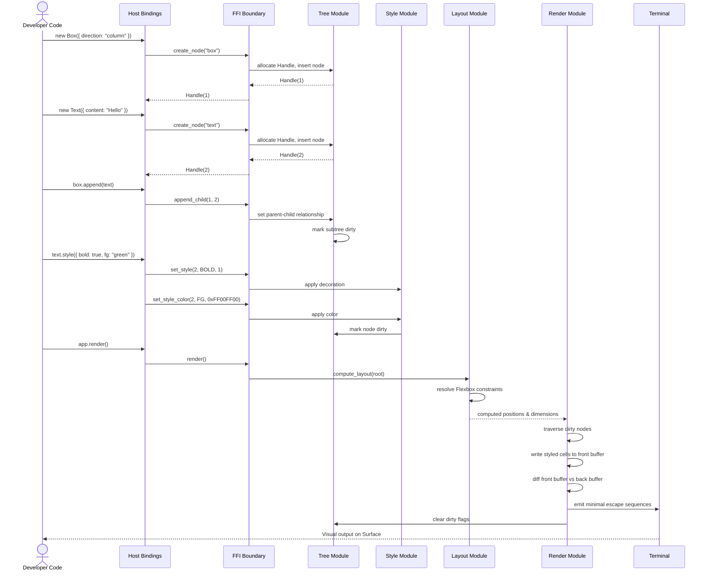

# Architecture Document

## Kraken TUI

**Version**: 1.0
**Status**: Draft
**Date**: February 2026
**Source of Truth**: [PRD.md](./PRD.md) v2.0
**Upstream Decisions**: [ADR-001 through ADR-005](./architecture/)

---

## 1. ARCHITECTURAL STRATEGY

### The Pattern

**Modular Monolith with Cross-Language Facade.**

Kraken TUI is a single-process library composed of two language layers connected by a Foreign Function Interface (FFI) boundary:

- **Native Core** — A compiled shared library containing all state, computation, and rendering logic. Internally decomposed into strictly bounded modules.
- **Host Language Bindings** — A thin ergonomic wrapper that translates Developer intent into FFI commands. Contains zero business logic.

The FFI boundary enforces the **Facade pattern** (GoF): the Host Layer sees a flat command protocol, not the internal module structure. Internal to the Native Core, modules communicate through shared in-process state, with boundaries enforced by the language's visibility system.

The render pipeline follows **Pipe-and-Filter**: mutation commands accumulate → layout resolution → dirty-flag diffing → minimal terminal I/O. The input subsystem follows **Event-Driven**: terminal input is captured, buffered, classified, and drained by the Host Layer on each tick.

### Core Architectural Invariant

**Rust is the performance engine; TypeScript is the steering wheel.**

All CPU-intensive work — layout computation, tree traversal, buffer diffing, text parsing, hit-testing, event classification — executes in the Native Core. The Host Layer's sole responsibility is ergonomic command dispatch. This invariant governs every architectural decision in this document.

### Justification

Per **Martin Fowler** (*Patterns of Enterprise Application Architecture*), the "Microservices Premium" — the operational overhead of distributed systems — is inappropriate for a single-process library. A Modular Monolith provides clean separation of concerns with zero deployment, serialization, or network overhead.

Per **Uncle Bob** (*Clean Architecture*), dependencies point inward: the Host Layer depends on the Native Core's command protocol, never the reverse. The Native Core has zero knowledge of TypeScript, Bun, or any host runtime. This satisfies the **Dependency Rule** and ensures the core is independently testable.

Per **Eric Evans** (*Domain-Driven Design*), the FFI boundary is the primary **Bounded Context** separator. The Native Core's domain (widget trees, layout computation, rendering) and the Host Layer's domain (Developer-facing API ergonomics) are decoupled by the command protocol. Data structures do not leak across this boundary — only opaque Handles and serialized descriptors cross it.

---

## 2. SYSTEM CONTAINERS (C4 Level 2)

| Container | Logical Type | Responsibility |
|---|---|---|
| **Native Core** | Compiled Shared Library (cdylib) | Owns all widget state, performs layout computation, renders to terminal, processes input events, parses rich text. The single performance-critical artifact. |
| **Host Language Bindings** | Script Package | Provides an ergonomic, type-safe API for Developers. Translates method calls into FFI commands. Contains zero rendering, layout, or state logic. |
| **Terminal Emulator** | External System | The rendering surface. Receives escape sequences from the Native Core and presents visual output to the End User. Provides raw input events. |
| **Script Runtime** | External System | Loads the Native Core shared library, executes Developer code, and facilitates the FFI boundary. |

### Internal Modules (Native Core Decomposition)

These are not independently deployable containers but are architecturally significant bounded contexts within the Native Core. Each module has a single responsibility and communicates through the shared `TuiContext` state.

| Module | Responsibility | Key Dependencies |
|---|---|---|
| **Tree Module** | Composition Tree CRUD operations. Handle allocation (per ADR-003). Parent-child relationships. Dirty-flag propagation. | None (foundational) |
| **Layout Module** | Flexbox constraint resolution (per ADR-002). Resize handling. Caches computed positions and dimensions. Provides hit-test geometry. | Tree Module |
| **Style Module** | Color resolution (named, hex, 256-palette). Text decoration (bold, italic, underline). Border computation. | Tree Module |
| **Text Module** | Rich text parsing: Markdown → styled spans, syntax highlighting. Built-in parsers are native. Custom formats are pre-processed in the Host Layer and arrive as styled span descriptors. | Style Module |
| **Render Module** | Double-buffered cell grid. Dirty-flag diffing (per ADR-001). Minimal terminal I/O via escape sequences. Terminal capability detection and graceful degradation. | Tree, Layout, Style, Text Modules |
| **Event Module** | Terminal input capture. Event classification (key, mouse, resize, focus). Event buffer for poll-drain model. Hit-testing (mouse → widget routing using Layout geometry). Focus state machine (traversal order, focus/blur lifecycle). | Tree, Layout Modules |
| **Scroll Module** | Viewport state per scrollable widget. Overflow detection. Scroll position persistence across Render Passes. Content clipping during render. | Tree, Layout Modules |

### Module Dependency Direction

```
Host Language Bindings
        │
        │ FFI Command Protocol (C ABI)
        ▼
┌──────────────────────────────────────────────────┐
│                  Native Core                      │
│                                                   │
│  ┌────────────┐                                   │
│  │    Tree    │◄───────────────────────┐          │
│  │   Module   │                        │          │
│  └─────┬──────┘                        │          │
│        │                               │          │
│  ┌─────▼──────┐  ┌────────────┐  ┌─────┴────────┐│
│  │   Layout   │  │   Style    │  │    Event     ││
│  │   Module   │  │   Module   │  │    Module    ││
│  └─────┬──────┘  └─────┬──────┘  └─────┬────────┘│
│        │               │               │          │
│  ┌─────▼──────┐  ┌─────▼──────┐        │          │
│  │   Scroll   │  │    Text    │        │          │
│  │   Module   │  │   Module   │        │          │
│  └─────┬──────┘  └─────┬──────┘        │          │
│        │               │               │          │
│  ┌─────▼───────────────▼───────────────▼────────┐ │
│  │              Render Module                    │ │
│  └──────────────────┬───────────────────────────┘ │
│                     │                              │
└─────────────────────┼──────────────────────────────┘
                      │ Terminal Escape Sequences
                      ▼
               Terminal Emulator
```

---

## 3. CONTAINER DIAGRAM (C4 Level 2)


---

## 4. CRITICAL EXECUTION FLOWS

### Flow 1: Widget Composition & First Render (Epics 1, 2, 3)

The foundational flow. A Developer creates a layout with styled widgets and renders it to the Surface.



### Flow 2: Keyboard Input with Focus Traversal (Epic 4)

An End User presses Tab to move focus, then types into an Input widget. Demonstrates the buffer-poll event delivery model.


### Flow 3: Mouse Click with Hit-Testing (Epic 4)

An End User clicks a widget. The Event Module performs hit-testing using Layout geometry to route the click to the correct widget.


---

## 5. RESILIENCE & CROSS-CUTTING CONCERNS

### 5.1 Failure Handling

Kraken TUI is a single-process library, not a distributed service. Classical resilience patterns (Circuit Breakers, Bulkheads, Timeouts) are reinterpreted for the library context per **Michael Nygard** (*Release It!*): "everything fails all the time" — including FFI boundaries, terminal emulators, and developer assumptions.

| Failure Mode | Impact | Mitigation |
|---|---|---|
| **Panic in Native Core** | Undefined behavior if panic crosses FFI boundary. Host process crashes with no recovery. | Every `extern "C"` entry point wraps its body in `catch_unwind`. Panics are caught and converted to error codes. The Host Layer translates error codes into typed exceptions. No panic ever crosses the FFI boundary. |
| **Invalid Handle** | Dereferencing a destroyed or never-allocated Handle could corrupt state or crash. | Every FFI function validates the Handle against the internal HashMap before any operation. Invalid Handles return error code 0 / null. Per ADR-003: Handle(0) is permanently reserved as the invalid sentinel. |
| **Terminal capability mismatch** | Rendering artifacts if the terminal lacks truecolor or mouse support. | The Native Core queries terminal capabilities at `tui_init()`. Color rendering degrades gracefully: truecolor → 256-color → 16-color → monochrome. Mouse support is optional; the Event Module functions without it using keyboard-only input. |
| **Render budget exceeded** | Frame drops if layout + diff + render exceeds 16ms. | The Render Module tracks per-frame timing via internal counters (exposed to the Host Layer for diagnostics). Frame drops are informational, not errors. The Animation subsystem (v1) reads this signal to skip interpolation frames and degrade gracefully. |
| **Terminal resize mid-render** | Partial render against stale dimensions. | Resize events are captured by the Event Module and buffered. The current Render Pass completes against the previous dimensions. The next `render()` call recomputes layout with the new Surface dimensions. No torn frames. |
| **Malformed UTF-8 across FFI** | Undefined behavior in string processing. | The Native Core validates all incoming string bytes. Invalid UTF-8 sequences are rejected with an error code before any processing occurs. |

### 5.2 FFI Boundary Contract

The FFI boundary is the most safety-critical interface in the system. The following invariants are enforced unconditionally:

1. **Unidirectional control flow.** The Host Layer calls into the Native Core. The Native Core **never** calls into the Host Layer. Events are buffered and polled, not pushed via callbacks. This eliminates re-entrant FFI, threading hazards, and lifetime complexity.

2. **Single source of truth.** The Host Layer holds opaque Handles (u32 integers). The Native Core holds all mutable state. There is exactly one owner for every piece of data. No synchronization required.

3. **Copy semantics for data transfer.** Strings are copied across the boundary (Host→Native: copy-in; Native→Host: pointer to internally-owned buffer with explicit free via `tui_free_string()`). No shared memory references.

4. **Error codes, not exceptions.** Every FFI function returns a status indicator. Zero or null signals failure. The Host Layer is responsible for translating error codes into language-appropriate exceptions.

5. **No interior pointers.** The Native Core never returns pointers to internal structure fields. All returned data is either an opaque Handle or a copied/owned buffer. This ensures internal refactoring cannot break the Host Layer.

### 5.3 Observability Strategy

| Concern | Mechanism |
|---|---|
| **Error diagnostics** | Every error code has a corresponding human-readable message retrievable via `tui_get_last_error()`. Categories: invalid handle, tree invariant violation, encoding error, render failure, terminal error. |
| **Performance counters** | The Native Core tracks and exposes: layout duration (μs), render duration (μs), diff cell count, event buffer depth, total nodes, dirty node count. Queryable via FFI for Developer-facing diagnostics. |
| **Debug mode** | An initialization flag enables verbose structured logging to stderr: tree mutations, layout recomputations, dirty-flag propagation paths, event buffer state, hit-test traces. Disabled by default with zero overhead when off. |

### 5.4 Identity & Authentication

Not applicable. Kraken TUI is a local, in-process library with no network communication, user sessions, or authentication concerns.

---

## 6. LOGICAL RISKS & TECHNICAL DEBT

### Risk 1: Single-Threaded Native Core

**Description:** Per ADR-003, the Native Core is single-threaded. The `TuiContext` is accessed without synchronization.
**Impact:** Acceptable for v0/v1 where all interaction is synchronous. Becomes a constraint in v2 if the reactive reconciler generates high-frequency mutations from concurrent signal sources.
**Mitigation path:** The command protocol design (all mutations are discrete, serializable operations) naturally supports a future migration to a command queue drained by a dedicated thread. This is an implementation change within the Tree Module, not an architectural change. The Host Layer and FFI surface remain unchanged.

### Risk 2: Rich Text Pre-Processing Hook Latency

**Description:** Custom rich text format handlers execute in the Host Layer before content crosses the FFI boundary. For content-heavy applications with many custom formats, this adds latency before the native render pipeline begins.
**Impact:** Low for typical use cases (small text content, infrequent updates). Potentially significant for applications rendering large documents with custom formats every frame.
**Mitigation:** Built-in formats (Markdown, syntax highlighting) execute entirely in the Native Core — unaffected. The pre-processing hook fires only for Developer-defined custom formats. Developers can cache pre-processed output and re-process only on content change, not on every render.

### Risk 3: Handle Space Exhaustion (Theoretical)

**Description:** Per ADR-003, Handles are sequential `u32` values that are never recycled.
**Impact:** After ~4.3 billion create operations, the handle space exhausts. At 1,000 widget creates per second, this takes ~49 days of continuous operation. Practically unreachable for TUI applications.
**Mitigation:** Document as a known theoretical limitation. If real-world usage approaches this limit, implement handle recycling via a free-list internal to the Tree Module. The change is invisible to the Host Layer — Handles remain opaque u32 values.

### Risk 4: Terminal Backend Coupling

**Description:** ADR-005 selected a specific terminal backend. If maintenance lapses or a platform-specific defect emerges, terminal I/O is a single point of dependency.
**Impact:** Rendering and input capture are non-functional without the backend.
**Mitigation:** The Render Module and Event Module should access terminal I/O through an internal trait (abstraction layer), not through direct library calls. This enables backend substitution without modifying module logic. This trait boundary should be established during initial implementation — retrofitting it later is significantly more costly.

### Risk 5: Layout Computation Scaling

**Description:** Flexbox constraint resolution is O(n) for typical trees but can degrade with deeply nested layouts and complex constraint interactions (percentage-based sizing with min/max bounds).
**Impact:** For typical dashboards (10–100 widgets), sub-millisecond. For stress cases (1,000+ deeply nested widgets), layout may approach the 16ms frame budget.
**Mitigation:** The Layout Module caches computed results and only recomputes dirty subtrees. Dirty flags propagate up (invalidation), recomputation propagates down (resolution). Cost is bounded to the changed subtree, not the full tree. The layout library's built-in caching further reduces redundant computation.

---

## Appendix A: Upstream ADR Consistency

This Architecture Document is consistent with and builds upon the following accepted ADRs:

| ADR | Decision | Architectural Impact |
|---|---|---|
| ADR-001 | Retained-mode with dirty-flag diffing | Render Module: double-buffered cell grid, dirty propagation, minimal diff output |
| ADR-002 | Layout via Rust-native Flexbox library | Layout Module: Flexbox constraint resolution, cached computed layout, resize recomputation |
| ADR-003 | Opaque handle model, Rust-owned allocations | Tree Module: HashMap<u32, Node>, sequential allocation, explicit destroy, copy semantics at boundary |
| ADR-004 | Imperative API first, reactive reconciler v2 | Host Layer: command-issuing thin client. v2 reconciler wraps the same command protocol (Strangler Fig pattern) |
| ADR-005 | Terminal backend (crossterm) | Render + Event Modules: terminal I/O via crossterm, behind internal trait for future substitution |

## Appendix B: New Architectural Decisions

The following decisions were made during this Architecture phase. They extend (not contradict) the existing ADRs.

| Decision | Choice | Rationale |
|---|---|---|
| **Event Delivery Model** | Hybrid buffer-poll. Native Core captures and buffers events; Host Layer drains the buffer each tick. | Eliminates callback-based FFI complexity. Enforces unidirectional control flow. At 60fps polling (~16ms interval), latency is well within the PRD's 50ms constraint. |
| **State Ownership** | Native Core owns all widget state. Host Layer is a command-issuing thin client. | Minimizes FFI surface area. Single source of truth eliminates synchronization. Aligns with the core invariant: Rust is the engine. The v2 reconciler generates the same commands — no architectural migration required (Strangler Fig per Fowler). |
| **Render Pipeline Topology** | Batched-synchronous. Mutations accumulate; explicit `render()` call triggers the full pipeline in one native execution. | Explicit over implicit (Uncle Bob). Developer controls timing. All compute-heavy work (layout, diff, render) executes in a single native call, minimizing FFI crossings. |
| **Rich Text Parser Location** | Native Core for built-in formats (Markdown, syntax highlighting). Extensibility via pre-processing hook at the FFI boundary. | Parsing is CPU-intensive — it belongs in the performance engine. Custom formats pre-process in the Host Layer, producing styled span descriptors that the Native Core renders directly. No FFI callbacks during parsing. |
| **Hit-Testing Strategy** | Event Module requests hit-test from Layout Module using computed rectangles. Traversal is back-to-front to match visual stacking order. | Hit-testing requires resolved layout geometry. Back-to-front traversal ensures the visually topmost widget receives the event. O(n) cost per click is acceptable for discrete, infrequent mouse events. |
