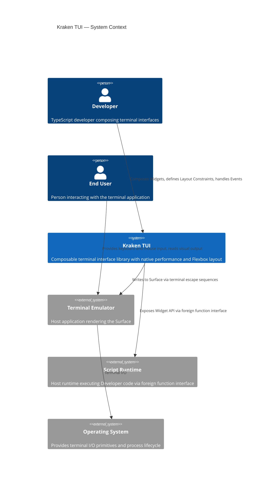
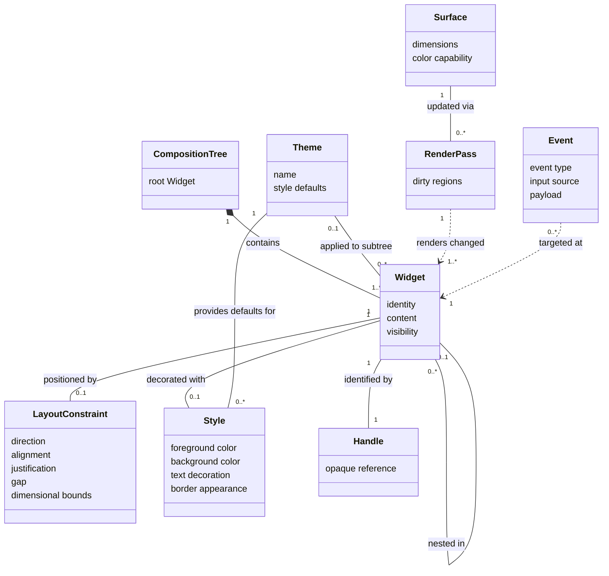

# Product Requirements Document (PRD)

## Kraken TUI

**Version**: 2.1
**Status**: Approved
**Date**: February 2026

---

## 1. EXECUTIVE SUMMARY

**The Vision:** Terminal interface development becomes as productive as web UI development — without sacrificing performance or requiring a systems programming background.

**The Problem:** Developers building terminal dashboards and interactive CLI tools in the TypeScript ecosystem face a forced trade-off: ergonomic but resource-heavy solutions (full-framework reconciliation overhead, 50MB+ memory for simple apps) versus performant but ergonomically hostile ones (systems languages, C bindings, no TypeScript support). No solution exists that provides native performance, familiar layout semantics, and a composable widget model — all accessible from TypeScript without framework overhead.

**Jobs to be Done:**

> _Primary:_ "When building interactive terminal applications in TypeScript, I want pre-built composable interface elements with native performance and familiar layout semantics, so I can **ship polished terminal UIs in hours, not days**, without the overhead of full-framework reconciliation or learning a systems language."

> _Secondary:_ "When using Bun as my primary runtime, I want a TUI library designed for Bun's foreign-function model from day one, so I don't fight compatibility shims or WASM overhead."

**JTBD Priority Order:** Ship Faster > Bun-native DX > Escape React Overhead > Own the Full Stack

---

## 2. UBIQUITOUS LANGUAGE (GLOSSARY)

| Term                  | Definition                                                                                                  | Do Not Use                               |
| --------------------- | ----------------------------------------------------------------------------------------------------------- | ---------------------------------------- |
| **Widget**            | A composable visual building block that can display content, accept input, or contain other Widgets.        | Component, Element, Node, Control        |
| **Developer**         | A person using Kraken TUI to build terminal applications.                                                   | Author, User, Consumer, Client           |
| **End User**          | The person interacting with the terminal application a Developer built.                                     | User, Customer, Operator                 |
| **Composition Tree**  | The hierarchical arrangement of Widgets that defines the interface structure.                               | DOM, Widget Tree, Node Tree, Scene Graph |
| **Surface**           | The terminal display area to which the Composition Tree is rendered.                                        | Screen, Canvas, View, Buffer             |
| **Handle**            | An opaque reference to a Widget in the native performance layer. Owned by the system, not the Developer.    | Pointer, Reference, ID, Key              |
| **Layout Constraint** | Rules governing a Widget's position and dimensions relative to its parent and siblings (Flexbox semantics). | Style, CSS, Layout Rule                  |
| **Render Pass**       | A single cycle from state mutation to Surface update. Only changed regions are recomputed.                  | Frame, Draw, Paint, Tick                 |
| **Event**             | A discrete unit of End User input (keystroke, mouse action, focus change) routed to the appropriate Widget. | Callback, Signal, Message, Action        |

---

## 3. ACTORS & PERSONAS

### Primary: The Rapid Dashboard Builder

**Psychographics:** Values composability over configurability. Measures success by time-from-idea-to-working-dashboard. Comfortable with TypeScript and terminal tooling but unwilling to invest weeks learning a new paradigm. Frustrated by frameworks that require boilerplate ceremony before anything appears on screen. Tolerates opinionated defaults; does _not_ tolerate missing defaults. Will abandon a tool if the first meaningful layout takes more than 30 minutes.

**Trigger situation:** "I need a CI/CD monitor / system dashboard / AI agent terminal interface. I need it working by end of day. I don't have time to learn Rust or fight React's render model."

**Current workarounds:** Cobbled-together ANSI escape sequences, Ink with growing memory concerns, or leaving the terminal entirely for a web dashboard (which breaks the workflow).

### Secondary: The Ship-It CLI Developer

**Psychographics:** The pragmatist. Values getting to a working interactive prompt faster than reading documentation. Will copy-paste examples before reading the API reference. Doesn't care about architecture; cares about _"How many lines of code to my first Select prompt?"_ Measures quality by how impressed colleagues are when they run the tool.

**Trigger situation:** "I'm building a CLI installer / config wizard / interactive prompt. I want it to look professional in 20 minutes."

### Tertiary: The Bun Ecosystem Native

**Psychographics:** Already committed to Bun. Seeks tools that feel native to the runtime, not ported from Node.js. Values zero-dependency solutions and tight runtime integration. Views WASM and polyfill layers as architectural smell.

---

## 4. FUNCTIONAL CAPABILITIES

### Epic 1: Widget Composition (P0 — Critical Path, v0)

- A Developer can create atomic visual elements: text display, text input, option selection, scrollable regions.
- A Developer can compose Widgets into hierarchical layouts of arbitrary depth.
- A Developer can add and remove Widgets from the Composition Tree at runtime.
- A Developer can set and update Widget content dynamically.

### Epic 2: Spatial Layout (P0 — Critical Path, v0)

- A Developer can define spatial relationships between Widgets using Flexbox-compatible Layout Constraints (direction, alignment, justification, gap).
- A Developer can specify dimensional bounds (fixed, percentage, min/max, flex-grow, flex-shrink).
- Layout resolves automatically on Composition Tree mutation without Developer intervention.
- Layout adapts to Surface dimensions (terminal resize).

### Epic 3: Visual Styling (P0 — Critical Path, v0)

- A Developer can apply foreground and background color to any Widget (named colors, hex, 256-palette).
- A Developer can apply text decoration (bold, italic, underline).
- A Developer can apply border styles to container Widgets.
- A Developer can batch multiple style mutations into a single Render Pass.

### Epic 4: Input & Focus (P0 — Critical Path, v0)

- An End User can type text into input Widgets via keyboard.
- An End User can navigate between interactive Widgets via keyboard-driven focus traversal (depth-first, DOM order).
- An End User can select from a list of options (Select widget) using arrow keys + Enter. Search/filter capability is out of scope for v0.
- A Developer can subscribe to keyboard Events on any Widget.
- An End User can click a Widget to focus it.
- An End User can scroll via mouse wheel within scrollable regions.
- A Developer can subscribe to mouse Events (click, scroll) on any Widget.
- The system performs hit-testing to route mouse Events to the correct Widget in the Composition Tree.

### Epic 5: Scrollable Regions (P0 — Critical Path, v0)

- A Developer can designate a container Widget as scrollable when content exceeds its bounds.
- An End User can scroll through overflow content via keyboard or mouse.
- Scroll position is maintained across Render Passes.

### Epic 6: Cross-Platform Terminal Abstraction (P0 — Critical Path, v0)

- The system operates on major OS families (macOS, Linux, Windows) without platform-specific Developer code.
- The system adapts to terminal capabilities (color depth, dimensions).
- The system manages terminal mode lifecycle (raw mode entry/exit, alternate screen) transparently.

### Epic 7: Rich Text Rendering (P0 — Critical Path, v0)

- A Developer can render Markdown-formatted text within a Widget.
- A Developer can render syntax-highlighted code blocks within a Widget.
- The system parses rich text formats into styled text spans without Developer intervention.
- A Developer can extend the parsing pipeline with custom format handlers.

### Epic 8: Animation (P1 — v1)

- A Developer can define timed transitions on Widget properties (opacity, foreground/background/border color).
- The system provides built-in animation primitives (spinner, progress bar, pulsing).
- Animations are frame-budget-aware and degrade gracefully under load.
- A Developer can cancel or chain animations programmatically.

### Epic 9: Theming (P1–P2 — v1 foundation, v2 completion)

- A Developer can define a Theme as a named collection of Style defaults.
- A Developer can apply a Theme to a subtree of the Composition Tree (v1).
- A Developer can switch Themes at runtime without rebuilding the Composition Tree (v1).
- The system provides a constraint-based Theme inheritance model for nested subtrees (v2).
- The system ships with at least two built-in Themes: light and dark (v1).

---

## 5. NON-FUNCTIONAL CONSTRAINTS

| Attribute                     | Constraint                                                                                 | Rationale                                                                               |
| ----------------------------- | ------------------------------------------------------------------------------------------ | --------------------------------------------------------------------------------------- |
| **Memory**                    | < 20MB for a composition of 100 Widgets                                                    | Enables deployment in constrained environments (CI runners, containers, remote servers) |
| **Input Latency**             | < 50ms from keystroke to Surface update                                                    | Below human perception threshold for interactive responsiveness                         |
| **Render Budget**             | < 16ms per Render Pass (60fps capable)                                                     | Smooth visual updates for real-time dashboards                                          |
| **Foreign Function Overhead** | < 1ms per cross-boundary call                                                              | Must not be the bottleneck in the render loop                                           |
| **Host-Language Bundle**      | < 50KB (TypeScript layer)                                                                  | Minimal overhead; the value is in the native core                                       |
| **Time to Hello World**       | < 15 minutes for a competent TypeScript developer                                          | Core JTBD: ship faster                                                                  |
| **API Stability**             | Semantic versioning guarantees begin at public v1.0 GA. Pre-GA releases may include breaking changes. | Community-driven OSS demands trust in API contracts                                     |
| **Contributor Experience**    | Clear module boundaries, documented architecture decisions, reproducible build environment | Portfolio + community viability depends on contribution accessibility                   |
| **Accessibility**             | Not a v0/v1 hard constraint. Tracked as a v2 commitment.                                   | Acknowledged as important; deferred to avoid scope creep in MVP                         |

---

## 6. BOUNDARY ANALYSIS

### In Scope (The Core Value)

**v0 — MVP:**

- Composable Widget system for constructing terminal dashboards and interactive CLI interfaces.
- Flexbox-compatible layout resolution.
- Keyboard-driven interaction with focus management.
- Mouse interaction (click-to-focus, scroll, hit-testing).
- Rich text rendering (Markdown, syntax highlighting, extensible parser pipeline).
- Imperative composition API (the simplest possible mental model).
- Incremental rendering (dirty-region tracking).
- Cross-platform terminal abstraction.
- Scrollable regions.

**v1 — Delivered:**

- Animation system (timed transitions, built-in primitives, frame-budget-aware).
- Theming foundation (theme definition, subtree application, runtime switching, built-in light/dark themes).

**v2 — Expansion:**

- Theme inheritance model (constraint-based, nested subtrees).
- Declarative/reactive framework bindings (reconciler layer).

### Out of Scope (Anti-Scope) — Explicit Exclusions

1. **Declarative/Reactive framework bindings.** Adding reconciler-based renderers (reactive signal-based or virtual-DOM-based) in v0/v1 would double the API surface and introduce conceptual complexity that conflicts with the "ship faster" JTBD. The imperative API is the minimal sufficient interface. Deferred to v2.

2. **Select widget search/filter.** Implementing search/filter within Select dropdowns adds significant complexity to the widget. Plain selection via arrow keys is sufficient for v0.

3. **Accessibility (a11y) features.** Screen reader support, ARIA-like labels, and focus indicators are deferred to v2. Basic keyboard navigation is supported in v0.

4. **Internationalization (i18n).** RTL layout support, Unicode beyond UTF-8, and localization hooks are out of scope for v0/v1.

5. **Widget state persistence.** Serialization/deserialization of the Composition Tree is deferred to future versions.

---

## 7. CONCEPTUAL DIAGRAMS

### Diagram A: System Context (C4 Level 1)

### Diagram B: Domain Model

---

## Appendix A: Version Roadmap

| Version | Epics                                | Summary                                                                                                       |
| ------- | ------------------------------------ | ------------------------------------------------------------------------------------------------------------- |
| **v0**  | 1, 2, 3, 4, 5, 6, 7                  | Widget composition, layout, styling, input (keyboard + mouse), scrolling, cross-platform, rich text rendering |
| **v1**  | 8, 9 (foundation)                    | Animation system (timed transitions, primitives, chaining), theming foundation (built-in themes, runtime switching) |
| **v2**  | 9 (completion), declarative bindings | Theme inheritance, reconciler layer (Solid.js, then React)                                                    |

## Appendix B: Operator Preferences

_The following are the developer's stated technology preferences. Per the Principle of Abstraction, these are documented here for downstream agents (Architect, Implementer) but are not incorporated into the functional or non-functional requirements above._

| Preference                   | Value                          |
| ---------------------------- | ------------------------------ |
| Core implementation language | Rust                           |
| Target runtime               | Bun                            |
| FFI mechanism                | bun:ffi                        |
| Layout engine                | Taffy                          |
| Terminal backend             | crossterm                      |
| Future reconciler path       | Solid.js (v2), then React (v3) |
| Build artifact               | cdylib                         |
| Dev environment              | devenv (Nix)                   |

## Appendix C: References

- [Ratatui](https://ratatui.rs/) — Rust TUI library
- [OpenTUI](https://opentui.com/) — Zig + Bun TUI framework
- [Ink](https://github.com/vadimdemedes/ink) — React for CLI apps
- [Textual](https://textual.textualize.io/) — Python TUI framework
- [Taffy](https://github.com/DioxusLabs/taffy) — Rust layout engine
- [crossterm](https://github.com/crossterm-rs/crossterm) — Rust terminal library
- [bun:ffi](https://bun.com/reference/bun/ffi) — Bun FFI documentation
