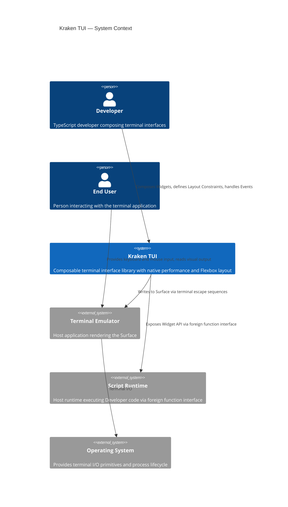
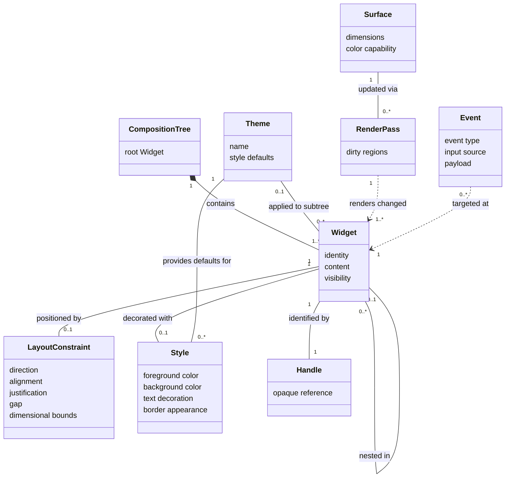

# Product Requirements Document

## 0. Version History & Changelog
- v2.3.0 - Reformatted to the current stage-1 framework skeleton while preserving approved scope, roadmap context, and operator preferences.
- v2.2.0 - Approved the current product emphasis around long-lived developer and agent workflows.
- v2.1.0 - Matured scope boundaries, non-functional constraints, and roadmap continuity for the v0-v2 product line.
- ... [Older history truncated, refer to git logs]

## 1. Executive Summary & Target Archetype
- **Target Archetype:** Cross-language terminal UI library and SDK for TypeScript-first developers, with Bun-native ergonomics as a key adoption path.
- **Vision:** Terminal interface development becomes as productive as web UI development without sacrificing performance or requiring a systems programming background.
- **Problem:** Developers building terminal dashboards and interactive CLI tools in the TypeScript ecosystem face a forced trade-off between ergonomic but resource-heavy solutions and performant but ergonomically hostile solutions. No current option combines native performance, familiar layout semantics, and composable Widgets behind an approachable TypeScript API.
- **Jobs to Be Done:**
  - Primary: "When building interactive terminal applications in TypeScript, I want pre-built composable interface elements with native performance and familiar layout semantics, so I can ship polished terminal UIs in hours, not days, especially for long-running developer and agent workflows, without the overhead of full-framework reconciliation or learning a systems language."
  - Secondary: "When using Bun as my primary runtime, I want a TUI library designed for Bun's foreign-function model from day one, so I don't fight compatibility shims or WASM overhead."

### 1.1 Product Posture
- **Current Product Emphasis:** Kraken's near-term differentiation is long-lived, information-dense terminal applications for developer and agent workflows. The product is especially valuable when interfaces must remain stable under streaming output, long transcripts, dense inspection surfaces, and pane-based navigation.
- **JTBD Priority Order:** Ship Faster > Bun-native DX > Escape React Overhead > Own the Full Stack

### 1.2 Version Roadmap Context

| Version | Scope Emphasis | Summary |
| --- | --- | --- |
| **v0** | Core interaction surface | Widget composition, layout, styling, keyboard and mouse input, scrolling, cross-platform terminal handling, and rich text rendering |
| **v1** | Product polish | Animation system and theming foundation |
| **v2** | Hardening and advanced DX | Core hardening, tree operations for reconciler support, theme inheritance, TextArea, choreography, lightweight JSX reconciler, and foundational accessibility |

## 2. Ubiquitous Language (Glossary)
| Term | Definition | Do Not Use |
| --- | --- | --- |
| **Widget** | A composable visual building block that can display content, accept input, or contain other Widgets. | Component, Element, Node, Control |
| **Developer** | A person using Kraken TUI to build terminal applications. | Author, User, Consumer, Client |
| **End User** | The person interacting with the terminal application a Developer built. | User, Customer, Operator |
| **Composition Tree** | The hierarchical arrangement of Widgets that defines the interface structure. | DOM, Widget Tree, Node Tree, Scene Graph |
| **Surface** | The terminal display area to which the Composition Tree is rendered. | Screen, Canvas, View, Buffer |
| **Handle** | An opaque reference to a Widget in the native performance layer. Owned by the system, not the Developer. | Pointer, Reference, ID, Key |
| **Layout Constraint** | Rules governing a Widget's position and dimensions relative to its parent and siblings. | Style, CSS, Layout Rule |
| **Render Pass** | A single cycle from state mutation to Surface update. Only changed regions are recomputed. | Frame, Draw, Paint, Tick |
| **Event** | A discrete unit of End User input routed to the appropriate Widget. | Callback, Signal, Message, Action |

## 3. Actors & Personas
### 3.1 Primary Actor
- **Role:** The Rapid Dashboard Builder
- **Context:** Comfortable with TypeScript and terminal tooling, but unwilling to spend weeks learning a new paradigm or a systems language.
- **Goals:** Compose useful, polished dashboards and agent interfaces quickly; rely on strong defaults; reach a meaningful first layout fast.
- **Frictions:** Boilerplate-heavy frameworks, missing defaults, memory-heavy React-style solutions, and any approach that makes the first real interface take more than roughly 30 minutes.
- **Current Workarounds:** Cobbled-together ANSI escape sequences, Ink with growing memory concerns, or leaving the terminal for a web dashboard that breaks the workflow.

### 3.2 Secondary Actor
- **Role:** The Ship-It CLI Developer
- **Context:** Pragmatic builder who values a working interactive prompt faster than reading API reference material.
- **Goals:** Build installers, config wizards, and professional-feeling interactive CLIs quickly; copy-paste examples and adapt them with minimal ceremony.
- **Frictions:** Slow onboarding, excessive architecture ceremony, and APIs that make common flows like prompts or lists harder than they should be.

### 3.3 Tertiary Actor
- **Role:** The Bun Ecosystem Native
- **Context:** Already committed to Bun and wants tools that feel native to the runtime rather than ported from a Node.js or browser-first worldview.
- **Goals:** Use a zero- or near-zero-dependency terminal UI library that integrates cleanly with Bun's foreign-function model.
- **Frictions:** WASM layers, compatibility shims, polyfill-heavy stacks, and tools that feel architecturally foreign to Bun.

## 4. Functional Capabilities
### Epic 1 — Widget Composition
- **Priority:** P0
- **Capability:** A Developer can create atomic visual elements for display, input, selection, and scrolling.
- **Capability:** A Developer can compose Widgets into hierarchical layouts of arbitrary depth.
- **Capability:** A Developer can add and remove Widgets from the Composition Tree at runtime.
- **Capability:** A Developer can set and update Widget content dynamically.
- **Rationale:** Without fast composition, Kraken fails its primary job of helping Developers ship polished terminal interfaces in hours instead of days.

### Epic 2 — Spatial Layout
- **Priority:** P0
- **Capability:** A Developer can define spatial relationships between Widgets using Flexbox-compatible Layout Constraints such as direction, alignment, justification, and gap.
- **Capability:** A Developer can specify dimensional bounds including fixed, percentage, min/max, flex-grow, and flex-shrink behavior.
- **Capability:** Layout resolves automatically on Composition Tree mutation without Developer intervention.
- **Capability:** Layout adapts to Surface dimensions, including terminal resize.
- **Rationale:** Familiar layout semantics are central to Kraken's promise of web-like productivity in a terminal environment.

### Epic 3 — Visual Styling
- **Priority:** P0
- **Capability:** A Developer can apply foreground and background color to any Widget using named colors, hex values, and the 256-color palette.
- **Capability:** A Developer can apply text decoration such as bold, italic, and underline.
- **Capability:** A Developer can apply border styles to container Widgets.
- **Capability:** A Developer can batch multiple style mutations into a single Render Pass.
- **Rationale:** Terminal applications must still look polished and legible to compete with web dashboards and desktop tooling.

### Epic 4 — Input & Focus
- **Priority:** P0
- **Capability:** An End User can type text into input Widgets via keyboard.
- **Capability:** An End User can navigate between interactive Widgets via keyboard-driven focus traversal in depth-first, DOM-order sequence.
- **Capability:** An End User can select from a list of options using arrow keys and Enter.
- **Capability:** A Developer can subscribe to keyboard Events on any Widget.
- **Capability:** An End User can click a Widget to focus it.
- **Capability:** An End User can scroll via mouse wheel within scrollable regions.
- **Capability:** A Developer can subscribe to mouse Events such as click and scroll on any Widget.
- **Capability:** The system performs hit-testing to route mouse Events to the correct Widget in the Composition Tree.
- **Rationale:** Real terminal applications live or die on input correctness, focus predictability, and low-friction event handling.

### Epic 5 — Scrollable Regions
- **Priority:** P0
- **Capability:** A Developer can designate a container Widget as scrollable when content exceeds its bounds.
- **Capability:** An End User can scroll through overflow content via keyboard or mouse.
- **Capability:** Scroll position is maintained across Render Passes.
- **Rationale:** Streaming logs, transcripts, and dense inspection surfaces require reliable viewport behavior to be usable.

### Epic 6 — Cross-Platform Terminal Abstraction
- **Priority:** P0
- **Capability:** The system operates on major OS families without platform-specific Developer code.
- **Capability:** The system adapts to terminal capabilities such as color depth and dimensions.
- **Capability:** The system manages terminal mode lifecycle, including raw mode and alternate screen handling, transparently.
- **Rationale:** A terminal UI library that requires platform-specific application code fails the "ship faster" promise for OSS and team adoption.

### Epic 7 — Rich Text Rendering
- **Priority:** P0
- **Capability:** A Developer can render Markdown-formatted text within a Widget.
- **Capability:** A Developer can render syntax-highlighted code blocks within a Widget.
- **Capability:** The system parses rich text formats into styled spans without Developer intervention.
- **Capability:** A Developer can extend the parsing pipeline with custom format handlers.
- **Rationale:** Developer tools, agent interfaces, and dense dashboards all depend on rich textual presentation rather than plain strings alone.

### Epic 8 — Animation
- **Priority:** P1
- **Capability:** A Developer can define timed transitions on Widget properties such as opacity and foreground, background, or border color.
- **Capability:** The system provides built-in animation primitives such as spinners, progress indicators, and pulsing states.
- **Capability:** Animations are frame-budget-aware and degrade gracefully under load.
- **Capability:** A Developer can cancel or chain animations programmatically.
- **Rationale:** Motion is a polish and feedback layer, not the critical path, but it materially improves perceived quality for interactive apps.

### Epic 9 — Theming
- **Priority:** P1
- **Capability:** A Developer can define a Theme as a named collection of Style defaults.
- **Capability:** A Developer can apply a Theme to a subtree of the Composition Tree.
- **Capability:** A Developer can switch Themes at runtime without rebuilding the Composition Tree.
- **Capability:** The system provides a constraint-based Theme inheritance model for nested subtrees.
- **Capability:** The system ships with at least two built-in Themes: light and dark.
- **Rationale:** Theming improves reuse, consistency, and adaptation across applications without forcing Developers to restyle every Widget manually.

## 5. Non-Functional Constraints
| Constraint Area | Requirement | Rationale |
| --- | --- | --- |
| **Performance** | Memory stays below 20MB for a composition of 100 Widgets. | Supports constrained environments such as CI runners, containers, and remote servers. |
| **Performance** | Input latency stays below 50ms from keystroke to Surface update. | Keeps interaction below the threshold where terminal UIs feel sluggish. |
| **Performance** | A Render Pass stays below 16ms when operating within the intended workload envelope. | Preserves 60fps-capable responsiveness for real-time dashboards and streaming workflows. |
| **Performance** | Foreign-function overhead stays below 1ms per cross-boundary call. | Ensures the language boundary does not become the bottleneck. |
| **Operability** | The host-language package stays below 75KB. | Keeps the TypeScript layer intentionally thin so the value remains in the Native Core. |
| **Adoption** | Time to Hello World stays below 15 minutes for a competent TypeScript Developer. | Reinforces the primary JTBD: shipping faster. |
| **Stability** | Semantic versioning guarantees begin at public v1.0 GA; pre-GA releases may include breaking changes. | Sets realistic trust expectations for open source adoption. |
| **Contributor Experience** | Module boundaries, architecture decisions, and build environment remain understandable and reproducible. | Makes contribution and long-term maintenance realistic. |
| **Accessibility** | Accessibility is not a v0/v1 hard constraint and is tracked as a v2 commitment. | Keeps MVP scope disciplined while preserving accessibility as a real product requirement. |

## 6. Boundary Analysis
### In Scope
- Composable Widget system for terminal dashboards and interactive CLI interfaces.
- Flexbox-compatible layout resolution.
- Keyboard-driven interaction with focus management.
- Mouse interaction including click-to-focus, scroll, and hit-testing.
- Rich text rendering including Markdown, syntax highlighting, and extensible parser pipelines.
- Imperative composition API as the primary mental model.
- Incremental rendering through dirty-region tracking.
- Cross-platform terminal abstraction.
- Scrollable regions.
- Long-lived transcript and log-style workflows where content updates continuously while the End User reads older content.
- Dense multi-pane developer and agent interfaces that combine navigation, inspection, and live output in a single Surface.
- Internal debugging and inspection workflows that help the Developer understand layout, focus, rendering, and event behavior while building such applications.
- Animation system and theming foundation as delivered product capabilities.
- Core hardening, reconciler support, advanced editing, and foundational accessibility as delivered v2 scope.

### Out of Scope
- Select-widget search and filter in the v0 capability set.
- Full screen-reader integration beyond foundational accessibility.
- Internationalization features such as RTL layout support and localization hooks.
- Widget state persistence through serialization and deserialization of the Composition Tree.
- Background render threading as part of the default product contract unless later evidence justifies promotion.
- Broad packaging and distribution polish as the primary product objective ahead of dependable long-lived workflow support.

## 7. Conceptual Diagrams (Mermaid)
### 7.1 System Context

```mermaid
C4Context
    title Kraken TUI — System Context

    Person(developer, "Developer", "TypeScript developer composing terminal interfaces")
    Person(enduser, "End User", "Person interacting with the terminal application")

    System(kraken, "Kraken TUI", "Composable terminal interface library with native performance and Flexbox layout")

    System_Ext(terminal, "Terminal Emulator", "Host application rendering the Surface")
    System_Ext(runtime, "Script Runtime", "Host runtime executing Developer code via foreign function interface")
    System_Ext(os, "Operating System", "Provides terminal I/O primitives and process lifecycle")

    Rel(developer, kraken, "Composes Widgets, defines Layout Constraints, handles Events")
    Rel(enduser, terminal, "Provides keyboard and mouse input, reads visual output")
    Rel(kraken, terminal, "Writes to Surface via terminal escape sequences")
    Rel(kraken, runtime, "Exposes Widget API via foreign function interface")
    Rel(terminal, os, "Terminal I/O")
```

### 7.2 Domain Model

```mermaid
classDiagram
    class Widget {
        identity
        content
        visibility
    }

    class CompositionTree {
        root Widget
    }

    class LayoutConstraint {
        direction
        alignment
        justification
        gap
        dimensional bounds
    }

    class Style {
        foreground color
        background color
        text decoration
        border appearance
    }

    class Theme {
        name
        style defaults
    }

    class Handle {
        opaque reference
    }

    class Event {
        event type
        input source
        payload
    }

    class Surface {
        dimensions
        color capability
    }

    class RenderPass {
        dirty regions
    }

    CompositionTree "1" *-- "1..*" Widget : contains
    Widget "1" -- "1" Handle : identified by
    Widget "1" -- "0..1" LayoutConstraint : positioned by
    Widget "1" -- "0..1" Style : decorated with
    Widget "0..*" -- "0..1" Widget : nested in
    Theme "1" -- "0..*" Style : provides defaults for
    Theme "0..1" -- "0..*" Widget : applied to subtree
    Surface "1" -- "0..*" RenderPass : updated via
    RenderPass "1" ..> "1..*" Widget : renders changed
    Event "0..*" ..> "1" Widget : targeted at
```

## Appendix: Operator Preferences
_The following are developer-stated implementation preferences. They are preserved for downstream stages but are not product requirements by themselves._

| Preference | Value |
| --- | --- |
| Core implementation language | Rust |
| Target runtime | Bun |
| FFI mechanism | `bun:ffi` |
| Layout engine | Taffy |
| Terminal backend | crossterm |
| Future reconciler path | Lightweight JSX factory plus `@preact/signals-core`, with optional Effect integration |
| Build artifact | `cdylib` |
| Dev environment | `devenv` (Nix) |
