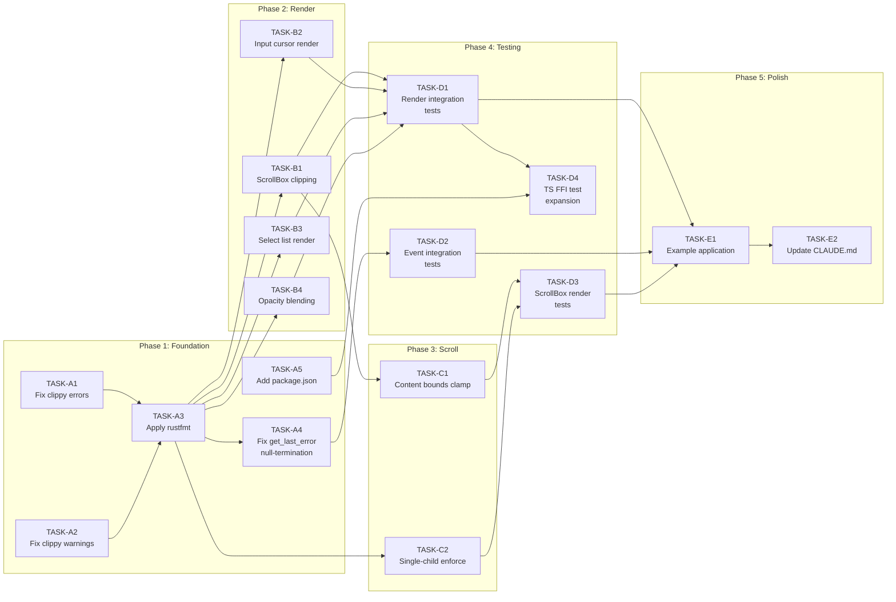

# Execution Plan (Tasks.md)

## Kraken TUI

**Version**: 1.0
**Status**: Active
**Date**: February 2026
**Source of Truth**: [TechSpec.md](./TechSpec.md) v2.1, [Architecture.md](./Architecture.md) v2.0

---

## 1. EXECUTIVE SUMMARY

**Total Estimation:** 34 Story Points (Fibonacci scale: 1, 2, 3, 5, 8)

**Current State:** All 62 FFI functions are implemented in the Rust Native Core (`lib.rs`). The TypeScript Host Layer is complete with all widget classes, FFI bindings, event handling, and style helpers. 27 Rust unit tests pass. However, the codebase has **20 clippy errors**, **10 clippy warnings**, **rustfmt violations**, a **null-termination correctness bug** in `tui_get_last_error`, and **functional gaps** in the Render Module (ScrollBox clipping, opacity, cursor/select rendering) and Scroll Module (content bounds clamping, single-child enforcement). **Zero render pipeline integration tests exist.**

**Critical Path:**

`TASK-A1` → `TASK-A3` → `TASK-A4` → `TASK-B1` → `TASK-B2` → `TASK-B3` → `TASK-C1` → `TASK-D1` → `TASK-E1`

---

## 2. PROJECT PHASING STRATEGY

### Phase 1 — MVP (v0 Release)

All tickets in this document target v0. The functional outcomes for v0:

1. **Code compiles with zero clippy errors and zero rustfmt violations** — CI-ready codebase.
2. **ScrollBox clips child content to its bounds** — per TechSpec 4.10.
3. **Input widget renders a visible cursor** — necessary for the "type text into input Widgets" JTBD (PRD Epic 4).
4. **Select widget renders its options list** — necessary for the "select from a list of options" JTBD (PRD Epic 4).
5. **Scroll positions clamp to content bounds** — per TechSpec 4.10 "Clamped to content bounds."
6. **Render pipeline has integration test coverage** — validates the most complex module end-to-end.
7. **A working example application exists** — validates the full stack (TS → FFI → Rust → Terminal).

### Phase 2 — Post-Launch (v1)

The following are explicitly deferred to prevent scope creep in the MVP:

- **Animation Module** (PRD Epic 8) — v1. Requires `animation.rs`, new FFI functions, render pipeline integration.
- **Theme Module** (PRD Epic 9) — v1. Requires `theme.rs`, theme resolution in Style Module, new FFI functions.
- **Multi-line Input (TextArea)** — v1 per ADR-T08.
- **Select search/filter** — explicitly out of scope per PRD.
- **Scrollbar rendering** — TechSpec 4.10: "The Native Core does not render scrollbars by default."
- **String interning optimization** — Architecture Appendix B: "Deferred to profiling data."
- **Handle recycling** — Architecture Risk 3: "Practically unreachable for TUI applications."

---

## 3. BUILD ORDER (DEPENDENCY GRAPH)



**Build Order Rationale (Per The Principle of Linear Dependency):**

1. **Foundation first.** Clippy errors and formatting violations are blocking concerns — a codebase that cannot pass basic linting is unshippable. The null-termination bug in `tui_get_last_error` is a correctness issue that causes undefined behavior in the TS layer.
2. **Render before Scroll.** Content bounds clamping in the Scroll Module requires the Render Module to correctly compute and clip content — the clipping rectangle establishes the coordinate space that scroll clamping must respect.
3. **Implementation before Tests.** Integration tests must assert on the behavior of the completed modules. Testing incomplete rendering produces brittle, meaningless assertions.
4. **Tests before Example.** The example application is a visual smoke test. It should be written against a verified pipeline, not used as the primary debugging tool.

---

## 4. THE TICKET LIST

### Epic A: Code Quality & Safety Foundation

> **Justification:** Per Gene Kim's _Accelerate_ research, code quality gates (linting, formatting) must pass before any feature work. A codebase with 20 clippy errors and a null-termination bug is a liability, not a foundation.

---

**[TASK-A1] Fix clippy `not_unsafe_ptr_arg_deref` errors across all FFI entry points**
- **Type:** Chore
- **Effort:** 2 SP
- **Dependencies:** None
- **Description:** 20 FFI functions in `lib.rs` that accept raw pointers (`*mut i32`, `*mut u8`, `*mut TuiEvent`, etc.) trigger clippy error `not_unsafe_ptr_arg_deref` because they dereference raw pointers inside `unsafe {}` blocks within public `extern "C"` functions not marked `unsafe`. The fix is to add `#[allow(clippy::not_unsafe_ptr_arg_deref)]` at the crate level in `lib.rs` (these are FFI entry points — the caller is already in unsafe territory per the C ABI contract) or mark each function with `/// # Safety` documentation. Affected functions: `tui_get_terminal_size`, `tui_set_content`, `tui_get_content`, `tui_set_code_language`, `tui_get_code_language`, `tui_select_get_option`, `tui_set_layout_dimension`, `tui_set_layout_edges`, `tui_get_layout`, `tui_measure_text`, `tui_get_scroll`, `tui_next_event`, and others taking raw pointers.
- **Acceptance Criteria (Gherkin):**
```gherkin
Given the Rust crate at native/
When I run cargo clippy --manifest-path native/Cargo.toml
Then there are zero errors of type not_unsafe_ptr_arg_deref
And the existing 27 unit tests still pass
```

---

**[TASK-A2] Fix clippy warnings (collapsible_if, too_many_arguments, useless_conversion, while_let_loop)**
- **Type:** Chore
- **Effort:** 1 SP
- **Dependencies:** None
- **Description:** 10 clippy warnings exist across four categories: (1) `collapsible_if` in `event.rs:77` — nested if-blocks for mouse focus can be collapsed. (2) `too_many_arguments` in `render.rs:198` and `render.rs:273` — `render_border` and `render_plain_text` exceed 7-argument threshold. Refactor into parameter structs or `#[allow]` with justification. (3) `useless_conversion` in `tree.rs:92` — redundant `NodeId::from(NodeId::new(0))`. (4) `while_let_loop` in `tree.rs:159` — `mark_dirty_ancestors` loop can be written as `while let`.
- **Acceptance Criteria (Gherkin):**
```gherkin
Given the Rust crate at native/
When I run cargo clippy --manifest-path native/Cargo.toml
Then there are zero warnings
And the existing 27 unit tests still pass
```

---

**[TASK-A3] Apply rustfmt formatting to all Rust source files**
- **Type:** Chore
- **Effort:** 1 SP
- **Dependencies:** [TASK-A1, TASK-A2]
- **Description:** `cargo fmt --check` reports formatting violations across `context.rs`, `event.rs`, `layout.rs`, `lib.rs`, `render.rs`, `style.rs`, `terminal.rs`, `text.rs`, `tree.rs`, and `types.rs`. Run `cargo fmt` to auto-fix. Verify no behavioral changes.
- **Acceptance Criteria (Gherkin):**
```gherkin
Given the Rust crate at native/
When I run cargo fmt --manifest-path native/Cargo.toml --check
Then the exit code is 0 (no formatting differences)
And the existing 27 unit tests still pass
```

---

**[TASK-A4] Fix `tui_get_last_error` null-termination correctness bug**
- **Type:** Security
- **Effort:** 2 SP
- **Dependencies:** [TASK-A3]
- **Description:** `tui_get_last_error()` in `lib.rs:936` returns `ctx.last_error.as_ptr() as *const c_char`. Rust's `String` is **NOT null-terminated**. The TypeScript layer reads this via `bun:ffi` as a C string (reads until null byte), which causes undefined behavior — potential buffer overread. **Fix:** Change `last_error` storage to ensure null termination. Two approaches: (a) Store a `CString` instead of `String` for `last_error` in `context.rs`, or (b) Append a null byte to the `String` before returning the pointer. Option (b) is simpler — `set_last_error()` should push a `\0` byte, and `tui_get_last_error()` can return the pointer safely. Also update `tui_clear_error()` to maintain the invariant.
- **Acceptance Criteria (Gherkin):**
```gherkin
Given a context with an error message "test error"
When tui_get_last_error() is called
Then the returned pointer contains "test error\0" (null-terminated)
And reading the pointer as a C string produces exactly "test error"
And no memory is read past the null terminator

Given a context with tui_clear_error() called
When tui_get_last_error() is called
Then it returns a null pointer
```

---

**[TASK-A5] Add `package.json` for TypeScript layer**
- **Type:** Chore
- **Effort:** 1 SP
- **Dependencies:** None
- **Description:** The `ts/` directory has no `package.json`. While Bun can operate without one, a `package.json` is needed for: (1) declaring the project name and version, (2) defining `scripts` for `bun test` and `bun run bench`, (3) enabling proper `bun install` workflows, (4) declaring `typescript` as a dev dependency for type checking. Create `ts/package.json` with name `kraken-tui`, version `0.1.0`, type `module`, and appropriate scripts.
- **Acceptance Criteria (Gherkin):**
```gherkin
Given the ts/ directory
When I run cat ts/package.json
Then a valid JSON file exists with name "kraken-tui" and version "0.1.0"
And "scripts" contains "test" and "bench" entries
And the "type" field is set to "module"
```

---

### Epic B: Render Pipeline Completion

> **Justification:** The Render Module (`render.rs`) implements the full pipeline (layout → clear → render → diff → output → swap → clean) but has four functional gaps. The TechSpec explicitly requires ScrollBox content clipping (Section 4.10). The PRD requires Input text entry (Epic 4) and Select option selection (Epic 4), which are non-functional without visual cursor and options rendering.

---

**[TASK-B1] Implement ScrollBox content clipping during render**
- **Type:** Feature
- **Effort:** 3 SP
- **Dependencies:** [TASK-A3]
- **Description:** Per TechSpec 4.10: "The ScrollBox node's single child content is clipped to the ScrollBox's bounds during rendering." Currently, `render_node()` in `render.rs:171-181` offsets child positions by `(scroll_x, scroll_y)` but does not clip — cells outside the ScrollBox bounds are written to the front buffer. **Fix:** Pass a clip rectangle through the render traversal. When rendering children of a ScrollBox, constrain all `front_buffer.set()` calls to the ScrollBox's computed layout bounds. Cells outside the clip rect are discarded. This requires either: (a) adding `clip_x, clip_y, clip_w, clip_h` parameters to `render_node()`, or (b) computing intersection before each `set()` call. Approach (a) is cleaner and enables nested ScrollBox clipping in the future.
- **Acceptance Criteria (Gherkin):**
```gherkin
Given a ScrollBox at position (5, 5) with size 10x10
And a child Text widget with content "AAAAAAAAAAAAAAAAAAAAAA" (22 chars wide)
And scroll_x = 0
When render() is called
Then cells at columns 5-14 contain 'A'
And cells at column 15 and beyond do NOT contain 'A' (clipped)

Given the same ScrollBox with scroll_x = 5
When render() is called
Then the child content is shifted 5 columns left
And cells outside the ScrollBox bounds are still clipped
```

---

**[TASK-B2] Implement visual cursor rendering for Input widgets**
- **Type:** Feature
- **Effort:** 2 SP
- **Dependencies:** [TASK-A3]
- **Description:** The Input widget tracks `cursor_position` but the render pipeline does not visually indicate the cursor location. Without a visible cursor, the End User cannot determine where typed characters will be inserted. **Fix:** In `render_node()`, after rendering the Input content text, draw a cursor indicator at the cursor position. The cursor should be rendered by inverting the foreground/background colors at the cursor cell position (standard terminal cursor convention). If the cursor is at the end of the content, render an inverted space character. Only render the cursor when the Input widget is focused (check `ctx.focused == Some(handle)`).
- **Acceptance Criteria (Gherkin):**
```gherkin
Given a focused Input widget with content "hello" and cursor_position = 3
When render() is called
Then the cell at content offset 3 (the 'l') has inverted fg/bg colors
And all other content cells have normal fg/bg colors

Given an unfocused Input widget
When render() is called
Then no cursor indicator is rendered (all cells have normal colors)

Given a focused Input with cursor at end of content (position = content length)
When render() is called
Then an inverted space character is rendered at the position after the last character
```

---

**[TASK-B3] Implement Select widget options list rendering**
- **Type:** Feature
- **Effort:** 3 SP
- **Dependencies:** [TASK-A3]
- **Description:** The Select widget currently renders only the selected option text. Per PRD Epic 4: "End User can select from a list of options using arrow keys + Enter." For the End User to see available options, the Select widget must render its full options list with the selected option visually highlighted. **Implementation:** Render each option on a separate row within the Select widget's content area. The selected option (`selected_index`) should be rendered with inverted colors (fg ↔ bg swap). If no option is selected, no inversion is applied. If the options list exceeds the widget height, show a visible subset centered on the selected option (viewport scrolling within the Select).
- **Acceptance Criteria (Gherkin):**
```gherkin
Given a Select widget with options ["Red", "Green", "Blue"] and selected_index = 1
When render() is called
Then "Red" is rendered on the first row with normal colors
And "Green" is rendered on the second row with inverted fg/bg
And "Blue" is rendered on the third row with normal colors

Given a Select widget with 20 options and a height of 5 rows
And selected_index = 10
When render() is called
Then 5 options are visible centered around index 10
And the selected option has inverted colors
```

---

**[TASK-B4] Implement opacity blending in render output**
- **Type:** Feature
- **Effort:** 2 SP
- **Dependencies:** [TASK-A3]
- **Description:** `VisualStyle.opacity` (0.0–1.0) is stored per node but not applied during rendering. The TechSpec defines `tui_set_style_opacity()` as a v0 function, so it must have visible effect. In a terminal context, true alpha blending is not possible. **Implementation:** Opacity affects foreground color intensity. At opacity 1.0, colors render normally. At opacity 0.0, the foreground is fully transparent (renders as the background color or default). Intermediate values linearly interpolate between foreground and background. Apply opacity to the `fg` color in the cell when `opacity < 1.0`. This requires modifying `render_plain_text()` and `render_styled_spans()` to read the node's opacity and blend before writing cells.
- **Acceptance Criteria (Gherkin):**
```gherkin
Given a Text widget with fg = 0x01FFFFFF (white RGB), bg = 0x01000000 (black RGB), opacity = 0.5
When render() is called
Then the foreground color of rendered cells is approximately 0x01808080 (grey — midpoint blend)

Given a Text widget with opacity = 1.0
When render() is called
Then the foreground color is unchanged from the widget's fg_color

Given a Text widget with opacity = 0.0
When render() is called
Then the foreground color equals the background color (fully transparent)
```

---

### Epic C: Scroll Module Completion

> **Justification:** TechSpec 4.10 specifies two behaviors that are currently missing: scroll position clamping to content bounds, and the single-child constraint. Without bounds clamping, scroll positions can become nonsensical (scrolling past content into empty space). Without the single-child constraint, multi-child ScrollBox behavior is undefined and untested.

---

**[TASK-C1] Implement content bounds clamping for scroll positions**
- **Type:** Feature
- **Effort:** 3 SP
- **Dependencies:** [TASK-B1]
- **Description:** TechSpec 4.10: "`tui_scroll_by` — Scroll by delta. Clamped to content bounds." And: "The scroll range is `(content_width - scrollbox_width, content_height - scrollbox_height)`." Currently, `scroll_by()` in `scroll.rs:43` only clamps to `>= 0`. **Fix:** After layout computation, the scroll module must query the ScrollBox's computed size and its child's computed size. `set_scroll()` and `scroll_by()` must clamp: `scroll_x` to `[0, max(0, child_width - scrollbox_width)]`, `scroll_y` to `[0, max(0, child_height - scrollbox_height)]`. This requires passing layout information into the scroll module. Two approaches: (a) compute clamping in `scroll.rs` by reading Taffy layout, or (b) compute max scroll bounds during `render()` and store them on the node. Approach (b) is simpler — store `max_scroll_x` and `max_scroll_y` on ScrollBox nodes after layout computation, then use them in `set_scroll()` and `scroll_by()`.
- **Acceptance Criteria (Gherkin):**
```gherkin
Given a ScrollBox of size 10x5 containing a child of size 20x15
When tui_set_scroll(handle, 100, 100) is called
Then scroll_x is clamped to 10 (20 - 10)
And scroll_y is clamped to 10 (15 - 5)

Given a ScrollBox of size 10x5 containing a child of size 8x3 (smaller than ScrollBox)
When tui_set_scroll(handle, 5, 5) is called
Then scroll_x is clamped to 0 (child fits, no scrolling needed)
And scroll_y is clamped to 0

Given a ScrollBox with scroll position (5, 5) and max scroll (10, 10)
When tui_scroll_by(handle, 100, 100) is called
Then scroll_x is clamped to 10
And scroll_y is clamped to 10
```

---

**[TASK-C2] Enforce ScrollBox single-child constraint**
- **Type:** Feature
- **Effort:** 1 SP
- **Dependencies:** [TASK-A3]
- **Description:** TechSpec 4.10: "ScrollBox accepts exactly one child. To scroll multiple widgets, wrap them in a Box container." Currently, `tui_append_child()` allows multiple children on ScrollBox nodes. **Fix:** In `tree::append_child()`, if the parent's `node_type` is `ScrollBox` and `children.len() >= 1`, return an error: "ScrollBox accepts exactly one child. Wrap multiple widgets in a Box container." This validation happens in the Tree Module, not at the FFI boundary.
- **Acceptance Criteria (Gherkin):**
```gherkin
Given a ScrollBox node with zero children
When tui_append_child(scrollbox, child1) is called
Then it succeeds (returns 0)

Given a ScrollBox node with one child already
When tui_append_child(scrollbox, child2) is called
Then it returns -1 (error)
And tui_get_last_error() contains "ScrollBox accepts exactly one child"
```

---

### Epic D: Integration & Verification

> **Justification:** Per Gene Kim's _Accelerate_ research, "the ability to run automated tests is a key predictor of delivery performance." The Render Module is the most complex module (~150 LOC of traversal, clipping, and diffing logic) with **zero test coverage**. Unit tests validate individual modules; integration tests validate the pipeline.

---

**[TASK-D1] Add render pipeline integration tests with MockBackend cell assertions**
- **Type:** Chore
- **Effort:** 3 SP
- **Dependencies:** [TASK-B1, TASK-B2, TASK-B3, TASK-B4]
- **Description:** Create integration tests that exercise the full render pipeline: create nodes → set properties → call `render()` → assert cell contents in the front buffer via MockBackend. Test scenarios: (1) Basic Box with Text child — verify text appears at computed position. (2) Nested Boxes with flex direction — verify child layout positions. (3) Bordered Box — verify border characters at edges. (4) Text with Markdown formatting — verify bold spans have `CellAttrs::BOLD`. (5) Background color fill — verify cells have correct `bg` value. (6) Invisible node — verify it is not rendered. Add these as `#[cfg(test)]` tests in `render.rs` or a new `tests/integration.rs` file.
- **Acceptance Criteria (Gherkin):**
```gherkin
Given a root Box (80x24) with a Text child containing "Hello"
When render() is called with a MockBackend
Then the front buffer cell at (0, 0) contains 'H'
And the front buffer cell at (4, 0) contains 'o'

Given a Box with border_style = Single and size 10x5
When render() is called
Then cell (0, 0) contains '┌' (top-left corner)
And cell (9, 0) contains '┐' (top-right corner)
And cell (0, 4) contains '└' (bottom-left corner)
And cell (1, 0) contains '─' (horizontal border)
```

---

**[TASK-D2] Add event pipeline integration tests**
- **Type:** Chore
- **Effort:** 2 SP
- **Dependencies:** [TASK-A4]
- **Description:** Create integration tests that exercise the event pipeline end-to-end: inject `TerminalInputEvent`s into MockBackend → call `read_input()` → drain events → assert TuiEvent output. Test scenarios: (1) Key press → Key event in buffer with correct code/modifiers. (2) Tab → FocusChange event generated, focus advances. (3) Character input on focused Input → content updated, Change event generated. (4) Mouse click → hit-test resolves correct target. (5) Scroll wheel → ScrollBox scroll position updated. (6) Enter on focused Input → Submit event. (7) Arrow keys on focused Select → Change event with updated index.
- **Acceptance Criteria (Gherkin):**
```gherkin
Given a tree with two Input widgets and focus on the first
When a Tab key event is injected and read_input() is called
Then a FocusChange event is in the buffer with from=input1 and to=input2
And ctx.focused == Some(input2)

Given a focused Input with content "hello"
When a Backspace key event is injected and read_input() is called
Then the Input content is "hell"
And a Change event is in the buffer targeting the Input handle
```

---

**[TASK-D3] Add ScrollBox rendering and scroll tests**
- **Type:** Chore
- **Effort:** 2 SP
- **Dependencies:** [TASK-C1, TASK-C2]
- **Description:** Create tests for ScrollBox-specific rendering behavior: (1) Child content rendered with scroll offset applied. (2) Content outside ScrollBox bounds is clipped (from TASK-B1). (3) Scroll bounds clamping works (from TASK-C1). (4) Second child rejected (from TASK-C2). (5) Scroll position persists across renders.
- **Acceptance Criteria (Gherkin):**
```gherkin
Given a ScrollBox (10x5) at (0, 0) with a child containing a 20-char string
And scroll_x = 5
When render() is called
Then the visible content starts from character index 5
And no content appears outside columns 0-9

Given a ScrollBox with one child
When a second child is appended
Then the operation fails with error code -1
And the ScrollBox still has exactly one child
```

---

**[TASK-D4] Expand TypeScript FFI integration tests**
- **Type:** Chore
- **Effort:** 2 SP
- **Dependencies:** [TASK-D1, TASK-A5]
- **Description:** Expand `ts/test-ffi.test.ts` to cover all 62 FFI functions with round-trip verification. Current tests cover basic scenarios. Add: (1) Input widget: cursor movement, character insertion, backspace, max length, password masking. (2) Select widget: add/remove/clear options, selection, get_option text retrieval. (3) Layout: all dimension properties, all flex enum values, edges, gap. (4) Style: all color properties, all flags, all border styles, opacity. (5) Focus: set_focusable, focus_next/prev cycle, focus_change event generation. (6) Scroll: set/get/scroll_by. (7) Content: set/get with UTF-8, format, code language. (8) Diagnostics: perf counters, debug mode. Requires a release build first (`cargo build --manifest-path native/Cargo.toml --release`).
- **Acceptance Criteria (Gherkin):**
```gherkin
Given a release build of libkraken_tui
When bun test ts/test-ffi.test.ts is executed
Then all tests pass
And every one of the 62 FFI functions is called at least once
And no memory leaks are detected (no segfaults, no ASAN violations)
```

---

### Epic E: Documentation & Example

> **Justification:** Per the PRD: "Time to Hello World: < 15 minutes for a competent TypeScript developer." A working example is the developer's first contact with the library. Without one, the "Hello World" JTBD cannot be validated.

---

**[TASK-E1] Create example application demonstrating all widget types**
- **Type:** Feature
- **Effort:** 3 SP
- **Dependencies:** [TASK-D1, TASK-D2, TASK-D3]
- **Description:** Create `examples/demo.ts` that demonstrates all five widget types (Box, Text, Input, Select, ScrollBox) in a single interactive application. The example should: (1) Create a root Box with column flex direction. (2) Add a Text widget with Markdown content. (3) Add an Input widget for text entry. (4) Add a Select widget with sample options. (5) Wrap a long Text in a ScrollBox. (6) Handle keyboard events (Escape to quit). (7) Render in a loop at ~60fps (16ms timeout). This serves as both documentation and a visual smoke test. The example should be runnable with `bun run examples/demo.ts` after a release build.
- **Acceptance Criteria (Gherkin):**
```gherkin
Given a release build of libkraken_tui
When bun run examples/demo.ts is executed
Then the terminal shows a dashboard with:
  - A Markdown-formatted header
  - A text input field with visible cursor
  - A select dropdown with options
  - A scrollable text region
And pressing Tab cycles focus between Input and Select
And pressing Escape cleanly exits the application
And the terminal is restored to its original state after exit
```

---

**[TASK-E2] Update CLAUDE.md implementation status table**
- **Type:** Chore
- **Effort:** 1 SP
- **Dependencies:** [TASK-E1]
- **Description:** The "Implementation Status" table in `CLAUDE.md` is outdated. Update all module statuses to reflect the completed v0 implementation. All modules should show ✅ status with accurate notes. Also update the "Development Commands" section if any new commands were added (e.g., example runner).
- **Acceptance Criteria (Gherkin):**
```gherkin
Given the updated CLAUDE.md
When I read the Implementation Status table
Then every module shows ✅ status
And the Notes column accurately reflects v0 completion
And no module shows ⚠️ or "scaffolding" status
```

---

## 5. SUMMARY TABLE

| ID | Title | Type | SP | Dependencies |
|----|-------|------|----|--------------|
| TASK-A1 | Fix clippy unsafe pointer deref errors | Chore | 2 | None |
| TASK-A2 | Fix clippy warnings | Chore | 1 | None |
| TASK-A3 | Apply rustfmt formatting | Chore | 1 | A1, A2 |
| TASK-A4 | Fix get_last_error null-termination bug | Security | 2 | A3 |
| TASK-A5 | Add package.json for TS | Chore | 1 | None |
| TASK-B1 | ScrollBox content clipping | Feature | 3 | A3 |
| TASK-B2 | Input cursor rendering | Feature | 2 | A3 |
| TASK-B3 | Select options list rendering | Feature | 3 | A3 |
| TASK-B4 | Opacity blending in render | Feature | 2 | A3 |
| TASK-C1 | Scroll content bounds clamping | Feature | 3 | B1 |
| TASK-C2 | ScrollBox single-child enforcement | Feature | 1 | A3 |
| TASK-D1 | Render pipeline integration tests | Chore | 3 | B1, B2, B3, B4 |
| TASK-D2 | Event pipeline integration tests | Chore | 2 | A4 |
| TASK-D3 | ScrollBox rendering tests | Chore | 2 | C1, C2 |
| TASK-D4 | TS FFI integration test expansion | Chore | 2 | D1, A5 |
| TASK-E1 | Example application | Feature | 3 | D1, D2, D3 |
| TASK-E2 | Update CLAUDE.md | Chore | 1 | E1 |
| | **TOTAL** | | **34** | |

**Parallelization Opportunities:** TASK-A1, TASK-A2, and TASK-A5 have no dependencies and can be executed simultaneously. After TASK-A3, the four rendering tasks (B1–B4) and TASK-C2 can all begin in parallel.
