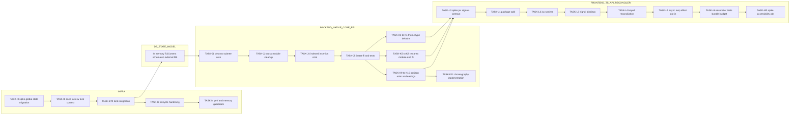

# Execution Plan (Tasks.md)

## Kraken TUI

**Version**: 4.0
**Status**: v1 Complete, v2 Planned (Detailed)
**Date**: February 2026
**Source of Truth**: [TechSpec.md](./TechSpec.md), [Architecture.md](./Architecture.md), [PRD.md](./PRD.md)

---

## 1. EXECUTIVE SUMMARY

**v2 Total Estimation:** 111 Story Points (Fibonacci: 1, 2, 3, 5, 8)

**v2 Critical Path (Longest Dependency Chain):**

`TASK-I0 -> TASK-I1 -> TASK-I2 -> TASK-I3 -> TASK-I4 -> TASK-J1 -> TASK-J2 -> TASK-J4 -> TASK-J5 -> TASK-K5 -> TASK-K6 -> TASK-K7 -> TASK-K8 -> TASK-L0 -> TASK-L1 -> TASK-L2 -> TASK-L3 -> TASK-L4 -> TASK-L5 -> TASK-L6 -> TASK-M0`

**Critical Path Estimate:** 83 Story Points

**Planning Constraint:** Epic M implementation tickets are intentionally not authored yet. `TechSpec.md` Appendix A explicitly marks accessibility contract details as not fully specified; only a spike is valid at this layer.

---

## 2. PROJECT PHASING STRATEGY

### Phase 1 (MVP for v2)

Functional outcomes:

1. Replace unsafe global state with `OnceLock<RwLock<TuiContext>>` and preserve FFI stability.
2. Ship reconciler prerequisites: `tui_destroy_subtree()` and `tui_insert_child()` with full cleanup and ordering guarantees.
3. Ship Theme inheritance completion: per-`NodeType` defaults and precedence resolution.
4. Ship TextArea widget (multi-line editing, 2D cursor, wrap mode, render integration, TS API).
5. Ship position animation (`PositionX`, `PositionY`) and new easing functions (`CubicIn`, `CubicOut`, `Elastic`, `Bounce`).
6. Ship declarative runtime baseline: JSX factory + signals + keyed child reconciliation.

### Phase 2 (Post-Launch / Scope-Controlled)

Deferred to reduce v2 risk and WIP:

1. Animation choreography APIs beyond existing pairwise chaining (fan-in/fan-out/timelines).
2. Optional `kraken-tui/effect` package and advanced host-loop helpers.
3. Accessibility foundation implementation after dedicated ADR and API contract ratification.

---

## 3. BUILD ORDER (DEPENDENCY GRAPH)



---

## 4. THE TICKET LIST

### Epic I: Core Hardening (ADR-T16 + Budget Enforcement)

**[TASK-I0] Spike Safe Global State Migration Plan**

- **Type:** Spike
- **Effort:** Story Points: 2
- **Dependencies:** None
- **Description:** Time-boxed design/verification spike to define lock acquisition policy (`read` vs `write`), re-init semantics, panic/poison handling, and success metrics before touching all FFI entrypoints.
- **Acceptance Criteria (Gherkin):**

```gherkin
Given current usage of static mut CONTEXT
When the spike is completed
Then a migration note exists defining lock boundaries for every FFI function category
And it includes measurable regression checks for render latency and FFI overhead
```

**[TASK-I1] Replace `static mut CONTEXT` with `OnceLock<RwLock<TuiContext>>`**

- **Type:** Feature
- **Effort:** Story Points: 5
- **Dependencies:** [TASK-I0]
- **Description:** Implement ADR-T16 in `context.rs`; remove `#[allow(static_mut_refs)]`; introduce safe context accessors and initialization guards.
- **Acceptance Criteria (Gherkin):**

```gherkin
Given a fresh process
When tui_init() is called
Then TuiContext is initialized through OnceLock<RwLock<_>>
And no static mut global context remains in the codebase
```

**[TASK-I2] Refactor FFI Entry Points for Explicit Locking**

- **Type:** Chore
- **Effort:** Story Points: 3
- **Dependencies:** [TASK-I1]
- **Description:** Update `lib.rs` FFI dispatch to acquire read/write locks consistently while preserving existing error-code semantics and `catch_unwind` behavior.
- **Acceptance Criteria (Gherkin):**

```gherkin
Given any public FFI function
When it executes
Then it acquires the correct lock mode for its operation
And panic conversion to -2 behavior is unchanged
```

**[TASK-I3] Harden Init/Shutdown/Reinit Lifecycle Semantics**

- **Type:** Chore
- **Effort:** Story Points: 3
- **Dependencies:** [TASK-I2]
- **Description:** Define and enforce deterministic behavior for repeated `tui_init()` / `tui_shutdown()` calls with locked context; verify all handles become invalid after shutdown.
- **Acceptance Criteria (Gherkin):**

```gherkin
Given tui_init() was called and nodes were created
When tui_shutdown() is called and then tui_init() is called again
Then previous handles are invalid
And the new context starts clean with no leaked state
```

**[TASK-I4] Memory and Performance Guardrails (Syntect + Counters)**

- **Type:** Chore
- **Effort:** Story Points: 5
- **Dependencies:** [TASK-I3]
- **Description:** Add budget-focused regression checks for memory footprint, FFI overhead, render budget, and input latency; include syntect-heavy scenarios and failure diagnostics.
- **Acceptance Criteria (Gherkin):**

```gherkin
Given benchmark and stress scenarios for rich text and animation
When the guardrail suite runs
Then memory stays under documented limits for target workloads
And regressions fail CI with actionable counter output
```

### Epic J: Tree Operations for Reconciler (ADR-T17, ADR-T18)

**[TASK-J1] Implement Native Post-Order `destroy_subtree()` in Tree Module**

- **Type:** Feature
- **Effort:** Story Points: 5
- **Dependencies:** [TASK-I2]
- **Description:** Add recursive post-order subtree destruction in `tree.rs` with structural correctness guarantees.
- **Acceptance Criteria (Gherkin):**

```gherkin
Given a tree with depth > 2
When destroy_subtree(root_child) is executed
Then all descendants are removed before the parent node
And no dangling parent/child references remain
```

**[TASK-J2] Integrate Subtree Destruction Cleanup Across Modules**

- **Type:** Feature
- **Effort:** Story Points: 5
- **Dependencies:** [TASK-J1]
- **Description:** Ensure subtree destruction cancels animations, clears theme bindings, detaches from Taffy, updates focus/root state, and leaves event pipeline consistent.
- **Acceptance Criteria (Gherkin):**

```gherkin
Given a subtree with active animations and theme bindings
When tui_destroy_subtree(handle) is called
Then all related animations and theme bindings are removed
And layout/render/focus queries do not reference destroyed handles
```

**[TASK-J3] Expose `tui_destroy_subtree()` Through FFI and TS Bindings**

- **Type:** Feature
- **Effort:** Story Points: 2
- **Dependencies:** [TASK-J2]
- **Description:** Add FFI entrypoint and TS wrapper surface for subtree destruction with consistent errors.
- **Acceptance Criteria (Gherkin):**

```gherkin
Given a valid subtree root handle
When the host calls tui_destroy_subtree(handle)
Then it returns 0
And subsequent reads on any destroyed handle return an error
```

**[TASK-J4] Implement `insert_child(parent, child, index)` with Reparenting**

- **Type:** Feature
- **Effort:** Story Points: 5
- **Dependencies:** [TASK-J2]
- **Description:** Add indexed insertion in native tree logic, including detach/reparent semantics and Taffy child order updates.
- **Acceptance Criteria (Gherkin):**

```gherkin
Given a parent with children [A, B, C]
When insert_child(parent, X, 1) is executed
Then child order becomes [A, X, B, C]
And layout child ordering matches tree ordering
```

**[TASK-J5] Expose `tui_insert_child()` + Host API + Reorder Regression Suite**

- **Type:** Feature
- **Effort:** Story Points: 3
- **Dependencies:** [TASK-J4]
- **Description:** Add FFI and TS wrappers for indexed insertion and cover keyed-reorder invariants with integration tests.
- **Acceptance Criteria (Gherkin):**

```gherkin
Given an existing child under another parent
When tui_insert_child(new_parent, child, 0) is called
Then child is detached from the old parent and inserted at index 0
And no duplicate parent references exist
```

### Epic K: Feature Expansions (ADR-T19, ADR-T21, ADR-T22 + Choreography)

**[TASK-K0] Spike Animation Choreography Contract (TBD in TechSpec)**

- **Type:** Spike
- **Effort:** Story Points: 2
- **Dependencies:** [TASK-J5]
- **Description:** Time-boxed ADR-level definition for choreography API shape (fan-in/fan-out, timeline grouping, cancellation semantics) and minimal viable FFI additions.
- **Acceptance Criteria (Gherkin):**

```gherkin
Given choreography is marked as TBD in the specification
When the spike completes
Then a written contract defines function signatures and lifecycle semantics
And implementation tickets are unblocked without ambiguous API assumptions
```

**[TASK-K1] Add Theme `type_defaults` Data Model and Native Setters**

- **Type:** Feature
- **Effort:** Story Points: 3
- **Dependencies:** [TASK-J5]
- **Description:** Extend `Theme` with `HashMap<NodeType, VisualStyle>` and internal mutation APIs for per-type defaults.
- **Acceptance Criteria (Gherkin):**

```gherkin
Given a theme and NodeType::Text
When a type default fg color is set
Then the theme stores that value under Text type defaults
And the corresponding mask bit is set for that type default
```

**[TASK-K2] Extend Style Resolution Precedence for Per-NodeType Defaults**

- **Type:** Feature
- **Effort:** Story Points: 3
- **Dependencies:** [TASK-K1]
- **Description:** Implement ADR-T21 precedence: explicit node style > theme NodeType default > theme global default > node stored value.
- **Acceptance Criteria (Gherkin):**

```gherkin
Given explicit style is unset on a Text node
And the active theme has both Text-specific and global fg defaults
When style is resolved
Then the Text-specific default wins over global default
```

**[TASK-K3] Add 4 `tui_set_theme_type_*` FFI Functions and TS Theme API**

- **Type:** Feature
- **Effort:** Story Points: 3
- **Dependencies:** [TASK-K2]
- **Description:** Implement and expose `tui_set_theme_type_color|flag|border|opacity` end-to-end.
- **Acceptance Criteria (Gherkin):**

```gherkin
Given a Theme instance in TypeScript
When setTypeColor("Text", "fg", "#00AAFF") is called
Then tui_set_theme_type_color is invoked with correct encoded arguments
And native resolution reflects that default during render
```

**[TASK-K4] Theme Inheritance Regression Tests (Native + FFI + TS)**

- **Type:** Chore
- **Effort:** Story Points: 2
- **Dependencies:** [TASK-K3]
- **Description:** Add tests covering precedence, nearest ancestor behavior, and backward compatibility for themes without type defaults.
- **Acceptance Criteria (Gherkin):**

```gherkin
Given an existing v1 theme without type defaults
When rendered under v2 resolver
Then visual output remains unchanged from v1 behavior
```

**[TASK-K5] Introduce TextArea Node Model and Internal Buffer Helpers**

- **Type:** Feature
- **Effort:** Story Points: 3
- **Dependencies:** [TASK-J5]
- **Description:** Add `NodeType::TextArea`, node fields (`cursor_row`, `cursor_col`, `wrap_mode`), and robust line-buffer utility functions.
- **Acceptance Criteria (Gherkin):**

```gherkin
Given a newly created TextArea node
When queried internally
Then its cursor defaults to row 0 col 0
And wrap_mode defaults to off
```

**[TASK-K6] Implement TextArea Editing Semantics in Event Module**

- **Type:** Feature
- **Effort:** Story Points: 5
- **Dependencies:** [TASK-K5]
- **Description:** Handle multi-line editing behavior (Enter newline, Backspace join at col 0, Up/Down cursor movement, bounds clamping).
- **Acceptance Criteria (Gherkin):**

```gherkin
Given TextArea content "abc\ndef" and cursor at row 1 col 0
When Backspace is pressed
Then lines are joined into "abcdef"
And cursor moves to row 0 col 3
```

**[TASK-K7] Render TextArea Cursor, Wrap Mode, and Viewport Behavior**

- **Type:** Feature
- **Effort:** Story Points: 5
- **Dependencies:** [TASK-K6]
- **Description:** Extend Render/Scroll integration for TextArea visual behavior under soft-wrap and horizontal-scroll modes.
- **Acceptance Criteria (Gherkin):**

```gherkin
Given a narrow TextArea with wrap_mode enabled
When long content is rendered
Then visual lines wrap within widget width
And cursor remains visible at the correct rendered position
```

**[TASK-K8] Add TextArea FFI Surface and TypeScript `TextArea` Widget API**

- **Type:** Feature
- **Effort:** Story Points: 3
- **Dependencies:** [TASK-K7]
- **Description:** Implement and expose `tui_textarea_set_cursor`, `tui_textarea_get_cursor`, `tui_textarea_get_line_count`, `tui_textarea_set_wrap` plus TS class wrappers.
- **Acceptance Criteria (Gherkin):**

```gherkin
Given a TextArea widget in TypeScript
When setCursor(2, 4) and setWrap(true) are called
Then the corresponding FFI functions return success
And getCursor()/getLineCount() round-trip expected values
```

**[TASK-K9] Add Position Animation via `render_offset` (ADR-T22)**

- **Type:** Feature
- **Effort:** Story Points: 5
- **Dependencies:** [TASK-J5]
- **Description:** Add `AnimProp::PositionX/Y`, update animation advancement to write node `render_offset`, and update render path to apply offsets without touching Layout.
- **Acceptance Criteria (Gherkin):**

```gherkin
Given an animation targeting PositionX from 0 to 10
When renders advance through the animation duration
Then visual output shifts horizontally by interpolated offsets
And computed layout dimensions remain unchanged
```

**[TASK-K10] Add New Easing Variants and Host Enum Support**

- **Type:** Feature
- **Effort:** Story Points: 3
- **Dependencies:** [TASK-K9]
- **Description:** Implement `CubicIn`, `CubicOut`, `Elastic`, and `Bounce` easing behavior natively and expose them in TS APIs.
- **Acceptance Criteria (Gherkin):**

```gherkin
Given an animation configured with Bounce easing
When elapsed time advances from 0 to duration
Then interpolated values follow non-linear bounce behavior
And easing enum values map consistently between Rust and TypeScript
```

**[TASK-K11] Implement Choreography MVP + Verification Suite**

- **Type:** Feature
- **Effort:** Story Points: 5
- **Dependencies:** [TASK-K0, TASK-K10]
- **Description:** Implement choreography APIs agreed in spike output (fan-in/fan-out/timeline minimum) and add cancellation/order guarantees tests.
- **Acceptance Criteria (Gherkin):**

```gherkin
Given two animations in a choreography group
When the group start command is issued
Then all scheduled animations begin according to the declared timeline rules
And cancelling the group prevents unscheduled followers from starting
```

### Epic L: Declarative Reconciler (ADR-T20)

**[TASK-L0] Spike JSX Factory + Signals Contract Validation**

- **Type:** Spike
- **Effort:** Story Points: 2
- **Dependencies:** [TASK-K4, TASK-K8, TASK-K10]
- **Description:** Validate runtime contract for JSX factory semantics, signal effect lifecycle, and keyed child updates before implementation.
- **Acceptance Criteria (Gherkin):**

```gherkin
Given ADR-T20 requirements
When the spike is completed
Then an implementation contract exists for create/update/unmount flows
And it explicitly maps each flow to existing FFI operations
```

**[TASK-L1] Establish Package Split (`kraken-tui` Core + `kraken-tui/effect`)**

- **Type:** Chore
- **Effort:** Story Points: 3
- **Dependencies:** [TASK-L0]
- **Description:** Create package boundaries, exports, and Bun build config to support optional effect integration without bloating core.
- **Acceptance Criteria (Gherkin):**

```gherkin
Given the package build output
When the core package is installed without effect package
Then imperative and JSX APIs work without optional dependencies
```

**[TASK-L2] Implement Runtime JSX Factory and Child Mount Ordering**

- **Type:** Feature
- **Effort:** Story Points: 5
- **Dependencies:** [TASK-L1]
- **Description:** Implement JSX runtime (`jsx`, `jsxs`, `Fragment`) that instantiates Widgets and mounts children in deterministic order.
- **Acceptance Criteria (Gherkin):**

```gherkin
Given a JSX tree with nested children
When rendered through the factory
Then native nodes are created in parent-before-child order
And child order matches JSX declaration order
```

**[TASK-L3] Implement Signal-Based Reactive Prop Updates and Cleanup**

- **Type:** Feature
- **Effort:** Story Points: 5
- **Dependencies:** [TASK-L2]
- **Description:** Bind signal changes directly to imperative setters and ensure teardown removes effects and native nodes safely.
- **Acceptance Criteria (Gherkin):**

```gherkin
Given a signal-bound style prop
When the signal value changes
Then the corresponding FFI setter is called with the new value
And no duplicate effects are retained after unmount
```

**[TASK-L4] Implement Keyed Child Reconciliation with `insert_child` + `destroy_subtree`**

- **Type:** Feature
- **Effort:** Story Points: 5
- **Dependencies:** [TASK-L3]
- **Description:** Add keyed list reconciliation that reorders/mounts/unmounts children using native O(1) tree primitives.
- **Acceptance Criteria (Gherkin):**

```gherkin
Given a keyed child list reordered from [A,B,C] to [C,A,B]
When reconciliation runs
Then child ordering is updated via insert operations without full subtree recreation
And removed keys trigger subtree destruction exactly once
```

**[TASK-L5] Async Loop Utilities and Optional Effect Integration**

- **Type:** Feature
- **Effort:** Story Points: 3
- **Dependencies:** [TASK-L4]
- **Description:** Provide host utilities for animation-aware loop pacing and optional Effect-layer adapters consistent with v2 loop guidance.
- **Acceptance Criteria (Gherkin):**

```gherkin
Given active animations are present
When the async loop utility runs
Then input polling becomes non-blocking and render cadence targets ~60fps
And idle mode increases blocking timeout to reduce CPU usage
```

**[TASK-L6] Reconciler Verification, Bundle Budget, and Migration Example**

- **Type:** Chore
- **Effort:** Story Points: 5
- **Dependencies:** [TASK-L5]
- **Description:** Add reconciliation integration tests, guard core bundle budget (<50KB), and include a complete imperative-to-JSX migration example.
- **Acceptance Criteria (Gherkin):**

```gherkin
Given CI test and bundle-size checks
When reconciler artifacts are built
Then keyed update and unmount tests pass
And the core host package stays within the documented size budget
```

### Epic M: Accessibility Foundation (Spec Gap Gate)

**[TASK-M0] Spike Accessibility ADR and FFI Contract Definition**

- **Type:** Spike
- **Effort:** Story Points: 3
- **Dependencies:** [TASK-L6, TASK-K8]
- **Description:** Define the missing accessibility contract (node role/label model, event behavior, FFI function set, and minimal screen-reader strategy). No implementation before this ticket closes.
- **Acceptance Criteria (Gherkin):**

```gherkin
Given accessibility is marked as not fully specified in TechSpec Appendix A
When this spike is completed
Then an approved ADR exists with concrete FFI signatures and data model fields
And follow-on implementation tickets can be authored without undefined behavior
```

---

## 5. V2 SUMMARY TABLE

| ID       | Epic | Type      | SP      | Dependencies |
| -------- | ---- | --------- | ------- | ------------ |
| TASK-I0  | I    | Spike     | 2       | None         |
| TASK-I1  | I    | Feature   | 5       | I0           |
| TASK-I2  | I    | Chore     | 3       | I1           |
| TASK-I3  | I    | Chore     | 3       | I2           |
| TASK-I4  | I    | Chore     | 5       | I3           |
| TASK-J1  | J    | Feature   | 5       | I2           |
| TASK-J2  | J    | Feature   | 5       | J1           |
| TASK-J3  | J    | Feature   | 2       | J2           |
| TASK-J4  | J    | Feature   | 5       | J2           |
| TASK-J5  | J    | Feature   | 3       | J4           |
| TASK-K0  | K    | Spike     | 2       | J5           |
| TASK-K1  | K    | Feature   | 3       | J5           |
| TASK-K2  | K    | Feature   | 3       | K1           |
| TASK-K3  | K    | Feature   | 3       | K2           |
| TASK-K4  | K    | Chore     | 2       | K3           |
| TASK-K5  | K    | Feature   | 3       | J5           |
| TASK-K6  | K    | Feature   | 5       | K5           |
| TASK-K7  | K    | Feature   | 5       | K6           |
| TASK-K8  | K    | Feature   | 3       | K7           |
| TASK-K9  | K    | Feature   | 5       | J5           |
| TASK-K10 | K    | Feature   | 3       | K9           |
| TASK-K11 | K    | Feature   | 5       | K0, K10      |
| TASK-L0  | L    | Spike     | 2       | K4, K8, K10  |
| TASK-L1  | L    | Chore     | 3       | L0           |
| TASK-L2  | L    | Feature   | 5       | L1           |
| TASK-L3  | L    | Feature   | 5       | L2           |
| TASK-L4  | L    | Feature   | 5       | L3           |
| TASK-L5  | L    | Feature   | 3       | L4           |
| TASK-L6  | L    | Chore     | 5       | L5           |
| TASK-M0  | M    | Spike     | 3       | L6, K8       |
|          |      | **TOTAL** | **111** |              |
