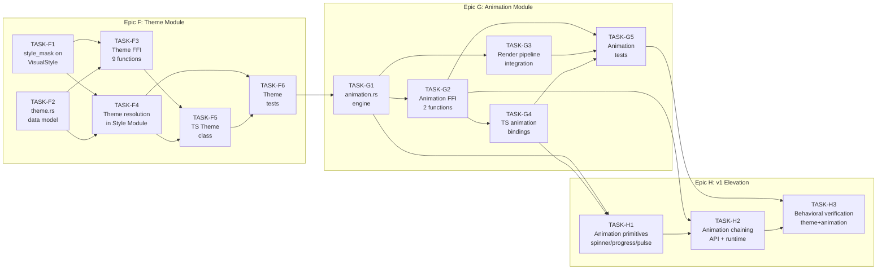

# Execution Plan (Tasks.md)

## Kraken TUI

**Version**: 2.1
**Status**: v1 Complete
**Date**: February 2026
**Source of Truth**: [TechSpec.md](./TechSpec.md), [Architecture.md](./Architecture.md)

---

## 1. EXECUTIVE SUMMARY

**v0 Delivered:** 34 Story Points across 17 tickets. All 63 FFI functions implemented. 70 Rust unit tests, 54 FFI integration tests. Zero clippy errors, zero rustfmt violations. Full render pipeline (ScrollBox clipping, opacity, cursor, Select rendering). Working example application. See Section 5 for archived ticket table.

**v1 Total Estimation:** 45 Story Points (Fibonacci scale: 1, 2, 3, 5, 8)
**v1 Remaining Estimation:** 0 Story Points (all epics closed)

**v1 Critical Path:**

`TASK-F1‖TASK-F2` → `TASK-F3‖TASK-F4` → `TASK-F5‖TASK-F6` → `TASK-G1` → `TASK-G2‖TASK-G3` → `TASK-G4‖TASK-G5` → `TASK-H1` → `TASK-H2` → `TASK-H3`

The longest sequential chain is: `F2(3) → F4(3) → F6(3) → G1(5) → G3(3) → H1(5) → H2(3) → H3(3)` = **28 SP** on the critical path. F1 and F2 can run in parallel as they touch different files. Within each epic, foundation tasks unblock implementation tasks which unblock tests.

---

## 2. PROJECT PHASING STRATEGY

### Phase 1 — v0 MVP: COMPLETE

All Phase 1 outcomes delivered:

1. ✅ Zero clippy errors, zero rustfmt violations
2. ✅ ScrollBox clips child content to computed bounds
3. ✅ Input widget renders a visible cursor
4. ✅ Select widget renders its full options list
5. ✅ Scroll positions clamp to content bounds
6. ✅ Full render + event + FFI integration test coverage (124 tests total)
7. ✅ Working `examples/demo.ts` demonstrating all five widget types

### Phase 2 — v1 Internal Stable Milestone: COMPLETE

Functional outcomes targeted for v1:

1. **Theme Module** — Developer can create named themes, configure color/border/opacity defaults, and bind them to subtrees. Built-in dark and light themes available after `tui_init()`.
2. **Animation Module** — Developer can animate `opacity`, `fg_color`, `bg_color`, and `border_color` with timed transitions and 4 easing functions. Animations advance automatically on each `tui_render()` call via delta-time.
3. **Animation Primitives** — Built-in spinner, progress bar, and pulse helpers are available without requiring manual animation choreography.
4. **Animation Chaining** — Developer can chain animations programmatically so animation B starts after animation A completes.

Execution status:

- ✅ Epic F (Theme Module) is closed.
- ✅ Epic G (Animation Core Module) is closed.
- ✅ Epic H (Post-audit v1 elevation) is closed.

Explicitly deferred to v2 (per TechSpec ADR-T14 and developer approval):

- Position animation (requires Layout Module involvement — architecture boundary violation)
- Per-NodeType theme defaults (requires selector engine)
- Multi-line Input / TextArea widget
- Scrollbar rendering
- Reactive reconciler

---

## 3. BUILD ORDER (DEPENDENCY GRAPH)



**Build Order Rationale:**

1. **Foundation before FFI.** `style_mask` (F1) and the Theme data model (F2) must exist in `TuiContext` before any FFI functions can delegate to the Theme Module. The `theme.rs` module depends on both.
2. **Resolution before tests.** Theme resolution in the Style Module (F4) is the most complex piece — it must be complete and correct before integration tests can make meaningful assertions. Tests that run against incomplete resolution logic produce false confidence.
3. **Theme before Animation.** Animation writes interpolated values directly into `VisualStyle` and marks nodes dirty. The render pipeline then reads `VisualStyle` through the theme-aware resolution path (F4). If F4 is absent, animated styles bypass theme resolution, producing incorrect rendering.
4. **Animation engine before extension work.** `animation.rs` (G1) defines the `Animation` struct, the `AnimProp`/`Easing` enums, and the interpolation logic. The FFI entry points (G2), render integration (G3), and Epic H extension tickets all delegate to it.

---

## 4. THE TICKET LIST

### Epic F: Theme Module

> **Justification:** Per Martin Fowler (_Refactoring_): "Before you start adding a new capability to a program, look carefully at the existing structure." The TechSpec ADR-T12 introduces `style_mask` as a minimal, backwards-compatible change to `VisualStyle`. Without it, theme resolution cannot distinguish "not set" from "explicitly set to default" — a fundamental correctness requirement. Foundation before feature.

---

**[TASK-F1] Add `style_mask` to `VisualStyle` and update style setters**
- **Type:** Chore
- **Effort:** 3 SP
- **Dependencies:** None
- **Description:** Per ADR-T12. Add `pub style_mask: u8` to the `VisualStyle` struct in `style.rs`. Update `VisualStyle::default()` to initialize `style_mask: 0`. Update all four `tui_set_style_*` functions in `lib.rs` to set the corresponding mask bit after mutating the property. Bit layout: 0=fg_color, 1=bg_color, 2=border_color, 3=border_style, 4=attrs (any decoration), 5=opacity. No behavior change for v0 apps — the mask is inert until a theme is bound (F4).
- **Acceptance Criteria (Gherkin):**
```gherkin
Given a fresh node with default VisualStyle
Then visual_style.style_mask == 0b00000000

Given a node where tui_set_style_color(handle, 0, 0x01FF0000) was called (fg_color)
Then visual_style.style_mask bit 0 is set (== 0b00000001)

Given a node where tui_set_style_color and tui_set_style_opacity were called
Then visual_style.style_mask bits 0 and 5 are set (== 0b00100001)

Given a node with style_mask set
When tui_render() is called with no theme bound
Then rendering output is identical to v0 behavior (mask is not consulted)
```

---

**[TASK-F2] Implement `theme.rs` — Theme data model, context integration, built-in themes**
- **Type:** Feature
- **Effort:** 3 SP
- **Dependencies:** None
- **Description:** Per TechSpec Section 3.3 (Theme struct) and ADR-T15. Create `native/src/theme.rs`. Define the `Theme` struct as specified. Add to `TuiContext` in `context.rs`: `themes: HashMap<u32, Theme>`, `theme_bindings: HashMap<u32, u32>`, `next_theme_handle: u32` (starts at 3). Update `tui_init()` to create built-in dark (handle 1) and light (handle 2) themes with the palettes defined in ADR-T15. Add to `types.rs`: no new enums needed (mask is a plain `u8`). Add `theme.rs` to the module tree in `lib.rs`. Implement: `create_theme()`, `destroy_theme(id)`, and the setter functions (`set_theme_color`, `set_theme_flag`, `set_theme_border`, `set_theme_opacity`) — all setting mask bits. Implement binding management: `apply_theme(theme_id, node)`, `clear_theme(node)`.
- **Acceptance Criteria (Gherkin):**
```gherkin
Given tui_init() has been called
Then a theme with handle 1 exists with dark palette (fg=0x01E0E0E0, bg=0x011E1E2E)
And a theme with handle 2 exists with light palette (fg=0x01222222, bg=0x01F5F5F5)
And next_theme_handle == 3

Given tui_create_theme() is called
Then a new theme handle >= 3 is returned
And the new theme has mask == 0 (no defaults set yet)

Given tui_set_theme_color(theme, 0, 0x01FF0000) is called (fg_color)
Then the theme's fg_color == 0x01FF0000
And the theme's mask bit 0 is set

Given tui_destroy_theme(1) is called (built-in dark theme)
Then it returns -1 (built-in themes cannot be destroyed)

Given tui_apply_theme(theme_handle, node_handle) is called
Then theme_bindings[node_handle] == theme_handle
```

---

**[TASK-F3] Implement Theme FFI — 9 new `extern "C"` entry points**
- **Type:** Feature
- **Effort:** 5 SP
- **Dependencies:** [TASK-F1, TASK-F2]
- **Description:** Per TechSpec Section 4.15. Add 9 new `extern "C"` functions to `lib.rs`, each following the `ffi_wrap()` pattern. Functions: `tui_create_theme`, `tui_destroy_theme`, `tui_set_theme_color`, `tui_set_theme_flag`, `tui_set_theme_border`, `tui_set_theme_opacity`, `tui_apply_theme`, `tui_clear_theme`, `tui_switch_theme`. For `tui_switch_theme`: call `apply_theme(theme_id, ctx.root.unwrap_or_default())` — return -1 if no root. For `tui_apply_theme` and `tui_clear_theme`: mark the target subtree dirty after modifying `theme_bindings`. For `tui_destroy_theme`: before destroying, iterate `theme_bindings` and remove all bindings referencing the destroyed theme, then mark affected subtrees dirty.
- **Acceptance Criteria (Gherkin):**
```gherkin
Given a release build of libkraken_tui
When tui_create_theme() is called
Then it returns a handle >= 3 and != 0

Given a theme with tui_set_theme_color(theme, 1, 0x01000000) set (bg=black)
When tui_apply_theme(theme, node) is called
Then it returns 0
And theme_bindings contains node → theme

Given a node with a theme binding
When tui_clear_theme(node) is called
Then it returns 0
And the node is no longer in theme_bindings
And the node is marked dirty

Given tui_switch_theme(theme) is called with no root set
Then it returns -1
And tui_get_last_error() contains a meaningful message

Given tui_destroy_theme(theme) where theme is bound to 3 nodes
When tui_destroy_theme(theme) is called
Then it returns 0
And all 3 theme bindings are removed
And all 3 nodes are marked dirty
```

---

**[TASK-F4] Implement theme-aware style resolution in the Style Module and Render pipeline**
- **Type:** Feature
- **Effort:** 3 SP
- **Dependencies:** [TASK-F1, TASK-F2]
- **Description:** Per TechSpec ADR-T12 resolution algorithm. Add a `pub(crate) fn resolve_style(handle: u32, ctx: &TuiContext) -> VisualStyle` function to `style.rs`. Algorithm: (1) Start with the node's `visual_style`. (2) For each of the 6 style properties, if the corresponding `style_mask` bit is NOT set, walk the ancestor chain (`parent → grandparent → ...` via `tree_bindings`) to find the nearest theme binding. (3) If a theme is found and its `mask` bit IS set for that property, use the theme's value. (4) Return the merged `VisualStyle`. Update the Render Module (`render.rs`) to call `resolve_style()` for each node instead of reading `node.visual_style` directly. The performance impact is O(depth) per node per render for nodes without explicit styles — acceptable for typical TUI depths (3–10).
- **Acceptance Criteria (Gherkin):**
```gherkin
Given a node with style_mask == 0 (no explicit styles)
And a theme bound to its parent with fg_color = 0x01FFFFFF and mask bit 0 set
When resolve_style(node) is called
Then the resolved fg_color == 0x01FFFFFF (from theme)

Given a node with fg_color = 0x01FF0000 and style_mask bit 0 set (explicitly red)
And a theme bound to its parent with fg_color = 0x01FFFFFF
When resolve_style(node) is called
Then the resolved fg_color == 0x01FF0000 (explicit wins over theme)

Given a node with no theme in any ancestor
When resolve_style(node) is called
Then the resolved style equals node.visual_style unchanged

Given a node with a theme bound to itself and a different theme on its parent
When resolve_style(node) is called
Then the nearest theme (node's own binding) is used, not the parent's
```

---

**[TASK-F5] TypeScript `Theme` class and FFI bindings**
- **Type:** Feature
- **Effort:** 2 SP
- **Dependencies:** [TASK-F3, TASK-F4]
- **Description:** Create `ts/src/theme.ts`. Define a `Theme` class that wraps the theme handle. Public constructor: allocates a custom theme via `tui_create_theme()` and stores the handle. Built-in handles are exposed as static constants: `Theme.DARK = 1`, `Theme.LIGHT = 2`. Methods: `setColor(prop, color)`, `setFlag(prop, value)`, `setBorder(style)`, `setOpacity(value)` — each delegates to the corresponding FFI function. `apply(widget)`: calls `tui_apply_theme(this.handle, widget.handle)`. `clear(widget)`: calls `tui_clear_theme(widget.handle)`. `destroy()`: calls `tui_destroy_theme(this.handle)`. Add the 9 new symbol declarations to `ts/src/ffi.ts`. Export `Theme` from `ts/src/index.ts`. Update `Kraken` class in `app.ts` to provide `switchTheme(theme: Theme)` convenience method.
- **Acceptance Criteria (Gherkin):**
```gherkin
Given import { Theme } from "kraken-tui"
When const t = new Theme() is called
Then t.handle is a number >= 3

Given Theme.DARK
Then Theme.DARK === 1

Given const t = new Theme(); t.setColor(0, 0x01FF0000)
When t.apply(someWidget) is called
Then tui_apply_theme is called with t.handle and someWidget.handle

Given app.switchTheme(theme) is called after tui_init
Then tui_switch_theme(theme.handle) is called
```

---

**[TASK-F6] Theme integration tests (Rust unit + FFI)**
- **Type:** Chore
- **Effort:** 3 SP
- **Dependencies:** [TASK-F4, TASK-F5]
- **Description:** Add Rust unit tests in `theme.rs` covering: (1) style_mask bits set correctly for each setter. (2) Theme mask bits set correctly for each theme setter. (3) Resolution: unset property takes theme default. (4) Resolution: set property ignores theme default. (5) Resolution: nearest ancestor wins over distant ancestor. (6) Resolution: no theme → returns node's own style unchanged. (7) Built-in theme handles exist after init. (8) Destroy removes bindings and marks dirty. Expand `ts/test-ffi.test.ts` to cover all 9 theme FFI functions with round-trip verification. Total target: ≥15 new Rust tests, ≥9 new FFI tests.
- **Acceptance Criteria (Gherkin):**
```gherkin
Given the Rust unit test suite
When cargo test --manifest-path native/Cargo.toml is run
Then all existing 70 tests still pass
And >= 15 new theme-specific tests pass
And zero test failures

Given a release build of libkraken_tui
When bun test ts/test-ffi.test.ts is run
Then all 9 theme FFI functions are tested
And theme resolution produces correct colors in rendered output
And tui_destroy_theme correctly invalidates bindings
```

---

### Epic G: Animation Module

> **Justification:** Per Eliyahu Goldratt (_The Goal_): "The throughput of a system is determined by its constraint." The animation engine (G1) is the constraint for the entire Epic G. Every subsequent ticket — FFI, render integration, TypeScript bindings, tests — depends on it. Per Uncle Bob (_Clean Architecture_): the interpolation math and easing functions belong in the domain (animation.rs), not scattered across the render pipeline or FFI layer.

---

**[TASK-G1] Implement `animation.rs` — interpolation engine and animation lifecycle**
- **Type:** Feature
- **Effort:** 5 SP
- **Dependencies:** [TASK-F6]
- **Description:** Per TechSpec Section 3.3 (Animation struct), ADR-T13, ADR-T14. Create `native/src/animation.rs`. Add to `types.rs`: `AnimProp` enum (Opacity=0, FgColor=1, BgColor=2, BorderColor=3) and `Easing` enum (Linear=0, EaseIn=1, EaseOut=2, EaseInOut=3). Add to `TuiContext` in `context.rs`: `animations: Vec<Animation>`, `next_anim_handle: u32` (starts at 1), `last_render_time: Option<Instant>`. Implement in `animation.rs`: `start_animation(target, property, target_bits, duration_ms, easing) -> u32` — captures current property value as start_bits, replaces any existing animation on the same (target, property) pair; `advance_animations(ctx, elapsed_ms)` — advances all active animations, applies interpolated values via style setters (setting style_mask bits), marks dirty, removes completed; `cancel_animation(ctx, anim_id)`. Implement easing functions as pure `fn ease_*( t: f32) -> f32`. Implement interpolation: f32 lerp for opacity (bit-cast), per-channel RGB lerp for color properties (non-RGB: snap at t=1.0). Implement conflict resolution: if `tui_animate()` targets a property already being animated, capture current interpolated value and replace.
- **Acceptance Criteria (Gherkin):**
```gherkin
Given an animation from opacity 1.0 to 0.0 over 1000ms
When advance_animations(500) is called (50% elapsed)
Then the node's opacity style is approximately 0.5 (Linear) or per easing function

Given EaseIn easing at t=0.5
Then the interpolation alpha is 0.25 (t*t = 0.25, advances slowly early)

Given EaseOut easing at t=0.5
Then the interpolation alpha is 0.75 (1 - (0.5)^2 = 0.75, advances quickly early)

Given an animation on fg_color from 0x01000000 to 0x01FFFFFF over 1000ms
When advance_animations(500) is called
Then the node's fg_color is approximately 0x01808080 (RGB midpoint)

Given an animation from a non-RGB color (0x00000000) to 0x01FF0000 over 500ms
When advance_animations(250) is called (50% elapsed, before completion)
Then the property value remains at start (no RGB interpolation possible)
When advance_animations(251) is called (crossing t=1.0)
Then the property snaps to 0x01FF0000

Given two tui_animate() calls targeting the same (node, opacity) property
Then the second call replaces the first
And the second animation starts from the first animation's current value at replacement time

Given advance_animations is called after elapsed >= duration
Then the animation is removed from the registry
And the node retains the end value exactly
```

---

**[TASK-G2] Implement Animation FFI — 2 new `extern "C"` entry points**
- **Type:** Feature
- **Effort:** 2 SP
- **Dependencies:** [TASK-G1]
- **Description:** Per TechSpec Section 4.16. Add 2 new `extern "C"` functions to `lib.rs` following the `ffi_wrap()` pattern. `tui_animate(handle: u32, property: u8, target_bits: u32, duration_ms: u32, easing: u8) -> u32`: validate handle, validate property (0–3), validate easing (0–3), call `animation::start_animation()`, return animation handle (0 on error). `tui_cancel_animation(anim_handle: u32) -> i32`: call `animation::cancel_animation()`, return 0 on success, -1 if not found. Note: `tui_destroy_node()` must also be updated to call `animation::cancel_all_for_node(ctx, handle)` before removing the node.
- **Acceptance Criteria (Gherkin):**
```gherkin
Given a valid node handle
When tui_animate(handle, 0, target_bits, 500, 0) is called (opacity, linear)
Then it returns a non-zero animation handle

Given an invalid property value (e.g., 99)
When tui_animate(handle, 99, target_bits, 500, 0) is called
Then it returns 0 (error)
And tui_get_last_error() describes the invalid property

Given a valid animation handle returned by tui_animate
When tui_cancel_animation(anim_handle) is called
Then it returns 0 (success)
And the animation is no longer in ctx.animations

Given an animation handle that has already completed
When tui_cancel_animation(expired_handle) is called
Then it returns -1 (not found)
```

---

**[TASK-G3] Integrate animation advancement into the `tui_render()` pipeline**
- **Type:** Feature
- **Effort:** 3 SP
- **Dependencies:** [TASK-G1]
- **Description:** Per TechSpec Section 4.11 (updated render pipeline) and ADR-T13. Modify `tui_render()` in `lib.rs` (or the delegated render function in `render.rs`) to execute animation advancement as the first step: (1) Compute `elapsed_ms = if let Some(last) = ctx.last_render_time { now.duration_since(last).as_millis() as f32 } else { 0.0 }`. (2) Call `animation::advance_animations(&mut ctx, elapsed_ms)`. (3) Set `ctx.last_render_time = Some(now)`. (4) Proceed with the existing pipeline (theme resolution → layout → buffer → diff → I/O). Update perf counter ID 6 (`active animation count`) to return `ctx.animations.len() as u64`. Ensure `last_render_time` is initialized to `None` in `tui_init()`.
- **Acceptance Criteria (Gherkin):**
```gherkin
Given an animation from opacity 1.0 to 0.0 over 500ms on a Text widget
When tui_render() is called (first call, 0ms elapsed)
Then the opacity in the rendered buffer is 1.0

Given tui_render() was called and 250ms have elapsed
When tui_render() is called again
Then the opacity in the rendered buffer is approximately 0.5
And the Text node is marked dirty between renders

Given tui_render() is called after the animation's duration has elapsed
Then the animation is no longer in ctx.animations
And the node's opacity is exactly the end value (0.0)

Given tui_get_perf_counter(6) is called with 3 active animations
Then it returns 3
```

---

**[TASK-G4] TypeScript animation bindings in `ffi.ts` and `widget.ts`**
- **Type:** Feature
- **Effort:** 2 SP
- **Dependencies:** [TASK-G2]
- **Description:** Add `tui_animate` and `tui_cancel_animation` symbol declarations to `ts/src/ffi.ts`. Add an `animate(options)` method to the `Widget` base class in `ts/src/widget.ts`. The `options` parameter: `{ property: "opacity" | "fgColor" | "bgColor" | "borderColor", target: number | string, duration: number, easing?: "linear" | "easeIn" | "easeOut" | "easeInOut" }`. The method maps the property name to `AnimProp` enum value. For opacity: `target` is a `number` (0.0–1.0) — perform f32 → u32 bit-cast using `Float32Array`/`Uint32Array`. For colors: `target` is a color string or number — parse via existing `style.ts` color parser. Returns the animation handle as `number`. Add `cancelAnimation(handle: number)` to Widget. Export `AnimProp` and `Easing` enum constants from `index.ts`.
- **Acceptance Criteria (Gherkin):**
```gherkin
Given a Text widget and import { Widget } from "kraken-tui"
When widget.animate({ property: "opacity", target: 0.5, duration: 300, easing: "easeOut" }) is called
Then tui_animate is called with property=0, target_bits=f32_bits(0.5), duration_ms=300, easing=2
And the return value is a non-zero animation handle

Given widget.animate({ property: "fgColor", target: "#FF0000", duration: 500 })
Then tui_animate is called with property=1, target_bits=0x01FF0000, duration_ms=500, easing=0 (default linear)

Given the animation handle h from widget.animate(...)
When widget.cancelAnimation(h) is called
Then tui_cancel_animation(h) is called
```

---

**[TASK-G5] Animation integration tests (Rust unit + FFI + TypeScript)**
- **Type:** Chore
- **Effort:** 3 SP
- **Dependencies:** [TASK-G3, TASK-G4]
- **Description:** Add Rust unit tests in `animation.rs` covering: (1) Linear interpolation at t=0, 0.25, 0.5, 0.75, 1.0. (2) EaseIn, EaseOut, EaseInOut at t=0.5 — verify expected alpha values. (3) RGB color interpolation at midpoint. (4) Non-RGB snap behavior at t<1 and t>=1. (5) Conflict replacement: second animation on same property captures in-progress value. (6) Completion: animation removed after duration elapsed, end value applied. (7) Cancellation: animation removed, property frozen at current interpolated value. (8) `tui_render()` advances animations before layout — verify via MockBackend cell inspection. Expand `ts/test-ffi.test.ts` to cover both animation FFI functions. Total target: ≥12 new Rust tests, ≥4 new FFI tests.
- **Acceptance Criteria (Gherkin):**
```gherkin
Given the Rust unit test suite
When cargo test --manifest-path native/Cargo.toml is run
Then all previous tests still pass
And >= 12 new animation-specific tests pass

Given a release build of libkraken_tui
When bun test ts/test-ffi.test.ts is run
Then tui_animate and tui_cancel_animation are exercised with round-trip assertions
And an animation that has elapsed its full duration is no longer in the registry

Given the TypeScript test suite
When bun test is run from ts/
Then widget.animate() correctly bit-casts f32 opacity to u32
And widget.animate() correctly encodes color strings
```

---

### Epic H: v1 Elevation (Post-Audit)

> **Justification:** Per Goldratt (_The Goal_), once a prior constraint is resolved, the system constraint moves. With Epics F and G closed, the new constraint is product-level readiness: missing v1 capabilities (primitives/chaining) and behavioral proof. Epic H isolates this final-mile work without reopening closed foundation epics.

---

**[TASK-H1] Built-in animation primitives (spinner, progress, pulse)**
- **Type:** Feature
- **Effort:** 5 SP
- **Dependencies:** [TASK-G5]
- **Description:** Implement built-in animation primitives required by PRD Epic 8. Add native helper entry points for `tui_start_spinner`, `tui_start_progress`, and `tui_start_pulse` that compose existing animation registry behavior. Add TS wrappers on `Widget` (`spinner()`, `progress()`, `pulse()`) with ergonomic defaults and explicit cancellation handles.
- **Acceptance Criteria (Gherkin):**
```gherkin
Given a widget handle
When widget.spinner({ interval: 80 }) is called
Then a non-zero animation handle is returned
And repeated renders visibly advance the spinner state

Given a widget handle
When widget.progress({ duration: 1000, easing: "linear" }) is called
Then a non-zero animation handle is returned
And progress reaches 100% after the duration elapses

Given a widget handle
When widget.pulse({ duration: 600, easing: "easeInOut" }) is called
Then a non-zero animation handle is returned
And the pulsing cycle updates across consecutive renders
```

---

**[TASK-H2] Animation chaining API and runtime scheduling**
- **Type:** Feature
- **Effort:** 3 SP
- **Dependencies:** [TASK-H1]
- **Description:** Implement chaining so animation B starts automatically after animation A completes. Add `tui_chain_animation(after_anim, next_anim)` and runtime queueing in `animation.rs` for pending links. Ensure cancellation semantics are explicit: cancelling the parent prevents automatic scheduling of chained successors.
- **Acceptance Criteria (Gherkin):**
```gherkin
Given animation A and animation B
When tui_chain_animation(A, B) is called
Then it returns 0
And B does not start before A completes

Given chained animations A -> B
When A completes during tui_render()
Then B is activated on the next render cycle

Given chained animations A -> B
When tui_cancel_animation(A) is called before completion
Then B is not auto-started
```

---

**[TASK-H3] Behavioral verification for themed render output and animation progression**
- **Type:** Chore
- **Effort:** 3 SP
- **Dependencies:** [TASK-H2]
- **Description:** Add executable behavior assertions (not status-code-only checks) for v1 done criteria: themed color resolution in rendered buffers, animation progression in rendered buffers over elapsed time, primitive behavior over frame progression, and chaining order guarantees. Expand both Rust render integration tests and TS FFI tests.
- **Acceptance Criteria (Gherkin):**
```gherkin
Given a text node with no explicit fg/bg
And a dark theme applied at root
When tui_render() is called
Then rendered cells use theme fg/bg values

Given an opacity animation from 1.0 to 0.0 over 500ms
When two renders occur around the midpoint
Then rendered output reflects intermediate opacity before final value

Given chained animations A -> B
When renders advance past A completion
Then B starts only after A completion and in-order
```

---

## 5. SUMMARY TABLES

### v1 Tickets

| ID | Title | Type | SP | Dependencies | Status |
|----|-------|------|----|--------------|--------|
| TASK-F1 | Add `style_mask` to VisualStyle + update style setters | Chore | 3 | None | ✅ Closed |
| TASK-F2 | Implement `theme.rs` — data model + context + built-in themes | Feature | 3 | None | ✅ Closed |
| TASK-F3 | Theme FFI — 9 new `extern "C"` entry points | Feature | 5 | F1, F2 | ✅ Closed |
| TASK-F4 | Theme-aware style resolution in Style + Render Modules | Feature | 3 | F1, F2 | ✅ Closed |
| TASK-F5 | TypeScript `Theme` class and FFI bindings | Feature | 2 | F3, F4 | ✅ Closed |
| TASK-F6 | Theme integration tests (Rust unit + FFI) | Chore | 3 | F4, F5 | ✅ Closed |
| TASK-G1 | Implement `animation.rs` — engine + lifecycle | Feature | 5 | F6 | ✅ Closed |
| TASK-G2 | Animation FFI — 2 new `extern "C"` entry points | Feature | 2 | G1 | ✅ Closed |
| TASK-G3 | Animation advancement in `tui_render()` pipeline | Feature | 3 | G1 | ✅ Closed |
| TASK-G4 | TypeScript animation bindings in `ffi.ts` + `widget.ts` | Feature | 2 | G2 | ✅ Closed |
| TASK-G5 | Animation integration tests (Rust unit + FFI + TS) | Chore | 3 | G3, G4 | ✅ Closed |
| TASK-H1 | Built-in animation primitives (spinner, progress, pulse) | Feature | 5 | G5 | ✅ Closed |
| TASK-H2 | Animation chaining API and runtime scheduling | Feature | 3 | H1 | ✅ Closed |
| TASK-H3 | Behavioral verification for themed output + animation progression | Chore | 3 | H2 | ✅ Closed |
| | **v1 TOTAL** | | **45** | | |

**Parallelization opportunities:** Historical v1 opportunities remain: TASK-F1 and TASK-F2 can execute in parallel; TASK-F3 and TASK-F4 can begin in parallel once F1/F2 are complete; TASK-G2 and TASK-G3 can begin in parallel once G1 is complete. Current active Epic H runs mostly sequentially by design to preserve behavioral determinism.

### v0 Archive (All Complete)

| ID | Title | SP | Status |
|----|-------|----|--------|
| TASK-A1 | Fix clippy unsafe pointer deref errors | 2 | ✅ |
| TASK-A2 | Fix clippy warnings | 1 | ✅ |
| TASK-A3 | Apply rustfmt formatting | 1 | ✅ |
| TASK-A4 | Fix get_last_error null-termination bug | 2 | ✅ |
| TASK-A5 | Add package.json for TS layer | 1 | ✅ |
| TASK-B1 | ScrollBox content clipping | 3 | ✅ |
| TASK-B2 | Input cursor rendering | 2 | ✅ |
| TASK-B3 | Select options list rendering | 3 | ✅ |
| TASK-B4 | Opacity blending in render | 2 | ✅ |
| TASK-C1 | Scroll content bounds clamping | 3 | ✅ |
| TASK-C2 | ScrollBox single-child enforcement | 1 | ✅ |
| TASK-D1 | Render pipeline integration tests | 3 | ✅ |
| TASK-D2 | Event pipeline integration tests | 2 | ✅ |
| TASK-D3 | ScrollBox rendering and scroll tests | 2 | ✅ |
| TASK-D4 | TypeScript FFI integration test expansion | 2 | ✅ |
| TASK-E1 | Example application | 3 | ✅ |
| TASK-E2 | Update CLAUDE.md | 1 | ✅ |
| | **v0 TOTAL** | **34** | **17/17** |
