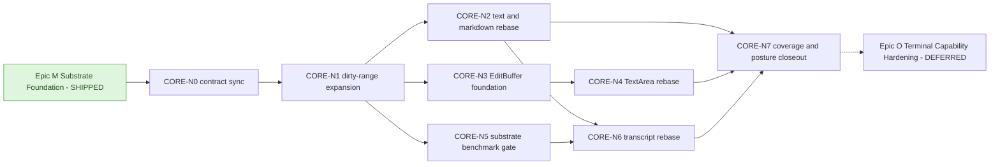

# Engineering Execution Plan

## 0. Version History & Changelog
- v7.4.1 - Marked Epic N complete after the final authority-cut and coalescing audit: substrate-backed text/textarea/transcript paths are shipped, the benchmark gate is live, and the ticket table now reflects completion instead of in-flight target state.
- v7.4.0 - Reshaped Epic N to match Brownfield reality: added a contract-sync preflight, moved the substrate benchmark gate ahead of transcript migration, and expanded dirty ranges to record both replaced and replacement extents.
- v7.3.11 - Tightened the active Epic N contract: oversized substrate getter values now fail explicitly, dirty-range scope is called out as a deliberate CORE-N3 decision, and the last substrate FFI coverage gap is closed.
- v7.3.10 - Reconciled Epic N planning with the shipped substrate reality: ADR-T37 and the spike memo now match flat-`String` backing and the host ABI is mechanically exercised end to end.
- ... [Older history truncated, refer to git logs]

## 1. Executive Summary & Active Critical Path
- **Total Active Story Points:** 0
- **Critical Path:** Epic N is complete on this branch; the next critical path begins when Epic O is activated.
- **Planning Assumptions:** The Native Text Substrate foundation (Epic M) and the full surface rebase (Epic N) are both shipped. `Text`, `Markdown`, code spans, `TextArea`, and transcript blocks now render through the shared substrate; transcript host-facing semantics (anchors, follow modes, unread, collapse, hierarchy) remain unchanged while their backing storage and render path are now substrate-native. `DirtyRange` records both replaced and replacement extents. Epic O (Terminal Capability Hardening) remains intentionally out of active scope per ADR-T40.

## 2. Project Phasing & Iteration Strategy
### Current Active Scope
- No active implementation epic is open in this file right now. Epic N is complete and archived below; Epic O remains deferred until explicitly activated.

### Future / Deferred Scope
#### Epic O — Terminal Capability Hardening (CORE) [DEFERRED]
- **Status:** Documented and deferred per TechSpec ADR-T40.
- **Begins after:** Epic N completes and the rebased substrate surfaces have shipped.
- **Candidate surfaces:**
  - Kitty keyboard protocol support.
  - OSC52 clipboard integration.
  - Terminal hyperlink emission (OSC8).
  - Palette and color-depth capability detection at runtime.
  - Pixel and cell resolution reporting where the terminal exposes it.
  - Multiplexer variance hardening (tmux, screen) and main / alternate / split mode behavior parity.
- **Rationale for deferral:** The bottleneck while Epic N is in flight is rebasing existing surfaces onto the new substrate. Hardening terminal capabilities while widgets are migrating would multiply migration risk and dilute focus. After Epic N ships, capability work can run on a stable foundation.

#### Standing Deferrals Preserved
- No native promotion of code or diff surfaces without measured post-substrate pressure (revisited in CORE-N4).
- No default background-render promotion.
- No packaging-first rewrite, no public onboarding wave, and no additional generic widget breadth in this wave.
- No React or Solid parity work; the JSX/signals layer stays a thin overlay over the imperative protocol.

### Archived or Already Completed Scope
- Epic N (Substrate Surface Rebase) delivered `CORE-N0` through `CORE-N7`: contract sync, dirty-range expansion, substrate-backed text rendering, native `EditBuffer`, `TextArea` rebase, the substrate benchmark gate, transcript substrate migration, and post-substrate coverage/posture updates.
- Epic M (Native Text Substrate) delivered `CORE-M0` through `CORE-M4`: the substrate contract memo, native `TextBuffer`, native `TextView`, the unified text renderer, and the §5.4.1 Unicode/wrapping native gate suite. Its completed scope is summarized in §5.
- The v7 docs-maintenance wave completed `DOCS-A001` through `DOCS-A003`: canonical artifact normalization, preservation review, and source-truth reconciliation.
- Epics I-L delivered native transcript state, anchor-based viewport behavior, nested scroll handoff, devtools APIs, host inspector surfaces, split-pane layout, transcript-backed composites, and flagship examples.
- The archived planning waves also delivered replay fixtures, golden coverage, and example-driven performance gates.
- Archived continuity is retained in summarized form in §6.

## 3. Build Order (Mermaid)

```mermaid
flowchart LR
    M[Epic M Substrate Foundation - SHIPPED]:::done
    M --> N0[CORE-N0 contract sync]
    N0 --> N1[CORE-N1 dirty-range expansion]
    N1 --> N2[CORE-N2 text and markdown rebase]
    N1 --> N3[CORE-N3 EditBuffer foundation]
    N3 --> N4[CORE-N4 TextArea rebase]
    N1 --> N5[CORE-N5 substrate benchmark gate]
    N2 --> N6[CORE-N6 transcript rebase]
    N5 --> N6
    N2 --> N7[CORE-N7 coverage and posture closeout]
    N4 --> N7
    N6 --> N7
    O[Epic O Terminal Capability Hardening - DEFERRED]
    N7 -.-> O
    classDef done fill:#dff5dd,stroke:#3f9d3f,color:#1f4d1f;
```

## 4. Ticket List

Epic O — Terminal Capability Hardening is intentionally not in this ticket list. It is documented in §2.2 with named candidate surfaces and is re-evaluated only after Epic N ships.

### Epic N — Substrate Surface Rebase (CORE)

**CORE-N0 Sync Epic-N Contract to Brownfield Reality**
- **Type:** Chore
- **Effort:** 2
- **Dependencies:** Substrate foundation (Epic M, shipped)
- **Capability / Contract Mapping:** TechSpec ADR-T37 through ADR-T39, §4.4
- **Description:** Reconcile `TechSpec.md`, `Tasks.md`, and the substrate spike memo with the current repo state before functional migration work continues. This sync explicitly records that getter overflows fail instead of truncating, that dirty ranges carry both replaced and replacement extents, and that the transcript benchmark gate lands before transcript rebase.
- **Acceptance Criteria (Gherkin):**
```gherkin
Given the current native substrate and legacy widget paths
When the Epic N docs are reviewed
Then TechSpec, Tasks, and the substrate spike memo describe the same active contract
And no active Epic N ticket relies on stale truncation or cache-only dirty-range semantics
```

**CORE-N1 Expand DirtyRange to Pre- and Post-Replacement Extents**
- **Type:** Feature
- **Effort:** 3
- **Dependencies:** CORE-N0
- **Capability / Contract Mapping:** TechSpec ADR-T39, §3.4, §4.4
- **Description:** Change the native dirty-range record from a single post-replacement interval to a triple carrying `start`, `old_end`, and `new_end`. `replace_range` and `append` record both the replaced extent and the replacement extent so shrinking and growing edits preserve enough information for transcript rebase and future incremental paint consumers. `tui_text_buffer_clear_dirty_ranges` remains the only consume path in this wave.
- **Acceptance Criteria (Gherkin):**
```gherkin
Given a buffer mutation that grows, shrinks, replaces, or appends content
When the buffer records a dirty range
Then the record preserves both the replaced extent and the replacement extent
And clearing dirty ranges still does not bump epoch or style fingerprint
```

**CORE-N2 Rebase Text, Markdown, and Code Spans Onto Substrate**
- **Type:** Feature
- **Effort:** 5
- **Dependencies:** CORE-N1
- **Capability / Contract Mapping:** TechSpec ADR-T37, §5.4.1
- **Description:** Migrate `Text`, `Markdown`, and code-style span rendering paths onto `TextBuffer` content and `TextView` projections drawn through the unified renderer. Remove ad-hoc width and wrap math from the migrated widgets. Public host API for these widgets remains unchanged. Each migrated surface adds a substrate-routing assertion (e.g. inspecting that the widget's render path calls `text_renderer::render_text_view` rather than recomputing geometry) so the §5.4.1 G3/G4 gates have behavioral coverage and not just visual goldens. Search-match highlight colors emitted via `tui_text_buffer_set_highlight` route through the active theme rather than the hard-coded `highlight_kind_bg` palette in the renderer; this avoids a follow-on visual regression once Markdown and code-search surfaces start using highlights.
- **Acceptance Criteria (Gherkin):**
```gherkin
Given a Text or Markdown widget
When its content is set or replaced through the existing host API
Then the widget stores its content in a TextBuffer and its projection in a TextView
And no widget-local code computes wrapped row counts
And the widget's render path is asserted (by test, not by review) to call text_renderer::render_text_view

Given existing widget golden snapshots
When the migrated widgets render the same content
Then snapshots match the documented baseline

Given a search-match or syntax highlight applied via tui_text_buffer_set_highlight
When the surface renders under a non-default theme
Then the highlight background routes through theme bindings rather than the renderer's v1 hard-coded palette
```

**CORE-N3 Land EditBuffer and Its Native ABI**
- **Type:** Feature
- **Effort:** 5
- **Dependencies:** CORE-N1
- **Capability / Contract Mapping:** TechSpec ADR-T38, §3.4, §4.4 `edit_buffer`
- **Description:** Add native `EditBuffer` storage, history/coalescing behavior, and the `tui_edit_buffer_*` FFI already authorized in TechSpec. The implementation owns buffer/edit-buffer lifetime rules, ordinary single-edit operation history, and mechanical FFI coverage before `TextArea` migrates onto it.
- **Acceptance Criteria (Gherkin):**
```gherkin
Given a native EditBuffer over a TextBuffer
When ordinary single-character edits are applied
Then history grows per operation without storing full-content snapshots
And undo and redo replay through buffer mutations rather than content replacement snapshots

Given the native EditBuffer ABI
When the host FFI surface exercises it
Then all documented constructors, mutators, and query functions behave according to the standard error model
```

**CORE-N4 Rebase TextArea Onto EditBuffer and TextView**
- **Type:** Feature
- **Effort:** 8
- **Dependencies:** CORE-N3
- **Capability / Contract Mapping:** TechSpec ADR-T38, §3.4, §4.4 `edit_buffer`
- **Description:** Move `TextArea` state onto an `EditBuffer` wrapping a `TextBuffer` with a `TextView` projection. Replace the existing snapshot-based undo and redo with an operation history plus coalescing rules for ordinary single-edit operations. Preserve the host `TextArea` public API and the existing keyboard behavior. Adds a substrate-routing assertion that `TextArea::render` reaches `text_renderer::render_text_view` (G3/G4 behavioral coverage) so a future regression that reintroduces widget-local wrap math fails in CI rather than slipping past G3's name-based source grep.
- **Acceptance Criteria (Gherkin):**
```gherkin
Given a TextArea editing several pages of content
When the user performs ordinary single-character insertions and deletions
Then operation history grows in O(1) per edit
And no full-content snapshot is stored for those edits
And undo and redo recover the prior cursor and selection state

Given the existing TextArea host wrapper and keyboard tests
When the rebased widget is loaded
Then the public host API and keyboard behavior remain unchanged from the prior TechSpec contract

Given the rebased TextArea
When its render path is exercised in tests
Then a behavioral assertion confirms the widget routes through text_renderer::render_text_view
```

**CORE-N5 Add the Substrate Benchmark Gate Before Transcript Rebase**
- **Type:** Chore
- **Effort:** 5
- **Dependencies:** CORE-N1
- **Capability / Contract Mapping:** TechSpec §5.4.1, ADR-T36
- **Description:** Add a dedicated Criterion benchmark gate for substrate workloads in `native/benches/` and publish the results in `docs/reports/`. This gate measures `tui_text_buffer_append` versus buffer size plus `tui_text_view_set_cursor` and `tui_text_view_byte_to_visual` versus offset distance, and it must be wired before transcript rebase is considered done. If append growth or prefix-scan cost is unacceptable, the benchmark ticket owns the required optimization before transcript closes.
- **Acceptance Criteria (Gherkin):**
```gherkin
Given the substrate benchmark suite
When it runs locally and in CI
Then append-cost growth and cursor-mapping prefix cost are published under docs/reports/
And transcript rebase does not close without an acceptable recorded curve or the required optimization landing in the same wave
```

**CORE-N6 Rebase Transcript Block Content Onto Substrate**
- **Type:** Feature
- **Effort:** 8
- **Dependencies:** CORE-N1, CORE-N2, CORE-N5
- **Capability / Contract Mapping:** TechSpec ADR-T39, §3.4
- **Description:** Replace `TranscriptBlock.content: String` with `TextBuffer`-backed segment storage. Render visible blocks through `TextView` projections via the unified renderer. `append_block`, `patch_block`, and `finish_block` mutate the buffer through the substrate API and bump the corresponding epoch. Transcript-specific state (`anchor_kind`, `follow_mode`, unread anchors, collapse state, parent and hierarchy, role coloring) is unchanged. The host `TranscriptView` public API stays stable. The rebase wires `tui_text_buffer_clear_dirty_ranges` into the per-frame render path so `dirty_ranges` does not grow unbounded across the session lifetime, and adds a substrate-routing assertion that the transcript visible-block render reaches `text_renderer::render_text_view`.
- **Pre-Rebase Performance Gate:** The shipped substrate stores buffer content in a flat `String` and `recompute_line_metadata` rescans the entire content per mutation, so per-token streaming `append` is O(N) and cumulative cost is O(N²) in buffer size. Transcript streaming is the headline workload that this rebase will lean on, so the CORE-N5 benchmark gate must record append cost as a function of buffer size before this ticket closes; if the curve is unacceptable, the required optimization lands in the same wave before transcript merge.
- **Acceptance Criteria (Gherkin):**
```gherkin
Given a streaming transcript with a visible reading position
When patch_block append operations arrive
Then only the affected block's TextBuffer epoch advances
And the visible-block render path does not clone block content into a temporary owned String

Given the canonical transcript replay fixtures (append, patch, collapse, unread, resize, detach)
When the rebased transcript runs them
Then anchor, follow, unread, and collapse behavior matches the prior fixture outputs
And the host TranscriptView public API behaves identically to the pre-rebase contract

Given the CORE-N5 append-cost benchmark
When CORE-N3 ships
Then the recorded append-cost-vs-buffer-size curve is documented and within the bound CORE-N5 establishes

Given a long-running transcript session that issues thousands of append / patch operations
When the per-frame render path runs
Then tui_text_buffer_clear_dirty_ranges is called once per buffer per frame
And dirty_ranges memory stays bounded across the session
```

**CORE-N7 Refresh Coverage and Re-Evaluate CodeView/DiffView Posture**
- **Type:** Chore
- **Effort:** 2
- **Dependencies:** CORE-N2, CORE-N4, CORE-N6
- **Capability / Contract Mapping:** TechSpec ADR-T35, ADR-T37
- **Description:** Refresh replay and golden coverage for substrate-driven surfaces, keep flagship example replay tests green, and re-run the host-composite-versus-native-promotion question for `CodeView` and `DiffView` against the new substrate. Update `docs/reports/code-diff-native-measurement.md` with substrate-era measurements and a recommendation. If the recommendation changes the prior posture, propose an ADR update to TechSpec.
- **Acceptance Criteria (Gherkin):**
```gherkin
Given the substrate-driven Text, TextArea, and Transcript surfaces
When the replay and golden suite runs in CI
Then large-transcript, long-code, nested-scroll, collapse and expand, tail-follow, resize, and selection and cursor scenarios all pass
And the existing flagship example replay tests in ts/test-examples.test.ts remain green
And any regression in the structural gates listed in TechSpec section 5.4.1 fails the suite

Given the new substrate is in use by Text, Markdown, TextArea, and Transcript surfaces
When CodeView and DiffView are exercised on representative content
Then a written measurement exists describing whether native promotion is warranted post-substrate
And the recommendation is reflected in TechSpec ADR status if it changes the prior posture
```

## 5. Ticket Summary Table (Active Wave)

| ID | Epic | Type | SP | Dependencies | Phase |
| --- | --- | --- | --- | --- | --- |
| CORE-N0 | N | Chore | 2 | Substrate (Epic M, shipped) | Done |
| CORE-N1 | N | Feature | 3 | N0 | Done |
| CORE-N2 | N | Feature | 5 | N1 | Done |
| CORE-N3 | N | Feature | 5 | N1 | Done |
| CORE-N4 | N | Feature | 8 | N3 | Done |
| CORE-N5 | N | Chore | 5 | N1 | Done |
| CORE-N6 | N | Feature | 8 | N1, N2, N5 | Done |
| CORE-N7 | N | Chore | 2 | N2, N4, N6 | Done |
|  |  | **TOTAL** | **38** |  |  |

### Archived Epic M Summary

| ID | Epic | Type | SP | Dependencies | Phase |
| --- | --- | --- | --- | --- | --- |
| CORE-M0 | M | Spike | 2 | None | Done |
| CORE-M1 | M | Feature | 8 | M0 | Done |
| CORE-M2 | M | Feature | 8 | M1 | Done |
| CORE-M3 | M | Feature | 5 | M2 | Done |
| CORE-M4 | M | Chore | 5 | M3 | Done |
|  |  | **TOTAL** | **28** |  |  |

## 6. Archived Continuity Summary

### 6.1 Archived v7 Docs-Maintenance Wave

| ID | Type | SP | Status | Outcome |
| --- | --- | --- | --- | --- |
| DOCS-A001 | Chore | 3 | Done | Rewrote the canonical docs chain into the current framework skeleton. |
| DOCS-A002 | Chore | 2 | Done | Verified preservation of glossary, scope, delivered capabilities, and continuity notes. |
| DOCS-A003 | Chore | 3 | Done | Reconciled the rewritten docs against source, tests, examples, and workflows. |
|  |  | **8** |  |  |

### 6.2 Archived v6 Delivery Wave
- **Total Archived Story Points:** 85
- **Archived Critical Path:** `TASK-I0 -> TASK-I1 -> TASK-I2 -> TASK-I3 -> TASK-I4 -> TASK-I5 -> TASK-J0 -> TASK-J1 -> TASK-J2 -> TASK-J3 -> TASK-J4 -> TASK-L1 -> TASK-L3`
- **Delivered outcomes preserved for continuity:** native transcript and anchor semantics, replay and benchmark gates, devtools APIs and inspector surfaces, native split-pane behavior, host composites (`CommandPalette`, `TracePanel`, `StructuredLogView`, `CodeView`, `DiffView`), and flagship examples (`agent-console`, `ops-log-console`, `repo-inspector`).
