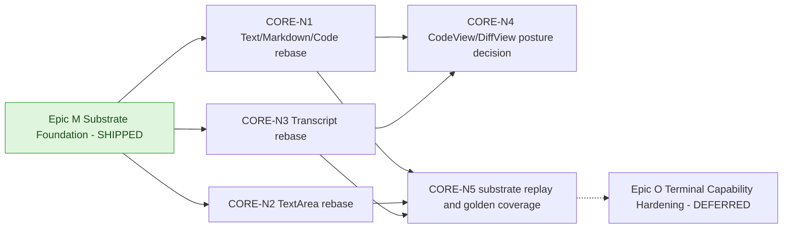
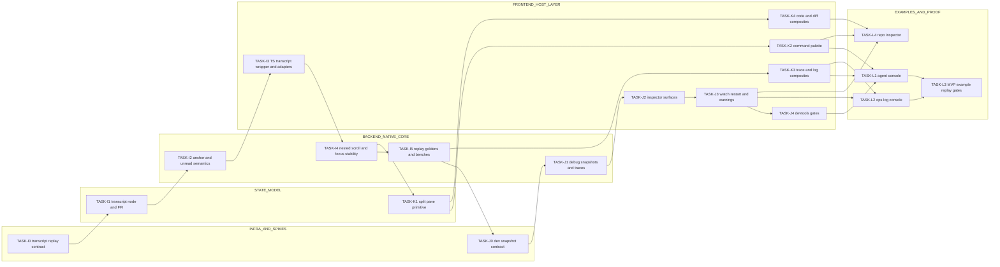

# Engineering Execution Plan

## 0. Version History & Changelog
- v7.3.8 - Reflects review-wave 8 against PR #35. Wired the substrate ABI into the Bun FFI symbol table — without this, the native `tui_text_buffer_*` / `tui_text_view_*` exports landed in Epic M but were inaccessible from TypeScript (`ffi.tui_text_buffer_create` was `undefined`). Also reconciled the §4.4 status-returning error-model list to include `tui_text_buffer_clear_dirty_ranges` so the contract is internally consistent for the wave-5 drain API.
- v7.3.7 - Reflects review-wave 7 against PR #35. Two renderer correctness fixes: (1) wave-5's wrap-boundary cursor suppression now also checks that the next visual row is within the rendered window — without this, a cursor at a wrap boundary disappeared when the next row was clipped by the viewport; (2) tabs no longer route through the wide-glyph `glyph_clipped` path, so clipped tab cells inside the rect get filled by the trailing-fill loop with the merged style instead of being left unstyled.
- v7.3.6 - Reflects review-wave 6 against PR #35. Two substrate correctness fixes plus three hot-path optimizations: (1) `wrap_segment` recomputes tab advance after wrap reset (column-dependent advance was stale, allowing multi-grapheme rows to overflow `wrap_width`); (2) cursor mapping now agrees across `set_cursor`, `byte_to_visual`, and `ensure_projection` reconciliation for offsets that fall in word-wrap consumed-whitespace gaps (set_cursor/byte_to_visual reject; reconciliation snaps forward); (3) `render_text_view` reads projection by reference instead of cloning `visual_lines`/`style_spans`/`highlights` per call; (4) `clear_last_error` peeks under a read lock first, skipping the write-lock acquisition when last_error is already empty (the common case after wave-3 made every successful FFI call clear); (5) `read_utf8_payload` returns `&str` instead of `String`, so substrate streaming-append paths copy each payload once into buffer storage rather than twice. Spike memo `CORE-M0-substrate-contract.md` updated to record the wave-5 dirty-range consume API.
- v7.3.5 - Reflects review-wave 5 against PR #35. Three substrate correctness fixes: (1) `wrap_segment` no longer emits visual lines whose `cell_width` exceeds `wrap_width` when the wrap break-point lands earlier in the segment than the for-loop's current grapheme — `run_col` is now recomputed against the iterated prefix after each wrap reset; (2) the renderer no longer double-draws the cursor at a soft-wrap boundary (end-of-row N marker is suppressed when row N+1 starts at the same byte); (3) left-clipped wide glyphs and tabs now paint their visible trailing cells, mirroring the right-edge clip path. New ABI: `tui_text_buffer_clear_dirty_ranges` lets consumers drain the dirty list so it doesn't grow unbounded; CORE-N3 picks up the wiring requirement. CORE-N1/N2/N3 acceptance criteria now require explicit substrate-routing assertions per migrated surface (G3/G4 behavioral coverage) and CORE-N1 picks up theme integration for highlight backgrounds. CORE-N5 benchmark scope expanded to include cursor-mapping cost as a function of prefix length so the wave-4 line-bounded scan question is measured before transcript-tail interactions ship.
- v7.3.4 - Reflects review-wave 4 against PR #35. Word-wrap no longer emits phantom zero-length visual rows when consumed inter-word whitespace precedes a long unbreakable token (the `last_ws` tracker is now scoped to the active run and the wrap branch refuses zero-length pushes). `is_grapheme_boundary` is now O(grapheme-position) instead of O(content) on no-match, removing a hidden quadratic in transcript-streaming workloads. Cursor `UNDERLINE` is restricted to the primary cell so wide-glyph and tab cursors don't smear the underline across trailing cells. `is_ws_grapheme`'s ASCII-only word-break set is documented. CORE-N3 is gated on a CORE-N5 append-cost benchmark before rebase ships, so the substrate's flat-`String` recompute-on-every-mutation cost cannot regress the transcript streaming path silently.
- v7.3.3 - Reflects review-wave 3 against PR #35. The substrate FFI now clears `last_error` on every successful call (via `ffi_wrap` / `ffi_wrap_handle` / `ffi_wrap_u64`), so the zero-sentinel getter contract is reliable in practice; added a Rust regression test for the stale-error-after-success path. `byte_to_visual` rejects non-grapheme offsets (matching `set_cursor` / `visual_to_byte`), making the byte<->visual mapping round-trippable for every accepted input. The unified renderer now fills every cell a tab grapheme advances through with the merged cell style, so selection / highlight / background coverage no longer leaves uncolored holes inside tab-expanded text. The `substrate_gates.rs` lede now matches the §5.4.1 reality (G3/G5/G6/G7/G8 enforced by named tests; G1/G4 source-review; G2 deferred to CORE-N2).
- v7.3.2 - Reflects review-wave 2 against PR #35. Documented the reality that substrate value-returning getters (`tui_text_buffer_get_*`, `tui_text_view_get_*`) cannot use the `0/-1/-2` status model and instead return `0` on error with the diagnostic surfaced through `tui_get_last_error()`; corrected stale §5.1 / "Appendix E" navigation references in the archived Epic M summary; updated `CORE-M2` notes to match shipped reality (10 `tui_text_view_*` FFI exports, expanded text_view test suite). Cursor reconciliation in `TextView` now snaps to a grapheme boundary, not just `byte_len`, so width-changing edits cannot strand the cursor inside a cluster.
- v7.3.1 - Reconciled `CORE-M4` description and acceptance with what the Epic-M gate suite actually enforces: G3/G5/G6/G7/G8 are covered by named native tests, G1/G4 are tracked as source-review gates, and G2 (TextArea undo without full snapshots) is deferred to `CORE-N2` along with `EditBuffer`. Reflects review-wave 1 against PR #35.
- v7.3.0 - Archived Epic M (Native Text Substrate) as completed: `CORE-M0` through `CORE-M4` shipped the contract memo, `TextBuffer`, `TextView`, the unified text renderer, and the §5.4.1 Unicode/wrapping gate suite. Active wave narrows to Epic N (Substrate Surface Rebase).
- v7.2.0 - Ratified Epic M (Native Text Substrate) and Epic N (Substrate Surface Rebase) as the active wave; documented Epic O (Terminal Capability Hardening) as deferred future scope; preserved the v6 and v7 archived appendices.
- v7.1.0 - Archived the completed docs-normalization wave and marked the active plan as intentionally idle until a post-v4 backlog is ratified.
- v7.0.0 - Reframed the plan around active versus archived scope, made documentation-chain normalization the current maintenance wave, and preserved the completed v4 execution record as archived continuity.
- ... [Older history truncated, refer to git logs]

## 1. Executive Summary & Active Critical Path
- **Total Active Story Points:** 29
- **Critical Path:** `CORE-N1 -> CORE-N3 -> CORE-N5`
- **Planning Assumptions:** The Native Text Substrate foundation (TechSpec ADR-T37, §3.4, §4.4) shipped with Epic M; `TextBuffer`, `TextView`, and the unified text renderer are now Brownfield reality. Active scope narrows to Epic N — migrating existing surfaces (`Text`, `Markdown`, code spans, `TextArea`, transcript blocks) onto the substrate and adding `EditBuffer`-backed undo for `TextArea` (ADR-T38). Existing transcript host-facing semantics (anchors, follow modes, unread, collapse, hierarchy) remain unchanged at the public contract level; only their backing storage migrates. Epic O (Terminal Capability Hardening) is intentionally out of active scope per ADR-T40 and is preserved in §2.2 with named candidate surfaces.

## 2. Project Phasing & Iteration Strategy
### Current Active Scope
- **Epic N — Substrate Surface Rebase (CORE):** Migrate `Text` / `Markdown` / code spans, `TextArea` (operation-based undo on `EditBuffer`), and transcript blocks onto the substrate. Re-evaluate `CodeView` / `DiffView` posture on the new substrate. Add replay and golden coverage for substrate-driven surfaces.

### Future / Deferred Scope
#### Epic O — Terminal Capability Hardening (CORE) [DEFERRED]
- **Status:** Documented and deferred per TechSpec ADR-T40.
- **Begins after:** Epic N completes and the rebased substrate surfaces have shipped.
- **Candidate surfaces:**
  - Kitty keyboard protocol support.
  - OSC52 clipboard integration.
  - Terminal hyperlink emission (OSC8).
  - Palette and color-depth capability detection at runtime.
  - Pixel and cell resolution reporting where the terminal exposes it.
  - Multiplexer variance hardening (tmux, screen) and main / alternate / split mode behavior parity.
- **Rationale for deferral:** The bottleneck while Epic N is in flight is rebasing existing surfaces onto the new substrate. Hardening terminal capabilities while widgets are migrating would multiply migration risk and dilute focus. After Epic N ships, capability work can run on a stable foundation.

#### Standing Deferrals Preserved
- No native promotion of code or diff surfaces without measured post-substrate pressure (revisited in CORE-N4).
- No default background-render promotion.
- No packaging-first rewrite, no public onboarding wave, and no additional generic widget breadth in this wave.
- No React or Solid parity work; the JSX/signals layer stays a thin overlay over the imperative protocol.

### Archived or Already Completed Scope
- Epic M (Native Text Substrate) delivered `CORE-M0` through `CORE-M4`: the substrate contract memo, native `TextBuffer`, native `TextView`, the unified text renderer, and the §5.4.1 Unicode/wrapping native gate suite. Detailed tickets are preserved in §4 under "Archived Epic M — Native Text Substrate (CORE) [Completed]".
- The v7 docs-maintenance wave completed `DOCS-A001` through `DOCS-A003`: canonical artifact normalization, preservation review, and source-truth reconciliation.
- Epics I-L delivered native transcript state, anchor-based viewport behavior, nested scroll handoff, devtools APIs, host inspector surfaces, split-pane layout, transcript-backed composites, and flagship examples.
- The archived planning waves also delivered replay fixtures, golden coverage, and example-driven performance gates.
- Detailed archived tickets, acceptance criteria, and archived build-order graphs are preserved below for continuity and auditability.

## 3. Build Order (Mermaid)

```mermaid
flowchart LR
    M[Epic M Substrate Foundation - SHIPPED]:::done
    M --> N1[CORE-N1 Text/Markdown/Code rebase]
    M --> N2[CORE-N2 TextArea rebase]
    M --> N3[CORE-N3 Transcript rebase]
    N1 --> N4[CORE-N4 CodeView/DiffView posture decision]
    N3 --> N4
    N1 --> N5[CORE-N5 substrate replay and golden coverage]
    N2 --> N5
    N3 --> N5
    O[Epic O Terminal Capability Hardening - DEFERRED]
    N5 -.-> O
    classDef done fill:#dff5dd,stroke:#3f9d3f,color:#1f4d1f;
```

## 4. Ticket List

Epic O — Terminal Capability Hardening is intentionally not in this active ticket list. It is documented in §2.2 with named candidate surfaces and is re-evaluated only after Epic N ships.

Epic M — Native Text Substrate shipped under v7.3 and is now archived. `CORE-M0` through `CORE-M4` are preserved with their original acceptance criteria below for continuity.

### Archived Epic M — Native Text Substrate (CORE) [Completed]

**CORE-M0 Spike Native Text Substrate Contract**
- **Type:** Spike
- **Effort:** 2
- **Status:** Done
- **Dependencies:** None
- **Capability / Contract Mapping:** TechSpec ADR-T37, §3.4, §4.4
- **Description:** Time-box the substrate contract before implementation begins. Lock the `TextBuffer` mutation API, content-epoch model, dirty-range semantics, `TextView` cache-key shape, `EditBuffer` operation list, and the ABI ownership and copy semantics for each surface. Emit a contract memo that downstream tickets reference.
- **Implementation Notes:** Contract memo committed at `docs/spikes/CORE-M0-substrate-contract.md`. Locks `TextBuffer` mutation API and epoch rules; `TextView` cache key as `(content_epoch, wrap_width, wrap_mode, tab_width, style_fingerprint, viewport_rows)`; `WrapMode` discriminator (`None=0`, `Char=1`, `Word=2`); `EditBuffer` operation list (`Insert`, `Delete`, `Replace`, `SelectionMove`, `CursorMove`) with coalescing rules; ABI ownership and copy semantics per surface; seven open questions resolved (storage backing, tab policy, grapheme strategy, selection model, highlight kind, cache invalidation granularity, empty-buffer behavior).
- **Acceptance Criteria (Gherkin):**
```gherkin
Given the active CORE wave is ratified
When the spike is closed
Then a TextBuffer mutation contract, TextView cache-key contract, and EditBuffer operation list are documented
And ABI handle ownership and copy semantics for each surface are decided
And open structural questions that block CORE-M1 are listed explicitly or marked resolved
```

**CORE-M1 Implement Native TextBuffer**
- **Type:** Feature
- **Effort:** 8
- **Status:** Done
- **Dependencies:** CORE-M0
- **Capability / Contract Mapping:** TechSpec ADR-T37, §3.4, §4.4 `text_buffer`
- **Description:** Implement chunked or rope-style content storage with content epochs, line-start markers, dirty ranges, cached width metrics, grapheme boundaries, tab expansion policy, style spans, selection ranges, and highlights. Expose the documented `tui_text_buffer_*` ABI surface in `lib.rs` through `ffi_wrap` / `ffi_wrap_handle` entry points.
- **Implementation Notes:** New module `native/src/text_buffer.rs` with `TextBuffer` (flat `String` backing per the M0 memo, content `epoch`, `style_fingerprint`, `line_starts`, cached `line_widths`, style spans, single active selection, highlights, dirty ranges, configurable `tab_width`). Mutation routes through `replace_range` / `append`; style/selection/highlight mutations bump `style_fingerprint` only. 13 `tui_text_buffer_*` FFI entry points wired in `lib.rs` via `ffi_wrap` / `ffi_wrap_handle` / new `ffi_wrap_u64` for the `u64` epoch getter. Substrate handle counter (`next_substrate_handle`) added to `TuiContext` and shared with `TextView` to prevent cross-map handle collisions. 12 unit tests cover empty-buffer invariants, monotonic epoch growth, no-op append behavior, dirty-range recording, line-metadata consistency, UTF-8 boundary rejection, out-of-range rejection, fingerprint vs epoch separation, range reconciliation, selection drop on full replace, view-referenced destroy guard, and CJK / tab cell width.
- **Acceptance Criteria (Gherkin):**
```gherkin
Given a freshly created TextBuffer
When content is appended and a byte range is replaced
Then the content epoch increases monotonically per mutation
And dirty ranges identify only the affected region
And line-start markers, grapheme counts, and width metrics stay consistent with the stored content

Given a TextBuffer with style spans, selection ranges, and highlights set
When the underlying byte range is replaced
Then ranges are reconciled against the new content
And invalid handles or out-of-range byte offsets return the documented error semantics
```

**CORE-M2 Implement Native TextView Projection**
- **Type:** Feature
- **Effort:** 8
- **Status:** Done
- **Dependencies:** CORE-M1
- **Capability / Contract Mapping:** TechSpec ADR-T37, §3.4, §4.4 `text_view`
- **Description:** Implement the viewport / wrap projection over `TextBuffer`. Visual lines, soft-wrap cache keyed by `(content_epoch, wrap_width, wrap_mode, tab_width, style_fingerprint, viewport_rows)`, scroll row and column, cursor mapping, byte-grapheme-cell-visual-row conversions, horizontal scroll, resize invalidation, and stable anchors.
- **Implementation Notes:** New module `native/src/text_view.rs` with `TextView` projection holding `wrap_width`, `wrap_mode`, `tab_width`, `viewport_rows`, scroll row/col, optional `CursorPos`, `Vec<VisualLine>` cache, and `cache_key_epoch`. `WrapMode::None` short-circuits to one visual row per logical line; `WrapMode::Char` breaks at any cell boundary; `WrapMode::Word` prefers whitespace breaks with char-mode fallback. `ensure_projection` lazily recomputes when the composite cache key changes; cursor anchors are clamped against the buffer's current `byte_len` and snapped backward to the nearest grapheme start so a width-changing edit can't strand the cursor inside a code point or cluster (refined in PR #35 review wave 2). 10 `tui_text_view_*` FFI entry points cover create/destroy, `set_wrap`, `set_viewport`, `set_cursor` / `clear_cursor`, `get_visual_line_count`, `byte_to_visual` / `visual_to_byte` with caller-owned out-pointers, and `get_cache_epoch`. The text_view test suite asserts unwrapped logical-line projection, char-mode wrap byte boundaries, word-wrap respects width, cache key invalidates on wrap change without disturbing buffer epoch, byte/visual round-trip across newlines, cursor clamping after buffer truncation, rejection of cursor offsets inside grapheme clusters (added in wave 1), grapheme-boundary cursor reconciliation after width-changing edits (added in wave 2), wide glyphs never split across grapheme boundaries, and TextBuffer destroy is blocked while a TextView still references it.
- **Acceptance Criteria (Gherkin):**
```gherkin
Given a TextView over a stable TextBuffer
When wrap width or viewport rows change
Then only the affected wrap-cache entries are invalidated
And the underlying buffer epoch and metrics remain unchanged

Given a TextView with an active cursor
When buffer content above the cursor is replaced
Then byte to visual mapping reflects the new content
And the view's stable anchors remain inside the buffer's valid byte range

Given a resize event that changes viewport width
When the view recomputes
Then visual lines are re-wrapped without invalidating buffer storage
```

**CORE-M3 Implement Unified Native Text Renderer**
- **Type:** Feature
- **Effort:** 5
- **Status:** Done
- **Dependencies:** CORE-M2
- **Capability / Contract Mapping:** TechSpec ADR-T37, §5.4.1
- **Description:** Implement the single text-rendering path that draws a `TextView` into Kraken's existing cell buffer. One implementation handles clipping, wide chars, combining marks, ZWJ and emoji, CJK width, tab expansion, selections, highlights, cursor rendering, and style merging. Add golden coverage for the renderer.
- **Implementation Notes:** New module `native/src/text_renderer.rs` exposes `render_text_view(ctx, view_handle, target, rect, base_style)` as the single rendering path. Walks visual lines starting at `scroll_row`, advances grapheme-by-grapheme with tab expansion against `tab_width`, applies the unified style merge order (base → buffer style spans → highlights → selection inversion → cursor underline), replaces wide glyphs that would spill past the right clip boundary with a single space (no split), and treats zero-width / combining graphemes as no-advance (the prior cell's `ch` remains in place). `golden::assert_golden_buffer` added to support standalone-buffer golden assertions outside `ctx.back_buffer`. 9 tests cover plain ASCII, wide-glyph clip-boundary placeholder, combining mark attachment, selection inversion, cursor marker placement, char-mode wrap rendering, highlight bg override, tab expansion against `tab_width`, and a multi-line Unicode-mixed golden fixture (`native/fixtures/text_renderer_unicode_mixed.golden`). The module sits idle in production until Epic N wires it into the existing widget render paths; `#![allow(dead_code)]` documents that.
- **Acceptance Criteria (Gherkin):**
```gherkin
Given a TextView containing mixed-width Unicode content
When the unified renderer draws into a clipped region
Then wide glyphs do not split across the clip boundary
And combining marks render attached to their base grapheme
And selections, highlights, and the cursor layer with correct precedence

Given an existing widget that previously hand-rolled text rendering
When the widget is migrated to the unified renderer
Then golden snapshots match the documented baseline
And no widget-local code computes wrapped row counts
```

**CORE-M4 Add Unicode and Wrapping Native Test Gate**
- **Type:** Chore
- **Effort:** 5
- **Status:** Done
- **Dependencies:** CORE-M3
- **Capability / Contract Mapping:** TechSpec §5.4.1
- **Description:** Add a native test suite under `cargo test` covering grapheme segmentation, `wcwidth` behavior, soft-wrapping, tab expansion, resize-driven wrap invalidation, cursor mapping, selection across grapheme boundaries, ZWJ emoji, CJK width, zero-width codepoints, and wide-glyph clipping. Cover the structural gates in TechSpec §5.4.1 that are enforceable from Epic M's deliverables: G3 / G5 / G6 / G7 / G8. G1 (no transcript clone-into-`String`) and G4 (no widget bypasses the unified renderer) remain source-review gates whose behavioral coverage is owned by the per-widget golden tests added during Epic N migrations. G2 (no full-content snapshot per single-edit op) is deferred until `EditBuffer` lands in `CORE-N2`.
- **Implementation Notes:** New `#[cfg(test)]` module `native/src/substrate_gates.rs` enforces the Epic-M-shipping gates with transparently named tests. G5 (cross-buffer epoch isolation), G6 (resize invalidates view only, not buffer storage), G7 (ZWJ family emoji segmentation, CJK width, soft-wrap byte boundaries, tab expansion against `tab_width`, resize-driven wrap invalidation, byte/visual round-trip, selection across grapheme boundary, zero-width codepoint handling, wide-glyph clip-boundary replacement), G3 (source-grep gate that no module outside the substrate defines a `compute_visual_lines` helper — name-based proxy; behavioral coverage lives in widget golden tests under Epic N), and G8 (substrate modules present and correctness tested in Rust). G1 and G4 stay as source-review gates here; G2 is intentionally deferred to `CORE-N2` along with `EditBuffer` and is documented as such in the module preamble. Suite runs as 13 named tests; full `cargo test` passes with `cargo fmt --check` and `cargo clippy -- -D warnings` clean.
- **Acceptance Criteria (Gherkin):**
```gherkin
Given the substrate test suite
When cargo test runs in the native crate
Then grapheme, wcwidth, wrap, tab, resize, cursor, and selection edge cases are covered by named tests
And each TechSpec §5.4.1 gate that depends only on Epic M deliverables (G3, G5, G6, G7, G8) is enforced by at least one named native test
And gates that depend on later substrate components or per-widget migrations (G1, G2, G4) are documented as source-review or deferred-test gates with the responsible epic identified
And the suite fails when any documented Unicode behavior regresses
```

### Epic N — Substrate Surface Rebase (CORE)

**CORE-N1 Rebase Text, Markdown, and Code Spans Onto Substrate**
- **Type:** Feature
- **Effort:** 5
- **Dependencies:** Substrate foundation (Epic M, shipped)
- **Capability / Contract Mapping:** TechSpec ADR-T37, §5.4.1
- **Description:** Migrate `Text`, `Markdown`, and code-style span rendering paths onto `TextBuffer` content and `TextView` projections drawn through the unified renderer. Remove ad-hoc width and wrap math from the migrated widgets. Public host API for these widgets remains unchanged. Each migrated surface adds a substrate-routing assertion (e.g. inspecting that the widget's render path calls `text_renderer::render_text_view` rather than recomputing geometry) so the §5.4.1 G3/G4 gates have behavioral coverage and not just visual goldens. Search-match highlight colors emitted via `tui_text_buffer_set_highlight` route through the active theme rather than the hard-coded `highlight_kind_bg` palette in the renderer; this avoids a follow-on visual regression once Markdown and code-search surfaces start using highlights.
- **Acceptance Criteria (Gherkin):**
```gherkin
Given a Text or Markdown widget
When its content is set or replaced through the existing host API
Then the widget stores its content in a TextBuffer and its projection in a TextView
And no widget-local code computes wrapped row counts
And the widget's render path is asserted (by test, not by review) to call text_renderer::render_text_view

Given existing widget golden snapshots
When the migrated widgets render the same content
Then snapshots match the documented baseline

Given a search-match or syntax highlight applied via tui_text_buffer_set_highlight
When the surface renders under a non-default theme
Then the highlight background routes through theme bindings rather than the renderer's v1 hard-coded palette
```

**CORE-N2 Rebase TextArea Onto EditBuffer and TextView**
- **Type:** Feature
- **Effort:** 8
- **Dependencies:** Substrate foundation (Epic M, shipped)
- **Capability / Contract Mapping:** TechSpec ADR-T38, §3.4, §4.4 `edit_buffer`
- **Description:** Move `TextArea` state onto an `EditBuffer` wrapping a `TextBuffer` with a `TextView` projection. Replace the existing snapshot-based undo and redo with an operation history plus coalescing rules for ordinary single-edit operations. Preserve the host `TextArea` public API and the existing keyboard behavior. Adds a substrate-routing assertion that `TextArea::render` reaches `text_renderer::render_text_view` (G3/G4 behavioral coverage) so a future regression that reintroduces widget-local wrap math fails in CI rather than slipping past G3's name-based source grep.
- **Acceptance Criteria (Gherkin):**
```gherkin
Given a TextArea editing several pages of content
When the user performs ordinary single-character insertions and deletions
Then operation history grows in O(1) per edit
And no full-content snapshot is stored for those edits
And undo and redo recover the prior cursor and selection state

Given the existing TextArea host wrapper and keyboard tests
When the rebased widget is loaded
Then the public host API and keyboard behavior remain unchanged from the prior TechSpec contract

Given the rebased TextArea
When its render path is exercised in tests
Then a behavioral assertion confirms the widget routes through text_renderer::render_text_view
```

**CORE-N3 Rebase Transcript Block Content Onto Substrate**
- **Type:** Feature
- **Effort:** 8
- **Dependencies:** Substrate foundation (Epic M, shipped); CORE-N5 append-cost benchmark must exist before this rebase ships (see "Pre-Rebase Performance Gate" below)
- **Capability / Contract Mapping:** TechSpec ADR-T39, §3.4
- **Description:** Replace `TranscriptBlock.content: String` with `TextBuffer`-backed segment storage. Render visible blocks through `TextView` projections via the unified renderer. `append_block`, `patch_block`, and `finish_block` mutate the buffer through the substrate API and bump the corresponding epoch. Transcript-specific state (`anchor_kind`, `follow_mode`, unread anchors, collapse state, parent and hierarchy, role coloring) is unchanged. The host `TranscriptView` public API stays stable. The rebase wires `tui_text_buffer_clear_dirty_ranges` into the per-frame render path so `dirty_ranges` does not grow unbounded across the session lifetime, and adds a substrate-routing assertion that the transcript visible-block render reaches `text_renderer::render_text_view`.
- **Pre-Rebase Performance Gate:** The shipped substrate stores buffer content in a flat `String` and `recompute_line_metadata` rescans the entire content per mutation, so per-token streaming `append` is O(N) and cumulative cost is O(N²) in buffer size. Transcript streaming is the headline workload that this rebase will lean on, so before this rebase merges, the CORE-N5 benchmark gate (see below) must report append cost as a function of buffer size; if the curve is unacceptable, this ticket is blocked on incremental line-metadata invalidation in `text_buffer.rs` (separate ticket if needed) before proceeding.
- **Acceptance Criteria (Gherkin):**
```gherkin
Given a streaming transcript with a visible reading position
When patch_block append operations arrive
Then only the affected block's TextBuffer epoch advances
And the visible-block render path does not clone block content into a temporary owned String

Given the canonical transcript replay fixtures (append, patch, collapse, unread, resize, detach)
When the rebased transcript runs them
Then anchor, follow, unread, and collapse behavior matches the prior fixture outputs
And the host TranscriptView public API behaves identically to the pre-rebase contract

Given the CORE-N5 append-cost benchmark
When CORE-N3 ships
Then the recorded append-cost-vs-buffer-size curve is documented and within the bound CORE-N5 establishes

Given a long-running transcript session that issues thousands of append / patch operations
When the per-frame render path runs
Then tui_text_buffer_clear_dirty_ranges is called once per buffer per frame
And dirty_ranges memory stays bounded across the session
```

**CORE-N4 Re-Evaluate CodeView and DiffView Posture**
- **Type:** Chore
- **Effort:** 3
- **Dependencies:** CORE-N1, CORE-N3
- **Capability / Contract Mapping:** TechSpec ADR-T35, ADR-T37
- **Description:** Re-run the host-composite-versus-native-promotion question for `CodeView` and `DiffView` against the new substrate. Update `docs/reports/code-diff-native-measurement.md` with substrate-era measurements and a recommendation. If the recommendation changes the prior posture, propose an ADR update to TechSpec.
- **Acceptance Criteria (Gherkin):**
```gherkin
Given the new substrate is in use by Text, Markdown, and Transcript surfaces
When CodeView and DiffView are exercised on representative content
Then a written measurement exists describing whether native promotion is warranted post-substrate
And the recommendation is reflected in TechSpec ADR status if it changes the prior posture
```

**CORE-N5 Add Substrate Replay, Golden, and Append-Cost Coverage**
- **Type:** Chore
- **Effort:** 5
- **Dependencies:** CORE-N1, CORE-N2, CORE-N3
- **Capability / Contract Mapping:** TechSpec §5.4.1, ADR-T36
- **Description:** Add replay and golden coverage for substrate-driven surfaces: large transcripts, long code blocks, nested scroll, collapse and expand, tail-follow, resize-driven wrap invalidation, and selection and cursor overlays. Existing flagship example replay tests in `ts/test-examples.test.ts` stay green. Add a Criterion benchmark gate in `native/benches/` (or extend an existing one) that measures `tui_text_buffer_append` cost as a function of pre-existing buffer size at 1 KiB, 16 KiB, 256 KiB, and 4 MiB. The benchmark output goes into `docs/reports/` so the curve is reviewable, and CORE-N3's pre-rebase gate consumes it. The same benchmark file also measures `tui_text_view_set_cursor` and `tui_text_view_byte_to_visual` as a function of the offset's distance from byte 0, so the wave-4 grapheme-boundary scan (currently bounded but still O(prefix-length)) is measured before transcript-tail interactions ship. If the curve is unacceptable, the optimization is "scan from the containing line via `line_starts` instead of from byte 0", tracked as a separate ticket.
- **Acceptance Criteria (Gherkin):**
```gherkin
Given the substrate-driven Text, TextArea, and Transcript surfaces
When the replay and golden suite runs in CI
Then large-transcript, long-code, nested-scroll, collapse and expand, tail-follow, resize, and selection and cursor scenarios all pass
And the existing flagship example replay tests in ts/test-examples.test.ts remain green
And any regression in the structural gates listed in TechSpec section 5.4.1 fails the suite

Given a Criterion benchmark of tui_text_buffer_append at increasing buffer sizes
When the benchmark runs locally and in CI
Then the recorded append-cost-vs-buffer-size curve is published under docs/reports/
And the curve sets the bound that CORE-N3's pre-rebase gate enforces

Given a Criterion benchmark of tui_text_view_set_cursor and tui_text_view_byte_to_visual at increasing prefix lengths
When the benchmark runs
Then the grapheme-boundary scan cost as a function of offset is published under docs/reports/
And the curve informs whether the line-bounded scan optimization is required before transcript-tail interactions ship
```

## 5. Ticket Summary Table (Active Wave)

| ID | Epic | Type | SP | Dependencies | Phase |
| --- | --- | --- | --- | --- | --- |
| CORE-N1 | N | Feature | 5 | Substrate (Epic M, shipped) | Active |
| CORE-N2 | N | Feature | 8 | Substrate (Epic M, shipped) | Active |
| CORE-N3 | N | Feature | 8 | Substrate (Epic M, shipped) | Active |
| CORE-N4 | N | Chore | 3 | N1, N3 | Active |
| CORE-N5 | N | Chore | 5 | N1, N2, N3 | Active |
|  |  | **TOTAL** | **29** |  |  |

### Archived M-Wave Summary

| ID | Epic | Type | SP | Dependencies | Phase |
| --- | --- | --- | --- | --- | --- |
| CORE-M0 | M | Spike | 2 | None | Done |
| CORE-M1 | M | Feature | 8 | M0 | Done |
| CORE-M2 | M | Feature | 8 | M1 | Done |
| CORE-M3 | M | Feature | 5 | M2 | Done |
| CORE-M4 | M | Chore | 5 | M3 | Done |
|  |  | **TOTAL** | **28** |  |  |

## Appendix D: Archived v7 Docs-Maintenance Wave (DOCS) [Completed]

### Archived Epic A — Documentation And Drift Control (DOCS)

**DOCS-A001 Normalize Canonical Planning Artifacts**
- **Type:** Chore
- **Effort:** 3
- **Dependencies:** None
- **Description:** Rewrite the four canonical planning artifacts into the current framework skeletons so each layer cleanly owns the right kind of information again.
- **Acceptance Criteria (Gherkin):**
```gherkin
Given the canonical docs chain was written against an older framework shape
When PRD, Architecture, TechSpec, and Tasks are revised
Then each artifact follows the current required section skeleton in order
And upstream versus downstream responsibilities are explicit again
```

**DOCS-A002 Verify Preservation And Archived Continuity**
- **Type:** Chore
- **Effort:** 2
- **Dependencies:** [DOCS-A001]
- **Description:** Review the rewritten artifacts against the prior versions to ensure product scope, glossary, delivered capabilities, ADR intent, and the completed v4 execution record remain represented.
- **Acceptance Criteria (Gherkin):**
```gherkin
Given the canonical artifacts have been reformatted
When preservation review is performed against the prior versions
Then glossary terms, scope boundaries, delivered capabilities, and ADR intent remain represented
And archived completed work remains accessible without being mistaken for current active scope
```

**DOCS-A003 Reconcile Docs With Source Truth**
- **Type:** Chore
- **Effort:** 3
- **Dependencies:** [DOCS-A002]
- **Description:** Check the rewritten docs against the current codebase, tests, examples, and release workflows, and correct or explicitly call out any remaining drift.
- **Acceptance Criteria (Gherkin):**
```gherkin
Given the canonical docs chain has been rewritten
When the docs are checked against source files, test suites, examples, and workflows
Then already-implemented features are documented in present tense
And any remaining drift is either corrected or explicitly recorded
```

## Appendix A: Archived Completed Scope (v6 Planning Wave)
### A.1 Archived Executive Summary
- **Total Archived Story Points:** 85
- **Archived MVP Story Points:** 72
- **Archived Post-MVP Story Points:** 13
- **Archived Critical Path:** `TASK-I0 -> TASK-I1 -> TASK-I2 -> TASK-I3 -> TASK-I4 -> TASK-I5 -> TASK-J0 -> TASK-J1 -> TASK-J2 -> TASK-J3 -> TASK-J4 -> TASK-L1 -> TASK-L3`
- **Archived Constraints Preserved:** Transcript and viewport correctness were treated as the first bottleneck; dev mode was treated as product work; `agent-console` and `ops-log-console` were the blocking proof applications for the wave.

### A.2 Archived Phasing
#### Archived MVP Outcomes
1. Ship a native `TranscriptView` with stable block IDs, streaming patch/update semantics, sticky-bottom, jump-to-unread, group collapse, and nested scroll correctness.
2. Ship transcript replay fixtures, goldens, and benchmark gates for long-lived streaming workloads.
3. Ship a cohesive dev mode with native snapshot/trace export, bounds/focus/dirty overlays, widget tree inspection, perf HUD, and deterministic watch/restart behavior.
4. Ship a native `SplitPane` plus host-side `CommandPalette`, `TracePanel`, and `StructuredLogView` composites.
5. Ship `agent-console` and `ops-log-console` as real regression-driving examples.

#### Archived Post-MVP Outcomes
1. Ship host-side `CodeView` and `DiffView` composites and measure whether native promotion is warranted.
2. Ship `repo-inspector` on top of the proven transcript, pane, palette, and devtools foundation.

### A.3 Archived Build Order

```mermaid
flowchart LR
    subgraph INFRA[INFRA_AND_SPIKES]
        I0[TASK-I0 transcript replay contract]
        J0[TASK-J0 dev snapshot contract]
    end

    subgraph STATE[STATE_MODEL]
        I1[TASK-I1 transcript node and FFI]
        K1[TASK-K1 split pane primitive]
    end

    subgraph BACKEND[BACKEND_NATIVE_CORE]
        I2[TASK-I2 anchor and unread semantics]
        I4[TASK-I4 nested scroll and focus stability]
        I5[TASK-I5 replay goldens and benches]
        J1[TASK-J1 debug snapshots and traces]
    end

    subgraph FRONTEND[FRONTEND_HOST_LAYER]
        I3[TASK-I3 TS transcript wrapper and adapters]
        J2[TASK-J2 inspector surfaces]
        J3[TASK-J3 watch restart and warnings]
        J4[TASK-J4 devtools gates]
        K2[TASK-K2 command palette]
        K3[TASK-K3 trace and log composites]
        K4[TASK-K4 code and diff composites]
    end

    subgraph EXAMPLES[EXAMPLES_AND_PROOF]
        L1[TASK-L1 agent console]
        L2[TASK-L2 ops log console]
        L3[TASK-L3 MVP example replay gates]
        L4[TASK-L4 repo inspector]
    end

    I0 --> I1 --> I2 --> I3 --> I4 --> I5
    I5 --> J0 --> J1 --> J2 --> J3 --> J4
    I4 --> K1 --> K2
    I5 --> K3
    J4 --> L1
    K2 --> L1
    K3 --> L1
    J3 --> L2
    K3 --> L2
    L1 --> L3
    L2 --> L3
    K1 --> K4 --> L4
    J3 --> L4
    K2 --> L4
```

## Appendix B: Archived Ticket Inventory (v6)
### Epic I: Transcript and Viewport Architecture

**[TASK-I0] Spike Transcript Replay Contract and Canonical Fixtures**

- **Type:** Spike
- **Effort:** Story Points: 2
- **Status:** Done
- **Dependencies:** None
- **Priority Area:** Transcript / viewport architecture
- **Description:** Time-box the transcript replay contract derived from the TechSpec. Define canonical replay fixtures, stable `block_id` rules, follow modes, unread anchor behavior, and the exact expected outcomes for resize, detach, and collapse cases.
- **Implementation Notes:** Added `TranscriptBlockKind`, `FollowMode`, `ViewportAnchorKind`, `TranscriptBlock`, `TranscriptState` types to `native/src/types.rs`. Created 6 canonical fixtures (append_basic, patch_streaming, collapse_toggle, unread_detach, resize_stability, detach_reattach) in `native/src/transcript.rs` with `TranscriptFixture`, `FixtureBlock`, and `FixtureOp` test infrastructure.
- **Out of Scope:** UI polish, command palette work, packaging, or generic virtualization research
- **Acceptance Criteria (Gherkin):**

```gherkin
Given representative AG-UI and streaming log event sequences
When transcript invariants are exercised in headless replay form
Then canonical fixtures exist for append, patch, collapse, unread, resize, and detach cases
And each fixture encodes the expected visible anchor and unread outcome
```

**[TASK-I1] Implement Native Transcript Node State and FFI Block APIs**

- **Type:** Feature
- **Effort:** Story Points: 5
- **Status:** Done
- **Dependencies:** [TASK-I0]
- **Priority Area:** Transcript / viewport architecture
- **Description:** Add `NodeType::Transcript`, `TranscriptState`, `TranscriptBlock`, and the transcript FFI surface defined in TechSpec section 4.3.1.
- **Implementation Notes:** Added `NodeType::Transcript = 10` with `is_leaf = true`, `focusable = true`. Created `native/src/transcript.rs` with 11 core functions (append_block, patch_block, finish_block, set_parent, set_collapsed, jump_to_block, jump_to_unread, set_follow_mode, get_follow_mode, mark_read, get_unread_count). Added 11 FFI entry points in `lib.rs`. 30 unit tests covering all operations and error cases.
- **Out of Scope:** Devtools overlays, example wiring, or code/diff surfaces
- **Acceptance Criteria (Gherkin):**

```gherkin
Given a transcript node created through the standard node factory
When blocks are appended, patched, finished, grouped, and collapsed through FFI
Then native transcript state reflects the latest logical block model
And invalid transcript handles or block identifiers return documented error semantics
```

**[TASK-I2] Implement Anchor-Based Follow, Sticky-Bottom, and Unread Semantics**

- **Type:** Feature
- **Effort:** Story Points: 5
- **Status:** Done
- **Dependencies:** [TASK-I1]
- **Priority Area:** Transcript / viewport architecture
- **Description:** Implement `FollowMode`, anchor tracking, sticky-bottom threshold logic, unread anchor creation, and `jump_to_unread`.
- **Implementation Notes:** Implemented `compute_total_visible_rows`, `is_near_bottom`, `recompute_anchor_after_insert`, `recompute_anchor_after_collapse`, `compute_visible_range`, and `recompute_unread_state` in transcript.rs. TailWhileNearBottom uses 2-row sticky threshold. Unread anchor tracks first unseen block when detached. All 6 canonical fixtures pass.
- **Out of Scope:** Split panes, watch mode, or inspector UIs
- **Acceptance Criteria (Gherkin):**

```gherkin
Given a transcript that is tail attached
When new streaming updates are appended
Then the viewport remains attached to the tail

Given a transcript that is detached from the tail
When unseen updates arrive
Then unread count increases without moving the current viewport
And jump_to_unread lands on the earliest unread block
```

**[TASK-I3] Implement TypeScript TranscriptView Wrapper and Replay Adapters**

- **Type:** Feature
- **Effort:** Story Points: 3
- **Status:** Done
- **Dependencies:** [TASK-I2]
- **Priority Area:** Transcript / viewport architecture
- **Description:** Add the `TranscriptView` host wrapper and replay adapters that translate host-side string identities into stable numeric `block_id` values.
- **Implementation Notes:** Created `ts/src/widgets/transcript.ts` (TranscriptView class with string→BigInt ID mapping) and `ts/src/widgets/transcript-adapters.ts` (15-event TranscriptReplayEvent type with `applyReplayEvent` adapter). Added 11 FFI symbols to `ffi.ts`, `Transcript: 10` to structs.ts, JSX support in reconciler.ts (WIDGET_MAP + followMode prop), TranscriptProps in types.ts. Exported from index.ts. 19 FFI integration tests.
- **Out of Scope:** Devtools inspectors, split panes, or replay benchmarks
- **Acceptance Criteria (Gherkin):**

```gherkin
Given AG-UI and log replay events with stable message or tool identifiers
When the TypeScript adapter applies them to TranscriptView
Then repeated patches update the same logical block instead of creating duplicates
And host-side string identifiers map deterministically to transcript block identifiers
```

**[TASK-I4] Integrate Nested Scroll Handoff and Focus Stability Under Streaming Updates**

- **Type:** Feature
- **Effort:** Story Points: 5
- **Status:** Done
- **Dependencies:** [TASK-I3]
- **Priority Area:** Transcript / viewport architecture
- **Description:** Wire transcript anchors into existing scroll and focus paths so inner scrollables consume events first, then bubble at edges, while focus and cursor remain stable under streaming inserts and collapse toggles.
- **Implementation Notes:** Added `handle_scroll` and `handle_key` in transcript.rs for scroll/keyboard navigation (Up/Down, PageUp/PageDown, Home/End). Modified event.rs: added `find_transcript_ancestor` and `find_scrollable_ancestor_above` helpers; updated scroll routing to try Transcript first, bubble to ScrollBox when at boundary. Transcript key handler wired into the widget-specific key dispatch. Focus stability inherent in block_id-based anchoring (inserts above anchor don't shift it).
- **Out of Scope:** Dev snapshot export, example-specific inspector sidebars, or command palette work
- **Acceptance Criteria (Gherkin):**

```gherkin
Given a transcript inside a parent scrollable layout
When wheel or page-scroll input occurs
Then the innermost scrollable consumes the input until its edge is reached
And only then does the parent scrollable consume the remaining motion

Given a focused transcript region
When streaming updates land above the focus anchor
Then the focused visual region remains stable after render
```

**[TASK-I5] Add Transcript Replay Goldens, Benchmarks, and Budget Gates**

- **Type:** Chore
- **Effort:** Story Points: 3
- **Status:** Done
- **Dependencies:** [TASK-I4]
- **Priority Area:** Transcript / viewport architecture
- **Description:** Add headless replay tests, golden snapshots, and transcript benchmark gates aligned to the TechSpec quality targets.
- **Implementation Notes:** Added `render_transcript` in render.rs with block-based viewport rendering (collapsed indicators, divider lines, content rendering with clip_set). Added `test_append_1000_blocks_no_drift` and `test_streaming_no_viewport_shift` performance tests. Validation covered transcript-specific FFI integration checks plus the relevant Rust, JSX, and bundle-budget gates that existed when the task landed.
- **Out of Scope:** Devtools UI surfaces or flagship example assembly
- **Acceptance Criteria (Gherkin):**

```gherkin
Given canonical transcript replay fixtures
When native tests and benchmarks run
Then goldens assert visible anchor behavior deterministically
And transcript benchmark output fails when render time or debug-off overhead exceeds the documented threshold
```

### Epic J: Dev Mode and Diagnostics

**[TASK-J0] Spike Debug Snapshot and Overlay Contract**

- **Type:** Spike
- **Status:** Done
- **Effort:** Story Points: 2
- **Dependencies:** [TASK-I5]
- **Priority Area:** Dev mode / developer tooling
- **Description:** Lock the JSON snapshot shape, trace stream categories, overlay flag set, and bounded buffer policy before implementation.
- **Out of Scope:** Example assembly, split-pane behavior, or packaging workflows
- **Implementation Notes:** JSON snapshot shape locked in `native/src/devtools.rs` (`DebugSnapshotJson`). Trace categories: EVENT=0, FOCUS=1, DIRTY=2, VIEWPORT=3. Overlay flags: BOUNDS=0x01, FOCUS=0x02, DIRTY=0x04, ANCHORS=0x08, PERF=0x10. Buffer policy: 4 separate `VecDeque<DebugTraceEntry>` rings, each capped at `DEBUG_TRACE_MAX=256`. Shape defined in `native/src/types.rs`.
- **Acceptance Criteria (Gherkin):**

```gherkin
Given the TechSpec debug and devtools contract
When the snapshot and trace payloads are reviewed against real transcript state
Then a stable JSON shape exists for widget tree, focus, dirty, perf, and transcript anchor data
And every trace stream has an explicit bounded retention policy
```

**[TASK-J1] Implement Native Debug Snapshots, Trace Buffers, and Overlay Toggles**

- **Type:** Feature
- **Status:** Done
- **Effort:** Story Points: 5
- **Dependencies:** [TASK-J0]
- **Priority Area:** Dev mode / developer tooling
- **Description:** Implement the native devtools surface defined in TechSpec section 4.3.3, including overlay toggles and bounded trace rings.
- **Out of Scope:** Host inspector panels, Bun watch integration, or repo inspector example work
- **Implementation Notes:** New module `native/src/devtools.rs` implements `push_trace`, `take_frame_snapshot`, `build_snapshot_json`, `build_trace_json`, `clear_traces`, `render_overlay`. 7 new FFI functions in `native/src/lib.rs`: `tui_debug_set_overlay`, `tui_debug_set_trace_flags`, `tui_debug_get_snapshot_len`, `tui_debug_get_snapshot`, `tui_debug_get_trace_len`, `tui_debug_get_trace`, `tui_debug_clear_traces`. Overlay renders into `back_buffer` without re-running layout (reads taffy computed rects). Perf counters 14–18 added. New types `DebugTraceEntry`, `DebugFrameSnapshot`, `SplitAxis`, `SplitPaneState`, `NodeType::SplitPane=11` in `native/src/types.rs`. Context fields `debug_overlay_flags`, `debug_trace_flags`, `debug_traces`, `debug_frames`, `next_debug_seq`, `frame_seq` added.
- **Acceptance Criteria (Gherkin):**

```gherkin
Given debug mode is enabled
When snapshot and trace APIs are queried after render and input activity
Then bounds, focus, dirty, transcript, and perf data are exported through the documented copy-out APIs
And overlay flags render above the application frame without mutating layout
```

**[TASK-J2] Implement Inspector Surfaces for Widget Tree, Bounds, Focus, and Perf**

- **Type:** Feature
- **Status:** Done
- **Effort:** Story Points: 5
- **Dependencies:** [TASK-J1]
- **Priority Area:** Dev mode / developer tooling
- **Description:** Build TypeScript inspector surfaces that consume the native snapshot APIs and expose widget tree, focused handle, bounds, transcript anchors, and perf HUD data.
- **Out of Scope:** Watch/restart loop, leak warnings, or flagship example assembly
- **Implementation Notes:** `ts/src/devtools/inspector.ts` exports `WidgetInspector` class with `fetchSnapshot()` returning native-parsed `DebugSnapshot`. `ts/src/devtools/hud.ts` exports `PerfHud` with `formatAll()`, `PERF_COUNTER_NAMES` (array of 19 names), `PERF_COUNTER_COUNT`. `ts/src/devtools/traces.ts` exports `TraceViewer` with `fetchTraces(kind)`, `TRACE_KIND` constants. 5 new debug methods on `Kraken` class in `ts/src/app.ts`: `debugSetOverlay`, `debugSetTraceFlags`, `debugGetSnapshot`, `debugGetTrace`, `debugClearTraces`. All exported from `ts/src/index.ts`.
- **Acceptance Criteria (Gherkin):**

```gherkin
Given a running Kraken app in dev mode
When the inspector surfaces are opened
Then the developer can inspect widget hierarchy, focused node, bounds, dirty count, and transcript anchor state
And the displayed information matches the latest native snapshot payload
```

**[TASK-J3] Implement Watch/Restart Loop, Event Log, Signal Trace, and Handle Warnings**

- **Type:** Feature
- **Status:** Done
- **Effort:** Story Points: 5
- **Dependencies:** [TASK-J2]
- **Priority Area:** Dev mode / developer tooling
- **Description:** Add Bun-based restart helpers, event-log surfaces, signal-trace plumbing, and leak/invalid-handle warnings for dev sessions.
- **Out of Scope:** Native code hot swapping, public packaging UX, or repo inspector implementation
- **Implementation Notes:** `ts/src/dev.ts` exports `createDevSession(options)` async function: converts overlay name array to bitmask, calls `app.setDebug(true)`, configures overlays and trace flags, registers `FinalizationRegistry` for handle-leak warnings to stderr, installs SIGINT handler for deterministic shutdown, runs app event loop, performs cleanup in `finally`. Watch mode uses `bun --watch` externally (documented in JSDoc). Exports `OVERLAY_FLAGS`, `TRACE_FLAGS`, `DevSessionOptions`, `OverlayName`.
- **Acceptance Criteria (Gherkin):**

```gherkin
Given an example app running under the dev session helper
When source changes trigger a restart
Then the prior app shuts down deterministically before re-init
And event logs, signal traces, and invalid-handle warnings remain inspectable across restarts
```

**[TASK-J4] Add Devtools Tests and Overhead Gates**

- **Type:** Chore
- **Status:** Done
- **Effort:** Story Points: 3
- **Dependencies:** [TASK-J3]
- **Priority Area:** Dev mode / developer tooling
- **Description:** Add headless tests and benchmark checks proving bounded trace storage, overlay correctness, and low debug-off overhead.
- **Out of Scope:** New feature development or example-specific UI polish
- **Implementation Notes:** 9 Rust unit tests in `native/src/devtools.rs` (`test_trace_buffer_bounded`, `test_clear_traces`, `test_snapshot_json_valid`, `test_trace_json_empty`, `test_trace_json_with_entries`, `test_overlay_flags`, `test_frame_snapshot_fields`, `test_trace_flag_gating`, `test_trace_no_op_when_debug_off`). 12 FFI integration tests in `ts/test-ffi.test.ts` (`devtools FFI` describe block). Criterion benchmark in `native/benches/devtools_bench.rs` measures `push_trace` debug-off no-op path vs debug-on active path, `build_snapshot_json` cost, `take_frame_snapshot` cost. Total Rust tests: 341. Total FFI tests: 200. Bundle: 50.0KB (100% of budget).
- **Acceptance Criteria (Gherkin):**

```gherkin
Given devtools are disabled on the transcript benchmark
When the paired benchmark suite runs with devtools disabled and enabled
Then the debug-off overhead stays within the documented budget
And bounded trace buffers never exceed their configured retention limits
```

### Epic K: App-Shaped Surfaces

**[TASK-K1] Implement Native SplitPane Layout and Resize Semantics**

- **Type:** Feature
- **Effort:** Story Points: 5
- **Status:** Done
- **Dependencies:** [TASK-I4]
- **Priority Area:** Agent/devtool-oriented components
- **Description:** Add `NodeType::SplitPane`, ratio/min-size state, and keyboard/mouse resize behavior as defined in the TechSpec.
- **Implementation Notes:** Created `native/src/splitpane.rs` with 8 module functions (set_axis, set_ratio, get_ratio, set_min_sizes, set_resize_step, set_resizable, handle_key, sync_children_layout). Added 6 FFI entry points in `lib.rs`. Added two-child constraint in `tree.rs` (like ScrollBox single-child). Added divider rendering in `render.rs` (`|` for horizontal, `-` for vertical in portable documentation terms; box-drawing characters in implementation). Added keyboard resize dispatch in `event.rs`. SplitPane is focusable for keyboard resize. Created `ts/src/widgets/splitpane.ts` TS widget, added to JSX reconciler. 23 Rust unit tests, 17 FFI integration tests.
- **Out of Scope:** Command palette, code/diff viewer composites, or repo inspector example assembly
- **Acceptance Criteria (Gherkin):**

```gherkin
Given a split pane with exactly two child regions
When the divider is resized by keyboard or mouse
Then child sizes update within configured minimum bounds
And terminal resize preserves a valid ratio and visible divider state
```

**[TASK-K2] Implement Host-Side Command Palette Composite**

- **Type:** Feature
- **Effort:** Story Points: 3
- **Status:** Done
- **Dependencies:** [TASK-K1]
- **Priority Area:** Agent/devtool-oriented components
- **Description:** Build `CommandPalette` as a host composite over `Overlay`, `Input`, and `List`, with dense filtering behavior suitable for flagship examples.
- **Implementation Notes:** Created `ts/src/composites/command-palette.ts` as a pure TS composite. Uses Overlay (modal, dismiss-on-escape) -> Box (column layout) -> Input (filter) + List (commands). Provides open/close, setCommands, applyFilter, executeSelected, selectPrevious/selectNext APIs. Case-insensitive substring filtering. 2 FFI integration tests validating the widget composition pattern.
- **Out of Scope:** Native palette widget work or repo inspector metadata panes
- **Acceptance Criteria (Gherkin):**

```gherkin
Given a command palette opened over a running app
When the developer types a filter query and navigates the result list
Then visible commands narrow deterministically and selection remains keyboard driven
And the palette can be reused in multiple examples without new native APIs
```

**[TASK-K3] Implement TracePanel and StructuredLogView Composites on TranscriptView**

- **Type:** Feature
- **Effort:** Story Points: 3
- **Status:** Done
- **Dependencies:** [TASK-I5]
- **Priority Area:** Agent/devtool-oriented components
- **Description:** Build trace and structured-log surfaces as host composites on top of `TranscriptView`, including filtering hooks required by MVP examples.
- **Implementation Notes:** Created `ts/src/composites/trace-panel.ts` with two composites. `TracePanel` wraps TranscriptView with trace-kind filtering (event/focus/dirty/viewport/all), follow/unfollow mode, and appendTrace API. `StructuredLogView` wraps TranscriptView for structured JSON log display with level/source/predicate filtering, appendLog API, and follow mode. 3 FFI integration tests validating transcript-backed composition.
- **Out of Scope:** Code/diff surfaces or native log-view widgets
- **Acceptance Criteria (Gherkin):**

```gherkin
Given transcript-backed trace and log streams
When the host composites apply filters or follow behavior
Then the visible transcript blocks update without losing transcript anchor correctness
And the same composite surfaces work in both agent and ops examples
```

**[TASK-K4] Implement CodeView and DiffView Host Composites and Measure Native-Promotion Need**

- **Type:** Feature
- **Effort:** Story Points: 5
- **Status:** Done
- **Dependencies:** [TASK-K1]
- **Priority Area:** Agent/devtool-oriented components
- **Description:** Build initial code and diff viewer composites from existing text, scroll, and syntax-highlight primitives, then capture the measurements needed to decide whether native promotion is justified.
- **Implementation Notes:** Created `ts/src/composites/code-view.ts` with two composites. `CodeView` wraps ScrollBox -> Box -> optional gutter Text + code Text (format=code, syntect highlighting). Provides setContent, setLineNumbers, getContent APIs. `DiffView` supports side-by-side (via SplitPane) and unified modes. Includes generateUnifiedDiff helper. Written measurement document at `docs/reports/code-diff-native-measurement.md` - recommendation: native promotion NOT warranted for v4. 4 FFI integration tests validating code/diff widget composition.
- **Out of Scope:** Immediate native code/diff widgets or packaging work
- **Acceptance Criteria (Gherkin):**

```gherkin
Given code and diff content displayed through host composites
When repo-inspector scenarios are exercised
Then line wrapping, scrolling, and syntax highlighting remain usable
And a written measurement exists describing whether native promotion is warranted
```

### Epic L: Flagship Examples and Proof

**[TASK-L1] Build Agent Console Example**

- **Type:** Feature
- **Effort:** Story Points: 8
- **Status:** Done
- **Dependencies:** [TASK-J4, TASK-K2, TASK-K3]
- **Priority Area:** Flagship examples as proof
- **Description:** Build `agent-console` around transcript streaming, tool-call traces, split panes, command palette actions, and dev-mode inspection.
- **Implementation Notes:** Created `examples/agent-console.ts` (~380 lines). Demonstrates TranscriptView with 57 AG-UI replay events (2-turn agent session with reasoning, tool calls, tool results), SplitPane (70/30 transcript + side panel), TracePanel with filter cycling, CommandPalette with 15 commands, Tabs for side panel switching, follow mode cycling, unread tracking, dev overlay toggling. Replay engine drives events at configurable speed in onTick.
- **Out of Scope:** Repo inspector workflows or packaging demos
- **Acceptance Criteria (Gherkin):**

```gherkin
Given the agent console example is running
When AG-UI replay events stream assistant text, tool calls, and tool results
Then the transcript, trace side panel, and unread behavior remain stable under load
And the command palette and devtools surfaces are usable in the same session
```

**[TASK-L2] Build Ops/Log Console Example**

- **Type:** Feature
- **Effort:** Story Points: 5
- **Status:** Done
- **Dependencies:** [TASK-J3, TASK-K3]
- **Priority Area:** Flagship examples as proof
- **Description:** Build `ops-log-console` with follow mode, filtering, folding, and inspector overlays using transcript-backed log surfaces.
- **Implementation Notes:** Created `examples/ops-log-console.ts` (~310 lines). Demonstrates StructuredLogView with continuous log generation from 18 realistic templates (HTTP, DB, cache, worker, auth, deploy sources), Select widget for level filtering (all/debug/info/warn/error/fatal), Input for text search, custom predicate filters, 3-mode follow cycling, 4-mode dev overlay cycling, configurable log rate, pause/resume.
- **Out of Scope:** Repo navigation, code/diff viewing, or packaging polish
- **Acceptance Criteria (Gherkin):**

```gherkin
Given the ops log console example is running
When logs stream continuously while the operator detaches, filters, and refollows
Then follow mode, unread behavior, and folding remain predictable
And dev overlays expose the viewport and dirty-region behavior during the session
```

**[TASK-L3] Add Replay Fixtures, Goldens, and Perf Budgets for MVP Examples**

- **Type:** Chore
- **Effort:** Story Points: 5
- **Status:** Done
- **Dependencies:** [TASK-L1, TASK-L2]
- **Priority Area:** Flagship examples as proof
- **Description:** Convert the MVP examples into blocking proof artifacts with replay fixtures, goldens, and benchmark thresholds.
- **Implementation Notes:** Created `ts/test-examples.test.ts` (16 tests) with JSON fixtures at `examples/fixtures/agent-console-replay.json` (57 events, 4 checkpoints) and `examples/fixtures/ops-log-replay.json` (20 entries, 2 checkpoints). Agent console tests: block count at checkpoints, streaming patch deduplication, tool call parenting, unread after detach, follow mode transitions, golden final state, trace panel mirroring, composite composition. Ops log tests: entry count, level filter, follow detach/reattach, structured data rendering, custom predicate filter. Performance budgets: 500 replay events under 500ms, 1000 log entries under 300ms, 200 traces with filter change under 100ms. All 16 tests pass in headless mode.
- **Out of Scope:** New feature invention or repo inspector implementation
- **Acceptance Criteria (Gherkin):**

```gherkin
Given the agent console and ops log console replay fixtures
When example validation runs in CI
Then goldens and replay assertions catch transcript, pane, and devtools regressions
And benchmark thresholds fail the pipeline when real-tool behavior drifts outside the documented budget
```

**[TASK-L4] Build Repo Inspector Example**

- **Type:** Feature
- **Effort:** Story Points: 8
- **Status:** Done
- **Dependencies:** [TASK-K4, TASK-K2, TASK-J3]
- **Priority Area:** Flagship examples as proof
- **Description:** Build `repo-inspector` with file tree navigation, code/diff viewing, metadata pane, and command palette actions once the MVP stack is stable.
- **Implementation Notes:** Created `examples/repo-inspector.ts` (~410 lines). Demonstrates nested SplitPane (file tree 25/75 + code/metadata 75/25), CodeView with syntax highlighting and togglable line numbers, DiffView with side-by-side comparison, List widget for directory tree with expand/collapse, CommandPalette with 8 commands, file content reading from local filesystem (depth=4, max 500 entries), language detection from extension, dev overlay toggling. Supports diff comparison workflow: set left file with 'c', show diff with 'v', close with 'x'.
- **Out of Scope:** Native code/diff promotion beyond the measurements captured in TASK-K4
- **Acceptance Criteria (Gherkin):**

```gherkin
Given the repo inspector example is running
When the operator switches files, opens diffs, and triggers palette actions
Then pane layout, code viewing, and diff navigation remain stable
And the example uses only the primitives and composites already defined in the TechSpec
```

## Appendix C: Archived Summary Table (v6)

| ID | Epic | Type | SP | Dependencies | Phase |
| --- | --- | --- | --- | --- | --- |
| TASK-I0 | I | Spike | 2 | None | MVP |
| TASK-I1 | I | Feature | 5 | I0 | MVP |
| TASK-I2 | I | Feature | 5 | I1 | MVP |
| TASK-I3 | I | Feature | 3 | I2 | MVP |
| TASK-I4 | I | Feature | 5 | I3 | MVP |
| TASK-I5 | I | Chore | 3 | I4 | MVP |
| TASK-J0 | J | Spike | 2 | I5 | MVP |
| TASK-J1 | J | Feature | 5 | J0 | MVP |
| TASK-J2 | J | Feature | 5 | J1 | MVP |
| TASK-J3 | J | Feature | 5 | J2 | MVP |
| TASK-J4 | J | Chore | 3 | J3 | MVP |
| TASK-K1 | K | Feature | 5 | I4 | MVP |
| TASK-K2 | K | Feature | 3 | K1 | MVP |
| TASK-K3 | K | Feature | 3 | I5 | MVP |
| TASK-K4 | K | Feature | 5 | K1 | Post-MVP |
| TASK-L1 | L | Feature | 8 | J4, K2, K3 | MVP |
| TASK-L2 | L | Feature | 5 | J3, K3 | MVP |
| TASK-L3 | L | Chore | 5 | L1, L2 | MVP |
| TASK-L4 | L | Feature | 8 | K4, K2, J3 | Post-MVP |
|  |  | **TOTAL** | **85** |  |  |
