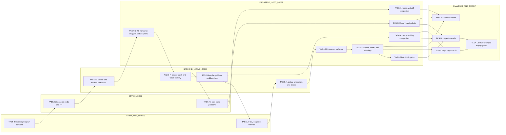

# Execution Plan (Tasks.md)

## Kraken TUI

**Version**: 6.0
**Status**: In Progress (Epic I complete)
**Date**: March 2026
**Source of Truth**: [TechSpec.md](./TechSpec.md), [Architecture.md](./Architecture.md), [PRD.md](./PRD.md), Kraken Focus Directive (March 2026)

**Planning note**: v3 is complete and remains the implementation baseline. This file tracks only the next execution phase and depends on the concrete contracts defined in `TechSpec.md`.

---

## 1. EXECUTIVE SUMMARY

**Total Estimation:** 85 Story Points (Fibonacci: 1, 2, 3, 5, 8)

**Phase 1 (MVP) Estimation:** 72 Story Points

**Phase 2 (Post-MVP) Estimation:** 13 Story Points

**Critical Path:**

`TASK-I0 -> TASK-I1 -> TASK-I2 -> TASK-I3 -> TASK-I4 -> TASK-I5 -> TASK-J0 -> TASK-J1 -> TASK-J2 -> TASK-J3 -> TASK-J4 -> TASK-L1 -> TASK-L3`

**Critical Path Estimate:** 56 Story Points

**Planning Constraints:**

1. `Tasks.md` is downstream of `TechSpec.md`. No ticket may introduce APIs, state, or widgets that the TechSpec does not already define.
2. Transcript/viewport correctness is the first bottleneck. Until that is stable, no example or component work is allowed to pull the roadmap toward generic widget expansion.
3. Dev mode is product work. It is not optional polish and cannot be deferred behind packaging or public adoption work.
4. `agent-console` and `ops-log-console` are blocking proof apps for this phase. `repo-inspector` starts only after the MVP stack is real and measurable.

---

## 2. PROJECT PHASING STRATEGY

### Phase 1 (MVP for v4)

Functional outcomes:

1. Ship a native `TranscriptView` with stable block IDs, streaming patch/update semantics, sticky-bottom, jump-to-unread, group collapse, and nested scroll correctness.
2. Ship transcript replay fixtures, goldens, and benchmark gates that exercise long-lived streaming workloads rather than short dashboard demos.
3. Ship a cohesive dev mode with native snapshot/trace export, bounds/focus/dirty overlays, widget tree inspection, perf HUD, and deterministic watch/restart behavior.
4. Ship a native `SplitPane` plus host-side `CommandPalette`, `TracePanel`, and `StructuredLogView` composites.
5. Ship `agent-console` and `ops-log-console` as real regression-driving examples.

### Phase 2 (Post-MVP / Scope-Controlled)

Functional outcomes:

1. Ship host-side `CodeView` and `DiffView` composites and measure whether native promotion is actually needed.
2. Ship `repo-inspector` on top of the proven transcript, pane, palette, and devtools foundation.

Explicitly deferred:

- Any native promotion of code/diff surfaces without measured example pressure
- Packaging/public usability work beyond the v3 baseline
- More `TextArea` depth
- Any revisit of background rendering

---

## 3. BUILD ORDER (DEPENDENCY GRAPH)


```mermaid
flowchart LR
    subgraph INFRA[INFRA_AND_SPIKES]
        I0[TASK-I0 transcript replay contract]
        J0[TASK-J0 dev snapshot contract]
    end

    subgraph STATE[STATE_MODEL]
        I1[TASK-I1 transcript node and FFI]
        K1[TASK-K1 split pane primitive]
    end

    subgraph BACKEND[BACKEND_NATIVE_CORE]
        I2[TASK-I2 anchor and unread semantics]
        I4[TASK-I4 nested scroll and focus stability]
        I5[TASK-I5 replay goldens and benches]
        J1[TASK-J1 debug snapshots and traces]
    end

    subgraph FRONTEND[FRONTEND_HOST_LAYER]
        I3[TASK-I3 TS transcript wrapper and adapters]
        J2[TASK-J2 inspector surfaces]
        J3[TASK-J3 watch restart and warnings]
        J4[TASK-J4 devtools gates]
        K2[TASK-K2 command palette]
        K3[TASK-K3 trace and log composites]
        K4[TASK-K4 code and diff composites]
    end

    subgraph EXAMPLES[EXAMPLES_AND_PROOF]
        L1[TASK-L1 agent console]
        L2[TASK-L2 ops log console]
        L3[TASK-L3 MVP example replay gates]
        L4[TASK-L4 repo inspector]
    end

    I0 --> I1 --> I2 --> I3 --> I4 --> I5
    I5 --> J0 --> J1 --> J2 --> J3 --> J4
    I4 --> K1 --> K2
    I5 --> K3
    J4 --> L1
    K2 --> L1
    K3 --> L1
    J3 --> L2
    K3 --> L2
    L1 --> L3
    L2 --> L3
    K1 --> K4 --> L4
    J3 --> L4
    K2 --> L4
```

---

## 4. THE TICKET LIST

### Epic I: Transcript and Viewport Architecture

**[TASK-I0] Spike Transcript Replay Contract and Canonical Fixtures**

- **Type:** Spike
- **Effort:** Story Points: 2
- **Status:** Done
- **Dependencies:** None
- **Priority Area:** Transcript / viewport architecture
- **Description:** Time-box the transcript replay contract derived from the TechSpec. Define canonical replay fixtures, stable `block_id` rules, follow modes, unread anchor behavior, and the exact expected outcomes for resize, detach, and collapse cases.
- **Implementation Notes:** Added `TranscriptBlockKind`, `FollowMode`, `ViewportAnchorKind`, `TranscriptBlock`, `TranscriptState` types to `native/src/types.rs`. Created 6 canonical fixtures (append_basic, patch_streaming, collapse_toggle, unread_detach, resize_stability, detach_reattach) in `native/src/transcript.rs` with `TranscriptFixture`, `FixtureBlock`, and `FixtureOp` test infrastructure.
- **Out of Scope:** UI polish, command palette work, packaging, or generic virtualization research
- **Acceptance Criteria (Gherkin):**

```gherkin
Given representative AG-UI and streaming log event sequences
When transcript invariants are exercised in headless replay form
Then canonical fixtures exist for append, patch, collapse, unread, resize, and detach cases
And each fixture encodes the expected visible anchor and unread outcome
```

**[TASK-I1] Implement Native Transcript Node State and FFI Block APIs**

- **Type:** Feature
- **Effort:** Story Points: 5
- **Status:** Done
- **Dependencies:** [TASK-I0]
- **Priority Area:** Transcript / viewport architecture
- **Description:** Add `NodeType::Transcript`, `TranscriptState`, `TranscriptBlock`, and the transcript FFI surface defined in TechSpec section 4.3.1.
- **Implementation Notes:** Added `NodeType::Transcript = 10` with `is_leaf = true`, `focusable = true`. Created `native/src/transcript.rs` with 11 core functions (append_block, patch_block, finish_block, set_parent, set_collapsed, jump_to_block, jump_to_unread, set_follow_mode, get_follow_mode, mark_read, get_unread_count). Added 11 FFI entry points in `lib.rs`. 30 unit tests covering all operations and error cases.
- **Out of Scope:** Devtools overlays, example wiring, or code/diff surfaces
- **Acceptance Criteria (Gherkin):**

```gherkin
Given a transcript node created through the standard node factory
When blocks are appended, patched, finished, grouped, and collapsed through FFI
Then native transcript state reflects the latest logical block model
And invalid transcript handles or block identifiers return documented error semantics
```

**[TASK-I2] Implement Anchor-Based Follow, Sticky-Bottom, and Unread Semantics**

- **Type:** Feature
- **Effort:** Story Points: 5
- **Status:** Done
- **Dependencies:** [TASK-I1]
- **Priority Area:** Transcript / viewport architecture
- **Description:** Implement `FollowMode`, anchor tracking, sticky-bottom threshold logic, unread anchor creation, and `jump_to_unread`.
- **Implementation Notes:** Implemented `compute_total_visible_rows`, `is_near_bottom`, `recompute_anchor_after_insert`, `recompute_anchor_after_collapse`, `compute_visible_range`, and `recompute_unread_state` in transcript.rs. TailWhileNearBottom uses 2-row sticky threshold. Unread anchor tracks first unseen block when detached. All 6 canonical fixtures pass.
- **Out of Scope:** Split panes, watch mode, or inspector UIs
- **Acceptance Criteria (Gherkin):**

```gherkin
Given a transcript that is tail attached
When new streaming updates are appended
Then the viewport remains attached to the tail

Given a transcript that is detached from the tail
When unseen updates arrive
Then unread count increases without moving the current viewport
And jump_to_unread lands on the earliest unread block
```

**[TASK-I3] Implement TypeScript TranscriptView Wrapper and Replay Adapters**

- **Type:** Feature
- **Effort:** Story Points: 3
- **Status:** Done
- **Dependencies:** [TASK-I2]
- **Priority Area:** Transcript / viewport architecture
- **Description:** Add the `TranscriptView` host wrapper and replay adapters that translate host-side string identities into stable numeric `block_id` values.
- **Implementation Notes:** Created `ts/src/widgets/transcript.ts` (TranscriptView class with string→BigInt ID mapping) and `ts/src/widgets/transcript-adapters.ts` (15-event TranscriptReplayEvent type with `applyReplayEvent` adapter). Added 11 FFI symbols to `ffi.ts`, `Transcript: 10` to structs.ts, JSX support in reconciler.ts (WIDGET_MAP + followMode prop), TranscriptProps in types.ts. Exported from index.ts. 19 FFI integration tests.
- **Out of Scope:** Devtools inspectors, split panes, or replay benchmarks
- **Acceptance Criteria (Gherkin):**

```gherkin
Given AG-UI and log replay events with stable message or tool identifiers
When the TypeScript adapter applies them to TranscriptView
Then repeated patches update the same logical block instead of creating duplicates
And host-side string identifiers map deterministically to transcript block identifiers
```

**[TASK-I4] Integrate Nested Scroll Handoff and Focus Stability Under Streaming Updates**

- **Type:** Feature
- **Effort:** Story Points: 5
- **Status:** Done
- **Dependencies:** [TASK-I3]
- **Priority Area:** Transcript / viewport architecture
- **Description:** Wire transcript anchors into existing scroll and focus paths so inner scrollables consume events first, then bubble at edges, while focus and cursor remain stable under streaming inserts and collapse toggles.
- **Implementation Notes:** Added `handle_scroll` and `handle_key` in transcript.rs for scroll/keyboard navigation (Up/Down, PageUp/PageDown, Home/End). Modified event.rs: added `find_transcript_ancestor` and `find_scrollable_ancestor_above` helpers; updated scroll routing to try Transcript first, bubble to ScrollBox when at boundary. Transcript key handler wired into the widget-specific key dispatch. Focus stability inherent in block_id-based anchoring (inserts above anchor don't shift it).
- **Out of Scope:** Dev snapshot export, example-specific inspector sidebars, or command palette work
- **Acceptance Criteria (Gherkin):**

```gherkin
Given a transcript inside a parent scrollable layout
When wheel or page-scroll input occurs
Then the innermost scrollable consumes the input until its edge is reached
And only then does the parent scrollable consume the remaining motion

Given a focused transcript region
When streaming updates land above the focus anchor
Then the focused visual region remains stable after render
```

**[TASK-I5] Add Transcript Replay Goldens, Benchmarks, and Budget Gates**

- **Type:** Chore
- **Effort:** Story Points: 3
- **Status:** Done
- **Dependencies:** [TASK-I4]
- **Priority Area:** Transcript / viewport architecture
- **Description:** Add headless replay tests, golden snapshots, and transcript benchmark gates aligned to the TechSpec quality targets.
- **Implementation Notes:** Added `render_transcript` in render.rs with block-based viewport rendering (collapsed indicators, divider lines, content rendering with clip_set). Added `test_append_1000_blocks_no_drift` and `test_streaming_no_viewport_shift` performance tests. 19 FFI integration tests in test-ffi.test.ts. Bundle budget verified at 47.3KB/50KB (95%). Total: 297 Rust tests, 179 FFI tests, 49 JSX tests passing.
- **Out of Scope:** Devtools UI surfaces or flagship example assembly
- **Acceptance Criteria (Gherkin):**

```gherkin
Given canonical transcript replay fixtures
When native tests and benchmarks run
Then goldens assert visible anchor behavior deterministically
And transcript benchmark output fails when render time or debug-off overhead exceeds the documented threshold
```

### Epic J: Dev Mode and Diagnostics

**[TASK-J0] Spike Debug Snapshot and Overlay Contract**

- **Type:** Spike
- **Effort:** Story Points: 2
- **Dependencies:** [TASK-I5]
- **Priority Area:** Dev mode / developer tooling
- **Description:** Lock the JSON snapshot shape, trace stream categories, overlay flag set, and bounded buffer policy before implementation.
- **Out of Scope:** Example assembly, split-pane behavior, or packaging workflows
- **Acceptance Criteria (Gherkin):**

```gherkin
Given the TechSpec debug and devtools contract
When the snapshot and trace payloads are reviewed against real transcript state
Then a stable JSON shape exists for widget tree, focus, dirty, perf, and transcript anchor data
And every trace stream has an explicit bounded retention policy
```

**[TASK-J1] Implement Native Debug Snapshots, Trace Buffers, and Overlay Toggles**

- **Type:** Feature
- **Effort:** Story Points: 5
- **Dependencies:** [TASK-J0]
- **Priority Area:** Dev mode / developer tooling
- **Description:** Implement the native devtools surface defined in TechSpec section 4.3.3, including overlay toggles and bounded trace rings.
- **Out of Scope:** Host inspector panels, Bun watch integration, or repo inspector example work
- **Acceptance Criteria (Gherkin):**

```gherkin
Given debug mode is enabled
When snapshot and trace APIs are queried after render and input activity
Then bounds, focus, dirty, transcript, and perf data are exported through the documented copy-out APIs
And overlay flags render above the application frame without mutating layout
```

**[TASK-J2] Implement Inspector Surfaces for Widget Tree, Bounds, Focus, and Perf**

- **Type:** Feature
- **Effort:** Story Points: 5
- **Dependencies:** [TASK-J1]
- **Priority Area:** Dev mode / developer tooling
- **Description:** Build TypeScript inspector surfaces that consume the native snapshot APIs and expose widget tree, focused handle, bounds, transcript anchors, and perf HUD data.
- **Out of Scope:** Watch/restart loop, leak warnings, or flagship example assembly
- **Acceptance Criteria (Gherkin):**

```gherkin
Given a running Kraken app in dev mode
When the inspector surfaces are opened
Then the developer can inspect widget hierarchy, focused node, bounds, dirty count, and transcript anchor state
And the displayed information matches the latest native snapshot payload
```

**[TASK-J3] Implement Watch/Restart Loop, Event Log, Signal Trace, and Handle Warnings**

- **Type:** Feature
- **Effort:** Story Points: 5
- **Dependencies:** [TASK-J2]
- **Priority Area:** Dev mode / developer tooling
- **Description:** Add Bun-based restart helpers, event-log surfaces, signal-trace plumbing, and leak/invalid-handle warnings for dev sessions.
- **Out of Scope:** Native code hot swapping, public packaging UX, or repo inspector implementation
- **Acceptance Criteria (Gherkin):**

```gherkin
Given an example app running under the dev session helper
When source changes trigger a restart
Then the prior app shuts down deterministically before re-init
And event logs, signal traces, and invalid-handle warnings remain inspectable across restarts
```

**[TASK-J4] Add Devtools Tests and Overhead Gates**

- **Type:** Chore
- **Effort:** Story Points: 3
- **Dependencies:** [TASK-J3]
- **Priority Area:** Dev mode / developer tooling
- **Description:** Add headless tests and benchmark checks proving bounded trace storage, overlay correctness, and low debug-off overhead.
- **Out of Scope:** New feature development or example-specific UI polish
- **Acceptance Criteria (Gherkin):**

```gherkin
Given devtools are disabled on the transcript benchmark
When the paired benchmark suite runs with devtools disabled and enabled
Then the debug-off overhead stays within the documented budget
And bounded trace buffers never exceed their configured retention limits
```

### Epic K: App-Shaped Surfaces

**[TASK-K1] Implement Native SplitPane Layout and Resize Semantics**

- **Type:** Feature
- **Effort:** Story Points: 5
- **Dependencies:** [TASK-I4]
- **Priority Area:** Agent/devtool-oriented components
- **Description:** Add `NodeType::SplitPane`, ratio/min-size state, and keyboard/mouse resize behavior as defined in the TechSpec.
- **Out of Scope:** Command palette, code/diff viewer composites, or repo inspector example assembly
- **Acceptance Criteria (Gherkin):**

```gherkin
Given a split pane with exactly two child regions
When the divider is resized by keyboard or mouse
Then child sizes update within configured minimum bounds
And terminal resize preserves a valid ratio and visible divider state
```

**[TASK-K2] Implement Host-Side Command Palette Composite**

- **Type:** Feature
- **Effort:** Story Points: 3
- **Dependencies:** [TASK-K1]
- **Priority Area:** Agent/devtool-oriented components
- **Description:** Build `CommandPalette` as a host composite over `Overlay`, `Input`, and `List`, with dense filtering behavior suitable for flagship examples.
- **Out of Scope:** Native palette widget work or repo inspector metadata panes
- **Acceptance Criteria (Gherkin):**

```gherkin
Given a command palette opened over a running app
When the developer types a filter query and navigates the result list
Then visible commands narrow deterministically and selection remains keyboard driven
And the palette can be reused in multiple examples without new native APIs
```

**[TASK-K3] Implement TracePanel and StructuredLogView Composites on TranscriptView**

- **Type:** Feature
- **Effort:** Story Points: 3
- **Dependencies:** [TASK-I5]
- **Priority Area:** Agent/devtool-oriented components
- **Description:** Build trace and structured-log surfaces as host composites on top of `TranscriptView`, including filtering hooks required by MVP examples.
- **Out of Scope:** Code/diff surfaces or native log-view widgets
- **Acceptance Criteria (Gherkin):**

```gherkin
Given transcript-backed trace and log streams
When the host composites apply filters or follow behavior
Then the visible transcript blocks update without losing transcript anchor correctness
And the same composite surfaces work in both agent and ops examples
```

**[TASK-K4] Implement CodeView and DiffView Host Composites and Measure Native-Promotion Need**

- **Type:** Feature
- **Effort:** Story Points: 5
- **Dependencies:** [TASK-K1]
- **Priority Area:** Agent/devtool-oriented components
- **Description:** Build initial code and diff viewer composites from existing text, scroll, and syntax-highlight primitives, then capture the measurements needed to decide whether native promotion is justified.
- **Out of Scope:** Immediate native code/diff widgets or packaging work
- **Acceptance Criteria (Gherkin):**

```gherkin
Given code and diff content displayed through host composites
When repo-inspector scenarios are exercised
Then line wrapping, scrolling, and syntax highlighting remain usable
And a written measurement exists describing whether native promotion is warranted
```

### Epic L: Flagship Examples and Proof

**[TASK-L1] Build Agent Console Example**

- **Type:** Feature
- **Effort:** Story Points: 8
- **Dependencies:** [TASK-J4, TASK-K2, TASK-K3]
- **Priority Area:** Flagship examples as proof
- **Description:** Build `agent-console` around transcript streaming, tool-call traces, split panes, command palette actions, and dev-mode inspection.
- **Out of Scope:** Repo inspector workflows or packaging demos
- **Acceptance Criteria (Gherkin):**

```gherkin
Given the agent console example is running
When AG-UI replay events stream assistant text, tool calls, and tool results
Then the transcript, trace side panel, and unread behavior remain stable under load
And the command palette and devtools surfaces are usable in the same session
```

**[TASK-L2] Build Ops/Log Console Example**

- **Type:** Feature
- **Effort:** Story Points: 5
- **Dependencies:** [TASK-J3, TASK-K3]
- **Priority Area:** Flagship examples as proof
- **Description:** Build `ops-log-console` with follow mode, filtering, folding, and inspector overlays using transcript-backed log surfaces.
- **Out of Scope:** Repo navigation, code/diff viewing, or packaging polish
- **Acceptance Criteria (Gherkin):**

```gherkin
Given the ops log console example is running
When logs stream continuously while the operator detaches, filters, and refollows
Then follow mode, unread behavior, and folding remain predictable
And dev overlays expose the viewport and dirty-region behavior during the session
```

**[TASK-L3] Add Replay Fixtures, Goldens, and Perf Budgets for MVP Examples**

- **Type:** Chore
- **Effort:** Story Points: 5
- **Dependencies:** [TASK-L1, TASK-L2]
- **Priority Area:** Flagship examples as proof
- **Description:** Convert the MVP examples into blocking proof artifacts with replay fixtures, goldens, and benchmark thresholds.
- **Out of Scope:** New feature invention or repo inspector implementation
- **Acceptance Criteria (Gherkin):**

```gherkin
Given the agent console and ops log console replay fixtures
When example validation runs in CI
Then goldens and replay assertions catch transcript, pane, and devtools regressions
And benchmark thresholds fail the pipeline when real-tool behavior drifts outside the documented budget
```

**[TASK-L4] Build Repo Inspector Example**

- **Type:** Feature
- **Effort:** Story Points: 8
- **Dependencies:** [TASK-K4, TASK-K2, TASK-J3]
- **Priority Area:** Flagship examples as proof
- **Description:** Build `repo-inspector` with file tree navigation, code/diff viewing, metadata pane, and command palette actions once the MVP stack is stable.
- **Out of Scope:** Native code/diff promotion beyond the measurements captured in TASK-K4
- **Acceptance Criteria (Gherkin):**

```gherkin
Given the repo inspector example is running
When the operator switches files, opens diffs, and triggers palette actions
Then pane layout, code viewing, and diff navigation remain stable
And the example uses only the primitives and composites already defined in the TechSpec
```

---

## 5. SUMMARY TABLE

| ID | Epic | Type | SP | Dependencies | Phase |
| -- | ---- | ---- | -- | ------------ | ----- |
| TASK-I0 | I | Spike | 2 | None | MVP |
| TASK-I1 | I | Feature | 5 | I0 | MVP |
| TASK-I2 | I | Feature | 5 | I1 | MVP |
| TASK-I3 | I | Feature | 3 | I2 | MVP |
| TASK-I4 | I | Feature | 5 | I3 | MVP |
| TASK-I5 | I | Chore | 3 | I4 | MVP |
| TASK-J0 | J | Spike | 2 | I5 | MVP |
| TASK-J1 | J | Feature | 5 | J0 | MVP |
| TASK-J2 | J | Feature | 5 | J1 | MVP |
| TASK-J3 | J | Feature | 5 | J2 | MVP |
| TASK-J4 | J | Chore | 3 | J3 | MVP |
| TASK-K1 | K | Feature | 5 | I4 | MVP |
| TASK-K2 | K | Feature | 3 | K1 | MVP |
| TASK-K3 | K | Feature | 3 | I5 | MVP |
| TASK-K4 | K | Feature | 5 | K1 | Post-MVP |
| TASK-L1 | L | Feature | 8 | J4, K2, K3 | MVP |
| TASK-L2 | L | Feature | 5 | J3, K3 | MVP |
| TASK-L3 | L | Chore | 5 | L1, L2 | MVP |
| TASK-L4 | L | Feature | 8 | K4, K2, J3 | Post-MVP |
| | | **TOTAL** | **85** | | |
