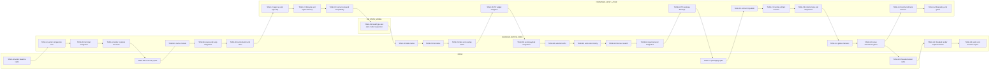

# Execution Plan (Tasks.md)

## Kraken TUI

**Version**: 5.0
**Status**: v3 In Progress (Epics A–G Done, H Conditional/Remaining)
**Date**: March 2026
**Source of Truth**: [TechSpec.md](./TechSpec.md), [Architecture.md](./Architecture.md), [PRD.md](./PRD.md)

---

## 1. EXECUTIVE SUMMARY

**v3 Total Estimation:** 122 Story Points (Fibonacci: 1, 2, 3, 5, 8)

**v3 MVP Estimation (A-G):** 112 Story Points

**v3 Critical Path (MVP):**

`TASK-A0 -> TASK-A1 -> TASK-A2 -> TASK-A3 -> TASK-B0 -> TASK-B1 -> TASK-B2 -> TASK-B3 -> TASK-C1 -> TASK-C2 -> TASK-C3 -> TASK-D1 -> TASK-D2 -> TASK-D3 -> TASK-D4 -> TASK-D5 -> TASK-D6 -> TASK-E1 -> TASK-E2 -> TASK-E3 -> TASK-E4 -> TASK-E5 -> TASK-F0 -> TASK-F1 -> TASK-F2 -> TASK-F3 -> TASK-G1 -> TASK-G2 -> TASK-G3 -> TASK-G4`

**Critical Path Estimate (MVP):** 112 Story Points

**Conditional Extension Path (Phase 2):**

`TASK-H0 -> TASK-H1 -> TASK-H2` (10 Story Points)

**Planning Constraints:**

1. All v2.1 + Epic M FFI symbols are compatibility baseline and must remain stable while v3 symbols are added.
2. Performance budgets from PRD are hard constraints, not stretch goals: render <16ms, input <50ms, FFI overhead <1ms, memory <20MB/100 widgets, host bundle <50KB.
3. ADR-T31 background render thread remains conditional and cannot be promoted without benchmark evidence and semantic parity.

---

## 2. PROJECT PHASING STRATEGY

### Phase 1 (MVP for v3)

Functional outcomes:

1. Ship terminal writer throughput improvements with run compaction, stateful style/cursor emission, and telemetry counters (ADR-T24).
2. Ship rich text and wrapping cache with bounded LRU memory behavior and hit/miss observability (ADR-T25).
3. Ship ergonomic TS Runner API (`app.run`, `app.stop`) without changing synchronous native render ownership (ADR-T26).
4. Ship dashboard staples (Table, List, Tabs, Overlay) in Native Core with complete FFI and TS wrapper coverage (ADR-T27).
5. Ship editor-grade TextArea extensions: selection, selected-text extraction, find-next, and bounded undo/redo (ADR-T28).
6. Ship cross-platform distribution UX with prebuilt artifacts and deterministic fallback behavior (ADR-T29).
7. Ship deterministic golden testing plus benchmark gates enforced in CI (ADR-T30).

### Phase 2 (Post-Launch / Scope-Controlled)

Deferred to control complexity and protect architecture clarity:

1. Experimental background render thread behind explicit feature flag only (ADR-T31).
2. Promotion decision for threaded rendering based on measured wins and semantic parity report.

---

## 3. BUILD ORDER (DEPENDENCY GRAPH)


```mermaid
flowchart LR
    subgraph INFRA[INFRA]
        A0[TASK-A0 writer baseline spike]
        B0[TASK-B0 cache key spike]
        F0[TASK-F0 packaging spike]
        H0[TASK-H0 threaded render spike]
    end

    subgraph DB[DB_STATE_MODEL]
        D1[TASK-D1 NodeType and state model expansion]
    end

    subgraph BACKEND[BACKEND_NATIVE_CORE]
        A1[TASK-A1 writer compaction core]
        A2[TASK-A2 terminal integration]
        A3[TASK-A3 writer counters and tests]
        B1[TASK-B1 cache module]
        B2[TASK-B2 parse and wrap integration]
        B3[TASK-B3 cache bench and tests]
        D2[TASK-D2 table native]
        D3[TASK-D3 list native]
        D4[TASK-D4 tabs and overlay native]
        D6[TASK-D6 event payload integration]
        E1[TASK-E1 selection APIs]
        E2[TASK-E2 undo redo history]
        E3[TASK-E3 find next search]
        E4[TASK-E4 input behavior integration]
        G1[TASK-G1 golden harness]
        G2[TASK-G2 native benchmark gates]
        H1[TASK-H1 threaded render implementation]
        H2[TASK-H2 parity and decision report]
    end

    subgraph FRONTEND[FRONTEND_HOST_LAYER]
        C1[TASK-C1 app.run and app.stop]
        C2[TASK-C2 lifecycle and signal cleanup]
        C3[TASK-C3 runner tests and compatibility]
        D5[TASK-D5 TS widget wrappers]
        E5[TASK-E5 TS textarea bindings]
        F1[TASK-F1 artifact CI publish]
        F2[TASK-F2 runtime artifact resolver]
        F3[TASK-F3 install smoke and diagnostics]
        G3[TASK-G3 host benchmark harness]
        G4[TASK-G4 final policy and gates]
    end

    A0 --> A1 --> A2 --> A3
    A3 --> B0 --> B1 --> B2 --> B3
    B3 --> C1 --> C2 --> C3 --> D1
    D1 --> D2 --> D3 --> D4 --> D5 --> D6
    D6 --> E1 --> E2 --> E3 --> E4 --> E5
    E5 --> F0 --> F1 --> F2 --> F3
    F3 --> G1 --> G2 --> G3 --> G4

    G2 --> H0 --> H1 --> H2
```

---

## 4. THE TICKET LIST

### Epic A: Terminal Writer Throughput (ADR-T24)

**[TASK-A0] Spike Writer Baseline and Emission Contract**

- **Type:** Spike
- **Effort:** Story Points: 2
- **Dependencies:** None
- **Description:** Time-boxed baseline study for current per-cell terminal emission. Capture bytes, run counts, and style delta counts across canonical workloads and lock the deterministic emission contract before implementation.
- **Acceptance Criteria (Gherkin):**

```gherkin
Given the current per-cell write path
When canonical writer workloads run at 10, 50, and 100 percent diff density
Then baseline metrics for bytes, run count, and style deltas are recorded
And a written emission contract exists for ordering, style transitions, and reset behavior
```

**[TASK-A1] Implement Native Run Compaction and WriterState**

- **Type:** Feature
- **Effort:** Story Points: 5
- **Dependencies:** [TASK-A0]
- **Description:** Implement `writer.rs` with contiguous run compaction and explicit `WriterState` tracking for cursor, fg, bg, and attrs.
- **Acceptance Criteria (Gherkin):**

```gherkin
Given diff updates containing adjacent cells with identical style
When run compaction executes
Then adjacent cells are merged into a single run in row-major order
And WriterState tracks cursor and style transitions without ambiguity
```

**[TASK-A2] Integrate Stateful Writer into Render and Terminal Modules**

- **Type:** Feature
- **Effort:** Story Points: 5
- **Dependencies:** [TASK-A1]
- **Description:** Integrate writer emission into `terminal.rs` and render path so cursor/style commands are emitted only on deltas and attribute reset occurs once per frame.
- **Acceptance Criteria (Gherkin):**

```gherkin
Given a frame with non-contiguous updates and style changes
When tui_render() performs terminal output
Then cursor movement commands are emitted only when position continuity breaks
And style commands are emitted only when style state changes
And a full attribute reset is emitted once at frame end
```

**[TASK-A3] Add Writer Throughput Counters and Regression Tests**

- **Type:** Chore
- **Effort:** Story Points: 3
- **Dependencies:** [TASK-A2]
- **Description:** Wire counters 7, 8, and 9 to writer output and add unit/integration tests plus benchmark assertions for writer regression detection.
- **Acceptance Criteria (Gherkin):**

```gherkin
Given writer benchmarks and integration tests
When a frame with changed cells is rendered
Then counters for write bytes, run count, and style deltas are populated
And tests fail when writer output regresses beyond configured thresholds
```

### Epic B: Rich Text and Wrap Cache (ADR-T25)

**[TASK-B0] Spike Cache Key and Invalidation Strategy**

- **Type:** Spike
- **Effort:** Story Points: 2
- **Dependencies:** [TASK-A3]
- **Description:** Validate cache key composition and invalidation rules for content hash, format, language, wrap width, and style fingerprint, including memory accounting strategy.
- **Acceptance Criteria (Gherkin):**

```gherkin
Given representative plain, markdown, and code content workloads
When cache key and invalidation rules are evaluated
Then every invalidation trigger is explicitly mapped to a key dimension
And memory accounting rules define insertion and eviction behavior under hard cap
```

**[TASK-B1] Implement Bounded Native Text Cache Module**

- **Type:** Feature
- **Effort:** Story Points: 5
- **Dependencies:** [TASK-B0]
- **Description:** Implement `text_cache.rs` with bounded LRU behavior, entry size accounting, and strict 8 MiB capacity handling.
- **Acceptance Criteria (Gherkin):**

```gherkin
Given cache capacity set to 8 MiB
When new parsed entries exceed remaining capacity
Then least recently used entries are evicted until capacity is respected
And used_bytes never exceeds max_bytes
```

**[TASK-B2] Integrate Cache with Text Parse and Wrap Pipeline**

- **Type:** Feature
- **Effort:** Story Points: 5
- **Dependencies:** [TASK-B1]
- **Description:** Integrate cache lookups/writes in `text.rs` and render flow, and wire counters for parse/wrap time plus hit/miss counts.
- **Acceptance Criteria (Gherkin):**

```gherkin
Given unchanged content, wrap width, format, and style fingerprint
When repeated renders occur
Then parse and wrap work is served from cache
And counters report hit increments and stable parse and wrap durations
```

**[TASK-B3] Add Cache Benchmarks and Correctness Tests**

- **Type:** Chore
- **Effort:** Story Points: 3
- **Dependencies:** [TASK-B2]
- **Description:** Add cache-focused unit tests and benchmark scenarios validating hit-rate targets and eviction correctness under pressure.
- **Acceptance Criteria (Gherkin):**

```gherkin
Given repeated render workloads with stable inputs
When benchmark suite runs
Then cache hit rate reaches or exceeds the target threshold
And eviction tests confirm no stale entries are returned after invalidation
```

### Epic C: Runner API Ergonomics (ADR-T26)

**[TASK-C1] Implement `app.run` and `app.stop` in Host Layer**

- **Type:** Feature
- **Effort:** Story Points: 5
- **Dependencies:** [TASK-B3]
- **Description:** Implement Runner modes (`onChange`, `continuous`) in TS using existing FFI lifecycle/input/render calls without introducing native threading.
- **Acceptance Criteria (Gherkin):**

```gherkin
Given a Kraken app instance
When app.run() is called in onChange mode
Then rendering occurs only when work is pending
And app.stop() exits the loop without leaving terminal state corrupted
```

**[TASK-C2] Implement Signal Cleanup and Deterministic Shutdown Semantics**

- **Type:** Feature
- **Effort:** Story Points: 3
- **Dependencies:** [TASK-C1]
- **Description:** Add SIGINT/SIGTERM cleanup handling and finally-block shutdown guarantees for deterministic terminal restoration.
- **Acceptance Criteria (Gherkin):**

```gherkin
Given app.run() is active
When SIGINT or SIGTERM is received
Then app.run() exits cleanly
And terminal mode is restored exactly once
```

**[TASK-C3] Add Runner Compatibility Tests and Legacy Loop Interop Coverage**

- **Type:** Chore
- **Effort:** Story Points: 2
- **Dependencies:** [TASK-C2]
- **Description:** Add tests proving compatibility between Runner API and existing manual loop pattern, including bundle guard verification.
- **Acceptance Criteria (Gherkin):**

```gherkin
Given both app.run() and manual loop usage patterns
When test suite executes
Then both patterns pass behavior equivalence checks for input and render flow
And bundle guard remains under the documented size budget
```

### Epic D: Dashboard Staple Widgets (ADR-T27)

**[TASK-D1] Expand NodeType and Internal State Model for v3 Widgets**

- **Type:** Feature
- **Effort:** Story Points: 3
- **Dependencies:** [TASK-C3]
- **Description:** Add `Table`, `List`, `Tabs`, and `Overlay` to node model and context storage with defaults and lifecycle hooks.
- **Acceptance Criteria (Gherkin):**

```gherkin
Given the v3 NodeType enum
When each new widget node type is created
Then internal node state initializes with valid defaults
And destruction paths release all widget-specific state
```

**[TASK-D2] Implement Table Widget Native Surface and FFI Contract**

- **Type:** Feature
- **Effort:** Story Points: 5
- **Dependencies:** [TASK-D1]
- **Description:** Implement Table state, rendering, selection behavior, and all Table FFI functions defined in TechSpec section 4.3.3.
- **Acceptance Criteria (Gherkin):**

```gherkin
Given a table with columns and rows
When table cell values and selected row are updated via FFI
Then rendered output reflects schema and selection state
And all table getters return values consistent with the latest mutation
```

**[TASK-D3] Implement List Widget Native Surface and FFI Contract**

- **Type:** Feature
- **Effort:** Story Points: 5
- **Dependencies:** [TASK-D2]
- **Description:** Implement List state, rendering, selection behavior, and all List FFI functions defined in TechSpec section 4.3.4.
- **Acceptance Criteria (Gherkin):**

```gherkin
Given a list with multiple items
When items are added, removed, cleared, and selected via FFI
Then list rendering and selected index remain consistent
And list getter APIs return correct item count and values
```

**[TASK-D4] Implement Tabs and Overlay Native Surfaces and FFI Contracts**

- **Type:** Feature
- **Effort:** Story Points: 5
- **Dependencies:** [TASK-D3]
- **Description:** Implement Tabs and Overlay state/render/event behavior and all Tabs/Overlay FFI functions from TechSpec sections 4.3.5 and 4.3.6.
- **Acceptance Criteria (Gherkin):**

```gherkin
Given tabs and overlay nodes in a composed UI
When active tab and overlay modal state are changed via FFI
Then tab focus state and overlay visibility update deterministically
And overlay modal behavior blocks outside interaction when enabled
```

**[TASK-D5] Implement TypeScript Wrappers and Public Exports for v3 Widgets**

- **Type:** Feature
- **Effort:** Story Points: 3
- **Dependencies:** [TASK-D4]
- **Description:** Add TS wrappers (`table.ts`, `list.ts`, `tabs.ts`, `overlay.ts`) and update package exports/index to expose full typed APIs.
- **Acceptance Criteria (Gherkin):**

```gherkin
Given the TypeScript host package
When a developer imports Table, List, Tabs, and Overlay wrappers
Then all v3 widget methods are typed and callable
And runtime calls map to the expected FFI symbols
```

**[TASK-D6] Update Change Event Payload Mapping and Integration Tests**

- **Type:** Chore
- **Effort:** Story Points: 3
- **Dependencies:** [TASK-D5]
- **Description:** Implement and verify event payload mapping for List/Tabs/Table change events in native and TS drain paths.
- **Acceptance Criteria (Gherkin):**

```gherkin
Given list, tabs, and table interactions
When change events are emitted and drained
Then event data fields match the v3 payload contract for each widget type
And integration tests validate payload decoding end-to-end
```

### Epic E: Editor-Grade TextArea (ADR-T28)

**[TASK-E1] Implement Selection Model and Selection FFI APIs**

- **Type:** Feature
- **Effort:** Story Points: 5
- **Dependencies:** [TASK-D6]
- **Description:** Implement selection anchor/focus state plus APIs for set/clear selection and selected text extraction.
- **Acceptance Criteria (Gherkin):**

```gherkin
Given a TextArea containing multiple lines
When a selection range is set via FFI
Then selected text length and bytes reflect the exact range
And clearing selection removes active selection state
```

**[TASK-E2] Implement Bounded Undo/Redo History and Limit Control**

- **Type:** Feature
- **Effort:** Story Points: 5
- **Dependencies:** [TASK-E1]
- **Description:** Add edit operation history stacks, undo/redo execution paths, and configurable history limit enforcement.
- **Acceptance Criteria (Gherkin):**

```gherkin
Given a TextArea with history limit configured
When edits exceed the configured limit
Then oldest history entries are discarded within the bound
And undo and redo operations preserve deterministic cursor and content state
```

**[TASK-E3] Implement `find_next` Search (Literal and Regex Modes)**

- **Type:** Feature
- **Effort:** Story Points: 3
- **Dependencies:** [TASK-E2]
- **Description:** Implement forward search with case-sensitive and regex options, anchored to current cursor position.
- **Acceptance Criteria (Gherkin):**

```gherkin
Given a TextArea with searchable content
When find_next is called in literal or regex mode
Then the next match is found from cursor position when present
And the API returns no-match without mutating content when no match exists
```

**[TASK-E4] Integrate Selection and Search with Input Behavior and Wrap Modes**

- **Type:** Chore
- **Effort:** Story Points: 3
- **Dependencies:** [TASK-E3]
- **Description:** Ensure keyboard and mouse editing behavior remains correct with selection, search navigation, and wrap mode transitions.
- **Acceptance Criteria (Gherkin):**

```gherkin
Given TextArea selection and search are active
When cursor movement and edits occur across wrap mode changes
Then cursor row and column remain valid
And selection and search state stay internally consistent
```

**[TASK-E5] Add TS Bindings and Integration Tests for New TextArea APIs**

- **Type:** Feature
- **Effort:** Story Points: 2
- **Dependencies:** [TASK-E4]
- **Description:** Expose new TextArea methods in TypeScript wrappers and validate full round-trip behavior through FFI integration tests.
- **Acceptance Criteria (Gherkin):**

```gherkin
Given TypeScript TextArea wrapper methods for v3 APIs
When integration tests call selection, history, and search methods
Then native state updates are reflected in wrapper getters and outputs
And all methods return documented error semantics on invalid handles
```

### Epic F: Cross-Platform Distribution UX (ADR-T29)

**[TASK-F0] Spike Artifact Packaging and Release Matrix Workflow**

- **Type:** Spike
- **Effort:** Story Points: 2
- **Dependencies:** [TASK-E5]
- **Description:** Validate release workflow for required target matrix, artifact naming, checksum/signature strategy, and fallback expectations.
- **Acceptance Criteria (Gherkin):**

```gherkin
Given the required OS and architecture target matrix
When packaging workflow options are evaluated
Then a concrete publish and verification strategy is documented
And fallback behavior is defined for unsupported or missing artifacts
```

**[TASK-F1] Implement Matrix CI Builds and Artifact Publication**

- **Type:** Feature
- **Effort:** Story Points: 5
- **Dependencies:** [TASK-F0]
- **Description:** Implement CI workflows that build and publish prebuilt native artifacts for the required matrix with checksums.
- **Acceptance Criteria (Gherkin):**

```gherkin
Given a release pipeline run
When matrix build jobs complete
Then artifacts are produced for all required targets
And checksum files are published and verifiable for each artifact
```

**[TASK-F2] Implement Runtime Artifact Resolution and Source-Build Fallback**

- **Type:** Feature
- **Effort:** Story Points: 5
- **Dependencies:** [TASK-F1]
- **Description:** Implement runtime logic for selecting the correct prebuilt artifact and deterministic fallback to source build when needed.
- **Acceptance Criteria (Gherkin):**

```gherkin
Given a host runtime on a supported target
When Kraken initializes native bindings
Then the correct prebuilt artifact is selected and loaded
And unsupported targets follow the documented fallback path
```

**[TASK-F3] Add Cross-Platform Install Smoke Tests and Diagnostics**

- **Type:** Chore
- **Effort:** Story Points: 3
- **Dependencies:** [TASK-F2]
- **Description:** Add install smoke tests and explicit diagnostics for missing libc, incompatible architecture, and load failures.
- **Acceptance Criteria (Gherkin):**

```gherkin
Given a fresh machine install scenario
When native artifact loading fails for a known reason
Then the error message identifies root cause and remediation steps
And smoke tests cover each target class in the release matrix
```

### Epic G: Deterministic Testing and Benchmark Gates (ADR-T30)

**[TASK-G1] Implement MockBackend Golden Snapshot Harness**

- **Type:** Feature
- **Effort:** Story Points: 5
- **Dependencies:** [TASK-F3]
- **Description:** Add deterministic golden fixture harness for render output and event routing, including explicit fixture update workflow.
- **Acceptance Criteria (Gherkin):**

```gherkin
Given a stable widget scene fixture
When golden tests run through MockBackend
Then generated snapshots match committed fixtures exactly
And fixture mismatch fails with diff output that pinpoints changed rows
```

**[TASK-G2] Implement Canonical Native Benchmark Suites and CI Thresholds**

- **Type:** Feature
- **Effort:** Story Points: 5
- **Dependencies:** [TASK-G1]
- **Description:** Add `cargo bench` suites for writer and cache workloads with enforced regression thresholds in CI.
- **Acceptance Criteria (Gherkin):**

```gherkin
Given canonical benchmark workloads for writer and text cache
When benchmark gates execute in CI
Then regressions beyond configured thresholds fail the pipeline
And benchmark output records baseline and delta values per workload
```

**[TASK-G3] Implement Host-Side Benchmark Harness and CI Integration**

- **Type:** Chore
- **Effort:** Story Points: 3
- **Dependencies:** [TASK-G2]
- **Description:** Implement `ts/bench-render.ts` scenarios and integrate host benchmark execution into CI validation.
- **Acceptance Criteria (Gherkin):**

```gherkin
Given host benchmark scenarios for runner and event loops
When bench-render.ts executes in CI
Then measured host-side throughput and latency metrics are captured
And failures are reported with actionable threshold context
```

**[TASK-G4] Enforce Final v3 Quality Gate Policy**

- **Type:** Chore
- **Effort:** Story Points: 2
- **Dependencies:** [TASK-G3]
- **Description:** Finalize gate policy connecting bundle size, perf counters, benchmark thresholds, and golden test outcomes to pass/fail release readiness.
- **Acceptance Criteria (Gherkin):**

```gherkin
Given the full v3 gate suite
When release readiness validation runs
Then bundle, perf, benchmark, and golden criteria are enforced as blocking checks
And policy documentation maps each gate to its owning ticket and metric
```

### Epic H: Background Render Thread Experiment (ADR-T31, Conditional)

**[TASK-H0] Spike Experimental Threaded Render Protocol and Rollback Plan**

- **Type:** Spike
- **Effort:** Story Points: 2
- **Dependencies:** [TASK-G2]
- **Description:** Define experiment constraints, parity criteria, and rollback protocol for background render thread evaluation.
- **Acceptance Criteria (Gherkin):**

```gherkin
Given ADR-T31 promotion criteria
When the experiment protocol is drafted
Then success and failure thresholds are explicit and measurable
And rollback steps are documented before implementation starts
```

**[TASK-H1] Implement Feature-Flagged Background Render Thread Prototype**

- **Type:** Feature
- **Effort:** Story Points: 5
- **Dependencies:** [TASK-H0]
- **Description:** Implement experimental threaded render mode behind explicit feature flag, preserving synchronous mode as default.
- **Acceptance Criteria (Gherkin):**

```gherkin
Given threaded render feature flag is disabled
When application render loop runs
Then behavior is identical to synchronous baseline
And enabling the flag activates the experimental threaded path without API breakage
```

**[TASK-H2] Run Parity and Benchmark Validation, Publish Go/No-Go Report**

- **Type:** Chore
- **Effort:** Story Points: 3
- **Dependencies:** [TASK-H1]
- **Description:** Execute parity and performance validation and publish a decision report stating whether the experiment advances or remains deferred.
- **Acceptance Criteria (Gherkin):**

```gherkin
Given threaded and synchronous render modes are both executable
When parity and benchmark validation runs
Then event ordering, mutation visibility, and shutdown semantics are compared explicitly
And the final report records go or no-go with supporting metrics
```

---

## 5. V3 SUMMARY TABLE

| ID       | Epic | Type    | SP | Dependencies | Status |
| -------- | ---- | ------- | -- | ------------ | ------ |
| TASK-A0  | A    | Spike   | 2  | None         | Done    |
| TASK-A1  | A    | Feature | 5  | A0           | Done    |
| TASK-A2  | A    | Feature | 5  | A1           | Done    |
| TASK-A3  | A    | Chore   | 3  | A2           | Done    |
| TASK-B0  | B    | Spike   | 2  | A3           | Done    |
| TASK-B1  | B    | Feature | 5  | B0           | Done    |
| TASK-B2  | B    | Feature | 5  | B1           | Done    |
| TASK-B3  | B    | Chore   | 3  | B2           | Done    |
| TASK-C1  | C    | Feature | 5  | B3           | Done    |
| TASK-C2  | C    | Feature | 3  | C1           | Done    |
| TASK-C3  | C    | Chore   | 2  | C2           | Done    |
| TASK-D1  | D    | Feature | 3  | C3           | Done    |
| TASK-D2  | D    | Feature | 5  | D1           | Done    |
| TASK-D3  | D    | Feature | 5  | D2           | Done    |
| TASK-D4  | D    | Feature | 5  | D3           | Done    |
| TASK-D5  | D    | Feature | 3  | D4           | Done    |
| TASK-D6  | D    | Chore   | 3  | D5           | Done    |
| TASK-E1  | E    | Feature | 5  | D6           | Done    |
| TASK-E2  | E    | Feature | 5  | E1           | Done    |
| TASK-E3  | E    | Feature | 3  | E2           | Done    |
| TASK-E4  | E    | Chore   | 3  | E3           | Done    |
| TASK-E5  | E    | Feature | 2  | E4           | Done    |
| TASK-F0  | F    | Spike   | 2  | E5           | Done    |
| TASK-F1  | F    | Feature | 5  | F0           | Done    |
| TASK-F2  | F    | Feature | 5  | F1           | Done    |
| TASK-F3  | F    | Chore   | 3  | F2           | Done    |
| TASK-G1  | G    | Feature | 5  | F3           | Done    |
| TASK-G2  | G    | Feature | 5  | G1           | Done    |
| TASK-G3  | G    | Chore   | 3  | G2           | Done    |
| TASK-G4  | G    | Chore   | 2  | G3           | Done    |
| TASK-H0  | H    | Spike   | 2  | G2           | Conditional |
| TASK-H1  | H    | Feature | 5  | H0           | Conditional |
| TASK-H2  | H    | Chore   | 3  | H1           | Conditional |
|          |      | **TOTAL** | **122** |              |        |
