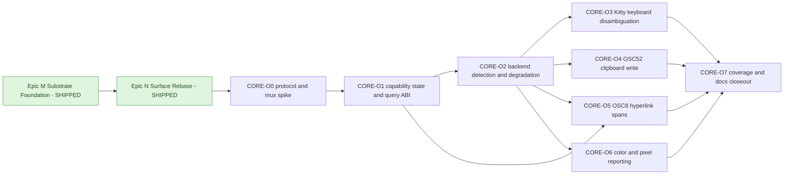

# Engineering Execution Plan

## 0. Version History & Changelog
- v7.5.0 - Framed Epic O as the next work-ready wave, sequenced terminal capability hardening behind a protocol/multiplexer spike, and moved completed Epic N work into archived continuity.
- v7.4.1 - Marked Epic N complete after the final authority-cut and coalescing audit: substrate-backed text/textarea/transcript paths are shipped, the benchmark gate is live, and the ticket table now reflects completion instead of in-flight target state.
- v7.4.0 - Reshaped Epic N to match Brownfield reality: added a contract-sync preflight, moved the substrate benchmark gate ahead of transcript migration, and expanded dirty ranges to record both replaced and replacement extents.
- ... [Older history truncated, refer to git logs]

## 1. Executive Summary & Active Critical Path
- **Total Active Story Points:** 37
- **Critical Path:** `CORE-O0 -> CORE-O1 -> CORE-O2 -> {CORE-O3, CORE-O4, CORE-O5, CORE-O6} -> CORE-O7`
- **Planning Assumptions:** Epic M and Epic N are shipped. TechSpec ADR-T40 authorizes terminal capability hardening as the next work-ready wave, and ADR-T41 defines detection-first degradation, write-only OSC52, OSC8 range metadata, Kitty keyboard negotiation, and multiplexer-aware backend policy. The Native Core remains the terminal state authority; Host code receives capability diagnostics and issues commands but does not perform terminal detection.

## 2. Project Phasing & Iteration Strategy
### Current Active Scope
- Epic O — Terminal Capability Hardening is ready for work.
- The first work item is protocol and multiplexer validation before implementation so terminal-specific assumptions do not leak into public APIs.
- The ready scope covers capability state/query APIs, multiplexer-aware backend policy, Kitty keyboard disambiguation, OSC52 clipboard writes, OSC8 hyperlink emission, and runtime color/pixel reporting.

### Future / Deferred Scope
#### Standing Deferrals Preserved
- No clipboard read support in Epic O.
- No Kitty graphics, sixel, inline image, or advanced MIME clipboard protocol support.
- No native promotion of code or diff surfaces without measured post-substrate pressure.
- No default background-render promotion.
- No packaging-first rewrite, no public onboarding wave, and no additional generic widget breadth.
- No React or Solid parity work; the JSX/signals layer stays a thin overlay over the imperative protocol.

### Archived or Already Completed Scope
- Epic N (Substrate Surface Rebase) delivered `CORE-N0` through `CORE-N7`: contract sync, dirty-range expansion, substrate-backed text rendering, native `EditBuffer`, `TextArea` rebase, the substrate benchmark gate, transcript substrate migration, and post-substrate coverage/posture updates.
- Epic M (Native Text Substrate) delivered `CORE-M0` through `CORE-M4`: the substrate contract memo, native `TextBuffer`, native `TextView`, the unified text renderer, and the §5.4.1 Unicode/wrapping native gate suite. Its completed scope is summarized in §5.
- The v7 docs-maintenance wave completed `DOCS-A001` through `DOCS-A003`: canonical artifact normalization, preservation review, and source-truth reconciliation.
- Epics I-L delivered native transcript state, anchor-based viewport behavior, nested scroll handoff, devtools APIs, host inspector surfaces, split-pane layout, transcript-backed composites, and flagship examples.
- The archived planning waves also delivered replay fixtures, golden coverage, and example-driven performance gates.
- Archived continuity is retained in summarized form in §6.

## 3. Build Order (Mermaid)

```mermaid
flowchart LR
    M[Epic M Substrate Foundation - SHIPPED]:::done
    N[Epic N Surface Rebase - SHIPPED]:::done
    M --> N
    N --> O0[CORE-O0 protocol and mux spike]
    O0 --> O1[CORE-O1 capability state and query ABI]
    O1 --> O2[CORE-O2 backend detection and degradation]
    O2 --> O3[CORE-O3 Kitty keyboard disambiguation]
    O2 --> O4[CORE-O4 OSC52 clipboard write]
    O1 --> O5[CORE-O5 OSC8 hyperlink spans]
    O2 --> O5
    O2 --> O6[CORE-O6 color and pixel reporting]
    O3 --> O7[CORE-O7 coverage and docs closeout]
    O4 --> O7
    O5 --> O7
    O6 --> O7
    classDef done fill:#dff5dd,stroke:#3f9d3f,color:#1f4d1f;
```

## 4. Ticket List

### Epic O — Terminal Capability Hardening (CORE)

**CORE-O0 Validate Terminal Protocol and Multiplexer Contract**
- **Type:** Spike
- **Effort:** 3
- **Dependencies:** Epic N shipped
- **Capability / Contract Mapping:** TechSpec ADR-T40, ADR-T41, §3.1.1, §4.5
- **Description:** Verify the exact protocol and backend constraints before implementation: Kitty keyboard negotiation and restore behavior, OSC52 write payload limits, OSC8 emission syntax, runtime color/pixel query feasibility, and tmux/screen/Zellij passthrough behavior. Record findings in `docs/spikes/CORE-O0-terminal-capability-contract.md`; if the spike contradicts TechSpec §4.5, revise TechSpec before implementing dependent tickets.
- **Acceptance Criteria (Gherkin):**
```gherkin
Given the Epic O terminal capability contract
When Kitty keyboard, OSC52, OSC8, color/pixel reporting, and multiplexer behavior are validated against current references and local backend constraints
Then a spike memo records the supported implementation path, payload limits, restore semantics, and known terminal or multiplexer caveats
And any contradiction with TechSpec §4.5 is resolved upstream before CORE-O1 starts
```

**CORE-O1 Add TerminalCapabilityState and Query APIs**
- **Type:** Feature
- **Effort:** 5
- **Dependencies:** CORE-O0
- **Capability / Contract Mapping:** TechSpec §3.1.1, §4.5
- **Description:** Add native `TerminalCapabilityState`, preserve the low-bit legacy `tui_get_capabilities()` behavior, add `tui_terminal_get_capabilities()` and `tui_terminal_get_info()` copy-out diagnostics, and expose thin host wrappers (`getCapabilities`, `getTerminalInfo`) without moving detection logic to TypeScript.
- **Acceptance Criteria (Gherkin):**
```gherkin
Given a Kraken app initialized in headless and Crossterm-backed modes
When the host queries terminal capabilities and terminal info
Then the returned values come from native state and match the documented flag contract
And existing callers of tui_get_capabilities continue to receive compatible low-bit results
```

**CORE-O2 Implement Backend Detection and Degraded Multiplexer Policy**
- **Type:** Feature
- **Effort:** 5
- **Dependencies:** CORE-O1
- **Capability / Contract Mapping:** TechSpec ADR-T41, §3.1.1, §4.5
- **Description:** Populate capability state from the active backend using conservative built-ins, environment hints, multiplexer detection, and validated probes from CORE-O0. Unknown multiplexer passthrough disables risky features until proven. Headless and mock backends expose deterministic test states.
- **Acceptance Criteria (Gherkin):**
```gherkin
Given TERM, TERM_PROGRAM, TMUX, STY, and ZELLIJ environment combinations
When Kraken initializes the terminal backend
Then terminal capability state records the detected multiplexer and only enables features allowed by the documented policy
And unsupported capabilities degrade without emitting partial escape sequences
```

**CORE-O3 Add Negotiated Kitty Keyboard Disambiguation**
- **Type:** Feature
- **Effort:** 8
- **Dependencies:** CORE-O2
- **Capability / Contract Mapping:** TechSpec ADR-T41, §4.5 `kitty_keyboard`
- **Description:** Negotiate Kitty keyboard progressive enhancement for disambiguated key reporting where supported, parse the resulting key events into Kraken's existing `Key` event shape, and restore terminal keyboard mode on shutdown. Release/repeat events and new public event variants remain out of scope.
- **Acceptance Criteria (Gherkin):**
```gherkin
Given a terminal that supports Kitty keyboard disambiguation
When Kraken initializes and receives ambiguous legacy key combinations
Then the backend maps disambiguated input into the existing Key event contract
And shutdown restores the negotiated keyboard mode

Given a terminal or multiplexer where negotiation fails or is disabled
When input is read
Then legacy key handling remains unchanged
```

**CORE-O4 Add Safe OSC52 Clipboard Write**
- **Type:** Feature
- **Effort:** 3
- **Dependencies:** CORE-O2
- **Capability / Contract Mapping:** TechSpec ADR-T41, §4.5 `osc52_clipboard`
- **Description:** Add native and host APIs for write-only OSC52 clipboard integration. Payloads are UTF-8, base64-encoded by native code, bounded by a documented ceiling, and emitted only when `OSC52_CLIPBOARD_WRITE` is enabled. Clipboard reads remain explicitly out of scope.
- **Acceptance Criteria (Gherkin):**
```gherkin
Given a terminal with OSC52 clipboard write support
When the host requests a clipboard write
Then native emits exactly one bounded OSC52 write sequence for the requested target
And the host receives true for a valid supported request

Given an unsupported terminal or oversized payload
When the host requests a clipboard write
Then no partial clipboard sequence is emitted
And unsupported valid requests return false while malformed requests fail explicitly
```

**CORE-O5 Add OSC8 Hyperlink Metadata and Writer Emission**
- **Type:** Feature
- **Effort:** 5
- **Dependencies:** CORE-O1, CORE-O2
- **Capability / Contract Mapping:** TechSpec ADR-T41, §3.4, §4.5 `osc8_hyperlinks`
- **Description:** Add terminal hyperlink ranges to `TextBuffer`, expose `tui_text_buffer_set_link` and `clear_links`, project link spans through the text renderer, and have the writer emit sanitized OSC8 open/close sequences around linked runs only when the capability is enabled.
- **Acceptance Criteria (Gherkin):**
```gherkin
Given a TextBuffer with hyperlink spans
When the linked range renders in a terminal with OSC8 support
Then the writer emits a balanced OSC8 open and close sequence around the projected cells
And URI, id, and control-byte validation prevents malformed escape payloads

Given OSC8 is unsupported
When the same content renders
Then text output remains visible and no OSC8 sequence is emitted
```

**CORE-O6 Add Runtime Color and Pixel Reporting**
- **Type:** Feature
- **Effort:** 5
- **Dependencies:** CORE-O2
- **Capability / Contract Mapping:** TechSpec §3.1.1, §4.5
- **Description:** Populate color-depth and pixel/cell-size fields where the terminal exposes them, preserve zero/absent values where unknown, and surface the result through `tui_terminal_get_info()` and host `getTerminalInfo()`. This ticket does not change layout semantics; it only reports capability data.
- **Acceptance Criteria (Gherkin):**
```gherkin
Given a terminal that reports color depth or pixel/cell dimensions
When terminal info is queried
Then the reported fields are copied out through native JSON and host wrappers
And the corresponding capability bits are enabled

Given the terminal does not expose these values
When terminal info is queried
Then Kraken reports absent or zero values without failing initialization
```

**CORE-O7 Close Terminal Capability Coverage and Docs**
- **Type:** Chore
- **Effort:** 3
- **Dependencies:** CORE-O3, CORE-O4, CORE-O5, CORE-O6
- **Capability / Contract Mapping:** TechSpec ADR-T41, §5.4
- **Description:** Add backend-level fixtures and host tests for supported and unsupported terminal capability behavior, update gate docs if new checks become blocking, refresh examples only where the feature materially improves flagship UX, and reconcile `native/AGENTS.md` / `native/CLAUDE.md` stale Epic N wording during the closeout pass.
- **Acceptance Criteria (Gherkin):**
```gherkin
Given the Epic O implementation is complete
When native tests, host tests, examples, and relevant benchmark gates run
Then supported and unsupported terminal capability paths are covered
And terminal protocol docs, gate policy notes, and agent-facing repo instructions match shipped Brownfield reality
```

## 5. Ticket Summary Table (Ready Wave)

| ID | Epic | Type | SP | Dependencies | Phase |
| --- | --- | --- | --- | --- | --- |
| CORE-O0 | O | Spike | 3 | Epic N shipped | Ready |
| CORE-O1 | O | Feature | 5 | CORE-O0 | Ready |
| CORE-O2 | O | Feature | 5 | CORE-O1 | Ready |
| CORE-O3 | O | Feature | 8 | CORE-O2 | Ready |
| CORE-O4 | O | Feature | 3 | CORE-O2 | Ready |
| CORE-O5 | O | Feature | 5 | CORE-O1, CORE-O2 | Ready |
| CORE-O6 | O | Feature | 5 | CORE-O2 | Ready |
| CORE-O7 | O | Chore | 3 | CORE-O3, CORE-O4, CORE-O5, CORE-O6 | Ready |
|  |  | **TOTAL** | **37** |  |  |

### Archived Epic N Summary

| ID | Epic | Type | SP | Dependencies | Phase |
| --- | --- | --- | --- | --- | --- |
| CORE-N0 | N | Chore | 2 | Substrate (Epic M, shipped) | Done |
| CORE-N1 | N | Feature | 3 | N0 | Done |
| CORE-N2 | N | Feature | 5 | N1 | Done |
| CORE-N3 | N | Feature | 5 | N1 | Done |
| CORE-N4 | N | Feature | 8 | N3 | Done |
| CORE-N5 | N | Chore | 5 | N1 | Done |
| CORE-N6 | N | Feature | 8 | N1, N2, N5 | Done |
| CORE-N7 | N | Chore | 2 | N2, N4, N6 | Done |
|  |  | **TOTAL** | **38** |  |  |

### Archived Epic M Summary

| ID | Epic | Type | SP | Dependencies | Phase |
| --- | --- | --- | --- | --- | --- |
| CORE-M0 | M | Spike | 2 | None | Done |
| CORE-M1 | M | Feature | 8 | M0 | Done |
| CORE-M2 | M | Feature | 8 | M1 | Done |
| CORE-M3 | M | Feature | 5 | M2 | Done |
| CORE-M4 | M | Chore | 5 | M3 | Done |
|  |  | **TOTAL** | **28** |  |  |

## 6. Archived Continuity Summary

### 6.1 Archived v7 Docs-Maintenance Wave

| ID | Type | SP | Status | Outcome |
| --- | --- | --- | --- | --- |
| DOCS-A001 | Chore | 3 | Done | Rewrote the canonical docs chain into the current framework skeleton. |
| DOCS-A002 | Chore | 2 | Done | Verified preservation of glossary, scope, delivered capabilities, and continuity notes. |
| DOCS-A003 | Chore | 3 | Done | Reconciled the rewritten docs against source, tests, examples, and workflows. |
|  |  | **8** |  |  |

### 6.2 Archived v6 Delivery Wave
- **Total Archived Story Points:** 85
- **Archived Critical Path:** `TASK-I0 -> TASK-I1 -> TASK-I2 -> TASK-I3 -> TASK-I4 -> TASK-I5 -> TASK-J0 -> TASK-J1 -> TASK-J2 -> TASK-J3 -> TASK-J4 -> TASK-L1 -> TASK-L3`
- **Delivered outcomes preserved for continuity:** native transcript and anchor semantics, replay and benchmark gates, devtools APIs and inspector surfaces, native split-pane behavior, host composites (`CommandPalette`, `TracePanel`, `StructuredLogView`, `CodeView`, `DiffView`), and flagship examples (`agent-console`, `ops-log-console`, `repo-inspector`).
