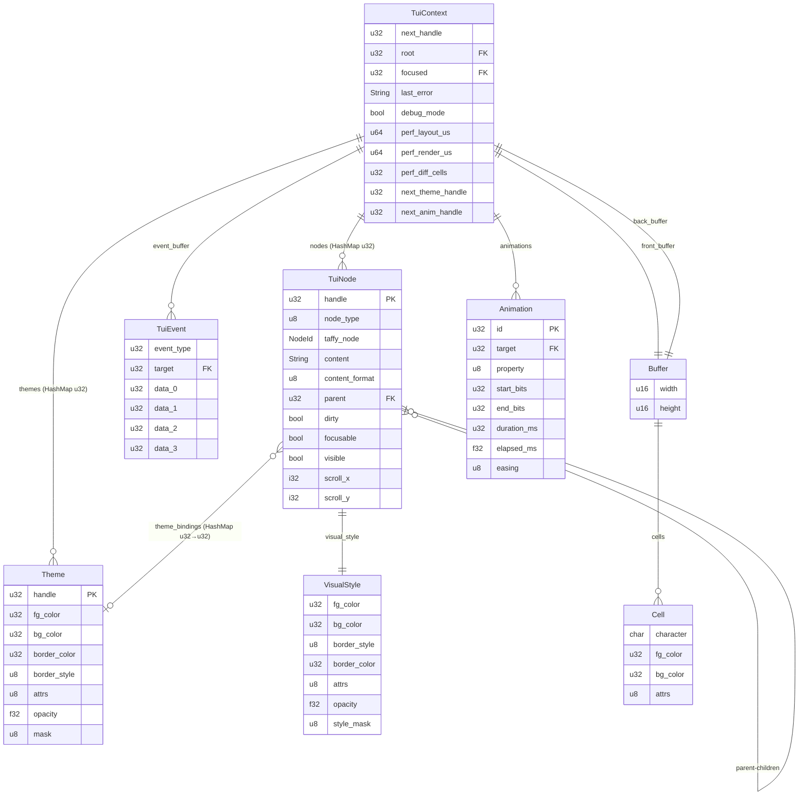

# Technical Specification (TechSpec.md)

## Kraken TUI

**Version**: 4.0
**Status**: Draft
**Date**: February 2026
**Source of Truth**: [Architecture.md](./Architecture.md), [PRD.md](./PRD.md)

**Changelog**:
- v4.0 — v2 scope additions. New ADRs: T16 (safe global state), T17 (subtree destruction), T18 (indexed insertion), T19 (TextArea widget), T20 (reconciler strategy), T21 (theme inheritance), T22 (position animation). Data model: Animation gains looping/pending/chain_next fields, TuiNode gains render_offset, NodeType gains TextArea, Theme gains type_defaults. New FFI functions: tui_destroy_subtree, tui_insert_child. Updated Appendix A (promoted v2 items). Updated Appendix B.
- v3.2 — Absorbed Performance Budgets from Architecture.md (was out of Architecture's boundary scope) into §5.5. Renumbered §5.6–§5.7.
- v3.1 — Aligned v1 scope with PRD: animation primitives and chaining are in v1 scope. Canonicalized Theme TS API contract (`new Theme()`, `Theme.DARK`, `Theme.LIGHT`) and `Kraken.switchTheme(theme: Theme)`. Marked headless init as testing utility excluded from public FFI symbol count.
- v3.0 — Added Theme Module (ADR-T12, ADR-T15), Animation Module (ADR-T13, ADR-T14). 11 new public FFI functions (73 total). Style mask for theme resolution. Built-in dark/light themes.
- v2.1 — Added text measurement API (ADR-T07), clarified Input scope (ADR-T08), added password masking (ADR-T09), completed Select CRUD (ADR-T10), fixed Select event model (ADR-T11)

---

## 1. STACK SPECIFICATION (BILL OF MATERIALS)

### Native Core

| Component              | Choice         | Version       | Rationale                                                                                                                          |
| ---------------------- | -------------- | ------------- | ---------------------------------------------------------------------------------------------------------------------------------- |
| **Language**           | Rust           | Stable 1.93.x | Performance engine per Architecture invariant. All CPU-intensive work executes here.                                               |
| **Edition**            | 2021           | —             | Current stable edition.                                                                                                            |
| **Build Target**       | cdylib         | —             | Shared library for FFI consumption via `bun:ffi`.                                                                                  |
| **Layout Engine**      | Taffy          | 0.9.x         | Pure Rust Flexbox. ADR-002. Current stable release.                                                                                |
| **Terminal Backend**   | crossterm      | 0.29.x        | Cross-platform terminal I/O. ADR-005.                                                                                              |
| **Markdown Parser**    | pulldown-cmark | 0.13.x        | CommonMark-compliant pull parser. Lightweight, no allocations during iteration.                                                    |
| **Syntax Highlighter** | syntect        | 5.3.x         | Sublime Text grammar-based. Default feature set with `default-onig` disabled to reduce binary size (use `default-fancy` features). |
| **Bitflags**           | bitflags       | 2.x           | Cell attribute flag representation.                                                                                                |
| **Unicode Width**      | unicode-width  | 0.2.x         | Display cell width calculation for CJK, emoji, combining chars. Required for layout engine integration.                           |

### Host Language Bindings

| Component         | Choice     | Version            | Rationale                                                                                                                               |
| ----------------- | ---------- | ------------------ | --------------------------------------------------------------------------------------------------------------------------------------- |
| **Runtime**       | Bun        | ≥ 1.0 (dev: 1.3.8) | Target runtime per PRD Appendix B. Native FFI support.                                                                                  |
| **Language**      | TypeScript | 5.x (Bun built-in) | Type-safe host layer. No build step required — Bun runs TS directly.                                                                    |
| **FFI Mechanism** | bun:ffi    | Built-in           | Zero-dependency foreign function interface. `dlopen` + symbol binding. Custom struct handling (ADR-T06) — no external struct libraries. |

### Build Artifacts

| Artifact     | Format                         | Output                   |
| ------------ | ------------------------------ | ------------------------ |
| Native Core  | `libkraken_tui.{so,dylib,dll}` | `native/target/release/` |
| Host Package | TypeScript source              | `ts/src/`                |

### Dev Environment

| Tool         | Configuration | Purpose                                         |
| ------------ | ------------- | ----------------------------------------------- |
| devenv (Nix) | `devenv.nix`  | Reproducible environment with Rust stable + Bun |
| rustfmt      | Default       | Code formatting                                 |
| clippy       | Default       | Linting                                         |

---

## 2. ARCHITECTURE DECISION RECORDS

### ADR-T01: Event Drain Protocol — Repeated Single-Call

**Context:** Architecture mandates batch event delivery (events buffered in Native Core, drained by Host Layer each tick) but does not specify the physical transfer mechanism across FFI.

**Decision:** Repeated single-call pattern. `tui_read_input(timeout_ms)` captures terminal input and classifies events into an internal buffer. `tui_next_event(out)` returns one event at a time via a fixed-layout `#[repr(C)]` struct (24 bytes). The Host Layer drains in a `while` loop until the function returns 0.

**Consequences:**

- (+) Simple — no packed buffer serialization or shared memory protocol.
- (+) Fixed-size event struct — no dynamic allocation at the FFI boundary.
- (+) Natural backpressure — host controls drain rate.
- (-) O(n) FFI crossings per tick. At typical volumes (1–5 events per tick at 60fps), overhead is <1μs — negligible vs the 1ms budget.
- (migration) Can move to packed buffer return if profiling reveals a bottleneck.

### ADR-T02: Property Routing — Layout vs Visual Separation

**Context:** The spike conflates Taffy layout properties (`width`, `flex_direction`) with visual properties (`foreground`, `bold`) in a single enum and function set. This violates the Architecture's bounded context separation between Layout Module and Style Module.

**Decision:** Two distinct FFI surface families:

- `tui_set_layout_*()` — routes to Taffy via Layout Module. Properties: width, height, min/max, flex-direction, flex-wrap, justify-content, align-items, align-self, align-content, gap, padding, margin, position.
- `tui_set_style_*()` — routes to per-node `VisualStyle` storage via Style Module. Properties: foreground, background, border-style, border-color, bold, italic, underline, opacity.

Per **Robert C. Martin** (Single Responsibility Principle): layout concerns and visual concerns change for different reasons and should not be coupled through the same interface.

**Consequences:**

- (+) Clean bounded context alignment with Architecture.
- (+) Layout Module touches only Taffy; Style Module never touches Taffy.
- (+) Better error diagnostics (invalid layout prop vs invalid style prop).
- (-) Two function families instead of one. Slightly larger FFI surface.

### ADR-T03: FFI Safety — `catch_unwind` + Error Code Pattern

**Context:** Architecture Section 5.1 mandates no Rust panic may cross the FFI boundary. The spike has zero `catch_unwind` usage.

**Decision:** Every `extern "C"` function body is wrapped in `std::panic::catch_unwind(AssertUnwindSafe(|| { ... }))`. Panics convert to error code `-2`. All functions return `i32` status (0 = success, negative = error) except handle-returning functions (0 = invalid sentinel). Last error message is stored in context, retrievable via `tui_get_last_error()`.

**Mandatory pattern for every FFI entry point:**

```rust
#[no_mangle]
pub extern "C" fn tui_example(handle: u32) -> i32 {
    match std::panic::catch_unwind(std::panic::AssertUnwindSafe(|| {
        let ctx = context_mut()?;    // Get context or return error
        ctx.validate_handle(handle)?; // Validate inputs
        // ... delegate to module ...
        Ok(0)
    })) {
        Ok(Ok(code)) => code,
        Ok(Err(msg)) => { set_last_error(msg); -1 }
        Err(_) => { set_last_error("internal panic"); -2 }
    }
}
```

**Consequences:**

- (+) No undefined behavior from panics crossing FFI.
- (+) Consistent error reporting.
- (-) ~2ns overhead per call in the non-panic path (negligible).

### ADR-T04: Style Patching — Read-Modify-Write

**Context:** The spike creates `Style::DEFAULT`, sets one property, then calls `tree.set_style()` — overwriting all other Taffy properties on the node.

**Decision:** Layout property setters read the node's current Taffy `Style`, modify the targeted property, then write the full style back. Visual properties accumulate in a separate `VisualStyle` struct on the node. Neither operation overwrites unrelated properties.

**Consequences:**

- (+) Correct Flexbox behavior — setting width doesn't reset flex-direction.
- (+) Required for incremental property mutation.
- (-) One read per mutation (in-memory HashMap lookup — negligible).

### ADR-T05: Terminal Backend Trait Abstraction

**Context:** Architecture Risk 4 recommends an internal trait for terminal I/O to enable backend substitution and testing.

**Decision:** Define a `TerminalBackend` trait. The crossterm implementation is the sole concrete implementation in v0. Render Module and Event Module depend on the trait. Context stores `Box<dyn TerminalBackend>` (dynamic dispatch). Mock backend used in tests.

```rust
pub trait TerminalBackend {
    fn init(&mut self) -> Result<(), String>;
    fn shutdown(&mut self) -> Result<(), String>;
    fn size(&self) -> (u16, u16);
    fn write_diff(&mut self, diff: &[CellUpdate]) -> Result<(), String>;
    fn flush(&mut self) -> Result<(), String>;
    fn read_events(&mut self, timeout_ms: u32) -> Vec<TerminalInputEvent>;
}
```

**Consequences:**

- (+) Enables mock backend for automated testing of render output and event processing.
- (+) Enables future backend replacement without modifying module logic.
- (-) Dynamic dispatch overhead (~1ns per call) — irrelevant since terminal I/O itself costs microseconds.

### ADR-T06: FFI Struct Handling — Custom Minimal Implementation

**Context:** The TechStack specifies Bun as the host runtime with `bun:ffi` for FFI. The FFI boundary uses fixed-layout C structs (`TuiEvent` 24 bytes, `Cell` 12 bytes) that must be marshalled between Rust and TypeScript. A third-party library `bun-ffi-structs` (by SST) exists for this purpose.

**Investigation:** Analyzed `bun-ffi-structs` (v0.1.3) which provides type-safe struct definitions for Bun FFI:

- ✅ Supports primitives (u8, u32, f32, etc.), enums, nested structs, arrays
- ✅ Handles C alignment and little-endian encoding
- ✅ Used by OpenTUI (which powers OpenCode)
- ⚠️ **Critical:** Native integration tests use **Zig only** — no Rust verification
- ⚠️ **Critical:** Library maintained by SST for their Zig→TypeScript stack; design optimized for Zig ABI conventions
- ⚠️ Risk: If SST pivots or abandons, we inherit unmaintained dependency with different design goals

**Decision:** Do NOT use `bun-ffi-structs`. Implement a minimal custom `ffi/structs.ts` module (~50 lines) with exactly what we need:

- Fixed-size struct pack/unpack for `TuiEvent`, `Cell`, layout results
- Proper C alignment and little-endian encoding
- Manual bitflag handling for `CellAttrs`

**Rationale:**

1. **We need <5 structs** — Not a general-purpose need; trivial to hand-code
2. **Zero dependencies** — No external roadmap affects us
3. **Full control** — We own alignment, endianness, everything
4. **Rust-first integrity** — We're not dependent on a Zig-optimized library for our Rust core
5. **Risk mitigation** — If `bun:ffi` becomes untenable, NAPI-RS is the migration path; a custom struct layer is trivial to adapt

**Consequences:**

- (+) Complete control over FFI struct handling
- (+) No external dependency for this critical path
- (+) Rust-core-first philosophy preserved
- (-) Re-inventing ~50 lines of struct packing logic
- (-) No compile-time struct definition validation (manual bookkeeping required)

**Implementation Note:** The custom module shall be implemented in `ts/src/ffi/structs.ts` with tests verifying byte layout matches Rust `#[repr(C)]` structs exactly.

### ADR-T07: Text Measurement — Unicode Display Cell Width

**Context:** Taffy layout engine requires intrinsic size measurements for text nodes to compute `auto` width and Flexbox layouts. Unicode text does not map 1:1 to terminal cells — CJK characters render as 2 cells, emoji as 2 cells, combining characters as 0 cells.

**Decision:** Expose `tui_measure_text()` FFI function using the `unicode-width` crate (v0.2.x). This crate is the industry standard used by Alacritty, ripgrep, and the Rust ecosystem. It implements Unicode Standard Annex #11 (East Asian Width) correctly.

**Critical Implementation Details:**
- Returns **display cell width**, not grapheme count or byte length
- CJK characters: 2 cells
- Emoji: 2 cells (including ZWJ sequences like 👩‍🔬)
- Combining characters: 0 cells
- Devanagari and complex scripts: context-dependent (per Unicode spec)

**Consequences:**

- (+) Correct layout computation for international text
- (+) Industry-proven implementation (unicode-width 0.2.x)
- (+) Zero additional architectural complexity
- (-) One additional dependency (~10KB)
- (note) Terminal emulator rendering may differ from Unicode spec for some edge cases (legacy engines)

### ADR-T08: Single-Line Input — Scope Deliberation

**Context:** Multi-line text editing (textarea) requires a two-dimensional cursor model (row, col) and significantly more complexity: line wrapping, vertical cursor movement, scroll position management. The PRD JTBD emphasizes "ship polished terminal UIs in hours, not days."

**Decision:** v0/v1 Input widget is **single-line only**. This satisfies the PRD Epic 4 requirement ("End User can type text into input Widgets") without the complexity of full text editor functionality. Multi-line input (textarea) is deferred to v2.

**Rationale:**

Per **tui-textarea** reference implementation (most popular Rust multi-line editor): multi-line editing requires:
- 2D cursor tracking (row, column)
- Line buffer management
- Vertical navigation key bindings
- Viewport scrolling for overflow
- Line number tracking (optional)

This is 5-10x the implementation complexity of single-line input.

**v0 Input Scope:**
- Single line of text
- Horizontal cursor positioning (0 to content length)
- Character insertion/deletion
- Password masking support (ADR-T09)
- Optional max length constraint

**v2 Roadmap Addition:** MultiLineInput widget or TextArea mode.

**Consequences:**

- (+) Aligns with "ship faster" JTBD
- (+) Covers 80% of CLI use cases (prompts, forms, search boxes)
- (+) Flat cursor model (single u32) is simple and fast
- (-) Does not support multi-line text entry (email body, comments, etc.)
- (migration) v2 reconciler can wrap the same primitives; no API breakage

### ADR-T09: Password Masking — Security Minimum Viable

**Context:** Password input is table stakes for TUI libraries. The PRD does not explicitly exclude it, and the **Ship-It CLI Developer** persona ("I want it to look professional in 20 minutes") expects this capability.

**Decision:** Add `tui_input_set_mask(u32 handle, u32 mask_char)` to the Input widget. When mask_char is non-zero, the Input renders mask_char instead of the actual typed character. Default is 0 (no masking).

**Design:**
- mask_char = 0: Display actual characters (default)
- mask_char = 0x2A ('*'): Display asterisks (common pattern)
- mask_char = 0x2022 ('•'): Display bullet (modern UI pattern)
- Cursor movement and editing work on actual content; display is masked only

**Reference:** reedline (Nushell's editor), tui-textarea, and ratatui all implement this pattern.

**Consequences:**

- (+) Meets security expectations for CLI tools
- (+) Simple implementation (display-time transformation only)
- (+) Zero impact on non-password inputs (default off)
- (-) Slightly larger Input widget state (one u32)

### ADR-T10: Select Widget State Management — Full CRUD

**Context:** The initial TechSpec only provided `tui_select_add_option()`. For dynamic UIs (dashboards with configurable filters, settings panels), developers need to clear and rebuild option lists at runtime. Destroying and recreating the entire widget is unacceptable DX.

**Decision:** Add `tui_select_clear_options()` and `tui_select_remove_option(index)` to complete the CRUD surface. This enables:
- Clearing a filter dropdown when parent selection changes
- Removing invalid options based on validation
- Rebuilding option lists from API responses

**Consequences:**

- (+) Enables dynamic, data-driven UIs
- (+) Matches standard UI toolkit patterns (HTML Select, React Select, etc.)
- (+) Zero architectural complexity (Vec operations only)
- (-) Two additional FFI functions

### ADR-T11: Select Change Events — Index-First Payload

**Context:** The initial TechSpec documented that Change events for all widgets require calling `tui_get_content()` to retrieve the new value. However, Select widgets don't have content—they have a selected index. This created undefined behavior.

**Decision:** Select Change events carry the selected index directly in `event.data[0]`. This eliminates an FFI round-trip (performance) and clarifies the API (ergonomics).

**Event Payload Specification:**

| Widget | `data[0]` | Retrieval Method |
|--------|-----------|------------------|
| Input | 0 (unused) | `tui_get_content(target)` |
| Select | Selected index | Use `data[0]` directly, or `tui_select_get_option(target, data[0], ...)` for text |

**Rationale:** Per Architecture Section 5.2 (FFI Boundary Contract), "Copy semantics for data transfer" — small fixed-size data should cross the boundary in the event struct. An index is 4 bytes; retrieving it via a separate call violates this principle.

**Consequences:**

- (+) Eliminates FFI round-trip for Select changes
- (+) Consistent with "Rust is the performance engine" invariant
- (+) Matches developer mental model (Select has index, not text content)
- (-) Slight asymmetry with Input widget (which retrieves text via getter)
- (note) Input cannot include text in event due to unbounded string length; Select index is bounded

### ADR-T12: Theme Style Resolution — Explicit Property Mask

**Context:** The v1 Theme Module provides VisualStyle defaults for subtrees. Theme resolution requires distinguishing between "property explicitly set on node" (explicit wins) and "property at default value" (use theme default). The current `VisualStyle` uses `0x00` for colors and `1.0` for opacity as defaults — there is no way to distinguish "explicitly set to default" from "never set."

**Investigation:** Lipgloss (Go) tracks set/unset state per property internally via an opaque struct with unexported fields. Ratatui uses `Option<Color>` to represent "unset" vs "set to a value." Both patterns solve the same problem: enabling "fill gaps only" composition where explicit values are preserved and only unset properties receive theme defaults.

**Decision:** Add a `style_mask: u8` bitfield to `VisualStyle`. Each bit indicates whether the corresponding property was explicitly set via a `tui_set_style_*` call. The `tui_set_style_*` functions automatically set the corresponding mask bit. Theme resolution checks the mask: set = use node's value, unset = use theme default.

**Mask bit layout:**

| Bit | Property |
|-----|----------|
| 0 | fg_color |
| 1 | bg_color |
| 2 | border_color |
| 3 | border_style |
| 4 | attrs (any of bold/italic/underline) |
| 5 | opacity |

**Resolution algorithm:** For each style property on a node during render:
1. If `style_mask` bit is set → use node's explicit value
2. Else if node (or ancestor) is bound to a theme, and theme provides that property → use theme's value
3. Else → use the node's stored value (which defaults to 0x00/empty/1.0)

**Theme lookup** follows nearest-ancestor semantics: walk from the node up the tree toward the root. The first ancestor (or the node itself) found in `theme_bindings` determines the applicable theme. O(depth) per node — negligible for typical TUI trees (depth 3–10).

**Consequences:**

- (+) Correct "fill gaps" resolution: explicit styles always win, themes fill unset properties
- (+) Backwards-compatible: v0 apps without themes are unaffected (mask is never consulted when no theme is bound)
- (+) Consistent with proven patterns (Lipgloss, ratatui)
- (+) 1 byte overhead per node (negligible)
- (-) Style setters must also set the mask bit (trivial implementation change)
- (note) No `tui_reset_style` function in v1. To revert an explicit style to theme default, destroy and recreate the node. Reset can be added in a future version if demand exists.

### ADR-T13: Animation Delta-Time Model

**Context:** The Architecture specifies "host-driven" animation: `render()` queries the system clock internally, and the Animation Module advances transitions based on elapsed time. The PRD requires "frame-budget-aware" degradation.

**Investigation:** Analyzed animation systems in tachyonfx (ratatui ecosystem, 1,125 stars), bubbletea/Harmonica (Go), and Ink (Node.js). Every framework with animation uses wall-clock elapsed time (delta-time). No TUI framework implements explicit frame dropping or animation priority queues. Delta-time naturally handles variable frame rates: if a frame takes 32ms instead of 16ms, the animation advances 32ms worth of progress. This is the same pattern used in game engines and is considered industry standard.

**Decision:** The Animation Module stores `last_render_time: Option<Instant>` in TuiContext. On each `tui_render()` call:
1. Compute `elapsed = now - last_render_time` (first call uses 0ms elapsed)
2. Advance all active animations by `elapsed`
3. Interpolate current values and apply to target nodes' `VisualStyle`
4. Mark affected nodes dirty
5. Remove completed animations from the registry
6. Update `last_render_time = now`

Animation advancement occurs **before** layout resolution in the render pipeline, consistent with the Architecture's pipeline: "mutation commands accumulate → animation advancement → layout resolution → dirty-flag diffing → terminal I/O."

**Consequences:**

- (+) Correct wall-clock timing regardless of frame rate
- (+) Natural frame-budget handling: slow frames advance animations proportionally, no visual glitches
- (+) Zero complexity beyond basic animation
- (+) Matches the proven pattern used by tachyonfx, Harmonica, and game engines
- (-) No explicit frame dropping for low-priority animations (can be added without API change if profiling reveals need)

### ADR-T14: Animatable Property Scope (v1)

**Context:** PRD Epic 8 requires timed property transitions, built-in animation primitives, and programmable chaining. The architecture still enforces module boundaries: Animation touches Tree/Style, not Layout.

**Investigation:** tachyonfx (ratatui) animates buffer cells post-render rather than widget properties. Bubbletea/Harmonica animate widget state (e.g., progress percentage) with spring physics. We adopt property transitions in the core, and model primitives/chaining as higher-level orchestration over the same engine.

**Decision:** v1 animatable properties are: `opacity`, `fg_color`, `bg_color`, `border_color`. Animation chaining (triggering animation B when A completes) is in v1 scope. Position animation remains deferred to v2 to preserve bounded-context separation with Layout.

**Animatable property encoding:**

| Value | Property | Type | Interpolation |
|-------|----------|------|---------------|
| 0 | opacity | f32 (as bits) | Linear lerp in f32 space |
| 1 | fg_color | u32 (color encoding) | Per-channel RGB lerp |
| 2 | bg_color | u32 (color encoding) | Per-channel RGB lerp |
| 3 | border_color | u32 (color encoding) | Per-channel RGB lerp |
| 4 | position_x | f32 (as bits) | Linear lerp in f32 space (v2, ADR-T22) |
| 5 | position_y | f32 (as bits) | Linear lerp in f32 space (v2, ADR-T22) |

**Color interpolation rules:**
- Both start and end are RGB (tag `0x01`): interpolate R, G, B channels independently, recombine with RGB tag
- Either start or end is not RGB (tag `0x00` default or `0x02` indexed): immediately snap to end value at `t >= 1.0` — no smooth transition for non-RGB colors

**Value encoding across FFI:** The `target_bits` parameter is `u32`. For f32 properties (opacity), the Host Layer bit-casts the f32 to u32 before calling. The Native Core bit-casts back to f32 based on the property type. This avoids a split into multiple FFI functions.

**Easing functions (v1):**

| Value | Function | Formula |
|-------|----------|---------|
| 0 | Linear | `t` |
| 1 | EaseIn | `t * t` |
| 2 | EaseOut | `1.0 - (1.0 - t) * (1.0 - t)` |
| 3 | EaseInOut | `t < 0.5 ? 2.0 * t * t : 1.0 - (-2.0 * t + 2.0).pow(2) / 2.0` |

tachyonfx supports 32 easing variants. Four quadratic variants cover the primary TUI use cases. Additional easing functions (cubic, elastic, bounce) can be added without API change by extending the enum.

**Consequences:**

- (+) Clean bounded context: Animation touches only Style (VisualStyle) and Tree (dirty flags)
- (+) 4 animatable properties cover the primary use cases (fade-in/out, color transitions, border highlights)
- (+) Simple interpolation logic (lerp for f32, per-channel lerp for RGB)
- (+) Primitives/chaining reuse one engine, avoiding parallel animation subsystems
- (-) No position animation in v1
- (migration) Position animation in v2 can be implemented as visual-only render offset without changing the Animation Module's FFI surface

### ADR-T15: Built-in Theme Palettes

**Context:** PRD requires "at least two built-in Themes: light and dark" (v1). These must be available immediately after `tui_init()` without requiring the developer to manually construct them.

**Investigation:** Lipgloss (Go) provides `AdaptiveColor` for light/dark terminal detection but no pre-built themes. Textual (Python) auto-derives ~120 CSS variables from a primary color using CIE-L\*ab color space. For Kraken TUI's FFI model (explicit property setters, no CSS engine), a simpler approach is appropriate: fixed palettes with reasonable defaults.

**Decision:** Two built-in themes are created during `tui_init()` with reserved theme handles:

**Dark Theme (handle 1):**

| Property | Value | Notes |
|----------|-------|-------|
| `fg_color` | `0x01E0E0E0` | Light grey — readable on dark backgrounds |
| `bg_color` | `0x011E1E2E` | Dark blue-grey |
| `border_color` | `0x014A4A5A` | Muted grey |
| `border_style` | `Single` | Standard single-line borders |
| `attrs` | empty | No text decorations |
| `opacity` | `1.0` | Fully opaque |

**Light Theme (handle 2):**

| Property | Value | Notes |
|----------|-------|-------|
| `fg_color` | `0x01222222` | Near-black — readable on light backgrounds |
| `bg_color` | `0x01F5F5F5` | Near-white |
| `border_color` | `0x01BBBBBB` | Medium grey |
| `border_style` | `Single` | Standard single-line borders |
| `attrs` | empty | No text decorations |
| `opacity` | `1.0` | Fully opaque |

Theme handles 1 and 2 are reserved. `tui_create_theme()` allocates from handle 3 onward. The built-in themes can be customized via `tui_set_theme_*` functions after init — they are not immutable.

Neither built-in theme is applied by default. The developer must explicitly call `tui_apply_theme()` or `tui_switch_theme()` to activate theming. This ensures zero behavior change for v0 apps.

**Consequences:**

- (+) Zero-configuration dark/light mode for developers who want it
- (+) Customizable — developers can modify built-in themes or create entirely new ones
- (+) No implicit behavior change — themes must be explicitly activated
- (-) Opinionated color choices (may not match every terminal's aesthetic)
- (note) Advanced use case: detect terminal background color in the Host Layer and select the appropriate built-in theme. This is a Host Layer concern, not a Native Core responsibility.

### ADR-T16: Safe Global State — `OnceLock<RwLock>` (v2)

**Context:** The v0/v1 `TuiContext` is stored as `static mut CONTEXT: Option<TuiContext>` with `#[allow(static_mut_refs)]`. This pattern is deprecated in Rust and unsound under strict aliasing rules. The v2 async event loop and reconciler introduce code paths that could theoretically access state from multiple call sites within a single thread.

**Decision:** Replace `static mut CONTEXT` with `std::sync::OnceLock<std::sync::RwLock<TuiContext>>`. All FFI entry points acquire the lock explicitly. The single-threaded execution model is preserved — `RwLock` provides Rust safety guarantees, not multi-threaded concurrency.

**Alternatives considered:**
- `thread_local!`: Simpler, but prevents future multi-threaded access (closes the door on a background render thread in v3).
- `Mutex<TuiContext>`: Write-only locking. `RwLock` is preferred because read-heavy FFI functions (getters, queries) can share access.

**Consequences:**

- (+) Eliminates `#[allow(static_mut_refs)]` — no more deprecated patterns
- (+) Sound under Rust aliasing rules
- (+) Preserves single-threaded execution model (no behavior change)
- (+) Prepares for potential v3 background thread without re-architecture
- (-) Minor overhead: lock acquisition on every FFI call (~10ns for uncontended RwLock)
- (-) All FFI entry points must be updated to acquire the lock

### ADR-T17: Cascading Subtree Destruction (v2)

**Context:** The current `tui_destroy_node()` orphans children — it does not recursively destroy descendants. In the imperative API, this is acceptable: the Developer manages individual nodes. In the declarative reconciler, unmounting a component subtree requires destroying all descendants. Without a native recursive destroy, the reconciler must walk the tree from the Host Layer — O(n) FFI calls for a subtree of n nodes.

**Decision:** Add `tui_destroy_subtree(handle)` to the FFI surface. This function recursively destroys a node and all its descendants in a single native call. For each destroyed node: detach from parent, cancel active animations, remove theme bindings, remove from Taffy layout tree, deallocate.

**Traversal order:** Post-order (children before parent) to ensure parent-child bookkeeping is consistent during destruction.

**Consequences:**

- (+) O(n) native operations in a single FFI call vs O(n) FFI calls
- (+) Prevents handle leaks in the reconciler
- (+) Animation and theme cleanup is automatic per node
- (-) One additional FFI function
- (note) `tui_destroy_node()` retains its current orphaning behavior for backwards compatibility

### ADR-T18: Indexed Child Insertion (v2)

**Context:** The current tree API provides only `tui_append_child(parent, child)` (appends to end) and `tui_remove_child(parent, child)` (removes). To reorder children, the Host Layer must remove all children and re-append them in the desired order — O(n) FFI calls. This is the standard `insertBefore` operation that every reconciler depends on for efficient keyed-list diffing.

**Decision:** Add `tui_insert_child(parent, child, index)` to the FFI surface. Inserts `child` at `index` in `parent`'s child list. If `index >= child_count`, appends (same as `tui_append_child`). If `child` already has a parent, it is detached first (reparenting). Marks the parent's subtree dirty.

**Consequences:**

- (+) Enables O(1) child reordering per node
- (+) Hard prerequisite for the reconciler's keyed-list diffing
- (+) Standard DOM-like tree mutation primitive
- (-) One additional FFI function
- (note) The Taffy layout tree must also be updated to reflect the new child order

### ADR-T19: TextArea Widget — Multi-Line Input (v2)

**Context:** ADR-T08 deferred multi-line text editing to v2. The PRD's TextArea widget requires a 2D cursor model, line buffer management, vertical navigation, and viewport scrolling.

**Decision:** Add `NodeType::TextArea = 5` as a new widget type. The TextArea widget manages:
- A `Vec<String>` line buffer (one allocation per line)
- 2D cursor: `(row: u32, col: u32)` position
- Viewport offset: `(scroll_row: u32, scroll_col: u32)` for scrolling
- Word wrap mode: off (horizontal scroll) or on (soft wrap at widget width)

**FFI surface additions:**
- `tui_textarea_set_cursor(handle, row, col) -> i32`
- `tui_textarea_get_cursor(handle, *mut u32 row, *mut u32 col) -> i32`
- `tui_textarea_get_line_count(handle) -> i32`
- `tui_textarea_set_wrap(handle, u8 wrap_mode) -> i32`

**Content model:** TextArea reuses `tui_set_content()` and `tui_get_content()` for the full text buffer. Newlines (`\n`) delimit lines internally. The Event Module handles vertical cursor movement (Up/Down) and multi-line editing (Enter inserts newline, Backspace at column 0 joins lines).

**Consequences:**

- (+) Covers the 20% of CLI use cases that single-line Input cannot (email body, comments, code snippets)
- (+) Reuses existing content FFI functions — no new string passing
- (-) Significant implementation complexity (2D cursor, line management, viewport scrolling)
- (-) 4+ new FFI functions
- (migration) The reconciler treats TextArea identically to Input — same lifecycle, same event model

### ADR-T20: Reconciler Strategy — JSX Factory + Signals (v2)

**Context:** ADR-004 established "imperative API first, reactive reconciler v2" with the Strangler Fig pattern. The PRD's Appendix B originally suggested Solid.js, then React. The v2 blueprint proposes a lighter approach: a custom JSX factory + `@preact/signals-core`.

**Decision:** The v2 reconciler is a lightweight runtime JSX factory that instantiates standard Widget classes. Reactivity is provided by `@preact/signals-core` (or equivalent micro-signal library). Signal effects push updates directly to the FFI. No Virtual DOM, no diffing of component trees — signals provide fine-grained reactivity at the property level.

**Package structure:**
- `kraken-tui` (core, <50KB): imperative wrappers + JSX factory + signal reconciler
- `kraken-tui/effect` (optional): maps widget lifecycles to Effect `Scope`, input buffer to Effect `Stream`

**JSX factory behavior:**
1. JSX element → calls `tui_create_node()`, returns Widget instance
2. JSX children → calls `tui_append_child()` / `tui_insert_child()` in order
3. JSX props → calls `tui_set_style_*()`, `tui_set_layout_*()`, etc.
4. Signal prop → wraps in `effect()` that re-calls the setter when the signal changes
5. Component unmount → calls `tui_destroy_subtree()` (ADR-T17)

**Consequences:**

- (+) Familiar JSX DX without React's weight
- (+) Fine-grained reactivity — no Virtual DOM diffing overhead
- (+) Core package stays under 50KB budget
- (+) Wraps the imperative API — no Native Core changes (Strangler Fig)
- (-) Diverges from PRD Appendix B's Solid.js preference (non-binding preference)
- (-) Custom JSX factory requires maintenance; no framework ecosystem to lean on
- (note) The imperative API remains fully supported — the reconciler is additive

### ADR-T21: Theme Inheritance — Per-NodeType Defaults (v2)

**Context:** v1 themes provide a single set of style defaults for an entire subtree. The PRD and TechSpec Appendix A anticipate v2 theme inheritance: "constraint-based Theme inheritance model for nested subtrees" and "Per-NodeType Themes."

**Decision:** Extend the `Theme` struct with `type_defaults: HashMap<NodeType, VisualStyle>`. The resolution algorithm (ADR-T12) gains a new step:

1. If `style_mask` bit is set → use node's explicit value
2. **[NEW]** Else if theme provides a NodeType-specific default for this node's type, and that default's mask bit is set → use the NodeType default
3. Else if theme provides a global default for this property → use theme's global value
4. Else → use the node's stored value (which defaults to 0x00/empty/1.0)

**FFI surface additions:**
- `tui_set_theme_type_color(theme, node_type, prop, color) -> i32`
- `tui_set_theme_type_flag(theme, node_type, prop, value) -> i32`
- `tui_set_theme_type_border(theme, node_type, border_style) -> i32`
- `tui_set_theme_type_opacity(theme, node_type, opacity) -> i32`

**Consequences:**

- (+) Enables "style all Text nodes blue" without per-node explicit styling
- (+) Backwards-compatible: v1 themes without type_defaults are unaffected
- (+) Resolution algorithm is a clean extension (one new step)
- (-) 4 new FFI functions
- (-) Theme struct grows by `HashMap<NodeType, VisualStyle>` (heap-allocated, lazy)

### ADR-T22: Position Animation via Render Offset (v2)

**Context:** ADR-T14 deferred position animation to v2 "to preserve bounded-context separation with Layout." TechSpec Appendix A already sketched the approach: "visual-only render offset."

**Decision:** Add `AnimProp::PositionX = 4` and `AnimProp::PositionY = 5` to the animatable property enum. Add `render_offset: (f32, f32)` field to `TuiNode`. The Animation Module writes to `render_offset`; the Render Module applies the offset during buffer rendering (shifts cell positions). The Layout Module is not involved — `render_offset` is a visual-only displacement that does not affect Flexbox computation.

**Interpolation:** Linear lerp in f32 space. The `target_bits` for position animations is the f32 offset in terminal cells, bit-cast to u32 (same pattern as opacity).

**Consequences:**

- (+) Enables slide-in/slide-out, bounce, and position-based motion
- (+) Clean bounded-context separation: Animation writes offset, Render reads offset, Layout is unaffected
- (+) No FFI surface change — `tui_animate()` already accepts `u8 property` and `u32 target_bits`
- (-) Visual offset can make widgets visually overlap without Layout awareness (developer responsibility)
- (note) For complex motion, combine position animation with opacity animation using chaining (ADR-T14)

---

## 3. DATA MODEL

### 3.1 Entity Relationship



### 3.2 Enum Definitions

#### NodeType

```rust
#[repr(u8)]
pub enum NodeType {
    Box      = 0,
    Text     = 1,
    Input    = 2,
    Select   = 3,
    ScrollBox = 4,
    TextArea  = 5,  // v2: multi-line text input (ADR-T19)
}
```

#### Color Encoding (`u32`)

Colors are encoded as a tagged `u32` across the FFI boundary:

```
Bits 31-24: Mode tag
  0x00 = Default (terminal default, no override)
  0x01 = RGB truecolor (bits 23-0 = 0xRRGGBB)
  0x02 = Indexed (bits 7-0 = palette index 0-255)

Examples:
  0x00000000 = Default (inherit terminal color)
  0x01FF0000 = Red (RGB)
  0x0100FF00 = Green (RGB)
  0x01FFFFFF = White (RGB)
  0x02000001 = Red (ANSI index 1)
  0x0200000F = White (ANSI index 15)
  0x020000E8 = Grey (256-palette index 232)
```

**Edge cases:**

- **Invalid tag (0x03–0xFF):** Treated as `Default` (0x00). The Native Core does not error on invalid tags — it falls back gracefully.
- **Invalid RGB values:** Values > 255 in any component are clamped to 255.
- **Invalid ANSI index:** Indices > 255 are treated as `Default`.
- **Default inheritance:** When a node's color is `0x00` (Default), it inherits from the terminal's default. No explicit parent traversal occurs.

The Host Layer parses developer-friendly formats (`"#FF0000"`, `"red"`, `196`) into this encoding. The Native Core decodes into crossterm `Color` variants.

#### BorderStyle

```rust
#[repr(u8)]
pub enum BorderStyle {
    None    = 0,
    Single  = 1,
    Double  = 2,
    Rounded = 3,
    Bold    = 4,
}
```

#### CellAttrs (bitflags)

```rust
bitflags! {
    #[repr(transparent)]
    pub struct CellAttrs: u8 {
        const BOLD      = 0b0000_0001;
        const ITALIC    = 0b0000_0010;
        const UNDERLINE = 0b0000_0100;
    }
}
```

#### ContentFormat

```rust
#[repr(u8)]
pub enum ContentFormat {
    Plain    = 0,
    Markdown = 1,
    Code     = 2,
}
```

#### TuiEventType

```rust
#[repr(u32)]
pub enum TuiEventType {
    None        = 0,
    Key         = 1,
    Mouse       = 2,
    Resize      = 3,
    FocusChange = 4,
    Change      = 5,
    Submit      = 6,
}
```

#### AnimProp

```rust
#[repr(u8)]
pub enum AnimProp {
    Opacity     = 0,
    FgColor     = 1,
    BgColor     = 2,
    BorderColor = 3,
    PositionX   = 4,  // v2: visual-only render offset X (ADR-T22)
    PositionY   = 5,  // v2: visual-only render offset Y (ADR-T22)
}
```

#### Easing

```rust
#[repr(u8)]
pub enum Easing {
    Linear    = 0,
    EaseIn    = 1,
    EaseOut   = 2,
    EaseInOut = 3,
    // v2 additions:
    CubicIn   = 4,
    CubicOut  = 5,
    Elastic   = 6,
    Bounce    = 7,
}
```

### 3.3 Struct Definitions

#### VisualStyle

```rust
pub struct VisualStyle {
    pub fg_color: u32,          // Color encoding. 0x00 = default.
    pub bg_color: u32,          // Color encoding. 0x00 = default.
    pub border_style: BorderStyle,
    pub border_color: u32,      // Color encoding. 0x00 = default.
    pub attrs: CellAttrs,       // Bold, italic, underline bitflags.
    pub opacity: f32,           // 0.0–1.0. Default 1.0.
    pub style_mask: u8,         // v1: Tracks which properties were explicitly set. See ADR-T12.
}

impl Default for VisualStyle {
    fn default() -> Self {
        Self {
            fg_color: 0, bg_color: 0,
            border_style: BorderStyle::None,
            border_color: 0,
            attrs: CellAttrs::empty(),
            opacity: 1.0,
            style_mask: 0,  // No properties explicitly set
        }
    }
}
```

**Style mask behavior:** The `tui_set_style_*` FFI functions set both the property value AND the corresponding `style_mask` bit. This is transparent to the caller — no additional FFI call is needed. The mask is internal state used only by the Style Module during theme-aware resolution (v1).

#### Theme

```rust
pub struct Theme {
    pub fg_color: u32,
    pub bg_color: u32,
    pub border_color: u32,
    pub border_style: BorderStyle,
    pub attrs: CellAttrs,
    pub opacity: f32,
    pub mask: u8,               // Which properties this theme provides defaults for.
                                // Same bit layout as VisualStyle.style_mask.
    pub type_defaults: HashMap<NodeType, VisualStyle>,  // v2: per-NodeType style defaults (ADR-T21)
}

impl Default for Theme {
    fn default() -> Self {
        Self {
            fg_color: 0, bg_color: 0,
            border_color: 0,
            border_style: BorderStyle::None,
            attrs: CellAttrs::empty(),
            opacity: 1.0,
            mask: 0,  // No defaults provided until tui_set_theme_* is called
            type_defaults: HashMap::new(),
        }
    }
}
```

**Theme mask behavior:** `tui_set_theme_*` functions set both the property value AND the corresponding `mask` bit on the Theme. During resolution, only properties where the theme's mask bit is set are applied as defaults.

**v2 per-NodeType defaults:** `tui_set_theme_type_*` functions set style defaults specific to a `NodeType`. During resolution, NodeType-specific defaults take priority over global theme defaults (see ADR-T21 for full resolution order).

#### Animation (internal)

```rust
pub struct Animation {
    pub id: u32,                // Unique animation handle
    pub target: u32,            // Widget handle being animated
    pub property: AnimProp,     // Which style property
    pub start_bits: u32,        // Starting value (bit representation, captured at creation)
    pub end_bits: u32,          // Target value (bit representation, from FFI call)
    pub duration_ms: u32,       // Total animation duration in milliseconds
    pub elapsed_ms: f32,        // Elapsed time since animation start
    pub easing: Easing,         // Easing function
    pub looping: bool,          // v1: reverse-on-completion (used by pulse primitive)
    pub pending: bool,          // v1: chained animation waiting for predecessor to complete
    pub chain_next: Option<u32>, // v1: animation ID to start when this animation completes
}
```

**Lifecycle:** An `Animation` is created by `tui_animate()`, which captures the target property's current value as `start_bits`. On each `tui_render()`, `elapsed_ms` is advanced by the frame delta. When `elapsed_ms >= duration_ms`, the end value is applied and the animation is removed from the registry. `tui_cancel_animation()` removes the animation immediately, leaving the property at its current interpolated value.

**Conflict resolution:** If `tui_animate()` is called for a property that already has an active animation, the existing animation is replaced. The new animation captures the current interpolated value as its `start_bits`, enabling smooth transitions from any in-progress state.

#### TuiNode

```rust
pub struct TuiNode {
    pub node_type: NodeType,
    pub taffy_node: taffy::NodeId,
    pub content: String,
    pub content_format: ContentFormat,
    pub code_language: Option<String>,   // For ContentFormat::Code
    pub children: Vec<u32>,
    pub parent: Option<u32>,
    pub visual_style: VisualStyle,
    pub dirty: bool,
    pub focusable: bool,
    pub visible: bool,
    pub scroll_x: i32,
    pub scroll_y: i32,
    pub render_offset: (f32, f32),       // v2: visual-only displacement (ADR-T22). Default (0.0, 0.0).
    // v2 TextArea fields (only used when node_type == TextArea):
    pub cursor_row: u32,                 // v2: 2D cursor row (ADR-T19)
    pub cursor_col: u32,                 // v2: 2D cursor column
    pub wrap_mode: u8,                   // v2: 0 = no wrap (horizontal scroll), 1 = soft wrap
}
```

**Storage strategy:** String fields (`content`, `code_language`) use Rust's `String` type with heap allocation. No string interning is used in v0 — each content mutation allocates a new string. This may be optimized in future versions based on profiling data.

#### TuiEvent (`#[repr(C)]`, 24 bytes)

```rust
#[repr(C)]
pub struct TuiEvent {
    pub event_type: u32,    // TuiEventType discriminant
    pub target: u32,        // Handle of relevant widget (0 = global)
    pub data: [u32; 4],     // Payload, interpretation depends on event_type
}
```

**Event payload layout:**

| Event Type      | `target`          | `data[0]`   | `data[1]`  | `data[2]`        | `data[3]` |
| --------------- | ----------------- | ----------- | ---------- | ---------------- | --------- |
| **Key**         | Focused handle    | key_code    | modifiers  | UTF-32 codepoint | —         |
| **Mouse**       | Hit-tested handle | x (column)  | y (row)    | button           | modifiers |
| **Resize**      | 0                 | new_width   | new_height | —                | —         |
| **FocusChange** | 0                 | from_handle | to_handle  | —                | —         |
| **Change**      | Target handle     | See notes   | —          | —                | —         |
| **Submit**      | Target handle     | —           | —          | —                | —         |

**Change Event Payload by Widget Type:**

| Widget Type | `data[0]` Interpretation | How to Retrieve Value |
| ----------- | ------------------------ | --------------------- |
| **Input**   | Unused (0)               | Call `tui_get_content(target)` to get text |
| **Select**  | Selected index (0-based) | Use `data[0]` directly, or call `tui_select_get_option(target, data[0], ...)` for text |

For **Submit**: The host reads the value via widget-specific getters (`tui_get_content` for Input, `tui_select_get_selected` for Select). No string data in events.

**Key code ranges:**

| Range           | Meaning                |
| --------------- | ---------------------- |
| `0x0000–0x007F` | ASCII (direct mapping) |
| `0x0100`        | Backspace              |
| `0x0101`        | Enter                  |
| `0x0102`        | Left                   |
| `0x0103`        | Right                  |
| `0x0104`        | Up                     |
| `0x0105`        | Down                   |
| `0x0106`        | Home                   |
| `0x0107`        | End                    |
| `0x0108`        | PageUp                 |
| `0x0109`        | PageDown               |
| `0x010A`        | Tab                    |
| `0x010B`        | BackTab (Shift+Tab)    |
| `0x010C`        | Delete                 |
| `0x010D`        | Insert                 |
| `0x010E`        | Escape                 |
| `0x0110–0x011F` | F1–F16                 |

**Modifier flags (bitfield):**

| Bit    | Modifier |
| ------ | -------- |
| `0x01` | Shift    |
| `0x02` | Ctrl     |
| `0x04` | Alt      |
| `0x08` | Super    |

**Mouse button:**

| Value | Button     |
| ----- | ---------- |
| 0     | Left       |
| 1     | Middle     |
| 2     | Right      |
| 3     | ScrollUp   |
| 4     | ScrollDown |

#### Cell

```rust
pub struct Cell {
    pub ch: char,
    pub fg: u32,           // Color encoding
    pub bg: u32,           // Color encoding
    pub attrs: CellAttrs,
}

impl Default for Cell {
    fn default() -> Self {
        Self { ch: ' ', fg: 0, bg: 0, attrs: CellAttrs::empty() }
    }
}
```

#### Buffer

```rust
pub struct Buffer {
    pub width: u16,
    pub height: u16,
    pub cells: Vec<Cell>,
}
```

#### TerminalInputEvent (internal, not FFI)

```rust
pub enum TerminalInputEvent {
    Key { code: u32, modifiers: u32, character: char },
    Mouse { x: u16, y: u16, button: u8, modifiers: u32 },
    Resize { width: u16, height: u16 },
    FocusGained,
    FocusLost,
}
```

#### CellUpdate (internal, for backend trait)

```rust
pub struct CellUpdate {
    pub x: u16,
    pub y: u16,
    pub cell: Cell,
}
```

#### TuiContext

**v2 note:** The global accessor changes from `static mut CONTEXT` to `OnceLock<RwLock<TuiContext>>` per ADR-T16. The struct contents are unchanged.

```rust
pub struct TuiContext {
    // Tree Module
    pub tree: TaffyTree<()>,
    pub nodes: HashMap<u32, TuiNode>,
    pub next_handle: u32,
    pub root: Option<u32>,

    // Event Module
    pub event_buffer: Vec<TuiEvent>,
    pub focused: Option<u32>,

    // Render Module
    pub front_buffer: Buffer,
    pub back_buffer: Buffer,
    pub backend: Box<dyn TerminalBackend>,

    // Text Module
    pub syntax_set: syntect::parsing::SyntaxSet,
    pub theme_set: syntect::highlighting::ThemeSet,

    // Theme Module
    pub themes: HashMap<u32, Theme>,
    pub theme_bindings: HashMap<u32, u32>,  // node_handle → theme_handle
    pub next_theme_handle: u32,             // Starts at 3 (1, 2 reserved for built-in)

    // Animation Module
    pub animations: Vec<Animation>,
    pub next_anim_handle: u32,              // Starts at 1
    pub last_render_time: Option<Instant>,  // std::time::Instant

    // Diagnostics
    pub last_error: String,
    pub debug_mode: bool,
    pub perf_layout_us: u64,
    pub perf_render_us: u64,
    pub perf_diff_cells: u32,
}
```

---

## 4. FFI CONTRACT (C ABI)

### 4.1 Conventions

- **Prefix:** All functions are prefixed with `tui_`.
- **ABI:** `extern "C"`, `#[no_mangle]`.
- **Handles:** `u32`. `0` = invalid sentinel. Never allocated. Widget handles, theme handles, and animation handles occupy **separate namespaces**.
- **Strings in:** `(*const u8, u32)` — pointer + byte length. Rust copies. Caller frees after call.
- **Strings out:** Caller provides `(*mut u8, u32)` buffer. Rust copies into buffer.
- **Returns:** `i32` for status functions (0 = success). `u32` for handle functions (0 = error).
- **Errors:** `-1` = error (check `tui_get_last_error()`). `-2` = internal panic.
- **Safety:** Every entry point wrapped in `catch_unwind` per ADR-T03.

### 4.2 Lifecycle

| Function                | Signature                     | Returns  | Description                                                                    |
| ----------------------- | ----------------------------- | -------- | ------------------------------------------------------------------------------ |
| `tui_init`              | `() -> i32`                   | 0 / -1   | Initialize context, enter alternate screen, enable raw mode and mouse capture. Creates built-in themes (handles 1 and 2). |
| `tui_shutdown`          | `() -> i32`                   | 0 / -1   | Restore terminal state, destroy context, free all resources. Cancels all active animations.                   |
| `tui_get_terminal_size` | `(*mut i32, *mut i32) -> i32` | 0 / -1   | Write current terminal width and height to provided pointers.                  |
| `tui_get_capabilities`  | `() -> u32`                   | Bitfield | Get terminal capabilities. See capability flags below.                         |

**Terminal capability flags** (bitfield returned by `tui_get_capabilities`):

| Bit | Capability         |
| --- | ------------------ |
| 0   | Truecolor (24-bit) |
| 1   | 256-color          |
| 2   | 16-color           |
| 3   | Mouse support      |
| 4   | UTF-8              |
| 5   | Alternate screen   |

### 4.3 Node Lifecycle

| Function             | Signature                         | Returns       | Description                                                                             |
| -------------------- | --------------------------------- | ------------- | --------------------------------------------------------------------------------------- |
| `tui_create_node`    | `(u8 node_type) -> u32`           | Handle / 0    | Create a node. `node_type`: see `NodeType` enum. Returns opaque handle.                 |
| `tui_destroy_node`   | `(u32 handle) -> i32`             | 0 / -1        | Destroy node. Detaches from parent. Orphans children (does not cascade). Cancels any active animations targeting this node. |
| `tui_get_node_type`  | `(u32 handle) -> i32`             | NodeType / -1 | Returns node type as `i32` (cast of `NodeType` enum value).                             |
| `tui_set_visible`    | `(u32 handle, u8 visible) -> i32` | 0 / -1        | Set node visibility. `visible`: 0 = hidden, 1 = visible. Hidden nodes are not rendered. |
| `tui_get_visible`    | `(u32 handle) -> i32`             | 1 / 0 / -1    | Get node visibility. Returns 1 if visible, 0 if hidden, -1 on error.                    |
| `tui_destroy_subtree`| `(u32 handle) -> i32`             | 0 / -1        | v2: Recursively destroy node and all descendants. Post-order traversal. Cancels animations, removes theme bindings, and clears root/focus if they point into the destroyed subtree. See ADR-T17. |
| `tui_get_node_count` | `() -> u32`                       | Count         | Get total number of nodes in the context.                                               |

### 4.4 Tree Structure

| Function              | Signature                        | Returns    | Description                                                                    |
| --------------------- | -------------------------------- | ---------- | ------------------------------------------------------------------------------ |
| `tui_set_root`        | `(u32 handle) -> i32`            | 0 / -1     | Designate a node as the composition tree root. Required before `tui_render()`. |
| `tui_append_child`    | `(u32 parent, u32 child) -> i32` | 0 / -1     | Add child to parent. Marks subtree dirty.                                      |
| `tui_insert_child`    | `(u32 parent, u32 child, u32 index) -> i32` | 0 / -1 | v2: Insert child at index. If index >= child_count, appends. Detaches from current parent if needed. If the child is already under `parent`, this acts as an in-place reorder. See ADR-T18. |
| `tui_remove_child`    | `(u32 parent, u32 child) -> i32` | 0 / -1     | Remove child from parent. Marks parent dirty.                                  |
| `tui_get_child_count` | `(u32 handle) -> i32`            | Count / -1 | Number of children.                                                            |
| `tui_get_child_at`    | `(u32 handle, u32 index) -> u32` | Handle / 0 | Child handle at index.                                                         |
| `tui_get_parent`      | `(u32 handle) -> u32`            | Handle / 0 | Parent handle. 0 if root or detached.                                          |

### 4.5 Content

| Function                 | Signature                                             | Returns            | Description                                                                                          |
| ------------------------ | ----------------------------------------------------- | ------------------ | ---------------------------------------------------------------------------------------------------- |
| `tui_set_content`        | `(u32 handle, *const u8 ptr, u32 len) -> i32`         | 0 / -1             | Set text content (UTF-8 encoded). Rust copies. Marks node dirty.                                     |
| `tui_get_content_len`    | `(u32 handle) -> i32`                                 | Byte length / -1   | Query content byte length (for pre-allocating buffer).                                               |
| `tui_get_content`        | `(u32 handle, *mut u8 buffer, u32 buffer_len) -> i32` | Bytes written / -1 | Copy content to caller-provided buffer. Null-terminated if space permits.                            |
| `tui_set_content_format` | `(u32 handle, u8 format) -> i32`                      | 0 / -1             | Set `ContentFormat`: 0=Plain, 1=Markdown, 2=Code. Marks dirty.                                       |
| `tui_set_code_language`  | `(u32 handle, *const u8 ptr, u32 len) -> i32`         | 0 / -1             | Set syntax highlighting language (e.g., `"rust"`, `"typescript"`). Only meaningful when format=Code. |
| `tui_get_code_language`  | `(u32 handle, *mut u8 buffer, u32 buffer_len) -> i32` | Bytes written / -1 | Get syntax highlighting language.                                                                    |

### 4.6 Widget Properties (Input/Select)

Widget-specific properties for Input and Select nodes.

| Function                  | Signature                                                        | Returns            | Description                                               |
| ------------------------- | ---------------------------------------------------------------- | ------------------ | --------------------------------------------------------- |
| **Input Widget**          |                                                                  |                    |                                                           |
| `tui_input_set_cursor`    | `(u32 handle, u32 position) -> i32`                              | 0 / -1             | Set cursor position within Input widget (single-line).    |
| `tui_input_get_cursor`    | `(u32 handle) -> i32`                                            | Position / -1      | Get current cursor position (0 to content length).        |
| `tui_input_set_max_len`   | `(u32 handle, u32 max_len) -> i32`                               | 0 / -1             | Set maximum character length for Input. 0 = unlimited.    |
| `tui_input_set_mask`      | `(u32 handle, u32 mask_char) -> i32`                             | 0 / -1             | Set password mask character. 0 = no masking, else display mask_char instead of actual input. |
| `tui_input_get_mask`      | `(u32 handle) -> i32`                                            | Mask char / 0 / -1 | Get current mask character. 0 = no masking.               |

**Input Widget Scope (v0/v1):** Single-line text input only. Cursor position is a single `u32` (0 to content length). For multi-line text entry, wrap multiple Input widgets or wait for a v2 TextArea widget. See ADR-T08.

| **Select Widget**         |                                                                  |                    |                                                           |
| `tui_select_add_option`   | `(u32 handle, *const u8 ptr, u32 len) -> i32`                    | 0 / -1             | Add an option to Select widget.                           |
| `tui_select_remove_option`| `(u32 handle, u32 index) -> i32`                                 | 0 / -1             | Remove option at index. Subsequent indices shift down.    |
| `tui_select_clear_options`| `(u32 handle) -> i32`                                            | 0 / -1             | Remove all options from Select widget.                    |
| `tui_select_get_count`    | `(u32 handle) -> i32`                                            | Count / -1         | Get number of options in Select.                          |
| `tui_select_get_option`   | `(u32 handle, u32 index, *mut u8 buffer, u32 buffer_len) -> i32` | Bytes written / -1 | Get option text at index.                                 |
| `tui_select_set_selected` | `(u32 handle, u32 index) -> i32`                                 | 0 / -1             | Set selected option by index.                             |
| `tui_select_get_selected` | `(u32 handle) -> i32`                                            | Index / -1         | Get currently selected option index. -1 if none selected. |

| **TextArea Widget (v2)** |                                                                  |                    |                                                           |
| `tui_textarea_set_cursor` | `(u32 handle, u32 row, u32 col) -> i32`                         | 0 / -1             | Set 2D cursor position within TextArea. See ADR-T19.       |
| `tui_textarea_get_cursor` | `(u32 handle, *mut u32 row, *mut u32 col) -> i32`               | 0 / -1             | Get current 2D cursor position.                            |
| `tui_textarea_get_line_count` | `(u32 handle) -> i32`                                        | Count / -1         | Get number of lines in TextArea content.                   |
| `tui_textarea_set_wrap`   | `(u32 handle, u8 wrap_mode) -> i32`                              | 0 / -1             | Set word wrap: 0 = off (horizontal scroll), 1 = soft wrap. |

### 4.7 Layout Properties

Layout properties are routed to Taffy via the Layout Module. They control spatial positioning and sizing.

| Function                   | Signature                                                                 | Returns | Description                                                    |
| -------------------------- | ------------------------------------------------------------------------- | ------- | -------------------------------------------------------------- |
| `tui_set_layout_dimension` | `(u32 handle, u32 prop, f32 value, u8 unit) -> i32`                       | 0 / -1  | Set a dimension property.                                      |
| `tui_set_layout_flex`      | `(u32 handle, u32 prop, u32 value) -> i32`                                | 0 / -1  | Set a flex enum property.                                      |
| `tui_set_layout_edges`     | `(u32 handle, u32 prop, f32 top, f32 right, f32 bottom, f32 left) -> i32` | 0 / -1  | Set a 4-sided property.                                        |
| `tui_set_layout_gap`       | `(u32 handle, f32 row_gap, f32 column_gap) -> i32`                        | 0 / -1  | Set row and column gap.                                        |
| `tui_get_layout`           | `(u32 handle, *mut i32 x, *mut i32 y, *mut i32 w, *mut i32 h) -> i32`     | 0 / -1  | Query computed position and size (valid after `tui_render()`). |
| `tui_measure_text`         | `(*const u8 ptr, u32 len, *mut u32 width) -> i32`                         | 0 / -1  | Measure display cell width of UTF-8 text. Accounts for CJK (2 cells), emoji (2 cells), combining chars (0 cells). |

**Dimension properties** (`prop` for `tui_set_layout_dimension`):

| Value | Property   |
| ----- | ---------- |
| 0     | width      |
| 1     | height     |
| 2     | min_width  |
| 3     | min_height |
| 4     | max_width  |
| 5     | max_height |

**Dimension units** (`unit`):

| Value | Unit    | Notes                                      |
| ----- | ------- | ------------------------------------------ |
| 0     | Auto    | Taffy `auto()`                             |
| 1     | Length  | Terminal cells. Taffy `length(value)`.     |
| 2     | Percent | 0.0–100.0. Taffy `percent(value / 100.0)`. |

**Flex enum properties** (`prop` for `tui_set_layout_flex`):

| Prop | Property        | Values                                                                 |
| ---- | --------------- | ---------------------------------------------------------------------- |
| 0    | flex_direction  | 0=Row, 1=Column, 2=RowReverse, 3=ColumnReverse                         |
| 1    | flex_wrap       | 0=NoWrap, 1=Wrap, 2=WrapReverse                                        |
| 2    | justify_content | 0=Start, 1=End, 2=Center, 3=SpaceBetween, 4=SpaceAround, 5=SpaceEvenly |
| 3    | align_items     | 0=Stretch, 1=Start, 2=End, 3=Center, 4=Baseline                        |
| 4    | align_self      | 0=Auto, 1=Stretch, 2=Start, 3=End, 4=Center, 5=Baseline                |
| 5    | align_content   | 0=Start, 1=End, 2=Center, 3=SpaceBetween, 4=SpaceAround, 5=SpaceEvenly |
| 6    | position        | 0=Relative, 1=Absolute                                                 |

**Edge properties** (`prop` for `tui_set_layout_edges`):

| Value | Property |
| ----- | -------- |
| 0     | padding  |
| 1     | margin   |

### 4.8 Visual Style Properties

Visual properties are routed to the Style Module. They control appearance without affecting layout. **v1:** Each setter also sets the corresponding `style_mask` bit on the node (ADR-T12), enabling correct theme resolution.

| Function                | Signature                                  | Returns | Description                                             |
| ----------------------- | ------------------------------------------ | ------- | ------------------------------------------------------- |
| `tui_set_style_color`   | `(u32 handle, u32 prop, u32 color) -> i32` | 0 / -1  | Set a color property. See Color Encoding (Section 3.2). |
| `tui_set_style_flag`    | `(u32 handle, u32 prop, u8 value) -> i32`  | 0 / -1  | Set a boolean text decoration. `value`: 0=off, 1=on.    |
| `tui_set_style_border`  | `(u32 handle, u8 border_style) -> i32`     | 0 / -1  | Set border style. See `BorderStyle` enum.               |
| `tui_set_style_opacity` | `(u32 handle, f32 opacity) -> i32`         | 0 / -1  | Set opacity (0.0–1.0).                                  |

**Color properties** (`prop` for `tui_set_style_color`):

| Value | Property     |
| ----- | ------------ |
| 0     | foreground   |
| 1     | background   |
| 2     | border_color |

**Flag properties** (`prop` for `tui_set_style_flag`):

| Value | Property  |
| ----- | --------- |
| 0     | bold      |
| 1     | italic    |
| 2     | underline |

### 4.9 Focus Management

| Function            | Signature                           | Returns    | Description                                                           |
| ------------------- | ----------------------------------- | ---------- | --------------------------------------------------------------------- |
| `tui_set_focusable` | `(u32 handle, u8 focusable) -> i32` | 0 / -1     | Set whether a node participates in focus traversal.                   |
| `tui_is_focusable`  | `(u32 handle) -> i32`               | 1 / 0 / -1 | Query if a node is focusable. Returns 1 if yes, 0 if no, -1 on error. |
| `tui_focus`         | `(u32 handle) -> i32`               | 0 / -1     | Set focus to a specific node. Generates FocusChange event.            |
| `tui_get_focused`   | `() -> u32`                         | Handle / 0 | Get currently focused node handle. 0 = nothing focused.               |
| `tui_focus_next`    | `() -> i32`                         | 0 / -1     | Advance focus to next focusable node (depth-first tree order).        |
| `tui_focus_prev`    | `() -> i32`                         | 0 / -1     | Move focus to previous focusable node.                                |

### 4.10 Scroll

| Function         | Signature                                     | Returns | Description                                        |
| ---------------- | --------------------------------------------- | ------- | -------------------------------------------------- |
| `tui_set_scroll` | `(u32 handle, i32 x, i32 y) -> i32`           | 0 / -1  | Set absolute scroll position for a ScrollBox node. |
| `tui_get_scroll` | `(u32 handle, *mut i32 x, *mut i32 y) -> i32` | 0 / -1  | Query current scroll position.                     |
| `tui_scroll_by`  | `(u32 handle, i32 dx, i32 dy) -> i32`         | 0 / -1  | Scroll by delta. Clamped to content bounds.        |

**ScrollBox Behavior:**

- **v0/v1 Limitation — Single Child:** ScrollBox accepts exactly one child. To scroll multiple widgets, wrap them in a Box container. Multi-child scrolling is deferred to v2.
- **Overflow detection:** When content dimensions exceed the ScrollBox's computed layout dimensions, scrolling is enabled.
- **Scrollbar rendering:** The Native Core does not render scrollbars by default. The Host Layer may render them based on scroll position if desired.
- **Child wrapper:** The ScrollBox node's single child content is clipped to the ScrollBox's bounds during rendering.
- **Content size:** Determined by the computed size of the ScrollBox's child after layout. The scroll range is `(content_width - scrollbox_width, content_height - scrollbox_height)`.
- **Scroll position limits:** Scroll coordinates use `i32` (±2,147,483,647). This exceeds all known terminal emulator capabilities (typical maximum: 10,000–50,000 lines of scrollback) by several orders of magnitude.

### 4.11 Input & Rendering

| Function         | Signature                    | Returns          | Description                                                                                                                               |
| ---------------- | ---------------------------- | ---------------- | ----------------------------------------------------------------------------------------------------------------------------------------- |
| `tui_read_input` | `(u32 timeout_ms) -> i32`    | Event count / -1 | Read pending terminal input, classify into events, store in buffer. `timeout_ms`: 0 = non-blocking, >0 = wait up to N ms for first input. |
| `tui_next_event` | `(*mut TuiEvent out) -> i32` | 1 / 0 / -1       | Drain one event from the buffer. Returns 1 if event written, 0 if buffer empty.                                                           |
| `tui_render`     | `() -> i32`                  | 0 / -1           | Full render pipeline: **animation advancement (v1)** → layout resolution → dirty-flag diffing → terminal I/O. Requires root set via `tui_set_root()`. |
| `tui_mark_dirty` | `(u32 handle) -> i32`        | 0 / -1           | Mark a node dirty. Propagates to ancestors.                                                                                               |

**v1 Render Pipeline (updated):**

The `tui_render()` pipeline with animation support:

1. **Animation advancement:** Compute `elapsed = now - last_render_time`. For each active animation: advance `elapsed_ms`, interpolate value, apply to target node's `VisualStyle`, mark node dirty. Remove completed animations. Update `last_render_time`.
2. **Theme resolution:** For each dirty node, resolve effective `VisualStyle` by merging node's explicit style with nearest ancestor theme defaults (per ADR-T12).
3. **Layout resolution:** Compute Flexbox layout via Taffy for dirty subtrees.
4. **Buffer rendering:** Traverse visible nodes, write styled cells to front buffer.
5. **Dirty diffing:** Compare front buffer vs back buffer.
6. **Terminal I/O:** Emit minimal escape sequences for changed cells.
7. **Cleanup:** Swap buffers, clear dirty flags.

### 4.12 Diagnostics

| Function               | Signature                 | Returns        | Description                                                                                  |
| ---------------------- | ------------------------- | -------------- | -------------------------------------------------------------------------------------------- |
| `tui_get_last_error`   | `() -> *const c_char`     | Pointer / null | Get last error message. Pointer is borrowed — valid until next error or `tui_clear_error()`. |
| `tui_clear_error`      | `() -> void`              | —              | Clear the error state.                                                                       |
| `tui_set_debug`        | `(u8 enabled) -> i32`     | 0 / -1         | Enable (1) or disable (0) debug logging to stderr.                                           |
| `tui_get_perf_counter` | `(u32 counter_id) -> u64` | Counter value  | Query a performance counter.                                                                 |
| `tui_free_string`      | `(*const u8 ptr) -> void` | —              | Free a string buffer previously returned by the Native Core.                                 |

**Performance counter IDs:**

| ID  | Counter                    | Unit   |
| --- | -------------------------- | ------ |
| 0   | Last layout duration       | μs     |
| 1   | Last render duration       | μs     |
| 2   | Last diff cell count       | cells  |
| 3   | Current event buffer depth | events |
| 4   | Total node count           | nodes  |
| 5   | Dirty node count           | nodes  |
| 6   | Active animation count     | anims  |

### 4.13 Memory Management Rules

| Direction                      | Rule                                                                                                                                                                            |
| ------------------------------ | ------------------------------------------------------------------------------------------------------------------------------------------------------------------------------- |
| **TS → Rust (strings)**        | Caller provides `(pointer, length)`. Rust copies the data internally. Caller may free immediately after call returns.                                                           |
| **Rust → TS (get_content)**    | Caller provides `(buffer, buffer_length)`. Rust copies into caller's buffer. No Rust-side allocation for the caller.                                                            |
| **Rust → TS (allocated)**      | Strings that require explicit deallocation are returned with a pointer. Caller must call `tui_free_string()` to release the memory.                                             |
| **Rust → TS (get_last_error)** | Returns pointer to context-owned string. Valid until the next error occurs or `tui_clear_error()` is called. Caller must not free. Caller should copy if persistence is needed. |
| **Handles**                    | Owned by Rust. Valid from `tui_create_node()` until `tui_destroy_node()`. Handle `0` is permanently invalid and never allocated.                                                |
| **Theme handles**              | Owned by Rust. Handles 1–2 are reserved for built-in themes (created during `tui_init()`). Custom themes valid from `tui_create_theme()` until `tui_destroy_theme()`. |
| **Animation handles**          | Owned by Rust. Valid from `tui_animate()` until the animation completes or `tui_cancel_animation()` is called. |
| **Context**                    | Created by `tui_init()`, destroyed by `tui_shutdown()`. All handles and state are invalidated on shutdown.                                                                      |

### 4.14 Error Codes

| Code | Meaning                                                                      |
| ---- | ---------------------------------------------------------------------------- |
| `0`  | Success                                                                      |
| `-1` | Error — check `tui_get_last_error()` for message                             |
| `-2` | Internal panic — caught by `catch_unwind`, should not occur in correct usage |

### 4.15 Theme Management (v1)

| Function                | Signature                                  | Returns    | Description                                                                                          |
| ----------------------- | ------------------------------------------ | ---------- | ---------------------------------------------------------------------------------------------------- |
| `tui_create_theme`      | `() -> u32`                                | Handle / 0 | Create a new empty theme. Returns theme handle (≥ 3). |
| `tui_destroy_theme`     | `(u32 theme) -> i32`                       | 0 / -1     | Destroy a theme. Removes all bindings referencing it and marks affected subtrees dirty. Built-in themes (1, 2) cannot be destroyed — returns -1. |
| `tui_set_theme_color`   | `(u32 theme, u8 prop, u32 color) -> i32`   | 0 / -1     | Set a theme color default. `prop`: 0=foreground, 1=background, 2=border_color. Sets the theme's mask bit. |
| `tui_set_theme_flag`    | `(u32 theme, u8 prop, u8 value) -> i32`    | 0 / -1     | Set a theme text decoration default. `prop`: 0=bold, 1=italic, 2=underline. Sets the theme's mask bit. |
| `tui_set_theme_border`  | `(u32 theme, u8 border_style) -> i32`      | 0 / -1     | Set theme border style default. Sets the theme's mask bit. |
| `tui_set_theme_opacity` | `(u32 theme, f32 opacity) -> i32`          | 0 / -1     | Set theme opacity default (0.0–1.0). Sets the theme's mask bit. |
| `tui_apply_theme`       | `(u32 theme, u32 node) -> i32`             | 0 / -1     | Bind theme to subtree rooted at `node`. Marks subtree dirty. Replaces any existing binding on that node. |
| `tui_clear_theme`       | `(u32 node) -> i32`                        | 0 / -1     | Remove theme binding from `node`. Does not affect bindings on descendants. Marks subtree dirty. |
| `tui_switch_theme`      | `(u32 theme) -> i32`                       | 0 / -1     | Apply theme to current root. Convenience for `tui_apply_theme(theme, root)`. Returns -1 if no root is set. |

**Theme resolution during render:** See ADR-T12 for the full resolution algorithm.

**Theme setter patterns:** The `tui_set_theme_*` functions mirror the `tui_set_style_*` functions exactly. The `prop` values for `tui_set_theme_color` and `tui_set_theme_flag` use the same encoding as `tui_set_style_color` and `tui_set_style_flag`.

**v2 per-NodeType theme setters:**

| Function                     | Signature                                              | Returns | Description |
| ---------------------------- | ------------------------------------------------------ | ------- | ----------- |
| `tui_set_theme_type_color`   | `(u32 theme, u8 node_type, u8 prop, u32 color) -> i32` | 0 / -1  | Set a color default for a specific NodeType within a theme. See ADR-T21. |
| `tui_set_theme_type_flag`    | `(u32 theme, u8 node_type, u8 prop, u8 value) -> i32`  | 0 / -1  | Set a text decoration default for a specific NodeType. |
| `tui_set_theme_type_border`  | `(u32 theme, u8 node_type, u8 border_style) -> i32`    | 0 / -1  | Set a border style default for a specific NodeType. |
| `tui_set_theme_type_opacity` | `(u32 theme, u8 node_type, f32 opacity) -> i32`        | 0 / -1  | Set an opacity default for a specific NodeType. |

### 4.16 Animation

| Function                 | Signature                                                               | Returns        | Description                                                                                          |
| ------------------------ | ----------------------------------------------------------------------- | -------------- | ---------------------------------------------------------------------------------------------------- |
| `tui_animate`            | `(u32 handle, u8 property, u32 target_bits, u32 duration_ms, u8 easing) -> u32` | Anim handle / 0 | Start animation on a widget property. `property`: see `AnimProp` enum. `target_bits`: target value encoded as u32 (f32 bit-cast for opacity, color encoding for colors). `duration_ms`: animation duration. `easing`: see `Easing` enum. Captures current value as start. Returns animation handle. |
| `tui_cancel_animation`   | `(u32 anim_handle) -> i32`                                              | 0 / -1         | Cancel an active animation. The property retains its current interpolated value. Returns -1 if animation not found (already completed or invalid handle). |
| `tui_chain_animation` | `(u32 after_anim, u32 next_anim) -> i32` | 0 / -1 | Chain animations so `next_anim` starts when `after_anim` completes. |
| `tui_start_spinner` | `(u32 handle, u32 interval_ms) -> u32` | Anim handle / 0 | Start built-in spinner primitive on a widget subtree. |
| `tui_start_progress` | `(u32 handle, u32 duration_ms, u8 easing) -> u32` | Anim handle / 0 | Start built-in progress-bar primitive on a widget subtree. |
| `tui_start_pulse` | `(u32 handle, u32 duration_ms, u8 easing) -> u32` | Anim handle / 0 | Start built-in pulsing primitive on a widget subtree. |
| `tui_set_animation_looping` | `(u32 anim_id) -> i32` | 0 / -1 | Enable looping (reverse-on-completion) for an animation. Used internally by pulse primitive. |

**Animation behavior:**

- **Start value capture:** `tui_animate()` reads the target property's current value from the node's `VisualStyle` and stores it as `start_bits`. If the property is currently being animated, the existing animation is replaced and the current interpolated value becomes the new `start_bits`.
- **Completion:** When `elapsed_ms >= duration_ms`, the end value is applied exactly (no floating-point drift), the node is marked dirty, and the animation is removed from the registry.
- **Cancellation:** `tui_cancel_animation()` removes the animation immediately. The property retains whatever interpolated value it had at the last render. The node is NOT marked dirty — it remains at its current visual state.
- **Node destruction:** `tui_destroy_node()` automatically cancels all animations targeting the destroyed node.
- **Zero duration:** `duration_ms = 0` immediately applies the end value (no interpolation). The function still returns a valid animation handle, but the animation completes on the next `tui_render()`.
- **Chaining:** `tui_chain_animation()` links two animation handles so completion of A schedules B in the next render cycle.
- **Primitives:** spinner/progress/pulse are thin native presets built on top of the same animation registry and easing/interpolation paths.

**Host Layer usage example (TypeScript):**

```typescript
// Fade a widget to 50% opacity over 300ms with ease-out
const opacity50 = new Float32Array([0.5]);
const opacityBits = new Uint32Array(opacity50.buffer)[0]; // f32 → u32 bit-cast
const animHandle = lib.tui_animate(widgetHandle, 0, opacityBits, 300, 2);

// Later, cancel if needed
lib.tui_cancel_animation(animHandle);

// Color transition: fade border to red over 500ms
lib.tui_animate(widgetHandle, 3, 0x01FF0000, 500, 3); // border_color, red RGB, ease-in-out
```

### 4.17 Complete FFI Symbol Count

**v1 public FFI surface: 78 functions** *(excludes test-only `tui_init_headless`)*
**v2 planned additions: +11 functions = 89 total**

| Category | v1 Count | v2 Adds | Note |
|----------|----------|---------|------|
| Lifecycle | 4 | — | init, shutdown, get_terminal_size, get_capabilities |
| Node | 6 | +1 | create, destroy, type, visibility; v2: destroy_subtree |
| Tree | 6 | +1 | root, append/remove child, parent queries; v2: insert_child |
| Content | 6 | — | text content, format, code language |
| Widget | 12 | +4 | Input (5) + Select (7); v2: TextArea (4) |
| Layout | 6 | — | dimensions, flex, edges, gap, get_layout, measure_text |
| Style | 4 | — | colors, flags, border, opacity |
| Focus | 6 | — | focusable state, focus navigation |
| Scroll | 3 | — | scroll position and delta |
| Input/Render | 4 | — | read_input, next_event, render, mark_dirty |
| Diagnostics | 5 | — | errors, debug, perf, free_string |
| Theme | 9 | +4 | create, destroy, set_color, set_flag, set_border, set_opacity, apply, clear, switch; v2: set_theme_type_color/flag/border/opacity |
| Animation | 7 | +1 | animate, cancel, spinner, progress, pulse, set_looping, chain; v2: (position anim uses existing tui_animate with new AnimProp values — no new function needed, but choreography APIs TBD) |

**v1 Breakdown:** 4+6+6+6+12+6+4+6+3+4+5+9+7 = **78**
**v2 Breakdown:** 4+7+7+6+16+6+4+6+3+4+5+13+7 = **88** (+ choreography APIs TBD)

---

## 5. IMPLEMENTATION GUIDELINES

### 5.1 Project Structure

````
kraken-tui/
├── native/                         # Rust cdylib
│   ├── Cargo.toml
│   └── src/
│       ├── lib.rs                  # extern "C" FFI entry points only
│       ├── context.rs              # TuiContext struct, global state accessor
│       ├── types.rs                # Shared types, enums, constants
│       ├── tree.rs                 # Tree Module
│       ├── layout.rs              # Layout Module (Taffy integration)
│       ├── style.rs               # Style Module (VisualStyle resolution)
│       ├── render.rs              # Render Module (double buffer, diff)
│       ├── event.rs               # Event Module (input, classification, focus)
│       ├── scroll.rs              # Scroll Module (viewport state)
│       ├── text.rs                # Text Module (Markdown, syntax highlighting)
│       ├── terminal.rs            # TerminalBackend trait + CrosstermBackend
│       ├── theme.rs               # Theme Module (v1: theme storage, bindings, resolution)
│       └── animation.rs           # Animation Module (v1: registry, advancement, interpolation)
├── ts/                             # TypeScript host package
│   ├── package.json
│   └── src/
│       ├── index.ts               # Public API exports
│       ├── ffi.ts                 # Raw bun:ffi bindings (dlopen, symbols)
│       ├── ffi/
│       │   └── structs.ts         # Custom struct pack/unpack (ADR-T06)
│       ├── app.ts                 # Application lifecycle (init, loop, shutdown)
│       ├── widget.ts              # Base Widget class
│       ├── widgets/
│       │   ├── box.ts
│       │   ├── text.ts
│       │   ├── input.ts
│       │   ├── select.ts
│       │   └── scrollbox.ts
│       ├── events.ts              # Event types, drain loop, dispatch
│       ├── style.ts               # Color parsing, style helpers
│       ├── theme.ts               # Theme class (constructor + built-in constants, configure, apply, switch)
│       └── errors.ts              # KrakenError, error code mapping
│   # v2 additions:
│   ├── jsx/                        # v2: JSX factory + reconciler (ADR-T20)
│   │   ├── jsx-runtime.ts         # Custom JSX factory (createElement, Fragment)
│   │   ├── reconciler.ts          # Signal-driven reconciler (create, update, unmount)
│   │   └── types.ts               # JSX type definitions
│   └── widgets/
│       └── textarea.ts            # v2: TextArea widget class (ADR-T19)
├── docs/                           # Documentation (existing)
├── devenv.nix                      # Dev environment config
└── README.md

### 5.2 Module → File Mapping

| Architecture Module | Rust File | Responsibility |
|---|---|---|
| Tree Module | `tree.rs` | Node CRUD, handle allocation (`next_handle++`), dirty flag set + propagation to ancestors, parent-child bookkeeping. v2: `destroy_subtree()` (ADR-T17), `insert_child()` (ADR-T18). |
| Layout Module | `layout.rs` | Wraps Taffy: translates `tui_set_layout_*` calls into Taffy `Style` mutations (read-modify-write per ADR-T04). `compute_layout()` delegates to `tree.compute_layout()`. Hit-testing: traverse computed rectangles back-to-front. |
| Style Module | `style.rs` | `VisualStyle` storage per node. `tui_set_style_*` setters mutate the node's `VisualStyle` and set `style_mask` bits (ADR-T12). Color decoding from `u32` encoding to crossterm `Color`. v1: `resolve_style()` merges explicit node style with nearest ancestor theme defaults based on `style_mask`. |
| Render Module | `render.rs` | Allocates front/back `Buffer`. v1 render pipeline: animation advancement → theme resolution → layout → buffer rendering → dirty diffing → terminal I/O. Swaps buffers. Clears dirty flags. |
| Event Module | `event.rs` | `read_input()`: calls `backend.read_events()`, classifies `TerminalInputEvent` → `TuiEvent` (mapping key codes, performing hit-testing for mouse events, managing focus state machine for Tab/BackTab). `next_event()`: drains from `event_buffer`. |
| Scroll Module | `scroll.rs` | Stores `(scroll_x, scroll_y)` per ScrollBox node. Clamps to content bounds. Render Module calls into Scroll Module to offset child positions and clip overflow during rendering. |
| Text Module | `text.rs` | Markdown: `pulldown_cmark::Parser` → iterate events → produce `Vec<StyledSpan>`. Code: `syntect` highlighter → produce `Vec<StyledSpan>`. `StyledSpan` = `{ text: &str, attrs: CellAttrs, fg: u32, bg: u32 }`. Render Module consumes spans. |
| Theme Module | `theme.rs` | `Theme` storage (`HashMap<u32, Theme>`), built-in theme initialization (dark=1, light=2), theme-to-subtree bindings (`theme_bindings: HashMap<u32, u32>`), nearest-ancestor resolution. `tui_set_theme_*` setters mutate theme properties and set mask bits. v2: per-NodeType defaults (`type_defaults: HashMap<NodeType, VisualStyle>`) per ADR-T21. |
| Animation Module | `animation.rs` | `Animation` registry (`Vec<Animation>`), delta-time advancement per `tui_render()`, property interpolation (f32 lerp for opacity, per-channel RGB lerp for colors), easing functions, animation lifecycle (start → advance → complete/cancel), chaining, looping. Marks target nodes dirty on each advancement step. v2: position animation via `render_offset` (ADR-T22), new easing variants (cubic, elastic, bounce). |
| — | `terminal.rs` | `TerminalBackend` trait definition. `CrosstermBackend`: `init()` enters alternate screen + raw mode + mouse capture. `shutdown()` restores. `size()` queries terminal. `write_diff()` emits crossterm commands. `read_events()` polls crossterm events. |
| — | `context.rs` | `TuiContext` struct. v1: Global `static mut CONTEXT: Option<TuiContext>`. v2: `OnceLock<RwLock<TuiContext>>` per ADR-T16. `context()` and `context_mut()` accessors that return `Result`. `tui_init()` creates built-in themes and initializes animation state. |
| — | `types.rs` | `NodeHandle` type alias, all enums (`NodeType`, `BorderStyle`, `CellAttrs`, `ContentFormat`, `TuiEventType`, `AnimProp`, `Easing`), `TuiEvent` struct, key code constants, modifier constants. |
| — | `lib.rs` | **Only** `extern "C"` functions. Each function: `catch_unwind` → `context_mut()` → validate → delegate to module function → return status code. Zero logic beyond dispatch. |

### 5.3 Coding Standards

**Rust:**

- `lib.rs` contains **only** `extern "C"` FFI entry points. No business logic. Each function delegates to a module function.
- Every `extern "C"` function is wrapped in `catch_unwind` per ADR-T03.
- No `println!` in production code. Debug output uses `eprintln!` gated behind `ctx.debug_mode`.
- Handle validation happens at the FFI boundary (in `lib.rs`), not repeated in internal modules.
- Internal module functions accept `&mut TuiContext` — no global state access inside modules.
- Module visibility: `pub(crate)` for module-internal functions. Only `lib.rs` is `pub`.
- No `unwrap()` in production code. Use `?` with `Result` or explicit match.
- **ADR-T04 compliance:** Layout and style setters must read the existing state, modify only the targeted property, then write back. Never create fresh `Style::DEFAULT` — this overwrites unrelated properties.
- **ADR-T12 compliance:** Style setters must set the corresponding `style_mask` bit. Theme setters must set the corresponding theme `mask` bit.
- Format: `rustfmt` (default config). Lint: `clippy` (default config).

**TypeScript:**

- Zero business logic. Only FFI dispatch and ergonomic wrapping.
- `strict: true` TypeScript.
- No runtime dependencies beyond `bun:ffi` (built-in). Custom struct handling in `ffi/structs.ts` (per ADR-T06).
- Widget classes hold a `handle: number` and call FFI functions through the bindings in `ffi.ts` and `ffi/structs.ts`.
- Color parsing (`"#FF0000"` → `0x01FF0000`, `"red"` → `0x02000001`) happens in TypeScript (`style.ts`).
- Developer-assigned IDs: `ts/src/app.ts` maintains an `id → handle` `Map<string, number>`. The Native Core never sees string IDs.
- **v1:** `theme.ts` uses `new Theme()` for custom theme allocation and static built-in constants `Theme.DARK`/`Theme.LIGHT`. `Kraken.switchTheme(theme: Theme)` applies a root theme. `widget.ts` provides `animate()` and `cancelAnimation()` APIs, plus primitive helpers (`spinner`, `progress`, `pulse`) as ergonomic wrappers.

### 5.4 Build Pipeline

```bash
# Build native core (release, optimized)
cargo build --release --manifest-path native/Cargo.toml
# Output: native/target/release/libkraken_tui.{so,dylib,dll}

# Run Rust unit tests
cargo test --manifest-path native/Cargo.toml

# Run TypeScript tests (loads cdylib, exercises FFI + host API)
cd ts && bun test
````

**Cargo.toml (native):**

```toml
[package]
name = "kraken_tui"
version = "0.1.0"
edition = "2021"

[lib]
crate-type = ["cdylib"]

[dependencies]
taffy = "0.9"
crossterm = "0.29"
pulldown-cmark = "0.13"
syntect = { version = "5.3", default-features = false, features = ["default-syntaxes", "default-themes", "regex-fancy"] }
bitflags = "2"
unicode-width = "0.2"
```

### 5.5 Performance Budgets

Per PRD Section 5 (Non-Functional Constraints), the following budgets govern implementation decisions:

#### FFI Overhead Budget (< 1ms per call)

**Allocation:**
- **Target:** < 500μs per FFI crossing (50% of budget for safety margin)
- **Measured via:** `tui_get_perf_counter()` performance counters (Section 4.12)

**Strategy:**
- Batch mutations in Host Layer before FFI calls
- Minimize call frequency: `render()` triggers full pipeline in one native execution
- Event drain uses repeated single-call pattern (ADR-T01) — acceptable due to low event volume

#### Host Bundle Budget (< 50KB)

**Allocation:**

| Component | Budget | Rationale |
|-----------|--------|-----------|
| FFI bindings | ~10KB | `dlopen`, symbol definitions, struct packing |
| Widget classes | ~20KB | 5 widget types × ~4KB each |
| Style helpers | ~5KB | Color parsing, style merging |
| Event handling | ~8KB | Event types, drain loop, dispatch |
| Error handling | ~4KB | Error classes, code mapping |
| **Buffer** | ~3KB | Safety margin |

**Strategy:**
- Zero runtime dependencies beyond `bun:ffi` (built-in)
- No external struct libraries (ADR-T06: custom minimal implementation)
- Tree-shakeable widget imports

### 5.6 Testing Strategy

| Layer                | Tool                        | What It Tests                                                                                                                                                                            |
| -------------------- | --------------------------- | ---------------------------------------------------------------------------------------------------------------------------------------------------------------------------------------- |
| **Rust unit**        | `cargo test`                | Each module in isolation. Tree operations, dirty propagation, style patching, buffer diffing, event classification, key code mapping, color encoding/decoding, Markdown span generation. v1: theme resolution, animation interpolation, easing functions, style mask behavior. |
| **Rust integration** | `cargo test` (`tests/` dir) | Full pipeline with `MockBackend`. Create nodes → set properties → render → assert buffer contents. Event injection → assert event buffer output. v1: theme application → render → verify themed colors. Animation start → advance time → verify interpolated values. |
| **FFI integration**  | `bun test`                  | Load `libkraken_tui.so` via `dlopen`. Call every FFI function. Assert return values, handle validity, layout results, event drain. v1: theme CRUD, theme application, animation start/cancel. |
| **TypeScript unit**  | `bun test`                  | Widget API, color parsing, error class, ID map. v1: Theme constructor/constants API, f32 bit-casting for animation, primitive helper wrappers. |
| **Visual smoke**     | Manual                      | Run example applications. Visually verify rendering, input, focus traversal, scrolling. v1: theme switching (dark/light), fade animations. |

### 5.7 Host Application Loop Pattern

The canonical event loop for a Kraken TUI application:

```typescript
import { Kraken, Box, Text } from "kraken-tui";

const app = Kraken.init();

const root = new Box({
	width: "100%",
	height: "100%",
	flexDirection: "column",
});
const label = new Text({
	content: "Hello, Kraken!",
	color: "#00FF00",
	bold: true,
});
root.append(label);
app.setRoot(root);

let running = true;
while (running) {
	app.readInput(16); // Capture terminal input (16ms timeout ≈ 60fps pacing)

	for (const event of app.drainEvents()) {
		if (event.type === "key" && event.keyCode === 0x010e) {
			// Escape
			running = false;
		}
	}

	app.render(); // Animation advancement → layout → diff → terminal I/O
}

app.shutdown();
```

**v2 async loop pattern (animation-aware sleep):**

```typescript
import { Kraken, Box, Text } from "kraken-tui";

const app = Kraken.init();
// ... widget setup as above ...

let running = true;
while (running) {
	const animating = app.getPerfCounter(6) > 0; // Active animation count

	if (animating) {
		app.readInput(0); // Non-blocking when animating (need to keep rendering)
		await Bun.sleep(16); // Yield to event loop, ~60fps
	} else {
		app.readInput(100); // Block longer when idle (saves CPU)
	}

	for (const event of app.drainEvents()) {
		if (event.type === "key" && event.keyCode === 0x010e) {
			running = false;
		}
	}

	app.render();
}

app.shutdown();
```

**FFI call sequence:**

```
tui_init()
tui_create_node(0)              → handle 1 (Box)
tui_create_node(1)              → handle 2 (Text)
tui_set_content(2, "Hello, Kraken!", 14)
tui_set_style_color(2, 0, 0x0100FF00)   // fg = green RGB
tui_set_style_flag(2, 0, 1)             // bold = on
tui_set_layout_dimension(1, 0, 100.0, 2) // width = 100%
tui_set_layout_dimension(1, 1, 100.0, 2) // height = 100%
tui_set_layout_flex(1, 0, 1)             // flex_direction = column
tui_append_child(1, 2)
tui_set_root(1)

loop:
  tui_read_input(16)
  while tui_next_event(&event) == 1:
    // handle event
  tui_render()

tui_shutdown()
```

**v1 Theme + Animation example (FFI call sequence):**

```
tui_init()                              // Built-in themes created: dark=1, light=2
// ... create nodes as above ...

tui_switch_theme(1)                     // Apply dark theme globally
tui_animate(2, 0, 0x3F000000, 500, 2)  // Fade text to opacity 0.5 over 500ms, ease-out
                                        // (0x3F000000 = f32 bits of 0.5)

loop:
  tui_read_input(16)
  while tui_next_event(&event) == 1:
    if event == key 't':
      tui_switch_theme(2)               // Switch to light theme
  tui_render()                          // Advances animations + renders with active theme
```

---

## Appendix A: v2 Design Decisions & Remaining Extension Points

The following v2 features are now fully specified with ADRs and FFI contracts in the main document:

| v2 Feature               | Status | ADR / Section |
| ------------------------ | ------ | ------------- |
| **Safe Global State**    | Specified | ADR-T16. `OnceLock<RwLock<TuiContext>>` replaces `static mut`. |
| **Cascading Destruction** | Specified | ADR-T17. `tui_destroy_subtree()` in §4.3. |
| **Indexed Insertion**    | Specified | ADR-T18. `tui_insert_child()` in §4.4. |
| **TextArea Widget**      | Specified | ADR-T19. `NodeType::TextArea = 5`, 4 new FFI functions in §4.6. |
| **Reconciler Strategy**  | Specified | ADR-T20. JSX factory + signals. Package split in §5.1. |
| **Per-NodeType Themes**  | Specified | ADR-T21. `type_defaults` on Theme, 4 new FFI functions in §4.15. |
| **Position Animation**   | Specified | ADR-T22. `AnimProp::PositionX/Y`, `render_offset` on TuiNode. |
| **Additional Easings**   | Specified | Extended `Easing` enum (cubic, elastic, bounce) in §3.2. No new FFI functions. |
| **Animation Choreography** | Specified (MVP) | Contract in `docs/spikes/TASK-K0-animation-choreography-contract.md`. Group lifecycle + timeline offsets + cancellation semantics. |

**Remaining extension points (not yet fully specified — require additional ADRs):**

| Feature                    | Integration Point |
| -------------------------- | -------------------------------------------------------------------------------------------------------------------------------------------------------------------------------------------------------------------------------- |
| **Scrollbar Rendering**    | Native Core renders scrollbar indicators based on scroll position and content overflow. Render Module enhancement — no FFI surface change. |
| **Accessibility (a11y)**   | New fields on TuiNode (role, label). Event Module extension for screen reader output. FFI functions for setting ARIA-like attributes. Requires a dedicated ADR. |
| **Async Event Loop**       | Host Layer refactoring: animation-aware sleep, `await Bun.sleep(16)` when animating. ts/CLAUDE.md constraint amendment needed. No Native Core change. |
| **String Interning**       | Internal optimization within Text Module for high-frequency identical content. Per Architecture Appendix B: deferred to profiling data. No FFI surface change. |

## Appendix B: Upstream Consistency

| Document        | Version         | Constraints Honored                                                                                                                                                                                                                                                                                   |
| --------------- | --------------- | ----------------------------------------------------------------------------------------------------------------------------------------------------------------------------------------------------------------------------------------------------------------------------------------------------- |
| PRD.md          | Approved | v0 scope (Epics 1–7). v1 scope (Epics 8–9). v2 scope: core hardening, tree ops, theme inheritance, TextArea, position animation, choreography, reconciler, accessibility. Performance targets: <20MB, <50ms input latency, <16ms render budget, <1ms FFI overhead. |
| Architecture.md | Draft    | Modular Monolith with Cross-Language Facade. FFI boundary contract (5 invariants). Buffer-poll event model. Batched-synchronous render pipeline. 9 internal modules. v2: safe global state (Risk 1 resolved), background render thread descoped to v3 (Risk 7), new Appendix B decisions for reconciler, subtree destruction, indexed insertion. |
| ADR-001         | Accepted        | Retained-mode scene graph with dirty-flag diffing. Double-buffered cell grid.                                                                                                                                                                                                                         |
| ADR-002         | Accepted        | Taffy 0.9.x for Flexbox layout.                                                                                                                                                                                                                                                                       |
| ADR-003         | Accepted        | Opaque `u32` handles. `HashMap<u32, TuiNode>`. Handle(0) invalid. Sequential allocation. Rust-owned state.                                                                                                                                                                                            |
| ADR-004         | Accepted        | Imperative command API (v0/v1). v2: reactive reconciler via JSX factory + signals (ADR-T20). Wraps imperative API (Strangler Fig).                                                                                                                                                                    |
| ADR-005         | Accepted        | crossterm 0.29.x. Behind `TerminalBackend` trait per Risk 4 mitigation.                                                                                                                                                                                                                               |
| ADR-T06         | Accepted        | Custom minimal FFI struct handling (no external libraries).                                                                                                                                                                                                                                           |
| ADR-T07         | Accepted        | Text measurement via unicode-width crate for CJK/emoji width calculation.                                                                                                                                                                                                                          |
| ADR-T08         | Accepted        | Single-line Input only for v0/v1. v2: TextArea widget for multi-line (ADR-T19).                                                                                                                                                                                                                   |
| ADR-T09         | Accepted        | Password masking support in Input widget.                                                                                                                                                                                                                                                      |
| ADR-T10         | Accepted        | Full CRUD for Select widget (add, remove, clear options).                                                                                                                                                                                                                                    |
| ADR-T11         | Accepted        | Select Change events carry index in data[0] to avoid FFI round-trip.                                                                                                                                                                                                                         |
| ADR-T12         | Accepted        | Style property mask (`style_mask: u8`) for theme resolution. Explicit styles win over theme defaults. v2: extended with NodeType-specific resolution step (ADR-T21).                                                                                                                         |
| ADR-T13         | Accepted        | Delta-time animation model. `tui_render()` advances animations using elapsed wall-clock time.                                                                                                                                                                                                |
| ADR-T14         | Accepted        | v1 animatable properties: opacity, fg_color, bg_color, border_color. v2: position_x, position_y added (ADR-T22).                                                                                                                                                                            |
| ADR-T15         | Accepted        | Built-in dark (handle 1) and light (handle 2) theme palettes. Created during `tui_init()`. Not applied by default.                                                                                                                                                                          |
| ADR-T16         | v2 Draft        | Safe global state: `OnceLock<RwLock<TuiContext>>` replaces `static mut`.                                                                                                                                                                                                                     |
| ADR-T17         | v2 Draft        | Cascading subtree destruction: `tui_destroy_subtree()` for recursive cleanup.                                                                                                                                                                                                                |
| ADR-T18         | v2 Draft        | Indexed child insertion: `tui_insert_child()` for reconciler keyed-list diffing.                                                                                                                                                                                                              |
| ADR-T19         | v2 Draft        | TextArea widget: multi-line input with 2D cursor, line buffer, word wrap.                                                                                                                                                                                                                     |
| ADR-T20         | v2 Draft        | Reconciler strategy: lightweight JSX factory + `@preact/signals-core`. Package split: core <50KB + optional effect package.                                                                                                                                                                   |
| ADR-T21         | v2 Draft        | Theme inheritance: per-NodeType style defaults via `type_defaults: HashMap<NodeType, VisualStyle>`.                                                                                                                                                                                           |
| ADR-T22         | v2 Draft        | Position animation: visual-only render offset on TuiNode. `AnimProp::PositionX/Y`. Layout unaffected.                                                                                                                                                                                        |
