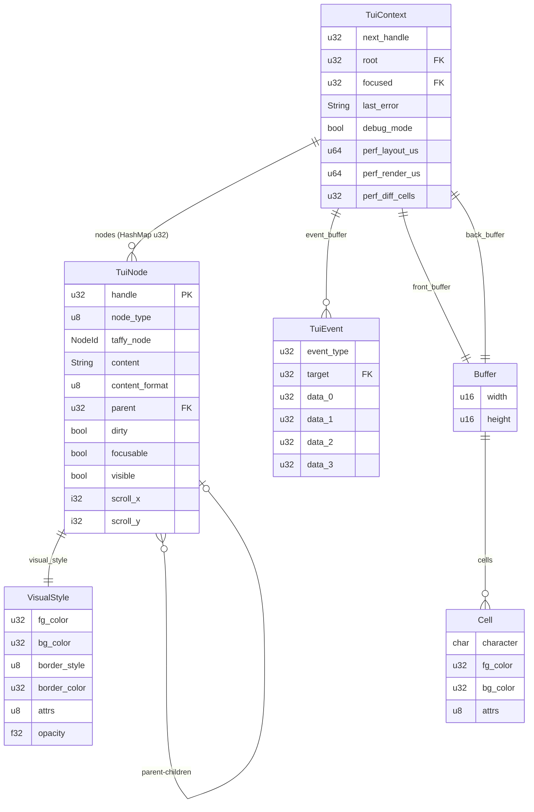

# Technical Specification (TechSpec.md)

## Kraken TUI

**Version**: 2.0
**Status**: Draft
**Date**: February 2026
**Source of Truth**: [Architecture.md](./Architecture.md) v2.0, [PRD.md](./PRD.md) v2.0

---

## 1. STACK SPECIFICATION (BILL OF MATERIALS)

### Native Core

| Component              | Choice         | Version       | Rationale                                                                                                                          |
| ---------------------- | -------------- | ------------- | ---------------------------------------------------------------------------------------------------------------------------------- |
| **Language**           | Rust           | Stable 1.93.x | Performance engine per Architecture invariant. All CPU-intensive work executes here.                                               |
| **Edition**            | 2021           | —             | Current stable edition.                                                                                                            |
| **Build Target**       | cdylib         | —             | Shared library for FFI consumption via `bun:ffi`.                                                                                  |
| **Layout Engine**      | Taffy          | 0.9.x         | Pure Rust Flexbox. ADR-002. Current stable release.                                                                                |
| **Terminal Backend**   | crossterm      | 0.29.x        | Cross-platform terminal I/O. ADR-005.                                                                                              |
| **Markdown Parser**    | pulldown-cmark | 0.13.x        | CommonMark-compliant pull parser. Lightweight, no allocations during iteration.                                                    |
| **Syntax Highlighter** | syntect        | 5.3.x         | Sublime Text grammar-based. Default feature set with `default-onig` disabled to reduce binary size (use `default-fancy` features). |
| **Bitflags**           | bitflags       | 2.x           | Cell attribute flag representation.                                                                                                |

### Host Language Bindings

| Component         | Choice     | Version            | Rationale                                                                                                                               |
| ----------------- | ---------- | ------------------ | --------------------------------------------------------------------------------------------------------------------------------------- |
| **Runtime**       | Bun        | ≥ 1.0 (dev: 1.3.8) | Target runtime per PRD Appendix B. Native FFI support.                                                                                  |
| **Language**      | TypeScript | 5.x (Bun built-in) | Type-safe host layer. No build step required — Bun runs TS directly.                                                                    |
| **FFI Mechanism** | bun:ffi    | Built-in           | Zero-dependency foreign function interface. `dlopen` + symbol binding. Custom struct handling (ADR-T06) — no external struct libraries. |

### Build Artifacts

| Artifact     | Format                         | Output                   |
| ------------ | ------------------------------ | ------------------------ |
| Native Core  | `libkraken_tui.{so,dylib,dll}` | `native/target/release/` |
| Host Package | TypeScript source              | `ts/src/`                |

### Dev Environment

| Tool         | Configuration | Purpose                                         |
| ------------ | ------------- | ----------------------------------------------- |
| devenv (Nix) | `devenv.nix`  | Reproducible environment with Rust stable + Bun |
| rustfmt      | Default       | Code formatting                                 |
| clippy       | Default       | Linting                                         |

---

## 2. ARCHITECTURE DECISION RECORDS

### ADR-T01: Event Drain Protocol — Repeated Single-Call

**Context:** Architecture mandates batch event delivery (events buffered in Native Core, drained by Host Layer each tick) but does not specify the physical transfer mechanism across FFI.

**Decision:** Repeated single-call pattern. `tui_read_input(timeout_ms)` captures terminal input and classifies events into an internal buffer. `tui_next_event(out)` returns one event at a time via a fixed-layout `#[repr(C)]` struct (24 bytes). The Host Layer drains in a `while` loop until the function returns 0.

**Consequences:**

- (+) Simple — no packed buffer serialization or shared memory protocol.
- (+) Fixed-size event struct — no dynamic allocation at the FFI boundary.
- (+) Natural backpressure — host controls drain rate.
- (-) O(n) FFI crossings per tick. At typical volumes (1–5 events per tick at 60fps), overhead is <1μs — negligible vs the 1ms budget.
- (migration) Can move to packed buffer return if profiling reveals a bottleneck.

### ADR-T02: Property Routing — Layout vs Visual Separation

**Context:** The spike conflates Taffy layout properties (`width`, `flex_direction`) with visual properties (`foreground`, `bold`) in a single enum and function set. This violates the Architecture's bounded context separation between Layout Module and Style Module.

**Decision:** Two distinct FFI surface families:

- `tui_set_layout_*()` — routes to Taffy via Layout Module. Properties: width, height, min/max, flex-direction, flex-wrap, justify-content, align-items, align-self, align-content, gap, padding, margin, position.
- `tui_set_style_*()` — routes to per-node `VisualStyle` storage via Style Module. Properties: foreground, background, border-style, border-color, bold, italic, underline, opacity.

Per **Robert C. Martin** (Single Responsibility Principle): layout concerns and visual concerns change for different reasons and should not be coupled through the same interface.

**Consequences:**

- (+) Clean bounded context alignment with Architecture.
- (+) Layout Module touches only Taffy; Style Module never touches Taffy.
- (+) Better error diagnostics (invalid layout prop vs invalid style prop).
- (-) Two function families instead of one. Slightly larger FFI surface.

### ADR-T03: FFI Safety — `catch_unwind` + Error Code Pattern

**Context:** Architecture Section 5.1 mandates no Rust panic may cross the FFI boundary. The spike has zero `catch_unwind` usage.

**Decision:** Every `extern "C"` function body is wrapped in `std::panic::catch_unwind(AssertUnwindSafe(|| { ... }))`. Panics convert to error code `-2`. All functions return `i32` status (0 = success, negative = error) except handle-returning functions (0 = invalid sentinel). Last error message is stored in context, retrievable via `tui_get_last_error()`.

**Mandatory pattern for every FFI entry point:**

```rust
#[no_mangle]
pub extern "C" fn tui_example(handle: u32) -> i32 {
    match std::panic::catch_unwind(std::panic::AssertUnwindSafe(|| {
        let ctx = context_mut()?;    // Get context or return error
        ctx.validate_handle(handle)?; // Validate inputs
        // ... delegate to module ...
        Ok(0)
    })) {
        Ok(Ok(code)) => code,
        Ok(Err(msg)) => { set_last_error(msg); -1 }
        Err(_) => { set_last_error("internal panic"); -2 }
    }
}
```

**Consequences:**

- (+) No undefined behavior from panics crossing FFI.
- (+) Consistent error reporting.
- (-) ~2ns overhead per call in the non-panic path (negligible).

### ADR-T04: Style Patching — Read-Modify-Write

**Context:** The spike creates `Style::DEFAULT`, sets one property, then calls `tree.set_style()` — overwriting all other Taffy properties on the node.

**Decision:** Layout property setters read the node's current Taffy `Style`, modify the targeted property, then write the full style back. Visual properties accumulate in a separate `VisualStyle` struct on the node. Neither operation overwrites unrelated properties.

**Consequences:**

- (+) Correct Flexbox behavior — setting width doesn't reset flex-direction.
- (+) Required for incremental property mutation.
- (-) One read per mutation (in-memory HashMap lookup — negligible).

### ADR-T05: Terminal Backend Trait Abstraction

**Context:** Architecture Risk 4 recommends an internal trait for terminal I/O to enable backend substitution and testing.

**Decision:** Define a `TerminalBackend` trait. The crossterm implementation is the sole concrete implementation in v0. Render Module and Event Module depend on the trait. Context stores `Box<dyn TerminalBackend>` (dynamic dispatch). Mock backend used in tests.

```rust
pub trait TerminalBackend {
    fn init(&mut self) -> Result<(), String>;
    fn shutdown(&mut self) -> Result<(), String>;
    fn size(&self) -> (u16, u16);
    fn write_diff(&mut self, diff: &[CellUpdate]) -> Result<(), String>;
    fn flush(&mut self) -> Result<(), String>;
    fn read_events(&mut self, timeout_ms: u32) -> Vec<TerminalInputEvent>;
}
```

**Consequences:**

- (+) Enables mock backend for automated testing of render output and event processing.
- (+) Enables future backend replacement without modifying module logic.
- (-) Dynamic dispatch overhead (~1ns per call) — irrelevant since terminal I/O itself costs microseconds.

### ADR-T06: FFI Struct Handling — Custom Minimal Implementation

**Context:** The TechStack specifies Bun as the host runtime with `bun:ffi` for FFI. The FFI boundary uses fixed-layout C structs (`TuiEvent` 24 bytes, `Cell` 12 bytes) that must be marshalled between Rust and TypeScript. A third-party library `bun-ffi-structs` (by SST) exists for this purpose.

**Investigation:** Analyzed `bun-ffi-structs` (v0.1.3) which provides type-safe struct definitions for Bun FFI:

- ✅ Supports primitives (u8, u32, f32, etc.), enums, nested structs, arrays
- ✅ Handles C alignment and little-endian encoding
- ✅ Used by OpenTUI (which powers OpenCode)
- ⚠️ **Critical:** Native integration tests use **Zig only** — no Rust verification
- ⚠️ **Critical:** Library maintained by SST for their Zig→TypeScript stack; design optimized for Zig ABI conventions
- ⚠️ Risk: If SST pivots or abandons, we inherit unmaintained dependency with different design goals

**Decision:** Do NOT use `bun-ffi-structs`. Implement a minimal custom `ffi/structs.ts` module (~50 lines) with exactly what we need:

- Fixed-size struct pack/unpack for `TuiEvent`, `Cell`, layout results
- Proper C alignment and little-endian encoding
- Manual bitflag handling for `CellAttrs`

**Rationale:**

1. **We need <5 structs** — Not a general-purpose need; trivial to hand-code
2. **Zero dependencies** — No external roadmap affects us
3. **Full control** — We own alignment, endianness, everything
4. **Rust-first integrity** — We're not dependent on a Zig-optimized library for our Rust core
5. **Risk mitigation** — If `bun:ffi` becomes untenable, NAPI-RS is the migration path; a custom struct layer is trivial to adapt

**Consequences:**

- (+) Complete control over FFI struct handling
- (+) No external dependency for this critical path
- (+) Rust-core-first philosophy preserved
- (-) Re-inventing ~50 lines of struct packing logic
- (-) No compile-time struct definition validation (manual bookkeeping required)

**Implementation Note:** The custom module shall be implemented in `ts/src/ffi/structs.ts` with tests verifying byte layout matches Rust `#[repr(C)]` structs exactly.

---

## 3. DATA MODEL

### 3.1 Entity Relationship



### 3.2 Enum Definitions

#### NodeType

```rust
#[repr(u8)]
pub enum NodeType {
    Box      = 0,
    Text     = 1,
    Input    = 2,
    Select   = 3,
    ScrollBox = 4,
}
```

#### Color Encoding (`u32`)

Colors are encoded as a tagged `u32` across the FFI boundary:

```
Bits 31-24: Mode tag
  0x00 = Default (terminal default, no override)
  0x01 = RGB truecolor (bits 23-0 = 0xRRGGBB)
  0x02 = Indexed (bits 7-0 = palette index 0-255)

Examples:
  0x00000000 = Default (inherit terminal color)
  0x01FF0000 = Red (RGB)
  0x0100FF00 = Green (RGB)
  0x01FFFFFF = White (RGB)
  0x02000001 = Red (ANSI index 1)
  0x0200000F = White (ANSI index 15)
  0x020000E8 = Grey (256-palette index 232)
```

**Edge cases:**

- **Invalid tag (0x03–0xFF):** Treated as `Default` (0x00). The Native Core does not error on invalid tags — it falls back gracefully.
- **Invalid RGB values:** Values > 255 in any component are clamped to 255.
- **Invalid ANSI index:** Indices > 255 are treated as `Default`.
- **Default inheritance:** When a node's color is `0x00` (Default), it inherits from the terminal's default. No explicit parent traversal occurs.

The Host Layer parses developer-friendly formats (`"#FF0000"`, `"red"`, `196`) into this encoding. The Native Core decodes into crossterm `Color` variants.

#### BorderStyle

```rust
#[repr(u8)]
pub enum BorderStyle {
    None    = 0,
    Single  = 1,
    Double  = 2,
    Rounded = 3,
    Bold    = 4,
}
```

#### CellAttrs (bitflags)

```rust
bitflags! {
    #[repr(transparent)]
    pub struct CellAttrs: u8 {
        const BOLD      = 0b0000_0001;
        const ITALIC    = 0b0000_0010;
        const UNDERLINE = 0b0000_0100;
    }
}
```

#### ContentFormat

```rust
#[repr(u8)]
pub enum ContentFormat {
    Plain    = 0,
    Markdown = 1,
    Code     = 2,
}
```

#### TuiEventType

```rust
#[repr(u32)]
pub enum TuiEventType {
    None        = 0,
    Key         = 1,
    Mouse       = 2,
    Resize      = 3,
    FocusChange = 4,
    Change      = 5,
    Submit      = 6,
}
```

### 3.3 Struct Definitions

#### VisualStyle

```rust
pub struct VisualStyle {
    pub fg_color: u32,          // Color encoding. 0x00 = default.
    pub bg_color: u32,          // Color encoding. 0x00 = default.
    pub border_style: BorderStyle,
    pub border_color: u32,      // Color encoding. 0x00 = default.
    pub attrs: CellAttrs,       // Bold, italic, underline bitflags.
    pub opacity: f32,           // 0.0–1.0. Default 1.0.
}

impl Default for VisualStyle {
    fn default() -> Self {
        Self {
            fg_color: 0, bg_color: 0,
            border_style: BorderStyle::None,
            border_color: 0,
            attrs: CellAttrs::empty(),
            opacity: 1.0,
        }
    }
}
```

#### TuiNode

```rust
pub struct TuiNode {
    pub node_type: NodeType,
    pub taffy_node: taffy::NodeId,
    pub content: String,
    pub content_format: ContentFormat,
    pub code_language: Option<String>,   // For ContentFormat::Code
    pub children: Vec<u32>,
    pub parent: Option<u32>,
    pub visual_style: VisualStyle,
    pub dirty: bool,
    pub focusable: bool,
    pub visible: bool,
    pub scroll_x: i32,
    pub scroll_y: i32,
}
```

**Storage strategy:** String fields (`content`, `code_language`) use Rust's `String` type with heap allocation. No string interning is used in v0 — each content mutation allocates a new string. This may be optimized in future versions based on profiling data.

#### TuiEvent (`#[repr(C)]`, 24 bytes)

```rust
#[repr(C)]
pub struct TuiEvent {
    pub event_type: u32,    // TuiEventType discriminant
    pub target: u32,        // Handle of relevant widget (0 = global)
    pub data: [u32; 4],     // Payload, interpretation depends on event_type
}
```

**Event payload layout:**

| Event Type      | `target`          | `data[0]`   | `data[1]`  | `data[2]`        | `data[3]` |
| --------------- | ----------------- | ----------- | ---------- | ---------------- | --------- |
| **Key**         | Focused handle    | key_code    | modifiers  | UTF-32 codepoint | —         |
| **Mouse**       | Hit-tested handle | x (column)  | y (row)    | button           | modifiers |
| **Resize**      | 0                 | new_width   | new_height | —                | —         |
| **FocusChange** | 0                 | from_handle | to_handle  | —                | —         |
| **Change**      | Target handle     | —           | —          | —                | —         |
| **Submit**      | Target handle     | —           | —          | —                | —         |

For **Change** and **Submit**: the host reads the new value via `tui_get_content(target)`. No string data in events.

**Key code ranges:**

| Range           | Meaning                |
| --------------- | ---------------------- |
| `0x0000–0x007F` | ASCII (direct mapping) |
| `0x0100`        | Backspace              |
| `0x0101`        | Enter                  |
| `0x0102`        | Left                   |
| `0x0103`        | Right                  |
| `0x0104`        | Up                     |
| `0x0105`        | Down                   |
| `0x0106`        | Home                   |
| `0x0107`        | End                    |
| `0x0108`        | PageUp                 |
| `0x0109`        | PageDown               |
| `0x010A`        | Tab                    |
| `0x010B`        | BackTab (Shift+Tab)    |
| `0x010C`        | Delete                 |
| `0x010D`        | Insert                 |
| `0x010E`        | Escape                 |
| `0x0110–0x011F` | F1–F16                 |

**Modifier flags (bitfield):**

| Bit    | Modifier |
| ------ | -------- |
| `0x01` | Shift    |
| `0x02` | Ctrl     |
| `0x04` | Alt      |
| `0x08` | Super    |

**Mouse button:**

| Value | Button     |
| ----- | ---------- |
| 0     | Left       |
| 1     | Middle     |
| 2     | Right      |
| 3     | ScrollUp   |
| 4     | ScrollDown |

#### Cell

```rust
pub struct Cell {
    pub ch: char,
    pub fg: u32,           // Color encoding
    pub bg: u32,           // Color encoding
    pub attrs: CellAttrs,
}

impl Default for Cell {
    fn default() -> Self {
        Self { ch: ' ', fg: 0, bg: 0, attrs: CellAttrs::empty() }
    }
}
```

#### Buffer

```rust
pub struct Buffer {
    pub width: u16,
    pub height: u16,
    pub cells: Vec<Cell>,
}
```

#### TerminalInputEvent (internal, not FFI)

```rust
pub enum TerminalInputEvent {
    Key { code: u32, modifiers: u32, character: char },
    Mouse { x: u16, y: u16, button: u8, modifiers: u32 },
    Resize { width: u16, height: u16 },
    FocusGained,
    FocusLost,
}
```

#### CellUpdate (internal, for backend trait)

```rust
pub struct CellUpdate {
    pub x: u16,
    pub y: u16,
    pub cell: Cell,
}
```

#### TuiContext

```rust
pub struct TuiContext {
    // Tree Module
    pub tree: TaffyTree<()>,
    pub nodes: HashMap<u32, TuiNode>,
    pub next_handle: u32,
    pub root: Option<u32>,

    // Event Module
    pub event_buffer: Vec<TuiEvent>,
    pub focused: Option<u32>,

    // Render Module
    pub front_buffer: Buffer,
    pub back_buffer: Buffer,
    pub backend: Box<dyn TerminalBackend>,

    // Text Module
    pub syntax_set: syntect::parsing::SyntaxSet,
    pub theme_set: syntect::highlighting::ThemeSet,

    // Diagnostics
    pub last_error: String,
    pub debug_mode: bool,
    pub perf_layout_us: u64,
    pub perf_render_us: u64,
    pub perf_diff_cells: u32,
}
```

---

## 4. FFI CONTRACT (C ABI)

### 4.1 Conventions

- **Prefix:** All functions are prefixed with `tui_`.
- **ABI:** `extern "C"`, `#[no_mangle]`.
- **Handles:** `u32`. `0` = invalid sentinel. Never allocated.
- **Strings in:** `(*const u8, u32)` — pointer + byte length. Rust copies. Caller frees after call.
- **Strings out:** Caller provides `(*mut u8, u32)` buffer. Rust copies into buffer.
- **Returns:** `i32` for status functions (0 = success). `u32` for handle functions (0 = error).
- **Errors:** `-1` = error (check `tui_get_last_error()`). `-2` = internal panic.
- **Safety:** Every entry point wrapped in `catch_unwind` per ADR-T03.

### 4.2 Lifecycle

| Function                | Signature                     | Returns  | Description                                                                    |
| ----------------------- | ----------------------------- | -------- | ------------------------------------------------------------------------------ |
| `tui_init`              | `() -> i32`                   | 0 / -1   | Initialize context, enter alternate screen, enable raw mode and mouse capture. |
| `tui_shutdown`          | `() -> i32`                   | 0 / -1   | Restore terminal state, destroy context, free all resources.                   |
| `tui_get_terminal_size` | `(*mut i32, *mut i32) -> i32` | 0 / -1   | Write current terminal width and height to provided pointers.                  |
| `tui_get_capabilities`  | `() -> u32`                   | Bitfield | Get terminal capabilities. See capability flags below.                         |

**Terminal capability flags** (bitfield returned by `tui_get_capabilities`):

| Bit | Capability         |
| --- | ------------------ |
| 0   | Truecolor (24-bit) |
| 1   | 256-color          |
| 2   | 16-color           |
| 3   | Mouse support      |
| 4   | UTF-8              |
| 5   | Alternate screen   |

### 4.3 Node Lifecycle

| Function             | Signature                         | Returns       | Description                                                                             |
| -------------------- | --------------------------------- | ------------- | --------------------------------------------------------------------------------------- |
| `tui_create_node`    | `(u8 node_type) -> u32`           | Handle / 0    | Create a node. `node_type`: see `NodeType` enum. Returns opaque handle.                 |
| `tui_destroy_node`   | `(u32 handle) -> i32`             | 0 / -1        | Destroy node. Detaches from parent. Orphans children (does not cascade).                |
| `tui_get_node_type`  | `(u32 handle) -> i32`             | NodeType / -1 | Returns node type as `i32` (cast of `NodeType` enum value).                             |
| `tui_set_visible`    | `(u32 handle, u8 visible) -> i32` | 0 / -1        | Set node visibility. `visible`: 0 = hidden, 1 = visible. Hidden nodes are not rendered. |
| `tui_get_visible`    | `(u32 handle) -> i32`             | 1 / 0 / -1    | Get node visibility. Returns 1 if visible, 0 if hidden, -1 on error.                    |
| `tui_get_node_count` | `() -> u32`                       | Count         | Get total number of nodes in the context.                                               |

### 4.4 Tree Structure

| Function              | Signature                        | Returns    | Description                                                                    |
| --------------------- | -------------------------------- | ---------- | ------------------------------------------------------------------------------ |
| `tui_set_root`        | `(u32 handle) -> i32`            | 0 / -1     | Designate a node as the composition tree root. Required before `tui_render()`. |
| `tui_append_child`    | `(u32 parent, u32 child) -> i32` | 0 / -1     | Add child to parent. Marks subtree dirty.                                      |
| `tui_remove_child`    | `(u32 parent, u32 child) -> i32` | 0 / -1     | Remove child from parent. Marks parent dirty.                                  |
| `tui_get_child_count` | `(u32 handle) -> i32`            | Count / -1 | Number of children.                                                            |
| `tui_get_child_at`    | `(u32 handle, u32 index) -> u32` | Handle / 0 | Child handle at index.                                                         |
| `tui_get_parent`      | `(u32 handle) -> u32`            | Handle / 0 | Parent handle. 0 if root or detached.                                          |

### 4.5 Content

| Function                 | Signature                                             | Returns            | Description                                                                                          |
| ------------------------ | ----------------------------------------------------- | ------------------ | ---------------------------------------------------------------------------------------------------- |
| `tui_set_content`        | `(u32 handle, *const u8 ptr, u32 len) -> i32`         | 0 / -1             | Set text content (UTF-8 encoded). Rust copies. Marks node dirty.                                     |
| `tui_get_content_len`    | `(u32 handle) -> i32`                                 | Byte length / -1   | Query content byte length (for pre-allocating buffer).                                               |
| `tui_get_content`        | `(u32 handle, *mut u8 buffer, u32 buffer_len) -> i32` | Bytes written / -1 | Copy content to caller-provided buffer. Null-terminated if space permits.                            |
| `tui_set_content_format` | `(u32 handle, u8 format) -> i32`                      | 0 / -1             | Set `ContentFormat`: 0=Plain, 1=Markdown, 2=Code. Marks dirty.                                       |
| `tui_set_code_language`  | `(u32 handle, *const u8 ptr, u32 len) -> i32`         | 0 / -1             | Set syntax highlighting language (e.g., `"rust"`, `"typescript"`). Only meaningful when format=Code. |
| `tui_get_code_language`  | `(u32 handle, *mut u8 buffer, u32 buffer_len) -> i32` | Bytes written / -1 | Get syntax highlighting language.                                                                    |

### 4.6 Widget Properties (Input/Select)

Widget-specific properties for Input and Select nodes.

| Function                  | Signature                                                        | Returns            | Description                                               |
| ------------------------- | ---------------------------------------------------------------- | ------------------ | --------------------------------------------------------- |
| **Input Widget**          |                                                                  |                    |                                                           |
| `tui_input_set_cursor`    | `(u32 handle, u32 position) -> i32`                              | 0 / -1             | Set cursor position within Input widget.                  |
| `tui_input_get_cursor`    | `(u32 handle) -> i32`                                            | Position / -1      | Get current cursor position.                              |
| `tui_input_set_max_len`   | `(u32 handle, u32 max_len) -> i32`                               | 0 / -1             | Set maximum character length for Input. 0 = unlimited.    |
| **Select Widget**         |                                                                  |                    |                                                           |
| `tui_select_add_option`   | `(u32 handle, *const u8 ptr, u32 len) -> i32`                    | 0 / -1             | Add an option to Select widget.                           |
| `tui_select_get_count`    | `(u32 handle) -> i32`                                            | Count / -1         | Get number of options in Select.                          |
| `tui_select_get_option`   | `(u32 handle, u32 index, *mut u8 buffer, u32 buffer_len) -> i32` | Bytes written / -1 | Get option text at index.                                 |
| `tui_select_set_selected` | `(u32 handle, u32 index) -> i32`                                 | 0 / -1             | Set selected option by index.                             |
| `tui_select_get_selected` | `(u32 handle) -> i32`                                            | Index / -1         | Get currently selected option index. -1 if none selected. |

### 4.7 Layout Properties

Layout properties are routed to Taffy via the Layout Module. They control spatial positioning and sizing.

| Function                   | Signature                                                                 | Returns | Description                                                    |
| -------------------------- | ------------------------------------------------------------------------- | ------- | -------------------------------------------------------------- |
| `tui_set_layout_dimension` | `(u32 handle, u32 prop, f32 value, u8 unit) -> i32`                       | 0 / -1  | Set a dimension property.                                      |
| `tui_set_layout_flex`      | `(u32 handle, u32 prop, u32 value) -> i32`                                | 0 / -1  | Set a flex enum property.                                      |
| `tui_set_layout_edges`     | `(u32 handle, u32 prop, f32 top, f32 right, f32 bottom, f32 left) -> i32` | 0 / -1  | Set a 4-sided property.                                        |
| `tui_set_layout_gap`       | `(u32 handle, f32 row_gap, f32 column_gap) -> i32`                        | 0 / -1  | Set row and column gap.                                        |
| `tui_get_layout`           | `(u32 handle, *mut i32 x, *mut i32 y, *mut i32 w, *mut i32 h) -> i32`     | 0 / -1  | Query computed position and size (valid after `tui_render()`). |

**Dimension properties** (`prop` for `tui_set_layout_dimension`):

| Value | Property   |
| ----- | ---------- |
| 0     | width      |
| 1     | height     |
| 2     | min_width  |
| 3     | min_height |
| 4     | max_width  |
| 5     | max_height |

**Dimension units** (`unit`):

| Value | Unit    | Notes                                      |
| ----- | ------- | ------------------------------------------ |
| 0     | Auto    | Taffy `auto()`                             |
| 1     | Length  | Terminal cells. Taffy `length(value)`.     |
| 2     | Percent | 0.0–100.0. Taffy `percent(value / 100.0)`. |

**Flex enum properties** (`prop` for `tui_set_layout_flex`):

| Prop | Property        | Values                                                                 |
| ---- | --------------- | ---------------------------------------------------------------------- |
| 0    | flex_direction  | 0=Row, 1=Column, 2=RowReverse, 3=ColumnReverse                         |
| 1    | flex_wrap       | 0=NoWrap, 1=Wrap, 2=WrapReverse                                        |
| 2    | justify_content | 0=Start, 1=End, 2=Center, 3=SpaceBetween, 4=SpaceAround, 5=SpaceEvenly |
| 3    | align_items     | 0=Stretch, 1=Start, 2=End, 3=Center, 4=Baseline                        |
| 4    | align_self      | 0=Auto, 1=Stretch, 2=Start, 3=End, 4=Center, 5=Baseline                |
| 5    | align_content   | 0=Start, 1=End, 2=Center, 3=SpaceBetween, 4=SpaceAround, 5=SpaceEvenly |
| 6    | position        | 0=Relative, 1=Absolute                                                 |

**Edge properties** (`prop` for `tui_set_layout_edges`):

| Value | Property |
| ----- | -------- |
| 0     | padding  |
| 1     | margin   |

### 4.8 Visual Style Properties

Visual properties are routed to the Style Module. They control appearance without affecting layout.

| Function                | Signature                                  | Returns | Description                                             |
| ----------------------- | ------------------------------------------ | ------- | ------------------------------------------------------- |
| `tui_set_style_color`   | `(u32 handle, u32 prop, u32 color) -> i32` | 0 / -1  | Set a color property. See Color Encoding (Section 3.2). |
| `tui_set_style_flag`    | `(u32 handle, u32 prop, u8 value) -> i32`  | 0 / -1  | Set a boolean text decoration. `value`: 0=off, 1=on.    |
| `tui_set_style_border`  | `(u32 handle, u8 border_style) -> i32`     | 0 / -1  | Set border style. See `BorderStyle` enum.               |
| `tui_set_style_opacity` | `(u32 handle, f32 opacity) -> i32`         | 0 / -1  | Set opacity (0.0–1.0).                                  |

**Color properties** (`prop` for `tui_set_style_color`):

| Value | Property     |
| ----- | ------------ |
| 0     | foreground   |
| 1     | background   |
| 2     | border_color |

**Flag properties** (`prop` for `tui_set_style_flag`):

| Value | Property  |
| ----- | --------- |
| 0     | bold      |
| 1     | italic    |
| 2     | underline |

### 4.9 Focus Management

| Function            | Signature                           | Returns    | Description                                                           |
| ------------------- | ----------------------------------- | ---------- | --------------------------------------------------------------------- |
| `tui_set_focusable` | `(u32 handle, u8 focusable) -> i32` | 0 / -1     | Set whether a node participates in focus traversal.                   |
| `tui_is_focusable`  | `(u32 handle) -> i32`               | 1 / 0 / -1 | Query if a node is focusable. Returns 1 if yes, 0 if no, -1 on error. |
| `tui_focus`         | `(u32 handle) -> i32`               | 0 / -1     | Set focus to a specific node. Generates FocusChange event.            |
| `tui_get_focused`   | `() -> u32`                         | Handle / 0 | Get currently focused node handle. 0 = nothing focused.               |
| `tui_focus_next`    | `() -> i32`                         | 0 / -1     | Advance focus to next focusable node (depth-first tree order).        |
| `tui_focus_prev`    | `() -> i32`                         | 0 / -1     | Move focus to previous focusable node.                                |

### 4.10 Scroll

| Function         | Signature                                     | Returns | Description                                        |
| ---------------- | --------------------------------------------- | ------- | -------------------------------------------------- |
| `tui_set_scroll` | `(u32 handle, i32 x, i32 y) -> i32`           | 0 / -1  | Set absolute scroll position for a ScrollBox node. |
| `tui_get_scroll` | `(u32 handle, *mut i32 x, *mut i32 y) -> i32` | 0 / -1  | Query current scroll position.                     |
| `tui_scroll_by`  | `(u32 handle, i32 dx, i32 dy) -> i32`         | 0 / -1  | Scroll by delta. Clamped to content bounds.        |

**ScrollBox Behavior:**

- **Overflow detection:** When content dimensions exceed the ScrollBox's computed layout dimensions, scrolling is enabled.
- **Scrollbar rendering:** The Native Core does not render scrollbars by default. The Host Layer may render them based on scroll position if desired.
- **Child wrapper:** The ScrollBox node expects a single child. The child's content is clipped to the ScrollBox's bounds during rendering.
- **Content size:** Determined by the computed size of the ScrollBox's child after layout. The scroll range is `(content_width - scrollbox_width, content_height - scrollbox_height)`.

### 4.11 Input & Rendering

| Function         | Signature                    | Returns          | Description                                                                                                                               |
| ---------------- | ---------------------------- | ---------------- | ----------------------------------------------------------------------------------------------------------------------------------------- |
| `tui_read_input` | `(u32 timeout_ms) -> i32`    | Event count / -1 | Read pending terminal input, classify into events, store in buffer. `timeout_ms`: 0 = non-blocking, >0 = wait up to N ms for first input. |
| `tui_next_event` | `(*mut TuiEvent out) -> i32` | 1 / 0 / -1       | Drain one event from the buffer. Returns 1 if event written, 0 if buffer empty.                                                           |
| `tui_render`     | `() -> i32`                  | 0 / -1           | Full render pipeline: layout resolution → dirty-flag diffing → terminal I/O. Requires root set via `tui_set_root()`.                      |
| `tui_mark_dirty` | `(u32 handle) -> i32`        | 0 / -1           | Mark a node dirty. Propagates to ancestors.                                                                                               |

### 4.12 Diagnostics

| Function               | Signature                 | Returns        | Description                                                                                  |
| ---------------------- | ------------------------- | -------------- | -------------------------------------------------------------------------------------------- |
| `tui_get_last_error`   | `() -> *const c_char`     | Pointer / null | Get last error message. Pointer is borrowed — valid until next error or `tui_clear_error()`. |
| `tui_clear_error`      | `() -> void`              | —              | Clear the error state.                                                                       |
| `tui_set_debug`        | `(u8 enabled) -> i32`     | 0 / -1         | Enable (1) or disable (0) debug logging to stderr.                                           |
| `tui_get_perf_counter` | `(u32 counter_id) -> u64` | Counter value  | Query a performance counter.                                                                 |
| `tui_free_string`      | `(*const u8 ptr) -> void` | —              | Free a string buffer previously returned by the Native Core.                                 |

**Performance counter IDs:**

| ID  | Counter                    | Unit   |
| --- | -------------------------- | ------ |
| 0   | Last layout duration       | μs     |
| 1   | Last render duration       | μs     |
| 2   | Last diff cell count       | cells  |
| 3   | Current event buffer depth | events |
| 4   | Total node count           | nodes  |
| 5   | Dirty node count           | nodes  |

### 4.13 Memory Management Rules

| Direction                      | Rule                                                                                                                                                                            |
| ------------------------------ | ------------------------------------------------------------------------------------------------------------------------------------------------------------------------------- |
| **TS → Rust (strings)**        | Caller provides `(pointer, length)`. Rust copies the data internally. Caller may free immediately after call returns.                                                           |
| **Rust → TS (get_content)**    | Caller provides `(buffer, buffer_length)`. Rust copies into caller's buffer. No Rust-side allocation for the caller.                                                            |
| **Rust → TS (allocated)**      | Strings that require explicit deallocation are returned with a pointer. Caller must call `tui_free_string()` to release the memory.                                             |
| **Rust → TS (get_last_error)** | Returns pointer to context-owned string. Valid until the next error occurs or `tui_clear_error()` is called. Caller must not free. Caller should copy if persistence is needed. |
| **Handles**                    | Owned by Rust. Valid from `tui_create_node()` until `tui_destroy_node()`. Handle `0` is permanently invalid and never allocated.                                                |
| **Context**                    | Created by `tui_init()`, destroyed by `tui_shutdown()`. All handles and state are invalidated on shutdown.                                                                      |

### 4.14 Error Codes

| Code | Meaning                                                                      |
| ---- | ---------------------------------------------------------------------------- |
| `0`  | Success                                                                      |
| `-1` | Error — check `tui_get_last_error()` for message                             |
| `-2` | Internal panic — caught by `catch_unwind`, should not occur in correct usage |

### 4.15 Complete FFI Symbol Count

**Total: 57 functions** (v0 scope)

- Lifecycle: 4
- Node: 6
- Tree: 6
- Content: 6
- Widget: 8
- Layout: 5
- Style: 4
- Focus: 6
- Scroll: 3
- Input/Render: 4
- Diagnostics: 5

---

## 5. IMPLEMENTATION GUIDELINES

### 5.1 Project Structure

````
kraken-tui/
├── native/                         # Rust cdylib
│   ├── Cargo.toml
│   └── src/
│       ├── lib.rs                  # extern "C" FFI entry points only
│       ├── context.rs              # TuiContext struct, global state accessor
│       ├── types.rs                # Shared types, enums, constants
│       ├── tree.rs                 # Tree Module
│       ├── layout.rs              # Layout Module (Taffy integration)
│       ├── style.rs               # Style Module (VisualStyle resolution)
│       ├── render.rs              # Render Module (double buffer, diff)
│       ├── event.rs               # Event Module (input, classification, focus)
│       ├── scroll.rs              # Scroll Module (viewport state)
│       ├── text.rs                # Text Module (Markdown, syntax highlighting)
│       └── terminal.rs            # TerminalBackend trait + CrosstermBackend
├── ts/                             # TypeScript host package
│   ├── package.json
│   └── src/
│       ├── index.ts               # Public API exports
│       ├── ffi.ts                 # Raw bun:ffi bindings (dlopen, symbols)
│       ├── ffi/
│       │   └── structs.ts         # Custom struct pack/unpack (ADR-T06)
│       ├── app.ts                 # Application lifecycle (init, loop, shutdown)
│       ├── widget.ts              # Base Widget class
│       ├── widgets/
│       │   ├── box.ts
│       │   ├── text.ts
│       │   ├── input.ts
│       │   ├── select.ts
│       │   └── scrollbox.ts
│       ├── events.ts              # Event types, drain loop, dispatch
│       ├── style.ts               # Color parsing, style helpers
│       └── errors.ts              # KrakenError, error code mapping
├── docs/                           # Documentation (existing)
├── devenv.nix                      # Dev environment config
└── README.md

### 5.2 Module → File Mapping

| Architecture Module | Rust File | Responsibility |
|---|---|---|
| Tree Module | `tree.rs` | Node CRUD, handle allocation (`next_handle++`), dirty flag set + propagation to ancestors, parent-child bookkeeping. |
| Layout Module | `layout.rs` | Wraps Taffy: translates `tui_set_layout_*` calls into Taffy `Style` mutations (read-modify-write per ADR-T04). `compute_layout()` delegates to `tree.compute_layout()`. Hit-testing: traverse computed rectangles back-to-front. |
| Style Module | `style.rs` | `VisualStyle` storage per node. `tui_set_style_*` setters mutate the node's `VisualStyle`. Color decoding from `u32` encoding to crossterm `Color`. v1: merge with Theme defaults. |
| Render Module | `render.rs` | Allocates front/back `Buffer`. Tree traversal: renders each visible node's content + borders + style into front buffer cells at computed layout positions. Diffs front vs back buffer. Sends `CellUpdate` list to backend. Swaps buffers. Clears dirty flags. |
| Event Module | `event.rs` | `read_input()`: calls `backend.read_events()`, classifies `TerminalInputEvent` → `TuiEvent` (mapping key codes, performing hit-testing for mouse events, managing focus state machine for Tab/BackTab). `next_event()`: drains from `event_buffer`. |
| Scroll Module | `scroll.rs` | Stores `(scroll_x, scroll_y)` per ScrollBox node. Clamps to content bounds. Render Module calls into Scroll Module to offset child positions and clip overflow during rendering. |
| Text Module | `text.rs` | Markdown: `pulldown_cmark::Parser` → iterate events → produce `Vec<StyledSpan>`. Code: `syntect` highlighter → produce `Vec<StyledSpan>`. `StyledSpan` = `{ text: &str, attrs: CellAttrs, fg: u32, bg: u32 }`. Render Module consumes spans. |
| Theme Module | *(v1)* | Not implemented in v0. Style Module resolves without theme defaults. |
| Animation Module | *(v1)* | Not implemented in v0. Render pipeline skips animation step. |
| — | `terminal.rs` | `TerminalBackend` trait definition. `CrosstermBackend`: `init()` enters alternate screen + raw mode + mouse capture. `shutdown()` restores. `size()` queries terminal. `write_diff()` emits crossterm commands. `read_events()` polls crossterm events. |
| — | `context.rs` | `TuiContext` struct. Global `static mut CONTEXT: Option<TuiContext>`. `context()` and `context_mut()` accessors that return `Result`. |
| — | `types.rs` | `NodeHandle` type alias, all enums (`NodeType`, `BorderStyle`, `CellAttrs`, `ContentFormat`, `TuiEventType`), `TuiEvent` struct, key code constants, modifier constants. |
| — | `lib.rs` | **Only** `extern "C"` functions. Each function: `catch_unwind` → `context_mut()` → validate → delegate to module function → return status code. Zero logic beyond dispatch. |

### 5.3 Coding Standards

**Rust:**

- `lib.rs` contains **only** `extern "C"` FFI entry points. No business logic. Each function delegates to a module function.
- Every `extern "C"` function is wrapped in `catch_unwind` per ADR-T03.
- No `println!` in production code. Debug output uses `eprintln!` gated behind `ctx.debug_mode`.
- Handle validation happens at the FFI boundary (in `lib.rs`), not repeated in internal modules.
- Internal module functions accept `&mut TuiContext` — no global state access inside modules.
- Module visibility: `pub(crate)` for module-internal functions. Only `lib.rs` is `pub`.
- No `unwrap()` in production code. Use `?` with `Result` or explicit match.
- **ADR-T04 compliance:** Layout and style setters must read the existing state, modify only the targeted property, then write back. Never create fresh `Style::DEFAULT` — this overwrites unrelated properties.
- Format: `rustfmt` (default config). Lint: `clippy` (default config).

**TypeScript:**

- Zero business logic. Only FFI dispatch and ergonomic wrapping.
- `strict: true` TypeScript.
- No runtime dependencies beyond `bun:ffi` (built-in). Custom struct handling in `ffi/structs.ts` (per ADR-T06).
- Widget classes hold a `handle: number` and call FFI functions through the bindings in `ffi.ts` and `ffi/structs.ts`.
- Color parsing (`"#FF0000"` → `0x01FF0000`, `"red"` → `0x02000001`) happens in TypeScript (`style.ts`).
- Developer-assigned IDs: `ts/src/app.ts` maintains an `id → handle` `Map<string, number>`. The Native Core never sees string IDs.

### 5.4 Build Pipeline

```bash
# Build native core (release, optimized)
cargo build --release --manifest-path native/Cargo.toml
# Output: native/target/release/libkraken_tui.{so,dylib,dll}

# Run Rust unit tests
cargo test --manifest-path native/Cargo.toml

# Run TypeScript tests (loads cdylib, exercises FFI + host API)
cd ts && bun test
````

**Cargo.toml (native):**

```toml
[package]
name = "kraken_tui"
version = "0.1.0"
edition = "2021"

[lib]
crate-type = ["cdylib"]

[dependencies]
taffy = "0.9"
crossterm = "0.29"
pulldown-cmark = "0.13"
syntect = { version = "5.3", default-features = false, features = ["default-syntaxes", "default-themes", "regex-fancy"] }
bitflags = "2"
```

### 5.5 Testing Strategy

| Layer                | Tool                        | What It Tests                                                                                                                                                                            |
| -------------------- | --------------------------- | ---------------------------------------------------------------------------------------------------------------------------------------------------------------------------------------- |
| **Rust unit**        | `cargo test`                | Each module in isolation. Tree operations, dirty propagation, style patching, buffer diffing, event classification, key code mapping, color encoding/decoding, Markdown span generation. |
| **Rust integration** | `cargo test` (`tests/` dir) | Full pipeline with `MockBackend`. Create nodes → set properties → render → assert buffer contents. Event injection → assert event buffer output.                                         |
| **FFI integration**  | `bun test`                  | Load `libkraken_tui.so` via `dlopen`. Call every FFI function. Assert return values, handle validity, layout results, event drain.                                                       |
| **TypeScript unit**  | `bun test`                  | Widget API, color parsing, error class, ID map.                                                                                                                                          |
| **Visual smoke**     | Manual                      | Run example applications. Visually verify rendering, input, focus traversal, scrolling.                                                                                                  |

### 5.6 Host Application Loop Pattern

The canonical event loop for a Kraken TUI application:

```typescript
import { Kraken, Box, Text } from "kraken-tui";

const app = Kraken.init();

const root = new Box({
	width: "100%",
	height: "100%",
	flexDirection: "column",
});
const label = new Text({
	content: "Hello, Kraken!",
	color: "#00FF00",
	bold: true,
});
root.append(label);
app.setRoot(root);

let running = true;
while (running) {
	app.readInput(16); // Capture terminal input (16ms timeout ≈ 60fps pacing)

	for (const event of app.drainEvents()) {
		if (event.type === "key" && event.keyCode === 0x010e) {
			// Escape
			running = false;
		}
	}

	app.render(); // Layout → diff → terminal I/O
}

app.shutdown();
```

**FFI call sequence:**

```
tui_init()
tui_create_node(0)              → handle 1 (Box)
tui_create_node(1)              → handle 2 (Text)
tui_set_content(2, "Hello, Kraken!", 14)
tui_set_style_color(2, 0, 0x0100FF00)   // fg = green RGB
tui_set_style_flag(2, 0, 1)             // bold = on
tui_set_layout_dimension(1, 0, 100.0, 2) // width = 100%
tui_set_layout_dimension(1, 1, 100.0, 2) // height = 100%
tui_set_layout_flex(1, 0, 1)             // flex_direction = column
tui_append_child(1, 2)
tui_set_root(1)

loop:
  tui_read_input(16)
  while tui_next_event(&event) == 1:
    // handle event
  tui_render()

tui_shutdown()
```

---

## Appendix A: v1 Extension Points

The v0 implementation structure is designed to accommodate v1 additions (Animation, Theming) without architectural change:

| v1 Module            | File                      | Integration Point                                                                                                                                                                                                                                                                          |
| -------------------- | ------------------------- | ------------------------------------------------------------------------------------------------------------------------------------------------------------------------------------------------------------------------------------------------------------------------------------------ |
| **Theme Module**     | `native/src/theme.rs`     | Style Module gains a `resolve_with_theme(node, theme_bindings) → VisualStyle` path. New FFI functions: `tui_create_theme()`, `tui_set_theme_default()`, `tui_apply_theme()`, `tui_switch_theme()`. TuiContext gains `themes: HashMap<u32, Theme>` and `theme_bindings: HashMap<u32, u32>`. |
| **Animation Module** | `native/src/animation.rs` | Render pipeline gains animation advancement step before layout resolution. New FFI: `tui_animate()`, `tui_cancel_animation()`. TuiContext gains `animations: Vec<Animation>` and `last_render_time: Instant`.                                                                              |

## Appendix B: Upstream Consistency

| Document        | Version         | Constraints Honored                                                                                                                                                                                                                                                                                   |
| --------------- | --------------- | ----------------------------------------------------------------------------------------------------------------------------------------------------------------------------------------------------------------------------------------------------------------------------------------------------- |
| PRD.md          | v2.0 (Approved) | v0 scope (Epics 1–7). 5 widget types. Performance targets: <20MB, <50ms input latency, <16ms render budget, <1ms FFI overhead.                                                                                                                                                                        |
| Architecture.md | v2.0 (Draft)    | Modular Monolith with Cross-Language Facade. FFI boundary contract (5 invariants: unidirectional flow, single source of truth, copy semantics, error codes, no interior pointers). Buffer-poll event model. Batched-synchronous render pipeline. 9 internal modules (Theme & Animation marked as v1). |
| ADR-001         | Accepted        | Retained-mode scene graph with dirty-flag diffing. Double-buffered cell grid.                                                                                                                                                                                                                         |
| ADR-002         | Accepted        | Taffy 0.9.x for Flexbox layout.                                                                                                                                                                                                                                                                       |
| ADR-003         | Accepted        | Opaque `u32` handles. `HashMap<u32, TuiNode>`. Handle(0) invalid. Sequential allocation. Rust-owned state.                                                                                                                                                                                            |
| ADR-004         | Accepted        | Imperative command API (v0/v1). Reactive reconciler deferred to v2.                                                                                                                                                                                                                                   |
| ADR-005         | Accepted        | crossterm 0.29.x. Behind `TerminalBackend` trait per Risk 4 mitigation.                                                                                                                                                                                                                               |
| ADR-T06         | Accepted        | Custom minimal FFI struct handling (no external libraries).                                                                                                                                                                                                                                           |
