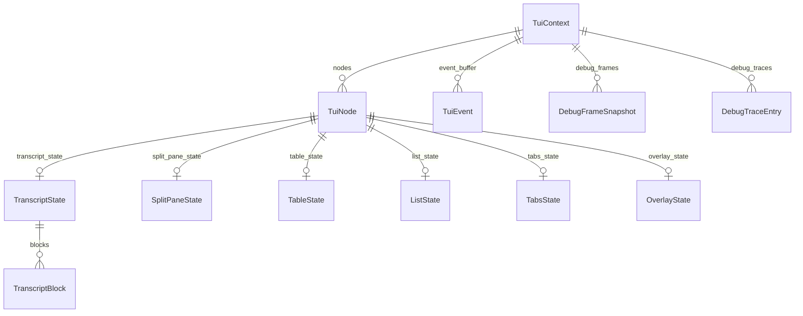

# Technical Specification

## 0. Version History & Changelog
- v7.0.0 - Converted the prior forward-looking delta spec into the canonical brownfield implementation contract and reconciled transcript, devtools, split-pane, and flagship-example scope with the current source tree.
- v6.0.0 - Reoriented the next planned phase around transcript-first UX, developer tooling, minimal native expansion, and flagship examples for developer and agent workflows.
- v5.0.0 - Preserved the completed v3 planning wave in git history prior to the v4 focus reset.
- ... [Older history truncated, refer to git logs]

## 1. Stack Specification (Bill of Materials)
- **Primary Language / Runtime:** Rust 2021 for the Native Core, TypeScript 5.x for the Host Layer, and Bun 1.3.x as the primary runtime for host execution and FFI loading.
- **Primary Frameworks / Libraries:** Taffy for layout, Crossterm for terminal I/O, pulldown-cmark and syntect for rich text, and `@preact/signals-core` for the optional JSX reconciler layer.
- **State Stores / Persistence:** All runtime UI state lives in the Native Core in memory. There is no external database or persisted state store in the canonical product contract.
- **Infrastructure / Tooling:** Cargo, Bun, GitHub Actions CI, GitHub release artifacts with checksum sidecars, Criterion benchmarks, headless terminal backend, replay fixtures, and golden snapshot utilities.
- **Testing / Quality Tooling:** `cargo test`, `cargo fmt`, `cargo clippy`, native benchmarks, Bun integration tests, example replay tests, install smoke tests, runner API tests, and bundle-budget checks.
- **Version Pinning / Compatibility Policy:** Kraken is still pre-1.0 (`0.1.0` in both native and host packages), so breaking changes remain possible. Even so, additive evolution is preferred for the C ABI and host wrappers, and any incompatible change to the public surface must be documented explicitly in this file before task planning.

### 1.1 Native Core Bill of Materials

| Component | Choice | Verified Source State | Decision |
| --- | --- | --- | --- |
| Language | Rust | `edition = "2021"` | Keep the Native Core as the sole owner of mutable UI state and compute-heavy workflows. |
| Layout engine | Taffy | `0.9` | Keep the current layout model and extend through the existing constraint engine rather than introducing a parallel layout path. |
| Terminal backend | Crossterm | `0.29` | Keep terminal I/O and capability handling behind the existing backend abstraction. |
| Rich text parser | pulldown-cmark | `0.13` | Keep Markdown parsing native-side for transcript and code-heavy interfaces. |
| Syntax highlighting | syntect | `5.3` | Keep native syntax highlighting for code and diff viewing surfaces. |
| Text measurement | unicode-width + unicode-segmentation | `0.2` and `1.12` | Keep native text width and grapheme handling for cursor, wrap, and viewport correctness. |
| Serialization | serde + serde_json | `1.0` | Use JSON copy-out for debug snapshots and trace payloads. |

### 1.2 Host Layer Bill of Materials

| Component | Choice | Verified Source State | Decision |
| --- | --- | --- | --- |
| Runtime | Bun | `1.3.8` verified locally | Keep Bun as the default runtime and FFI host. |
| Language | TypeScript | `^5.0.0` | Keep strict typed wrappers and examples in TypeScript. |
| FFI mechanism | `bun:ffi` | built-in | Preserve the direct native-library loading path rather than adding an alternate bridge. |
| Reactivity | `@preact/signals-core` | `^1.8.0` | Preserve the lightweight JSX/signals path without promoting it to the primary lifecycle model. |
| Additional runtime deps | none beyond signals | current package state | Keep the host bundle intentionally thin. |

### 1.3 Build, Test, and Release Artifacts

| Artifact | Format | Source of Truth |
| --- | --- | --- |
| Native Core | Shared library (`.so`, `.dylib`, `.dll`) | `native/target/release/` for source builds; versioned GitHub release assets for published native binaries |
| Host Package | ESM TypeScript package | `ts/package.json`, `ts/src/` |
| Release Artifacts | Versioned platform builds with `.sha256` sidecars | `.github/workflows/release.yml` |
| Flagship Examples | Bun entrypoints | `examples/agent-console.ts`, `examples/ops-log-console.ts`, `examples/repo-inspector.ts` |
| Replay Fixtures | JSON fixtures and headless assertions | `examples/fixtures/`, `ts/test-examples.test.ts` |

### 1.4 Release and Distribution Matrix

| Platform | Architecture | Published release asset | Resolver target when a prebuild is staged locally |
| --- | --- | --- | --- |
| Linux | x64 | `kraken-tui-<tag>-linux-x64.so` | `ts/prebuilds/linux-x64/<libName>` |
| Linux | arm64 | `kraken-tui-<tag>-linux-arm64.so` | `ts/prebuilds/linux-arm64/<libName>` |
| macOS | arm64 | `kraken-tui-<tag>-darwin-arm64.dylib` | `ts/prebuilds/darwin-arm64/<libName>` |
| macOS | x64 | `kraken-tui-<tag>-darwin-x64.dylib` | `ts/prebuilds/darwin-x64/<libName>` |
| Windows | x64 | `kraken-tui-<tag>-win32-x64.dll` | `ts/prebuilds/win32-x64/<libName>` |

The repo-owned release workflow currently publishes **versioned GitHub release assets** with SHA-256 sidecars. It does **not** populate `ts/prebuilds/` in-tree on its own. The resolver still supports `ts/prebuilds/...` as the expected layout for packaged or manually staged prebuilds after those published assets have been downloaded and renamed to the platform-specific `libName`.

## 2. Architecture Decision Records (ADRs)
### 2.1 Active Inherited Decisions

| ADR | Status | Retained decision | Consequences |
| --- | --- | --- | --- |
| **ADR-T16** | accepted | Safe global state via `OnceLock<RwLock<...>>` at the FFI boundary | Alias safety is enforced without changing the default synchronous execution model. |
| **ADR-T20** | accepted | The JSX reconciler wraps the imperative command protocol rather than replacing it | Declarative usage remains an overlay on top of the same host/native contract. |
| **ADR-T23** | accepted | Accessibility foundations live on `TuiNode` as optional role, label, and description metadata | Foundational accessibility remains available without redefining the render pipeline. |
| **ADR-T24** | accepted | Writer compaction and cursor/style delta minimization are first-class parts of the render path | High-frequency transcript and dashboard workloads depend on efficient terminal emission. |
| **ADR-T25** | accepted | Rich text and wrap results are cached in a bounded native LRU | Stable content avoids repeated parse and wrap work inside the Native Core. |
| **ADR-T26** | accepted | `app.run()` and `app.stop()` remain host-owned loop constructs | Loop policy stays explicit and host-driven. |
| **ADR-T29** | accepted | Prebuilt artifact matrix plus source-build fallback are part of the install contract | Distribution UX is treated as implementation contract, not post-hoc packaging polish. |
| **ADR-T30** | accepted | Goldens and benchmark gates are required for writer-, cache-, and replay-sensitive changes | Performance and rendering regressions must be caught systematically. |
| **ADR-T31** | accepted | Background rendering remains experimental and opt-in | The canonical contract stays synchronous until semantic parity is proven. |

### ADR-T32 TranscriptView Is a First-Class Native Workload
- **Status:** accepted
- **Context:** `ScrollBox` plus `Text` was sufficient for simple overflow, but it could not model stable logical block identity, streaming patch paths, unread anchors, collapse state, or low-churn transcript updates for developer and agent workflows.
- **Decision:** Introduce `NodeType::Transcript`, keep transcript content as ordered logical `TranscriptBlock` records keyed by host-owned `u64` block IDs, and expose transcript-focused mutation and viewport commands through the native ABI and thin host wrappers.
- **Consequences:** Transcript-heavy apps can stream and patch content without host-side tree explosion, but the transcript surface becomes a distinct native state model with its own invariants. Middle-of-history arbitrary deletion remains outside the current contract.

### ADR-T33 Anchor-Based Viewport Semantics Override Raw Scroll Position
- **Status:** accepted
- **Context:** Raw row offsets drift under streaming inserts, collapse toggles, and pane resize. Transcript and log workflows need deterministic sticky-bottom behavior and predictable detached reading.
- **Decision:** Track transcript follow behavior through `FollowMode`, logical anchor semantics, unread anchors, and explicit jump commands rather than raw row offsets as the primary contract.
- **Consequences:** Operators can remain detached from the tail without losing context, but transcript state must track viewport height and width, unread state, and anchor mode carefully. Replay fixtures and example tests become essential to prevent subtle regressions.

### ADR-T34 Dev Mode Is Core Product Work
- **Status:** accepted
- **Context:** Long-lived complex terminal applications are difficult to debug without inspecting layout, focus, dirty propagation, viewport state, and render cost. Generic stderr logging is not enough.
- **Decision:** Add native debug snapshot and trace APIs, bounded per-kind trace rings, overlay rendering, host-side inspector and HUD surfaces, and deterministic dev-session helpers.
- **Consequences:** The implementation gains a stable diagnostics surface that examples and developers can rely on, but debug JSON contracts, overlay flags, and overhead budgets become part of the maintained public surface.

### ADR-T35 Minimal Native Expansion, Not Generic Widget Inflation
- **Status:** accepted
- **Context:** Dense application layouts required better pane behavior, but the product did not need a broad new wave of native widgets to prove its identity.
- **Decision:** Add `SplitPane` as the only new native layout primitive in this wave and keep `CommandPalette`, `TracePanel`, `StructuredLogView`, `CodeView`, and `DiffView` as host composites over existing primitives unless measured pressure justifies native promotion later.
- **Consequences:** The native surface stays focused and smaller, but the host layer must maintain disciplined composite abstractions and preserve the invariant that Rust still owns the performance-critical state.

### ADR-T36 Flagship Examples Are Blocking Release Gates
- **Status:** accepted
- **Context:** Feature breadth alone does not prove product identity. Kraken needs example-driven proof under transcript, pane, and debugging pressure.
- **Decision:** Treat `agent-console` and `ops-log-console` as blocking proof examples for the transcript/devtools wave, and keep `repo-inspector` within the same flagship family once the underlying primitives are stable.
- **Consequences:** Example behavior now constrains implementation choices. Replay fixtures, performance budgets, and example usability are part of release-readiness, not optional showcase material.

### 2.2 Brownfield Reality Note
- The prior v6 TechSpec described transcript, devtools, split-pane, and flagship examples as future work. The current source tree implements them.
- This v7 artifact is therefore intentionally present-tense and canonical rather than future-tense and phase-only.

## 3. State & Data Modeling
### 3.1 Native UI State Model
- **Purpose:** Represent the entire live terminal UI, event buffer, render buffers, theming state, animation registry, transcript workloads, pane state, and diagnostics inside one native authority.
- **Storage Shape:** In-memory `TuiContext` with `HashMap<u32, TuiNode>` ownership for Widget state, explicit event and diagnostics buffers, native render buffers, and per-widget optional state attachments.
- **Constraints / Invariants:**
  - `Handle(0)` is permanently invalid.
  - The Host Layer owns developer-facing string IDs; the Native Core owns `u32` Handles and transcript `u64` block bookkeeping.
  - Transcript state is attached only to `NodeType::Transcript`; split pane state is attached only to `NodeType::SplitPane`.
  - Debug traces are retained in bounded per-kind rings.
  - Widget state is not persisted across process lifetime.
- **Indexes / Access Paths:**
  - `nodes: HashMap<u32, TuiNode>` keyed by Handle
  - `blocks: Vec<TranscriptBlock>` plus `block_index: HashMap<u64, usize>` keyed by transcript block ID
  - `theme_bindings: HashMap<u32, u32>` keyed by node Handle
  - `event_buffer: Vec<TuiEvent>` as ordered buffered events
  - `debug_traces: [VecDeque<DebugTraceEntry>; 4]` indexed by trace kind
- **Migration Notes:** There is no persisted schema migration layer. Compatibility work is about ABI and wrapper evolution rather than stored data migration.


```mermaid
erDiagram
    TuiContext ||--o{ TuiNode : nodes
    TuiContext ||--o{ TuiEvent : event_buffer
    TuiContext ||--o{ DebugFrameSnapshot : debug_frames
    TuiContext ||--o{ DebugTraceEntry : debug_traces
    TuiNode ||--o| TranscriptState : transcript_state
    TuiNode ||--o| SplitPaneState : split_pane_state
    TuiNode ||--o| TableState : table_state
    TuiNode ||--o| ListState : list_state
    TuiNode ||--o| TabsState : tabs_state
    TuiNode ||--o| OverlayState : overlay_state
    TranscriptState ||--o{ TranscriptBlock : blocks
```

### 3.2 Key Enums
#### NodeType
```rust
#[repr(u8)]
pub enum NodeType {
    Box = 0,
    Text = 1,
    Input = 2,
    Select = 3,
    ScrollBox = 4,
    TextArea = 5,
    Table = 6,
    List = 7,
    Tabs = 8,
    Overlay = 9,
    Transcript = 10,
    SplitPane = 11,
}
```

#### TranscriptBlockKind
```rust
#[repr(u8)]
pub enum TranscriptBlockKind {
    Message = 0,
    ToolCall = 1,
    ToolResult = 2,
    Reasoning = 3,
    Activity = 4,
    Divider = 5,
}
```

#### FollowMode and ViewportAnchorKind
```rust
#[repr(u8)]
pub enum FollowMode {
    Manual = 0,
    TailLocked = 1,
    TailWhileNearBottom = 2,
}

#[repr(u8)]
pub enum ViewportAnchorKind {
    Tail = 0,
    BlockStart = 1,
    FocusedBlock = 2,
}
```

#### SplitAxis
```rust
#[repr(u8)]
pub enum SplitAxis {
    Horizontal = 0,
    Vertical = 1,
}
```

### 3.3 Key Struct Excerpts
#### TranscriptBlock and TranscriptState
```rust
pub struct TranscriptBlock {
    pub id: u64,
    pub kind: TranscriptBlockKind,
    pub parent_id: Option<u64>,
    pub role: u8,
    pub content: String,
    pub content_format: ContentFormat,
    pub code_language: Option<String>,
    pub streaming: bool,
    pub collapsed: bool,
    pub hidden: bool,
    pub unread: bool,
    pub rendered_rows: u32,
    pub version: u64,
}

pub struct TranscriptState {
    pub blocks: Vec<TranscriptBlock>,
    pub block_index: HashMap<u64, usize>,
    pub follow_mode: FollowMode,
    pub anchor_kind: ViewportAnchorKind,
    pub unread_anchor: Option<u64>,
    pub unread_count: u32,
    pub sticky_threshold_rows: u32,
    pub tail_attached: bool,
    pub viewport_rows: u32,
    pub viewport_width: u32,
    pub role_colors: [u32; 5],
}
```

#### SplitPaneState
```rust
pub struct SplitPaneState {
    pub axis: SplitAxis,
    pub primary_ratio_permille: u16,
    pub min_primary: u16,
    pub min_secondary: u16,
    pub resize_step: u16,
    pub resizable: bool,
}
```

#### DebugTraceEntry and DebugFrameSnapshot
```rust
pub struct DebugTraceEntry {
    pub seq: u64,
    pub kind: u8,
    pub target: u32,
    pub detail: String,
}

pub struct DebugFrameSnapshot {
    pub frame_id: u64,
    pub focused: u32,
    pub dirty_nodes: u32,
    pub diff_cells: u32,
    pub write_runs: u32,
    pub transcript_blocks: u32,
    pub transcript_unread: u32,
    pub tail_attached: bool,
}
```

#### TuiNode and TuiContext Additions Relevant to v3-v4 Scope
```rust
pub struct TuiNode {
    pub role: Option<AccessibilityRole>,
    pub label: Option<String>,
    pub description: Option<String>,
    pub table_state: Option<TableState>,
    pub list_state: Option<ListState>,
    pub tabs_state: Option<TabsState>,
    pub overlay_state: Option<OverlayState>,
    pub transcript_state: Option<TranscriptState>,
    pub split_pane_state: Option<SplitPaneState>,
}

pub struct TuiContext {
    pub next_handle: u32,
    pub root: Option<u32>,
    pub event_buffer: Vec<TuiEvent>,
    pub themes: HashMap<u32, Theme>,
    pub theme_bindings: HashMap<u32, u32>,
    pub debug_overlay_flags: u32,
    pub debug_trace_flags: u32,
    pub debug_traces: [VecDeque<DebugTraceEntry>; 4],
    pub debug_frames: VecDeque<DebugFrameSnapshot>,
    pub next_debug_seq: u64,
    pub frame_seq: u64,
}
```

## 4. Interface Contract
### 4.1 Native C ABI
- **Style:** Library API / C ABI
- **Authentication / Authorization:** Not applicable
- **Compatibility Strategy:** New surfaces are added additively. Existing symbols remain valid unless explicitly deprecated and migrated. The host treats `u32` Handles as opaque, uses caller-owned buffers for copy-out operations, and reserves `Handle(0)` as the invalid sentinel.
- **Error model:** `0` for success, `-1` for explicit error with `tui_get_last_error()`, `-2` for panic caught at the boundary.

```yaml
conventions:
  prefix: tui_
  abi: extern "C"
  handles:
    type: u32
    invalid_sentinel: 0
  transcript_block_ids:
    type: u64
    ownership: host-layer scoped per transcript
  string_in: "(ptr,len) copied by Rust"
  string_out: "caller-owned buffer copy-out"
  panic_safety: "all public entry points wrapped at the boundary"
  event_delivery: "ingest first, drain explicitly later"
```

#### Native Surface Additions Preserved in the Current Contract

| Surface | Functions | Notes |
| --- | --- | --- |
| **Transcript** | `tui_transcript_clear`, `append_block`, `patch_block`, `finish_block`, `set_parent`, `set_collapsed`, `set_hidden`, `jump_to_block`, `jump_to_unread`, `set_follow_mode`, `get_follow_mode`, `set_role_color`, `mark_read`, `get_unread_count` | Block-oriented transcript mutation and viewport control |
| **SplitPane** | `tui_splitpane_set_axis`, `set_ratio`, `get_ratio`, `set_min_sizes`, `set_resize_step`, `set_resizable` | Native pane layout and resize behavior |
| **Debug / Devtools** | `tui_debug_set_overlay`, `set_trace_flags`, `get_snapshot_len`, `get_snapshot`, `get_trace_len`, `get_trace`, `clear_traces` | Copy-out diagnostics surface and overlay control |

#### Event and Counter Notes
- `Change` events are emitted for `SplitPane` ratio updates.
- Transcript viewport changes are primarily exposed through debug snapshots and traces rather than a dedicated transcript change event.
- Diagnostics counters include transcript block count, visible row count, unread count, trace depth, and tail-attached state in addition to the older render and text counters.

### 4.2 Host Language Library API
- **Style:** Library API
- **Authentication / Authorization:** Not applicable
- **Compatibility Strategy:** The host layer remains a thin wrapper over the C ABI plus a small set of higher-level composites. Developer-facing string IDs are resolved in the host layer and are not part of the native ABI.
- **Error model:** FFI failures surface as host-language errors through `checkResult()` and `KrakenError`.

```ts
class TranscriptView extends Widget {
  clear(): void;
  appendBlock(input: {
    id: string | bigint | number;
    kind: "message" | "toolCall" | "toolResult" | "reasoning" | "activity" | "divider";
    role: "system" | "user" | "assistant" | "tool" | "reasoning";
    content?: string;
  }): void;
  patchBlock(
    id: string | bigint | number,
    patch: { mode: "append" | "replace"; content: string },
  ): void;
  finishBlock(id: string | bigint | number): void;
  setParent(id: string | bigint | number, parentId: string | bigint | number): void;
  setCollapsed(id: string | bigint | number, collapsed: boolean): void;
  setHidden(id: string | bigint | number, hidden: boolean): void;
  jumpToBlock(id: string | bigint | number, align?: "top" | "center" | "bottom"): void;
  jumpToUnread(): void;
  setFollowMode(mode: "manual" | "tailLocked" | "tailWhileNearBottom"): void;
  getFollowMode(): "manual" | "tailLocked" | "tailWhileNearBottom";
  setRoleColor(role: "system" | "user" | "assistant" | "tool" | "reasoning", color: string | number): void;
  markRead(): void;
  getUnreadCount(): number;
}
```

```ts
interface DevSessionOptions {
  createApp: () => Promise<{ app: Kraken; root: Widget }>;
  overlay?: Array<"bounds" | "focus" | "dirty" | "anchors" | "perf">;
  traceSignals?: boolean;
  watch?: string[];
}

function createDevSession(options: DevSessionOptions): Promise<void>;
```

### 4.3 Install / Resolver Contract
- **Style:** Runtime artifact-resolution contract
- **Authentication / Authorization:** Not applicable
- **Compatibility Strategy:** Resolver search order is deterministic and platform-aware so both prebuilt and source-built workflows remain valid.
- **Error model:** Missing-artifact failures include searched paths and platform-specific remediation guidance.

```yaml
resolver_search_order:
  - KRAKEN_LIB_PATH
  - ts/prebuilds/<platform>-<arch>/<libName>
  - native/target/release/<libName>
  - diagnostic_error
notes:
  - "GitHub Releases publish versioned assets."
  - "Staging or renaming those assets into ts/prebuilds/<platform>-<arch>/<libName> is currently a packaging or manual install step outside the repo-owned release workflow."
release_assets:
  - versioned_native_artifact
  - sha256_sidecar
supported_release_targets:
  - linux-x64
  - linux-arm64
  - darwin-arm64
  - darwin-x64
  - win32-x64
```

## 5. Implementation Guidelines
### 5.1 Project Structure
```text
.
├── .github/
│   └── workflows/
│       ├── ci.yml
│       └── release.yml
├── docs/
│   ├── PRD.md
│   ├── Architecture.md
│   ├── TechSpec.md
│   ├── Tasks.md
│   └── reports/
│       ├── GatePolicy.md
│       └── code-diff-native-measurement.md
├── examples/
│   ├── agent-console.ts
│   ├── ops-log-console.ts
│   ├── repo-inspector.ts
│   └── fixtures/
├── native/
│   ├── Cargo.toml
│   ├── benches/
│   └── src/
│       ├── lib.rs
│       ├── context.rs
│       ├── tree.rs
│       ├── layout.rs
│       ├── render.rs
│       ├── writer.rs
│       ├── event.rs
│       ├── scroll.rs
│       ├── text.rs
│       ├── text_cache.rs
│       ├── theme.rs
│       ├── animation.rs
│       ├── textarea.rs
│       ├── transcript.rs
│       ├── splitpane.rs
│       └── devtools.rs
└── ts/
    ├── package.json
    ├── src/
    │   ├── app.ts
    │   ├── ffi.ts
    │   ├── resolver.ts
    │   ├── diagnostics.ts
    │   ├── dev.ts
    │   ├── devtools/
    │   ├── composites/
    │   └── widgets/
    ├── test-ffi.test.ts
    ├── test-jsx.test.ts
    ├── test-examples.test.ts
    ├── test-install.test.ts
    └── test-runner.test.ts
```

### 5.2 Coding Standards
- **Formatting / Linting:**
  - Rust: `cargo fmt` and `cargo clippy -D warnings`
  - TypeScript: `strict` mode, thin wrappers, Bun-native ESM
- **Testing Expectations:**
  - `lib.rs` remains FFI-boundary code only; feature logic lives in dedicated native modules.
  - Transcript operations always address stable `u64` block IDs, never visible row numbers.
  - `SplitPane` must validate exactly two direct children before enabling pane semantics.
  - Devtools APIs must remain copy-out only; no interior pointers or borrowed JSON buffers cross the boundary.
  - Host composites may orchestrate multiple Widgets but must not become a second source of mutable UI truth.
- **Observability Hooks:**
  - `tui_get_last_error()` remains the human-readable error channel.
  - Perf counters, debug overlays, trace rings, and frame snapshots are maintained as first-class diagnostics.
  - Dev-session helpers must preserve deterministic teardown and re-init.
- **Migration / Deployment Notes:**
  - Releases build prebuilt native artifacts for five platform/arch targets with checksum sidecars.
  - The host resolver must continue to support both prebuilt and source-build workflows.
  - Background rendering remains experimental and must not silently alter default lifecycle semantics.
- **Performance / Capacity Notes:**
  - Bundle budget target is 75KB for the host package.
  - Render and transcript replay budgets are enforced through benchmark and replay gates rather than prose-only goals.
  - Debug-off overhead must remain low enough that devtools can stay available without distorting ordinary use.

### 5.3 Verification Commands
```bash
# Native build and tests
cargo build --manifest-path native/Cargo.toml --release
cargo test --manifest-path native/Cargo.toml
cargo fmt --manifest-path native/Cargo.toml -- --check
cargo clippy --manifest-path native/Cargo.toml -- -D warnings

# Native benchmarks
cargo bench --manifest-path native/Cargo.toml --bench writer_bench
cargo bench --manifest-path native/Cargo.toml --bench text_cache_bench
cargo bench --manifest-path native/Cargo.toml --bench devtools_bench

# Host tests and budgets
bun test ts/test-ffi.test.ts
bun test ts/test-jsx.test.ts
bun test ts/test-examples.test.ts
bun test ts/test-install.test.ts
bun test ts/test-runner.test.ts
bun run ts/check-bundle.ts

# Host benchmarks
bun run ts/bench-ffi.ts
bun run ts/bench-render.ts

# Flagship examples
cargo build --manifest-path native/Cargo.toml --release && bun run examples/agent-console.ts
cargo build --manifest-path native/Cargo.toml --release && bun run examples/ops-log-console.ts
cargo build --manifest-path native/Cargo.toml --release && bun run examples/repo-inspector.ts
```

Repo-side host verification entrypoints that `dlopen` directly are expected to target the local Cargo-built native artifact under `native/target/release/`. The general runtime resolver still supports staged prebuilds for package/install flows, but branch validation must not be shadowed by stale packaged assets.

### 5.4 Performance and Quality Gates

| Gate | Target | Current enforcement path |
| --- | --- | --- |
| Host bundle size | `< 75KB` | `bun run ts/check-bundle.ts` |
| Single FFI call overhead | `< 1ms` | `bun run ts/bench-ffi.ts` |
| Render frame budget | `< 16ms` target envelope | `bun run ts/bench-render.ts` |
| Goldens and native correctness | zero failures | `cargo test --manifest-path native/Cargo.toml` |
| Transcript replay correctness | deterministic anchor, unread, and follow behavior | `ts/test-examples.test.ts` plus transcript-specific native tests |
| Debug-off overhead | bounded and benchmarked | `native/benches/devtools_bench.rs` |

Current CI validates the host benchmark and install surfaces on Linux. Cross-platform release artifacts are built in the release workflow, and the resolver path for staged prebuilds is covered by install smoke tests, but the full host benchmark matrix is not yet exercised on macOS and Windows in CI.

### 5.5 Documentation Drift-Prevention Rules
- `PRD.md` stays conceptual and does not absorb stack or ABI detail.
- `Architecture.md` stays logical and does not become a list of concrete APIs or file names.
- `TechSpec.md` is canonical current-state implementation truth, not a future-only planning delta.
- `Tasks.md` tracks active and archived execution reality separately so completed phases do not masquerade as current backlog.
