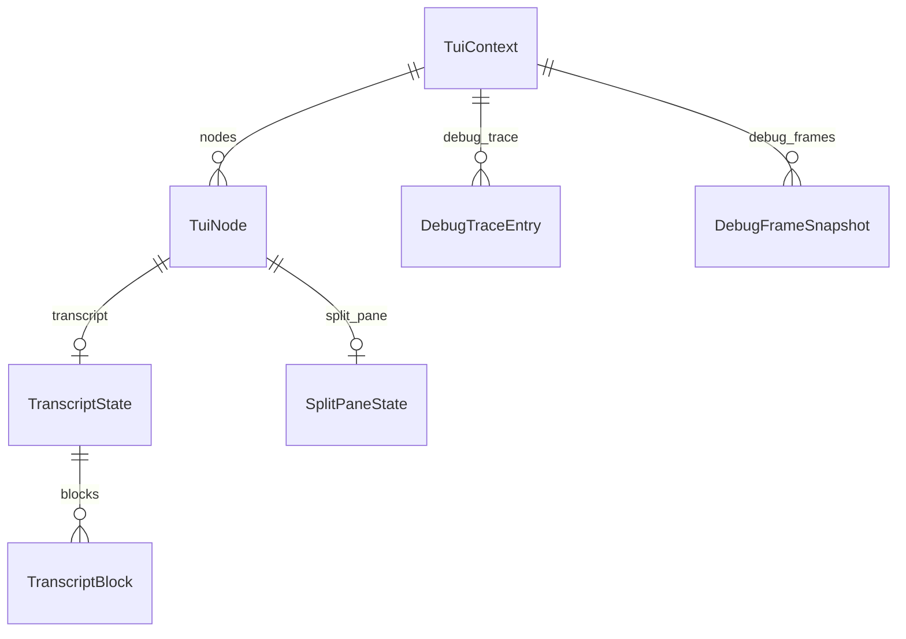

# Technical Specification (TechSpec.md)

## Kraken TUI

**Version**: 6.0  
**Status**: Draft (v4 focus reset)  
**Date**: March 2026  
**Source of Truth**: [Architecture.md](./Architecture.md), [PRD.md](./PRD.md), Kraken Focus Directive (March 2026)

**Scope note**: v3 is the implemented baseline. This document replaces the old forward-looking v3 plan and defines the next phase only.

**Changelog (succinct)**:

- v6.0 (v4 focus reset): Reoriented next-phase work around transcript-first UX, dev mode, minimal app-shaped primitives, and flagship examples for agent/developer workflows.
- v5.0 and earlier: preserved in git history as the completed v3 plan.

---

## 1. STACK SPECIFICATION (BILL OF MATERIALS)

### 1.1 Product Constraint Summary

- Kraken already has the foundation: 142 public C ABI functions, 10 shipped widget types, writer compaction, text cache, `app.run()`, JSX/signals, headless golden tests, and a completed threaded-render no-go report.
- The next phase is not another generic widget or packaging pass. It is a product-shaping pass for long-lived agent consoles, developer inspectors, streaming logs, and dense pane-based workflows.
- New dependencies are blocked unless they directly improve transcript behavior, devtools, or flagship examples.

### 1.2 Native Core

| Component | Choice | Version | Decision |
| --------- | ------ | ------- | -------- |
| Language | Rust | verified local: 1.93.1 | Keep Rust as sole owner of mutable UI state and heavy compute. |
| Edition | Rust 2021 | 2021 | Matches current crate and avoids churn. |
| Layout Engine | taffy | 0.9.x | Keep; transcript and pane work must reuse the current layout engine. |
| Terminal Backend | crossterm | 0.29.x | Keep; no backend swap is justified by the current priorities. |
| Rich Text | pulldown-cmark | 0.13.x | Keep; transcript blocks and code panes reuse the current markdown path. |
| Syntax Highlighting | syntect | 5.3.x | Keep; code and diff surfaces reuse the current native highlighter. |
| Unicode Width | unicode-width | 0.2.x | Keep; required for viewport and cursor correctness under dense streaming text. |
| Grapheme Handling | unicode-segmentation | 1.12.x | Keep; required for cursor stability and selection correctness. |
| Debug Snapshot Serialization | serde + serde_json | 1.0.x, debug-only addition | Allowed because snapshot/trace copy-out is core dev-mode work; no other new Rust dependency is accepted in v4 without direct product leverage. |

### 1.3 Host Language Bindings

| Component | Choice | Version | Decision |
| --------- | ------ | ------- | -------- |
| Runtime | Bun | verified local: 1.3.8 | Keep; use Bun watch mode for restart loops and `bun:ffi` for the host boundary. |
| Language | TypeScript | 5.x | Keep strict typed host wrappers and example apps in TS. |
| FFI Mechanism | bun:ffi | built-in | Keep; no alternate bridge is justified by the current focus. |
| Reactivity | @preact/signals-core | ^1.8.0 | Keep for fine-grained example apps and signal tracing in dev mode. |
| Additional Runtime Dependencies | none | n/a | v4 does not add runtime deps beyond the current binding surface. |

### 1.4 Build Artifacts

| Artifact | Format | Output |
| -------- | ------ | ------ |
| Native Core | `libkraken_tui.{so,dylib,dll}` | `native/target/release/` |
| Host Package | TypeScript source | `ts/src/` |
| Flagship Examples | Bun entrypoints | `examples/agent-console.tsx`, `examples/ops-log-console.tsx`, `examples/repo-inspector.tsx` |

### 1.5 CI and Tooling

| Tool | Location | Purpose |
| ---- | -------- | ------- |
| `cargo test` | `native/` | Native correctness, transcript fixtures, devtools behavior |
| `cargo bench` | `native/` | Transcript replay and writer/debug overhead benchmarks |
| `bun test` | `ts/` | FFI wrappers, dev session helpers, example replay integration |
| `bun --watch` | repo root / `examples/` | Fast restart loop during development |
| Headless replay harness | `native/` + `ts/` | Long-thread and log-console determinism |

---

## 2. ARCHITECTURE DECISION RECORDS

### 2.1 Inherited Baseline (Active Contract)

| ADR | Retained Decision | Why it stays |
| --- | ----------------- | ------------ |
| T16 | `OnceLock<RwLock<TuiContext>>` global state | Safe state ownership remains correct for the synchronous core. |
| T24 | Writer compaction after diffing | Transcript-heavy workloads need this even more than widget demos do. |
| T25 | Native text cache | Transcript and code panes reuse the existing parse/wrap cache path. |
| T26 | Host-owned runner API | Dev mode and replay loops stay host-orchestrated; no hidden native loop. |
| T30 | Headless goldens and benchmark gates | v4 proof relies on replayable transcript/log fixtures. |
| T31 | Background render stays opt-in and deferred | The no-go report stands; product work beats renderer cleverness. |

### 2.2 v4 Decisions

### ADR-T32: TranscriptView Is a First-Class Native Workload

**Context:** `ScrollBox` + `Text` is enough for simple overflow, but it has no stable logical block identity, no streaming patch path, no unread anchor, and no collapse model. For agent consoles and ops/log viewers, that forces the host layer into tree churn and index math exactly where Kraken should be strongest.

**Workflow improved:** Streaming assistant output, tool-call traces, reasoning summaries, and log rows while the operator scrolls older content or keeps the tail pinned.

**Decision:**

1. Add `NodeType::Transcript` and implement `native/src/transcript.rs`.
2. Store transcript content as ordered `TranscriptBlock` records keyed by host-owned `u64 block_id`.
3. TypeScript bindings map protocol/message IDs to numeric `block_id` values; Rust never parses AG-UI or provider-specific IDs.
4. A block can be `Message`, `ToolCall`, `ToolResult`, `Reasoning`, `Activity`, or `Divider`.
5. Blocks support append-in-place and replace-in-place updates so streaming text does not require node re-creation.
6. Nested groups are modeled by `parent_id`; collapsing a parent hides descendants without deleting them.
7. Rendering is row-based and viewport-clipped from logical blocks. Kraken must not represent each transcript line as a standalone child node.

**Reuses existing primitives:** writer compaction, text cache, theme resolution, scroll clipping, dirty propagation, headless backend, and current render pipeline.

**Failure modes and edge cases:**

- Streaming into a collapsed group must not auto-expand it.
- Updates above the viewport must preserve the logical anchor.
- Tool-result or reasoning blocks may arrive before their parent block is finished; patching an unfinished block is allowed.
- v4 transcript storage is append-oriented; arbitrary middle deletion is out of scope.

**Observability/debuggability requirements:**

- Counters for transcript block count, visible rows, unread count, and tail-attached state.
- Debug snapshot includes anchor kind, anchor block, unread anchor, visible top/bottom block IDs, and collapse state.

**Acceptance criteria:**

- A transcript with 10,000 logical blocks renders from a single `Transcript` node without host-side tree explosion.
- Streaming append/replace updates mutate existing blocks without sibling node churn.
- Group collapse/expand survives repeated renders and preserves descendant order.

**Flagship example benefit:** This is the core surface for `agent-console` and `ops-log-console`.

### ADR-T33: Anchor-Based Viewport Semantics Override Raw Scroll Position

**Context:** Raw row offsets drift under continuous inserts, group collapse/expand, and pane resize. Long-lived transcripts need deterministic sticky-bottom behavior, jump-to-unread, nested scrolling, and focus stability while content keeps changing.

**Workflow improved:** A developer reviews older content in a live transcript without the viewport snapping, then jumps back to the first unread region in one command.

**Decision:**

1. Viewport state is tracked by logical anchor, not raw row position.
2. Anchor kinds are:
   - `Tail`
   - `BlockStart(block_id, row_offset)`
   - `FocusedBlock(block_id, row_offset)` while keyboard focus is inside transcript descendants
3. Follow modes are:
   - `Manual`
   - `TailLocked`
   - `TailWhileNearBottom`
4. Default sticky-bottom threshold is 2 rows. Detached viewers do not snap back unless follow mode or explicit jump requests it.
5. The first update received while detached creates an `unread_anchor` at the earliest unseen block. Later unseen updates increment unread count but do not move the anchor.
6. Nested scroll routing is "innermost until edge, then bubble to parent" for wheel, PageUp/PageDown, and transcript jump commands.
7. Focus and cursor stability are resolved before terminal emission by recomputing anchors after inserts, collapse toggles, and pane resize.

**Failure modes and edge cases:**

- Resize while detached must preserve the anchor rather than the previous raw row.
- If collapse hides the focused descendant, focus moves to the collapsed parent and records a debug trace entry.
- Multiple patches in one frame must produce the same viewport result as the same patches across multiple frames.

**Observability/debuggability requirements:**

- Debug snapshot records anchor kind, anchor block ID, anchor row offset, unread anchor, and tail-attached boolean.
- Replay fixtures must assert visible top/bottom block IDs across streaming updates.

**Acceptance criteria:**

- Tail-attached transcripts stay pinned across repeated streaming updates.
- Detached transcripts preserve the visible anchor while unread count increases.
- `jump_to_unread` lands on the earliest unread block, not the newest block.
- Nested scroll tests prove inner-first, edge-bubble behavior.

**Flagship example benefit:** This is the differentiator for long-running agent and log consoles.

### ADR-T34: Dev Mode Is Core Product Work

**Context:** Kraken exposes perf counters and raw debug logging, but it does not yet provide a cohesive way to inspect layout, focus, dirty regions, event flow, or signal-driven updates. Internal debugging friction is currently a larger product risk than packaging polish.

**Workflow improved:** A developer runs an example under load, sees bounds/focus/dirty overlays, inspects the widget tree and transcript anchors, restarts quickly, and traces why a repaint happened.

**Decision:**

1. Add structured debug snapshot and trace APIs in the native core.
2. Add bounded ring buffers for recent input events, focus changes, dirty propagation, and transcript viewport state.
3. Add native overlay toggles for layout bounds, focused widget, dirty regions, and transcript anchors. Overlays render above the app frame and must not mutate application layout.
4. Add TypeScript dev surfaces on top of the snapshot APIs: widget tree inspector, perf HUD, event log, signal trace panel, and leak/invalid-handle warnings.
5. Fast restart is host-owned and based on Bun watch mode plus deterministic teardown/re-init. v4 does not implement in-process code hot swapping.

**Reuses existing primitives:** `tui_set_debug`, perf counters, headless backend, runner API, existing widget toolkit for inspector panels.

**Failure modes and edge cases:**

- Debug mode must not perturb input/focus ordering.
- Trace buffers must stay bounded.
- Overlay rendering must not influence layout or dirty propagation decisions.

**Observability/debuggability requirements:**

- When debug mode is off, overhead on the transcript benchmark must stay below 3 percent.
- Snapshot and trace export must use caller-owned buffers; no interior pointers cross FFI.

**Acceptance criteria:**

- Bounds/focus/dirty overlays can be toggled independently.
- Widget tree, focus target, perf counters, and recent events are queryable in one dev session.
- Leak and invalid-handle warnings surface in examples under watch/restart workflows.

**Flagship example benefit:** Makes all flagship examples inspectable instead of merely impressive.

### ADR-T35: Minimal Native Expansion, Not Generic Widget Inflation

**Context:** Dense agent/dev apps need panes. They do not need a large new generic widget collection. Most new surfaces can begin as host composites if transcript and pane semantics are strong.

**Workflow improved:** A developer can build multi-pane consoles and inspectors quickly, while Kraken keeps the performance-critical transcript and resizing semantics in Rust.

**Decision:**

1. Add `NodeType::SplitPane` as the only new native layout primitive in v4.
2. `SplitPane` owns axis, ratio, min sizes, and keyboard/mouse resize behavior, but still uses ordinary tree children.
3. `CommandPalette` stays a host composite over `Overlay + Input + List`.
4. `TracePanel` and `StructuredLogView` stay host composites over `TranscriptView` plus filter state.
5. `CodeView` and `DiffView` start as host composites over `Text`, `ScrollBox`, theme, and syntax highlighting.
6. No new native widget enters v4 without a named flagship example that needs it.

**Failure modes and edge cases:**

- `SplitPane` must reject anything other than exactly two direct children.
- Divider resize must preserve min sizes and stay deterministic under terminal resize.
- Code/diff surfaces are not allowed to promote themselves to native during v4 without measured example pain.

**Acceptance criteria:**

- Nested split panes resize correctly with keyboard and mouse.
- Command palette and trace/log panels are usable in flagship examples without additional native widgets.

**Flagship example benefit:** Powers the side-pane layouts in `agent-console`, `ops-log-console`, and later `repo-inspector`.

**Addendum (2026-03-20) — Bundle budget increase:** The host-language bundle budget is increased from 50KB to 75KB to accommodate Epic K host composites (`CommandPalette`, `TracePanel`, `StructuredLogView`, `CodeView`, `DiffView`). These composites add ~5-8KB of minified TypeScript, well within the revised limit. The increase is justified because the composites eliminate the need for additional native widgets, keeping the native binary size stable while expanding developer surface area.

### ADR-T36: Flagship Examples Are Blocking Release Gates

**Context:** Current examples prove breadth, but not the target product identity. v4 needs proof under real transcript, pane, and debugging pressure.

**Workflow improved:** The same example apps used for design pressure also become replayable regression harnesses.

**Decision:**

1. `agent-console` and `ops-log-console` are v4 MVP gates.
2. `repo-inspector` is planned in the same phase family but after transcript/devtools MVP stabilizes.
3. Every feature in v4 must feed at least one flagship example.
4. Replay fixtures, goldens, and perf checks are tied to example behaviors, not just unit-level APIs.

**Acceptance criteria:**

- Flagship examples run under replay fixtures and pass behavior/perf gates.
- A feature is not "done" until at least one flagship example uses it under load.

**Flagship example benefit:** Prevents framework vanity and keeps the roadmap product-shaped.

---

## 3. DATA MODEL (v4 Additions)

### 3.1 In-Memory ERD


```mermaid
erDiagram
    TuiContext ||--o{ TuiNode : nodes
    TuiNode ||--o| TranscriptState : transcript
    TuiNode ||--o| SplitPaneState : split_pane
    TranscriptState ||--o{ TranscriptBlock : blocks
    TuiContext ||--o{ DebugTraceEntry : debug_trace
    TuiContext ||--o{ DebugFrameSnapshot : debug_frames
```

### 3.2 Enums

#### NodeType

```rust
#[repr(u8)]
pub enum NodeType {
    Box = 0,
    Text = 1,
    Input = 2,
    Select = 3,
    ScrollBox = 4,
    TextArea = 5,
    Table = 6,
    List = 7,
    Tabs = 8,
    Overlay = 9,
    Transcript = 10,
    SplitPane = 11,
}
```

#### TranscriptBlockKind

```rust
#[repr(u8)]
pub enum TranscriptBlockKind {
    Message = 0,
    ToolCall = 1,
    ToolResult = 2,
    Reasoning = 3,
    Activity = 4,
    Divider = 5,
}
```

#### FollowMode

```rust
#[repr(u8)]
pub enum FollowMode {
    Manual = 0,
    TailLocked = 1,
    TailWhileNearBottom = 2,
}
```

#### ViewportAnchorKind

```rust
#[repr(u8)]
pub enum ViewportAnchorKind {
    Tail = 0,
    BlockStart = 1,
    FocusedBlock = 2,
}
```

#### SplitAxis

```rust
#[repr(u8)]
pub enum SplitAxis {
    Horizontal = 0,
    Vertical = 1,
}
```

### 3.3 Structs

#### TranscriptBlock

```rust
pub struct TranscriptBlock {
    pub id: u64,
    pub kind: TranscriptBlockKind,
    pub parent_id: Option<u64>,
    pub role: u8, // 0=system, 1=user, 2=assistant, 3=tool, 4=reasoning
    pub content: String,
    pub content_format: ContentFormat,
    pub code_language: Option<String>,
    pub streaming: bool,
    pub collapsed: bool,
    pub unread: bool,
    pub rendered_rows: u32,
    pub version: u64,
}
```

#### TranscriptState

```rust
pub struct TranscriptState {
    pub blocks: Vec<TranscriptBlock>,
    pub block_index: HashMap<u64, usize>,
    pub follow_mode: FollowMode,
    pub anchor_kind: ViewportAnchorKind,
    pub anchor_block_id: Option<u64>,
    pub anchor_row_offset: u32,
    pub unread_anchor: Option<u64>,
    pub unread_count: u32,
    pub sticky_threshold_rows: u16,
    pub tail_attached: bool,
}
```

#### SplitPaneState

```rust
pub struct SplitPaneState {
    pub axis: SplitAxis,
    pub primary_ratio_permille: u16,
    pub min_primary: u16,
    pub min_secondary: u16,
    pub resize_step: u16,
    pub resizable: bool,
}
```

#### DebugTraceEntry and DebugFrameSnapshot

```rust
pub struct DebugTraceEntry {
    pub seq: u64,
    pub kind: u8, // event, focus, dirty, viewport
    pub target: u32,
    pub detail: String,
}

pub struct DebugFrameSnapshot {
    pub frame_id: u64,
    pub focused: u32,
    pub dirty_nodes: u32,
    pub diff_cells: u32,
    pub write_runs: u32,
    pub transcript_blocks: u32,
    pub transcript_unread: u32,
    pub tail_attached: bool,
}
```

#### TuiNode and TuiContext Additions

```rust
pub struct TuiNode {
    // existing fields unchanged
    pub transcript_state: Option<TranscriptState>,
    pub split_pane_state: Option<SplitPaneState>,
}

pub struct TuiContext {
    // existing fields unchanged
    pub debug_overlay_flags: u32,
    pub debug_trace_flags: u32,
    pub debug_trace: VecDeque<DebugTraceEntry>,
    pub debug_frames: VecDeque<DebugFrameSnapshot>,
    pub next_debug_seq: u64,
    pub frame_seq: u64,
}
```

---

## 4. FFI CONTRACT (C ABI)

### 4.1 Conventions

- Prefix: `tui_`
- ABI: `extern "C"` + `#[unsafe(no_mangle)]`
- Handles: `u32`, with `0` invalid sentinel
- Transcript block IDs: `u64`, scoped by transcript instance and owned by host bindings
- String-in: `(*const u8 ptr, u32 len)`; Rust copies
- String-out: caller-provided `(*mut u8 buffer, u32 len)`
- Return codes: `0` success, `-1` error, `-2` panic
- Panic safety: all entry points wrapped in `catch_unwind`
- Error retrieval: `tui_get_last_error()`

### 4.2 Baseline Inheritance Policy

All implemented v3 symbols remain valid. v4 adds transcript, split-pane, and debug/devtools symbols without breaking the existing runner, widget, theme, or diagnostics contracts.

### 4.3 v4 Additions (New Symbols)

#### 4.3.1 Transcript Surface (+11)

| Function | Signature | Returns | Description |
| -------- | --------- | ------- | ----------- |
| `tui_transcript_append_block` | `(u32 handle, u64 block_id, u8 kind, u8 role, *const u8 ptr, u32 len) -> i32` | 0 / -1 | Append a new logical block |
| `tui_transcript_patch_block` | `(u32 handle, u64 block_id, u8 patch_mode, *const u8 ptr, u32 len) -> i32` | 0 / -1 | `patch_mode`: 0=append text, 1=replace text |
| `tui_transcript_finish_block` | `(u32 handle, u64 block_id) -> i32` | 0 / -1 | Mark a streaming block as complete |
| `tui_transcript_set_parent` | `(u32 handle, u64 block_id, u64 parent_id) -> i32` | 0 / -1 | Assign a group parent |
| `tui_transcript_set_collapsed` | `(u32 handle, u64 block_id, u8 collapsed) -> i32` | 0 / -1 | Collapse or expand a block group |
| `tui_transcript_jump_to_block` | `(u32 handle, u64 block_id, u8 align) -> i32` | 0 / -1 | Jump viewport to block; `align`: 0=start, 1=center, 2=end |
| `tui_transcript_jump_to_unread` | `(u32 handle) -> i32` | 0 / -1 | Jump to the earliest unread anchor |
| `tui_transcript_set_follow_mode` | `(u32 handle, u8 mode) -> i32` | 0 / -1 | Set `FollowMode` |
| `tui_transcript_get_follow_mode` | `(u32 handle) -> i32` | mode / -1 | Read current `FollowMode` |
| `tui_transcript_mark_read` | `(u32 handle) -> i32` | 0 / -1 | Clear unread state at the current viewport |
| `tui_transcript_get_unread_count` | `(u32 handle) -> i32` | count / -1 | Read unread block count |

#### 4.3.2 SplitPane (+6)

| Function | Signature | Returns | Description |
| -------- | --------- | ------- | ----------- |
| `tui_splitpane_set_axis` | `(u32 handle, u8 axis) -> i32` | 0 / -1 | `0=horizontal`, `1=vertical` |
| `tui_splitpane_set_ratio` | `(u32 handle, u16 primary_ratio_permille) -> i32` | 0 / -1 | Set split ratio in thousandths |
| `tui_splitpane_get_ratio` | `(u32 handle) -> i32` | ratio / -1 | Read split ratio in thousandths |
| `tui_splitpane_set_min_sizes` | `(u32 handle, u16 min_primary, u16 min_secondary) -> i32` | 0 / -1 | Set child minimum sizes in cells |
| `tui_splitpane_set_resize_step` | `(u32 handle, u16 step_cells) -> i32` | 0 / -1 | Set keyboard resize step |
| `tui_splitpane_set_resizable` | `(u32 handle, u8 enabled) -> i32` | 0 / -1 | Enable or disable user resize |

#### 4.3.3 Debug and Devtools (+7)

| Function | Signature | Returns | Description |
| -------- | --------- | ------- | ----------- |
| `tui_debug_set_overlay` | `(u32 flags) -> i32` | 0 / -1 | Toggle overlay flags for bounds, focus, dirty, anchors |
| `tui_debug_set_trace_flags` | `(u32 flags) -> i32` | 0 / -1 | Enable specific trace streams |
| `tui_debug_get_snapshot_len` | `() -> i32` | len / -1 | Byte length for current debug snapshot JSON |
| `tui_debug_get_snapshot` | `(*mut u8 buffer, u32 buffer_len) -> i32` | bytes / -1 | Copy current debug snapshot JSON |
| `tui_debug_get_trace_len` | `(u8 kind) -> i32` | len / -1 | Byte length for a trace stream JSON payload |
| `tui_debug_get_trace` | `(u8 kind, *mut u8 buffer, u32 buffer_len) -> i32` | bytes / -1 | Copy a trace stream JSON payload |
| `tui_debug_clear_traces` | `() -> i32` | 0 / -1 | Clear all buffered trace entries |

### 4.4 Event Payload Additions

| Event Type | `target` | `data[0]` | `data[1]` | Notes |
| ---------- | -------- | --------- | --------- | ----- |
| Change on SplitPane | split-pane handle | ratio permille | 0 | Emitted on keyboard or mouse resize |
| Change on Transcript | not used in v4 MVP | - | - | Transcript remains command-driven; debug traces expose viewport changes |

### 4.5 Diagnostics Counters

Counters `0..13` remain unchanged from the v3 baseline. v4 adds:

| ID | Counter | Unit |
| -- | ------- | ---- |
| 14 | transcript block count | blocks |
| 15 | transcript visible row count | rows |
| 16 | transcript unread count | blocks |
| 17 | debug trace depth | entries |
| 18 | transcript tail attached | bool (0/1) |

### 4.6 Symbol Count

- Current implemented baseline at end of v3: **142**
- v4 additions in this spec: **+24**
- Projected total after v4 MVP: **166**

Breakdown of v4 additions:

- Transcript: +11
- SplitPane: +6
- Debug/devtools: +7

### 4.7 Host Contracts (TS-only)

#### TranscriptView Wrapper

```ts
class TranscriptView extends Widget {
  appendBlock(input: {
    id: bigint | number;
    kind: "message" | "toolCall" | "toolResult" | "reasoning" | "activity" | "divider";
    role: "system" | "user" | "assistant" | "tool" | "reasoning";
    content?: string;
  }): void;

  patchBlock(
    id: bigint | number,
    patch: { mode: "append" | "replace"; content: string },
  ): void;

  finishBlock(id: bigint | number): void;
  setParent(id: bigint | number, parentId: bigint | number): void;
  setCollapsed(id: bigint | number, collapsed: boolean): void;
  setFollowMode(mode: "manual" | "tailLocked" | "tailWhileNearBottom"): void;
  jumpToUnread(): void;
}
```

#### AG-UI Replay Adapter

```ts
type AgUiReplayEvent =
  | { type: "RUN_STARTED"; threadId: string; runId: string }
  | { type: "TEXT_MESSAGE_CHUNK"; messageId: string; role?: string; delta?: string }
  | { type: "TOOL_CALL_CHUNK"; toolCallId: string; toolCallName?: string; delta?: string }
  | { type: "TOOL_CALL_RESULT"; toolCallId: string; messageId: string; content: string }
  | { type: "ACTIVITY_SNAPSHOT"; messageId: string; activityType: string; content: unknown }
  | { type: "ACTIVITY_DELTA"; messageId: string; activityType: string; patch: unknown[] }
  | { type: "RUN_FINISHED"; runId: string }
  | { type: "RUN_ERROR"; runId: string; message: string };

function applyAgUiReplayEvent(transcript: TranscriptView, event: AgUiReplayEvent): void;
```

#### Dev Session Contract

```ts
interface DevSessionOptions {
  createApp: () => Promise<{ app: Kraken; root: Widget }>;
  overlay?: Array<"bounds" | "focus" | "dirty" | "anchors" | "perf">;
  traceSignals?: boolean;
  watch?: string[];
}

function createDevSession(options: DevSessionOptions): Promise<void>;
```

Implementation note: the restart loop is launched under `bun --watch` and performs deterministic `shutdown()` + re-init. v4 explicitly rejects in-process code swapping.

---

## 5. IMPLEMENTATION GUIDELINES

### 5.1 Project Structure (v4 Target)

```text
kraken-tui/
|- native/
|  |- Cargo.toml
|  `- src/
|     |- lib.rs
|     |- context.rs
|     |- tree.rs
|     |- layout.rs
|     |- render.rs
|     |- writer.rs
|     |- text.rs
|     |- text_cache.rs
|     |- event.rs
|     |- scroll.rs
|     |- theme.rs
|     |- animation.rs
|     |- textarea.rs
|     |- transcript.rs      # v4
|     |- splitpane.rs       # v4
|     `- devtools.rs        # v4
|- ts/
|  |- src/
|  |  |- app.ts
|  |  |- dev.ts            # v4
|  |  |- diagnostics.ts
|  |  |- widget.ts
|  |  |- widgets/
|  |  |  |- transcript.ts  # v4
|  |  |  `- splitpane.ts   # v4
|  |  `- devtools/
|  |     |- inspector.ts   # v4
|  |     |- hud.ts         # v4
|  |     `- traces.ts      # v4
|- examples/
|  |- agent-console.tsx    # v4
|  |- ops-log-console.tsx  # v4
|  `- repo-inspector.tsx   # v4
`- docs/
```

### 5.2 Module Responsibilities (v4 Focus)

| Module | File(s) | Responsibility |
| ------ | ------- | -------------- |
| Transcript | `native/src/transcript.rs`, `ts/src/widgets/transcript.ts` | Logical block storage, streaming patch path, unread/follow behavior |
| Split panes | `native/src/splitpane.rs`, `ts/src/widgets/splitpane.ts` | Dense pane layout and user resize behavior |
| Devtools | `native/src/devtools.rs`, `ts/src/dev.ts`, `ts/src/devtools/*` | Snapshot export, trace buffers, overlays, inspector panels |
| Replay adapters | `ts/src/widgets/transcript.ts`, example helpers | AG-UI and log replay into transcript surfaces |
| Flagship examples | `examples/*` | Product proof, regression pressure, operator workflows |

### 5.3 Coding Standards

**Rust**

- `lib.rs` remains FFI-only; all transcript, split-pane, and devtools logic lives in dedicated modules.
- Transcript operations address blocks by stable `u64 block_id`, never by visible row or child index.
- Debug snapshot and trace APIs are copy-out only; no interior pointers cross FFI.
- When debug mode is off, devtools code paths must short-circuit before extra tree traversal.
- `SplitPane` validates exactly two direct children before accepting resize behavior.

**TypeScript**

- Host wrappers stay thin; Rust still owns transcript state, pane state, and viewport correctness.
- `CommandPalette`, `TracePanel`, `StructuredLogView`, `CodeView`, and `DiffView` stay host composites until example pressure proves native promotion is necessary.
- Watch/restart helpers must always call `shutdown()` before re-init.

### 5.4 Build and Verification Commands

```bash
# Native build
cargo build --release --manifest-path native/Cargo.toml

# Native tests and transcript replay fixtures
cargo test --manifest-path native/Cargo.toml

# Native benchmarks
cargo bench --manifest-path native/Cargo.toml

# TS tests
bun test ts/test-ffi.test.ts
bun test ts/test-runner.test.ts
bun test ts/test-jsx.test.ts

# Flagship examples (target commands)
cargo build --release --manifest-path native/Cargo.toml && bun run examples/agent-console.tsx
cargo build --release --manifest-path native/Cargo.toml && bun run examples/ops-log-console.tsx
cargo build --release --manifest-path native/Cargo.toml && bun run examples/repo-inspector.tsx

# Dev restart loop
bun --watch examples/agent-console.tsx
```

### 5.5 Performance and Quality Gates

| Constraint | Target | Gate |
| ---------- | ------ | ---- |
| Transcript replay render time | p95 < 8ms on canonical 120x40 headless replay | `cargo bench` transcript fixture |
| Tail-attached stability | 0 viewport drift across 1,000 streaming updates | headless replay assertion |
| Detached reading stability | visible anchor unchanged while unread count increases | replay + golden tests |
| Jump-to-unread correctness | lands on earliest unread block | transcript behavior tests |
| Nested scroll handoff | inner-first, edge-bubble semantics | integration tests |
| Debug-off overhead | < 3% render delta on transcript benchmark | paired benchmark with devtools disabled/enabled |
| Flagship examples | `agent-console` and `ops-log-console` replay fixtures pass | example replay suite |

### 5.6 Explicit v4 Non-Priorities

- Distribution and packaging polish beyond what v3 already delivered
- Further editor-grade `TextArea` work
- Any promotion of the threaded render experiment
- Generic widget parity work without transcript/devtools leverage
- New native components that are not required by the flagship examples

---

## Appendix A: v4 Exit Criteria

- Long transcript replay stays stable under sustained streaming.
- Sticky-bottom, jump-to-unread, and nested scroll behavior are deterministic.
- Dev mode exposes bounds, focus, dirty regions, traces, and replayable diagnostics.
- `agent-console` and `ops-log-console` feel like real tools, not broad feature demos.
- Repo inspector is unblocked by proven pane and transcript primitives, not by another generic widget wave.
