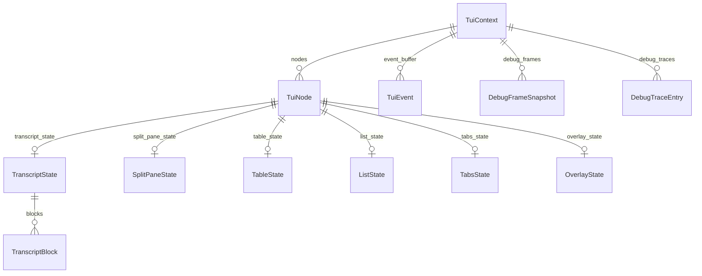

# Technical Specification

## 0. Version History & Changelog
- v7.2.11 - Tightened the substrate ABI and transcript rebase contract: oversized `usize` values now fail explicitly instead of truncating, and dirty-range semantics are documented as a deliberate CORE-N3 decision point rather than an implicit behavior.
- v7.2.10 - Reconciled ADR-T37 and the spike memo with the shipped substrate reality: flat-`String` backing is the current contract, the borrowed-`&str` payload path is authoritative, and the host FFI surface is mechanically exercised end to end.
- v7.2.9 - Fixed `tui_text_view_get_cache_epoch` to refresh projections before reporting cache state and aligned the spike memo with the shipped one-copy payload path.
- ... [Older history truncated, refer to git logs]

## 1. Stack Specification (Bill of Materials)
- **Primary Language / Runtime:** Rust 2021 for the Native Core, TypeScript 5.x for the Host Layer, and Bun 1.3.x as the primary runtime for host execution and FFI loading.
- **Primary Frameworks / Libraries:** Taffy for layout, Crossterm for terminal I/O, pulldown-cmark and syntect for rich text, and `@preact/signals-core` for the optional JSX reconciler layer.
- **State Stores / Persistence:** All runtime UI state lives in the Native Core in memory. There is no external database or persisted state store in the canonical product contract.
- **Infrastructure / Tooling:** Cargo, Bun, GitHub Actions CI, GitHub release artifacts with checksum sidecars, Criterion benchmarks, headless terminal backend, replay fixtures, and golden snapshot utilities.
- **Testing / Quality Tooling:** `cargo test`, `cargo fmt`, `cargo clippy`, native benchmarks, Bun integration tests, example replay tests, install smoke tests, runner API tests, and bundle-budget checks.
- **Version Pinning / Compatibility Policy:** Kraken is still pre-1.0 (`0.1.0` in both native and host packages), so breaking changes remain possible. Even so, additive evolution is preferred for the C ABI and host wrappers, and any incompatible change to the public surface must be documented explicitly in this file before task planning.

### 1.1 Native Core Bill of Materials

| Component | Choice | Verified Source State | Decision |
| --- | --- | --- | --- |
| Language | Rust | `edition = "2021"` | Keep the Native Core as the sole owner of mutable UI state and compute-heavy workflows. |
| Layout engine | Taffy | `0.9` | Keep the current layout model and extend through the existing constraint engine rather than introducing a parallel layout path. |
| Terminal backend | Crossterm | `0.29` | Keep terminal I/O and capability handling behind the existing backend abstraction. |
| Rich text parser | pulldown-cmark | `0.13` | Keep Markdown parsing native-side for transcript and code-heavy interfaces. |
| Syntax highlighting | syntect | `5.3` | Keep native syntax highlighting for code and diff viewing surfaces. |
| Text measurement | unicode-width + unicode-segmentation | `0.2` and `1.12` | Keep native text width and grapheme handling for cursor, wrap, and viewport correctness. |
| Serialization | serde + serde_json | `1.0` | Use JSON copy-out for debug snapshots and trace payloads. |

### 1.2 Host Layer Bill of Materials

| Component | Choice | Verified Source State | Decision |
| --- | --- | --- | --- |
| Runtime | Bun | `1.3.8` verified locally | Keep Bun as the default runtime and FFI host. |
| Language | TypeScript | `^5.0.0` | Keep strict typed wrappers and examples in TypeScript. |
| FFI mechanism | `bun:ffi` | built-in | Preserve the direct native-library loading path rather than adding an alternate bridge. |
| Reactivity | `@preact/signals-core` | `^1.8.0` | Preserve the lightweight JSX/signals path without promoting it to the primary lifecycle model. |
| Additional runtime deps | none beyond signals | current package state | Keep the host bundle intentionally thin. |

### 1.3 Build, Test, and Release Artifacts

| Artifact | Format | Source of Truth |
| --- | --- | --- |
| Native Core | Shared library (`.so`, `.dylib`, `.dll`) | `native/target/release/` for source builds; versioned GitHub release assets for published native binaries |
| Host Package | ESM TypeScript package | `ts/package.json`, `ts/src/` |
| Release Artifacts | Versioned platform builds with `.sha256` sidecars | `.github/workflows/release.yml` |
| Flagship Examples | Bun entrypoints | `examples/agent-console.ts`, `examples/ops-log-console.ts`, `examples/repo-inspector.ts` |
| Replay Fixtures | JSON fixtures and headless assertions | `examples/fixtures/`, `ts/test-examples.test.ts` |

### 1.4 Release and Distribution Matrix

| Platform | Architecture | Published release asset | Resolver target when a prebuild is staged locally |
| --- | --- | --- | --- |
| Linux | x64 | `kraken-tui-<tag>-linux-x64.so` | `ts/prebuilds/linux-x64/<libName>` |
| Linux | arm64 | `kraken-tui-<tag>-linux-arm64.so` | `ts/prebuilds/linux-arm64/<libName>` |
| macOS | arm64 | `kraken-tui-<tag>-darwin-arm64.dylib` | `ts/prebuilds/darwin-arm64/<libName>` |
| macOS | x64 | `kraken-tui-<tag>-darwin-x64.dylib` | `ts/prebuilds/darwin-x64/<libName>` |
| Windows | x64 | `kraken-tui-<tag>-win32-x64.dll` | `ts/prebuilds/win32-x64/<libName>` |

The repo-owned release workflow currently publishes **versioned GitHub release assets** with SHA-256 sidecars. It does **not** populate `ts/prebuilds/` in-tree on its own. The resolver still supports `ts/prebuilds/...` as the expected layout for packaged or manually staged prebuilds after those published assets have been downloaded and renamed to the platform-specific `libName`.

## 2. Architecture Decision Records (ADRs)
### 2.1 Active Inherited Decisions

| ADR | Status | Retained decision | Consequences |
| --- | --- | --- | --- |
| **ADR-T16** | accepted | Safe global state via `OnceLock<RwLock<...>>` at the FFI boundary | Alias safety is enforced without changing the default synchronous execution model. |
| **ADR-T20** | accepted | The JSX reconciler wraps the imperative command protocol rather than replacing it | Declarative usage remains an overlay on top of the same host/native contract. |
| **ADR-T23** | accepted | Accessibility foundations live on `TuiNode` as optional role, label, and description metadata | Foundational accessibility remains available without redefining the render pipeline. |
| **ADR-T24** | accepted | Writer compaction and cursor/style delta minimization are first-class parts of the render path | High-frequency transcript and dashboard workloads depend on efficient terminal emission. |
| **ADR-T25** | accepted | Rich text and wrap results are cached in a bounded native LRU | Stable content avoids repeated parse and wrap work inside the Native Core. |
| **ADR-T26** | accepted | `app.run()` and `app.stop()` remain host-owned loop constructs | Loop policy stays explicit and host-driven. |
| **ADR-T29** | accepted | Prebuilt artifact matrix plus source-build fallback are part of the install contract | Distribution UX is treated as implementation contract, not post-hoc packaging polish. |
| **ADR-T30** | accepted | Goldens and benchmark gates are required for writer-, cache-, and replay-sensitive changes | Performance and rendering regressions must be caught systematically. |
| **ADR-T31** | accepted | Background rendering remains experimental and opt-in | The canonical contract stays synchronous until semantic parity is proven. |

### ADR-T32 TranscriptView Is a First-Class Native Workload
- **Status:** accepted
- **Context:** `ScrollBox` plus `Text` was sufficient for simple overflow, but it could not model stable logical block identity, streaming patch paths, unread anchors, collapse state, or low-churn transcript updates for developer and agent workflows.
- **Decision:** Introduce `NodeType::Transcript`, keep transcript content as ordered logical `TranscriptBlock` records keyed by host-owned `u64` block IDs, and expose transcript-focused mutation and viewport commands through the native ABI and thin host wrappers.
- **Consequences:** Transcript-heavy apps can stream and patch content without host-side tree explosion, but the transcript surface becomes a distinct native state model with its own invariants. Middle-of-history arbitrary deletion remains outside the current contract.

### ADR-T33 Anchor-Based Viewport Semantics Override Raw Scroll Position
- **Status:** accepted
- **Context:** Raw row offsets drift under streaming inserts, collapse toggles, and pane resize. Transcript and log workflows need deterministic sticky-bottom behavior and predictable detached reading.
- **Decision:** Track transcript follow behavior through `FollowMode`, logical anchor semantics, unread anchors, and explicit jump commands rather than raw row offsets as the primary contract.
- **Consequences:** Operators can remain detached from the tail without losing context, but transcript state must track viewport height and width, unread state, and anchor mode carefully. Replay fixtures and example tests become essential to prevent subtle regressions.

### ADR-T34 Dev Mode Is Core Product Work
- **Status:** accepted
- **Context:** Long-lived complex terminal applications are difficult to debug without inspecting layout, focus, dirty propagation, viewport state, and render cost. Generic stderr logging is not enough.
- **Decision:** Add native debug snapshot and trace APIs, bounded per-kind trace rings, overlay rendering, host-side inspector and HUD surfaces, and deterministic dev-session helpers.
- **Consequences:** The implementation gains a stable diagnostics surface that examples and developers can rely on, but debug JSON contracts, overlay flags, and overhead budgets become part of the maintained public surface.

### ADR-T35 Minimal Native Expansion, Not Generic Widget Inflation
- **Status:** accepted
- **Context:** Dense application layouts required better pane behavior, but the product did not need a broad new wave of native widgets to prove its identity.
- **Decision:** Add `SplitPane` as the only new native layout primitive in this wave and keep `CommandPalette`, `TracePanel`, `StructuredLogView`, `CodeView`, and `DiffView` as host composites over existing primitives unless measured pressure justifies native promotion later.
- **Consequences:** The native surface stays focused and smaller, but the host layer must maintain disciplined composite abstractions and preserve the invariant that Rust still owns the performance-critical state.

### ADR-T36 Flagship Examples Are Blocking Release Gates
- **Status:** accepted
- **Context:** Feature breadth alone does not prove product identity. Kraken needs example-driven proof under transcript, pane, and debugging pressure.
- **Decision:** Treat `agent-console` and `ops-log-console` as blocking proof examples for the transcript/devtools wave, and keep `repo-inspector` within the same flagship family once the underlying primitives are stable.
- **Consequences:** Example behavior now constrains implementation choices. Replay fixtures, performance budgets, and example usability are part of release-readiness, not optional showcase material.

### ADR-T37 Native Text/Cell/View Substrate Is the Single Path for Substantial Text
- **Status:** accepted
- **Context:** Today's transcript path patches block strings in place, render code clones visible block content into temporary owned `String`s, row counts are recomputed from text width per widget, and `TextArea` undo/redo is snapshot-oriented. This is sufficient to prove the product model but is too shallow under large agent traces, streaming code output, multiline edits, mixed-width Unicode, nested scroll regions, and terminal resize churn.
- **Decision:** Introduce a single native content/render substrate inside the Native Core composed of `TextBuffer` (canonical content storage with content epochs, line-start markers, dirty ranges, cached width metrics, grapheme boundaries, tab expansion policy, style spans, selection ranges, and highlights — v1 ships a flat `String` backing per the M0 spike memo, with rope/chunked storage available as a future option that does not change the public ABI), `TextView` (viewport/wrap projection over a `TextBuffer` with visual lines, soft-wrap cache, scroll row/col, cursor mapping, byte-grapheme-cell-visual-row conversions, and resize invalidation), and a unified text renderer that draws a `TextView` into Kraken's existing cell buffer with one implementation for clipping, wide chars, combining marks, ZWJ/emoji, CJK width, tabs, selections, highlights, cursor rendering, and style merging. Every Kraken surface that renders substantial text routes through this substrate.
- **Consequences:** Widget code stops re-implementing Unicode width, wrap row counting, and clipping. Streamed content append invalidates only affected buffer and view epochs. Resize invalidates view projections rather than content storage. The Native Core gains a sizable new module with its own invariants and ABI footprint, and existing surfaces (`Text`, `Markdown`, code spans, `TextArea`, transcript blocks, `CodeView`, `DiffView`) must be migrated before the legacy text paths are removed. Migration is sequenced in `Tasks.md` Epic N.

### ADR-T38 Operation-Based Edit History Replaces Snapshot Undo for TextArea
- **Status:** accepted
- **Context:** `TextArea` undo/redo currently stores full-content snapshots. This works for short fields but degrades quickly under multiline edits and is incompatible with the substrate's epoch and dirty-range model.
- **Decision:** Move `TextArea` onto an `EditBuffer` that wraps a `TextBuffer` with an operation history (`insert`, `delete`, `replace`, selection move, cursor move) plus coalescing rules for ordinary single-edit operations. Undo and redo replay operations against the buffer; only structural operations such as bulk paste or programmatic full-content replacement may produce checkpoint snapshots.
- **Consequences:** Ordinary single-character editing no longer produces full-content snapshots, eliminating an O(content size) memory cost per keystroke. The substrate gains an additional state model (`EditBuffer`) and matching ABI surface. Existing `TextArea` keyboard behavior and the host wrapper API are preserved through replay tests during migration.

### ADR-T39 Transcript Content Is Backed by TextBuffer Segments
- **Status:** accepted
- **Context:** `TranscriptBlock.content: String` is mutated in place by `patch_block` and cloned into render-local structures during render. This conflicts with the substrate goal that resize invalidates view projections rather than content storage and that streamed append affects only impacted epochs.
- **Decision:** Each transcript block's content is owned by a `TextBuffer` (or a transcript-specialized segment-list view over the substrate). Rendering consumes a `TextView` projection per visible block. `append_block`, `patch_block`, and `finish_block` operations mutate the buffer through the substrate's mutation API and bump the corresponding epoch. Transcript-specific concerns (`anchor_kind`, `follow_mode`, unread anchors, collapse state, parent and hierarchy, role coloring) remain inside `TranscriptState`; only block content storage moves.
- **Consequences:** Transcript host-facing contract (anchors, follow modes, unread, collapse, hierarchy) is preserved unchanged. Internally, transcript code stops owning text-measurement logic and shares it with every other substantial text surface. Replay fixtures and host wrappers stay stable; transcript-internal block layout invariants and their tests are rewritten on top of the substrate.

### ADR-T40 Terminal Capability Hardening Is Deferred Until Substrate Is Stable
- **Status:** accepted
- **Context:** Kitty keyboard protocol, OSC52, hyperlink emission, palette and capability detection, pixel and cell resolution, and terminal multiplexer variance hardening are real product needs, but the current bottleneck is the content substrate beneath the widgets. Hardening terminal capabilities while the substrate is being shaped would multiply migration risk and dilute focus.
- **Decision:** Treat terminal capability hardening as a follow-up wave (Epic O in `Tasks.md`) that begins only after Epic M (substrate foundation) and Epic N (surface rebase) are complete. Do not absorb capability work into the substrate wave.
- **Consequences:** Kraken's terminal-capability surface stays at its current level during this wave. The deferral is recorded explicitly so it is not mistaken for an oversight. Epic O is preserved in the planning record with named candidate surfaces and re-evaluated after the substrate ships.

### 2.2 Brownfield Reality Note
- The prior v6 TechSpec described transcript, devtools, split-pane, and flagship examples as future work. The current source tree implements them.
- This v7 artifact is therefore intentionally present-tense and canonical rather than future-tense and phase-only.
- ADR-T37 through ADR-T40 introduce explicitly forward-looking scope (the Native Text/Cell/View Substrate and its migration). Sections 3.4 and 4.4 now describe Brownfield reality for `TextBuffer`, `TextView`, and the unified text renderer (Epic M shipped). `EditBuffer` and the rebased surfaces (`Text`, `Markdown`, code spans, `TextArea`, transcript blocks) remain target state pending Epic N.

## 3. State & Data Modeling
### 3.1 Native UI State Model
- **Purpose:** Represent the entire live terminal UI, event buffer, render buffers, theming state, animation registry, transcript workloads, pane state, and diagnostics inside one native authority.
- **Storage Shape:** In-memory `TuiContext` with `HashMap<u32, TuiNode>` ownership for Widget state, explicit event and diagnostics buffers, native render buffers, and per-widget optional state attachments.
- **Constraints / Invariants:**
  - `Handle(0)` is permanently invalid.
  - The Host Layer owns developer-facing string IDs; the Native Core owns `u32` Handles and transcript `u64` block bookkeeping.
  - Transcript state is attached only to `NodeType::Transcript`; split pane state is attached only to `NodeType::SplitPane`.
  - Debug traces are retained in bounded per-kind rings.
  - Widget state is not persisted across process lifetime.
- **Indexes / Access Paths:**
  - `nodes: HashMap<u32, TuiNode>` keyed by Handle
  - `blocks: Vec<TranscriptBlock>` plus `block_index: HashMap<u64, usize>` keyed by transcript block ID
  - `theme_bindings: HashMap<u32, u32>` keyed by node Handle
  - `event_buffer: Vec<TuiEvent>` as ordered buffered events
  - `debug_traces: [VecDeque<DebugTraceEntry>; 4]` indexed by trace kind
- **Migration Notes:** There is no persisted schema migration layer. Compatibility work is about ABI and wrapper evolution rather than stored data migration.


```mermaid
erDiagram
    TuiContext ||--o{ TuiNode : nodes
    TuiContext ||--o{ TuiEvent : event_buffer
    TuiContext ||--o{ DebugFrameSnapshot : debug_frames
    TuiContext ||--o{ DebugTraceEntry : debug_traces
    TuiNode ||--o| TranscriptState : transcript_state
    TuiNode ||--o| SplitPaneState : split_pane_state
    TuiNode ||--o| TableState : table_state
    TuiNode ||--o| ListState : list_state
    TuiNode ||--o| TabsState : tabs_state
    TuiNode ||--o| OverlayState : overlay_state
    TranscriptState ||--o{ TranscriptBlock : blocks
```

### 3.2 Key Enums
#### NodeType
```rust
#[repr(u8)]
pub enum NodeType {
    Box = 0,
    Text = 1,
    Input = 2,
    Select = 3,
    ScrollBox = 4,
    TextArea = 5,
    Table = 6,
    List = 7,
    Tabs = 8,
    Overlay = 9,
    Transcript = 10,
    SplitPane = 11,
}
```

#### TranscriptBlockKind
```rust
#[repr(u8)]
pub enum TranscriptBlockKind {
    Message = 0,
    ToolCall = 1,
    ToolResult = 2,
    Reasoning = 3,
    Activity = 4,
    Divider = 5,
}
```

#### FollowMode and ViewportAnchorKind
```rust
#[repr(u8)]
pub enum FollowMode {
    Manual = 0,
    TailLocked = 1,
    TailWhileNearBottom = 2,
}

pub enum ViewportAnchorKind {
    Tail,
    BlockStart { block_id: u64, row_offset: u32 },
    FocusedBlock { block_id: u64, row_offset: u32 },
}
```

#### SplitAxis
```rust
#[repr(u8)]
pub enum SplitAxis {
    Horizontal = 0,
    Vertical = 1,
}
```

### 3.3 Key Struct Excerpts
#### TranscriptBlock and TranscriptState
```rust
pub struct TranscriptBlock {
    pub id: u64,
    pub kind: TranscriptBlockKind,
    pub parent_id: Option<u64>,
    pub role: u8,
    pub content: String,
    pub content_format: ContentFormat,
    pub code_language: Option<String>,
    pub streaming: bool,
    pub collapsed: bool,
    pub hidden: bool,
    pub unread: bool,
    pub rendered_rows: u32,
    pub version: u64,
}

pub struct TranscriptState {
    pub blocks: Vec<TranscriptBlock>,
    pub block_index: HashMap<u64, usize>,
    pub follow_mode: FollowMode,
    pub anchor_kind: ViewportAnchorKind,
    pub unread_anchor: Option<u64>,
    pub unread_count: u32,
    pub sticky_threshold_rows: u32,
    pub tail_attached: bool,
    pub viewport_rows: u32,
    pub viewport_width: u32,
    pub role_colors: [u32; 5],
}
```

#### SplitPaneState
```rust
pub struct SplitPaneState {
    pub axis: SplitAxis,
    pub primary_ratio_permille: u16,
    pub min_primary: u16,
    pub min_secondary: u16,
    pub resize_step: u16,
    pub resizable: bool,
}
```

#### DebugTraceEntry and DebugFrameSnapshot
```rust
pub struct DebugTraceEntry {
    pub seq: u64,
    pub kind: u8,
    pub target: u32,
    pub detail: String,
}

pub struct DebugFrameSnapshot {
    pub frame_id: u64,
    pub focused: u32,
    pub dirty_nodes: u32,
    pub diff_cells: u32,
    pub write_runs: u32,
    pub transcript_blocks: u32,
    pub transcript_unread: u32,
    pub tail_attached: bool,
}
```

#### TuiNode and TuiContext Additions Relevant to v3-v4 Scope
```rust
pub struct TuiNode {
    pub role: Option<AccessibilityRole>,
    pub label: Option<String>,
    pub description: Option<String>,
    pub table_state: Option<TableState>,
    pub list_state: Option<ListState>,
    pub tabs_state: Option<TabsState>,
    pub overlay_state: Option<OverlayState>,
    pub transcript_state: Option<TranscriptState>,
    pub split_pane_state: Option<SplitPaneState>,
}

pub struct TuiContext {
    pub next_handle: u32,
    pub root: Option<u32>,
    pub event_buffer: Vec<TuiEvent>,
    pub themes: HashMap<u32, Theme>,
    pub theme_bindings: HashMap<u32, u32>,
    pub debug_overlay_flags: u32,
    pub debug_trace_flags: u32,
    pub debug_traces: [VecDeque<DebugTraceEntry>; 4],
    pub debug_frames: VecDeque<DebugFrameSnapshot>,
    pub next_debug_seq: u64,
    pub frame_seq: u64,
}
```

### 3.4 Native Text Substrate
- **Purpose:** Own all substantial text content and its viewport projections inside the Native Core so widget code stops re-implementing measurement, wrapping, clipping, and Unicode handling.
- **Storage Shape:**
  - `TextBuffer` — flat `String` content backing keyed by an opaque `u32` Handle, plus maintained metadata: monotonic `epoch` (bumped on byte mutations only), `style_fingerprint` (bumped on style/selection/highlight changes), `line_starts: Vec<usize>` index, cached per-line `line_widths`, `style_spans`, a single optional `selection`, `highlights`, `dirty_ranges`, and a configurable `tab_width`. Rope or chunked storage remains a future option that can be adopted post-substrate without changing the public ABI; v1 ships flat storage to keep the contract surface and benchmarking baseline simple.
  - `TextView` — viewport projection over a `TextBuffer`, parameterized by wrap width, wrap mode, tab width, viewport rows, scroll row and column, and optional cursor position. Holds a soft-wrap visual-line cache keyed by content epoch and wrap parameters.
  - `EditBuffer` — wraps a `TextBuffer` with an operation history (`insert`, `delete`, `replace`, selection move, cursor move) plus coalescing rules for ordinary single-edit operations. Target state, lands under CORE-N2.
- **Constraints / Invariants:**
  - Every substantial text surface routes through this substrate; widget code holds no parallel text-rendering path.
  - Content epochs increase monotonically per buffer mutation; an append affects views over only that buffer.
  - Visual-line caches are keyed by `(content_epoch, wrap_width, wrap_mode, tab_width, style_fingerprint, viewport_rows)`. Wrap parameters changing invalidates only affected cache entries.
  - Resize invalidates view projections, not buffer storage.
  - Buffer mutation occurs only through the substrate API; widget code does not hold mutable string aliases into buffer contents.
  - Cursor byte offsets must be UTF-8 boundaries AND grapheme cluster boundaries; the renderer only places the cursor at grapheme starts, so non-grapheme offsets are rejected at the API boundary rather than silently rendered as no-ops. After a buffer mutation, the substrate reconciles the stored cursor by clamping to the new `byte_len` and then snapping backward to the nearest grapheme start, so a width-changing edit before the cursor cannot strand it inside a code point or cluster.
  - `Handle(0)` remains the invalid sentinel for buffer, view, and edit-buffer Handles.
- **Indexes / Access Paths:**
  - `text_buffers: HashMap<u32, TextBuffer>` keyed by buffer Handle
  - `text_views: HashMap<u32, TextView>` keyed by view Handle, each referencing a buffer Handle
  - `edit_buffers: HashMap<u32, EditBuffer>` keyed by edit-buffer Handle, each referencing a buffer Handle
  - Per-buffer `Vec<usize>` line-start index and `Vec<DirtyRange>` dirty-range list
  - Per-view `Vec<VisualLine>` wrap cache plus the cache key
- **Migration Notes:** `TextBuffer`, `TextView`, and the unified text renderer landed under Epic M (`native/src/text_buffer.rs`, `native/src/text_view.rs`, `native/src/text_renderer.rs`); the matching `tui_text_buffer_*` and `tui_text_view_*` ABI is exposed today. `EditBuffer` storage and the substrate-rebased surfaces (`Text`, `Markdown`, code spans, `TextArea`, transcript blocks) are migrated under Epic N. Replay fixtures (transcript fixtures and example replay tests) remain green throughout the rebase. Public host APIs (`TranscriptView`, `TextArea`, `Text`, `Markdown`) preserve their current contracts.
- **Known Limitations (Brownfield):** The shared `Cell` model (`types.rs`) stores a single `char` per cell. Multi-scalar grapheme clusters (ZWJ family emoji, flag sequences, keycaps, skin-tone sequences) are segmented and advance the column by their measured cell width, so layout, hit-testing, soft wrap, and selection are correct, but the visible glyph emitted into the cell grid is the cluster's first scalar rather than the composed cluster. Widening the cell model to carry full grapheme strings is post-Epic-N work and is not blocked by the substrate ABI.

```rust
pub struct TextBuffer {
    // Content and metadata stored in the flat-`String` shape shipped under M.
    pub epoch: u64,                  // bumped on byte mutations only
    pub style_fingerprint: u64,      // bumped on style / selection / highlight changes
    pub line_starts: Vec<usize>,
    pub line_widths: Vec<u32>,
    pub style_spans: Vec<StyleSpan>,
    pub selection: Option<SelectionRange>,
    pub highlights: Vec<HighlightRange>,
    pub dirty_ranges: Vec<DirtyRange>,
    pub tab_width: u8,
    // The content `String` itself is a private implementation detail; the
    // substrate API mediates all reads and writes.
}

pub struct TextView {
    pub buffer: u32,
    pub wrap_width: u32,
    pub wrap_mode: WrapMode,
    pub tab_width: u8,
    pub viewport_rows: u32,
    pub scroll_row: u32,
    pub scroll_col: u32,
    pub cursor: Option<CursorPos>,
    pub visual_lines: Vec<VisualLine>,
    pub cache_key_epoch: u64,
}

pub struct EditBuffer {
    pub buffer: u32,
    pub history: Vec<EditOp>,
    pub undo_cursor: usize,
}
```

## 4. Interface Contract
### 4.1 Native C ABI
- **Style:** Library API / C ABI
- **Authentication / Authorization:** Not applicable
- **Compatibility Strategy:** New surfaces are added additively. Existing symbols remain valid unless explicitly deprecated and migrated. The host treats `u32` Handles as opaque, uses caller-owned buffers for copy-out operations, and reserves `Handle(0)` as the invalid sentinel.
- **Error model:** `0` for success, `-1` for explicit error with `tui_get_last_error()`, `-2` for panic caught at the boundary.

```yaml
conventions:
  prefix: tui_
  abi: extern "C"
  handles:
    type: u32
    invalid_sentinel: 0
  transcript_block_ids:
    type: u64
    ownership: host-layer scoped per transcript
  string_in: "(ptr,len) copied by Rust"
  string_out: "caller-owned buffer copy-out"
  panic_safety: "all public entry points wrapped at the boundary"
  event_delivery: "ingest first, drain explicitly later"
```

#### Native Surface Additions Preserved in the Current Contract

| Surface | Functions | Notes |
| --- | --- | --- |
| **Transcript** | `tui_transcript_clear`, `append_block`, `patch_block`, `finish_block`, `set_parent`, `set_collapsed`, `set_hidden`, `jump_to_block`, `jump_to_unread`, `set_follow_mode`, `get_follow_mode`, `set_role_color`, `mark_read`, `get_unread_count` | Block-oriented transcript mutation and viewport control |
| **SplitPane** | `tui_splitpane_set_axis`, `set_ratio`, `get_ratio`, `set_min_sizes`, `set_resize_step`, `set_resizable` | Native pane layout and resize behavior |
| **Debug / Devtools** | `tui_debug_set_overlay`, `set_trace_flags`, `get_snapshot_len`, `get_snapshot`, `get_trace_len`, `get_trace`, `clear_traces` | Copy-out diagnostics surface and overlay control |

#### Event and Counter Notes
- `Change` events are emitted for `SplitPane` ratio updates.
- Transcript viewport changes are primarily exposed through debug snapshots and traces rather than a dedicated transcript change event.
- Diagnostics counters include transcript block count, visible row count, unread count, trace depth, and tail-attached state in addition to the older render and text counters.

### 4.2 Host Language Library API
- **Style:** Library API
- **Authentication / Authorization:** Not applicable
- **Compatibility Strategy:** The host layer remains a thin wrapper over the C ABI plus a small set of higher-level composites. Developer-facing string IDs are resolved in the host layer and are not part of the native ABI.
- **Error model:** FFI failures surface as host-language errors through `checkResult()` and `KrakenError`.

```ts
class TranscriptView extends Widget {
  clear(): void;
  appendBlock(input: {
    id: string | bigint | number;
    kind: "message" | "toolCall" | "toolResult" | "reasoning" | "activity" | "divider";
    role: "system" | "user" | "assistant" | "tool" | "reasoning";
    content?: string;
  }): void;
  patchBlock(
    id: string | bigint | number,
    patch: { mode: "append" | "replace"; content: string },
  ): void;
  finishBlock(id: string | bigint | number): void;
  setParent(id: string | bigint | number, parentId: string | bigint | number): void;
  setCollapsed(id: string | bigint | number, collapsed: boolean): void;
  setHidden(id: string | bigint | number, hidden: boolean): void;
  jumpToBlock(id: string | bigint | number, align?: "top" | "center" | "bottom"): void;
  jumpToUnread(): void;
  setFollowMode(mode: "manual" | "tailLocked" | "tailWhileNearBottom"): void;
  getFollowMode(): "manual" | "tailLocked" | "tailWhileNearBottom";
  setRoleColor(role: "system" | "user" | "assistant" | "tool" | "reasoning", color: string | number): void;
  markRead(): void;
  getUnreadCount(): number;
}
```

```ts
interface DevSessionOptions {
  createApp: () => Promise<{ app: Kraken; root: Widget }>;
  overlay?: Array<"bounds" | "focus" | "dirty" | "anchors" | "perf">;
  traceSignals?: boolean;
  watch?: string[];
}

function createDevSession(options: DevSessionOptions): Promise<void>;
```

### 4.3 Install / Resolver Contract
- **Style:** Runtime artifact-resolution contract
- **Authentication / Authorization:** Not applicable
- **Compatibility Strategy:** Resolver search order is deterministic and platform-aware so both prebuilt and source-built workflows remain valid.
- **Error model:** Missing-artifact failures include searched paths and platform-specific remediation guidance.

```yaml
resolver_search_order:
  - KRAKEN_LIB_PATH
  - ts/prebuilds/<platform>-<arch>/<libName>
  - native/target/release/<libName>
  - diagnostic_error
notes:
  - "GitHub Releases publish versioned assets."
  - "Staging or renaming those assets into ts/prebuilds/<platform>-<arch>/<libName> is currently a packaging or manual install step outside the repo-owned release workflow."
release_assets:
  - versioned_native_artifact
  - sha256_sidecar
supported_release_targets:
  - linux-x64
  - linux-arm64
  - darwin-arm64
  - darwin-x64
  - win32-x64
```

### 4.4 Native Text Substrate ABI
- **Style:** Library API / C ABI (additive)
- **Authentication / Authorization:** Not applicable
- **Compatibility Strategy:** New substrate symbols are added additively under the existing `tui_` prefix. They follow the same conventions as the existing ABI: `u32` Handles with `0` invalid and copy-out for outbound strings and metrics. Status-returning entry points (`-> i32`) follow the standard `0 / -1 / -2` error model below; value-returning getters (`-> u32` / `-> u64`) follow the sentinel pattern documented under "Getter error model" below because they have no separate channel for a status code.
- **Error model (status-returning calls):** `0` for success, `-1` for explicit error retrievable through `tui_get_last_error()`, `-2` for panic caught at the boundary. Applies to: `tui_text_buffer_destroy`, `tui_text_buffer_replace_range`, `tui_text_buffer_append`, `tui_text_buffer_set_style_span`, `tui_text_buffer_clear_style_spans`, `tui_text_buffer_set_selection`, `tui_text_buffer_clear_selection`, `tui_text_buffer_set_highlight`, `tui_text_buffer_clear_highlights`, `tui_text_buffer_clear_dirty_ranges`, `tui_text_view_destroy`, `tui_text_view_set_wrap`, `tui_text_view_set_viewport`, `tui_text_view_set_cursor`, `tui_text_view_clear_cursor`, `tui_text_view_byte_to_visual`, `tui_text_view_visual_to_byte`.
- **Handle constructors:** `tui_text_buffer_create`, `tui_text_view_create`, and the future `tui_edit_buffer_create` return a `u32` handle. `0` is the invalid handle sentinel; on error the call returns `0` and `tui_get_last_error()` carries the diagnostic string. The host's `checkResult()` cannot distinguish a `0` handle from a `0` status, so host code must use a handle-aware helper that checks for `handle == 0` and consults `tui_get_last_error()`.
- **Getter error model (value-returning calls):** `tui_text_buffer_get_epoch`, `tui_text_buffer_get_byte_len`, `tui_text_buffer_get_line_count`, `tui_text_view_get_visual_line_count`, and `tui_text_view_get_cache_epoch` return their value directly. Because these functions have no separate status channel, errors are signalled by returning `0` and setting `tui_get_last_error()`. `0` is also a valid value for some states — a freshly created buffer's `epoch` is `0`, an empty buffer's `byte_len` is `0`, and a freshly created view's `cache_epoch` is `0` — so callers that need to distinguish a real `0` from an error consult `tui_get_last_error()` after the call. **Every FFI wrapper clears `last_error` on the success path**, so a successful getter call is observed as `tui_get_last_error() == NULL` regardless of any prior failure; callers do not need to manually clear before each getter. Callers that already hold a known-valid handle can treat `0` as a valid value without checking. The host's standard `checkResult()` helper (which only flags negative codes) does not apply to these getters.
- **Range and ceiling notes:** `tui_text_buffer_get_byte_len`, `tui_text_buffer_get_line_count`, and `tui_text_view_get_visual_line_count` cast `usize` to `u32` with a saturating-style `as` truncation. The implicit ceiling is `u32::MAX` (~4.29 GiB of bytes / ~4.29G lines). v1 host workloads (transcripts, prose, source spans) sit far below that; surfaces that may exceed it must adopt a different ABI shape before crossing the threshold. There is no negative sentinel — values >= `u32::MAX` are silently truncated.
- **Dirty range ownership:** `replace_range` and `append` push `DirtyRange` entries that callers (Epic N's unified renderer once it consumes them) must drain via `tui_text_buffer_clear_dirty_ranges`. The substrate does not auto-drain because consumers may run on a different cadence than mutations (e.g. one render per N appends). Without periodic draining, `dirty_ranges` grows unbounded across the session lifetime; the per-mutation cost stays O(1) but memory is leaked. Draining does not bump `epoch` or `style_fingerprint`.

```yaml
text_buffer:
  - tui_text_buffer_create() -> Handle
  - tui_text_buffer_destroy(handle)
  - tui_text_buffer_replace_range(handle, start_byte, end_byte, ptr, len)
  - tui_text_buffer_append(handle, ptr, len)
  - tui_text_buffer_get_epoch(handle) -> u64
  - tui_text_buffer_get_byte_len(handle) -> u32
  - tui_text_buffer_get_line_count(handle) -> u32
  - tui_text_buffer_set_style_span(handle, start_byte, end_byte, style)
  - tui_text_buffer_clear_style_spans(handle)
  - tui_text_buffer_set_selection(handle, start_byte, end_byte)
  - tui_text_buffer_clear_selection(handle)
  - tui_text_buffer_set_highlight(handle, start_byte, end_byte, kind)
  - tui_text_buffer_clear_highlights(handle)
  - tui_text_buffer_clear_dirty_ranges(handle)  # consumer drain; required to bound dirty_ranges memory

text_view:
  - tui_text_view_create(buffer_handle) -> Handle
  - tui_text_view_destroy(handle)
  - tui_text_view_set_wrap(handle, width, mode, tab_width)
  - tui_text_view_set_viewport(handle, rows, scroll_row, scroll_col)
  - tui_text_view_set_cursor(handle, byte_offset)
  - tui_text_view_clear_cursor(handle)
  - tui_text_view_get_visual_line_count(handle) -> u32
  - tui_text_view_byte_to_visual(handle, byte_offset, out_row, out_col) -> i32
  - tui_text_view_visual_to_byte(handle, row, col, out_byte) -> i32
  - tui_text_view_get_cache_epoch(handle) -> u64

edit_buffer:
  - tui_edit_buffer_create(buffer_handle) -> Handle
  - tui_edit_buffer_destroy(handle)
  - tui_edit_buffer_apply_op(handle, op_kind, ptr, len, start_byte, end_byte)
  - tui_edit_buffer_undo(handle)
  - tui_edit_buffer_redo(handle)
  - tui_edit_buffer_can_undo(handle) -> u8
  - tui_edit_buffer_can_redo(handle) -> u8
  - tui_edit_buffer_history_len(handle) -> u32

ownership:
  - "TextBuffer Handles are owned by the Native Core; host destroys via tui_text_buffer_destroy."
  - "TextView and EditBuffer Handles reference a TextBuffer Handle; destroying the buffer first is a documented host error."
  - "Style, selection, and highlight ranges are stored in byte units against the buffer's current content."
  - "Visual-line and cursor results are returned through caller-owned out-pointers; no interior pointers cross the boundary."
```

## 5. Implementation Guidelines
### 5.1 Project Structure
```text
.
├── .github/
│   └── workflows/
│       ├── ci.yml
│       └── release.yml
├── docs/
│   ├── PRD.md
│   ├── Architecture.md
│   ├── TechSpec.md
│   ├── Tasks.md
│   └── reports/
│       ├── GatePolicy.md
│       └── code-diff-native-measurement.md
├── examples/
│   ├── agent-console.ts
│   ├── ops-log-console.ts
│   ├── repo-inspector.ts
│   └── fixtures/
├── native/
│   ├── Cargo.toml
│   ├── benches/
│   └── src/
│       ├── lib.rs
│       ├── context.rs
│       ├── tree.rs
│       ├── layout.rs
│       ├── render.rs
│       ├── writer.rs
│       ├── event.rs
│       ├── scroll.rs
│       ├── text.rs
│       ├── text_cache.rs
│       ├── text_buffer.rs
│       ├── text_view.rs
│       ├── text_renderer.rs
│       ├── substrate_gates.rs    # CORE-M4 §5.4.1 gate suite
│       ├── edit_buffer.rs        # Epic N target (CORE-N2)
│       ├── theme.rs
│       ├── animation.rs
│       ├── textarea.rs
│       ├── transcript.rs
│       ├── splitpane.rs
│       └── devtools.rs
└── ts/
    ├── package.json
    ├── src/
    │   ├── app.ts
    │   ├── ffi.ts
    │   ├── resolver.ts
    │   ├── diagnostics.ts
    │   ├── dev.ts
    │   ├── devtools/
    │   ├── composites/
    │   └── widgets/
    ├── test-ffi.test.ts
    ├── test-jsx.test.ts
    ├── test-examples.test.ts
    ├── test-install.test.ts
    └── test-runner.test.ts
```

### 5.2 Coding Standards
- **Formatting / Linting:**
  - Rust: `cargo fmt` and `cargo clippy -D warnings`
  - TypeScript: `strict` mode, thin wrappers, Bun-native ESM
- **Testing Expectations:**
  - `lib.rs` remains FFI-boundary code only; feature logic lives in dedicated native modules.
  - Transcript operations always address stable `u64` block IDs, never visible row numbers.
  - `SplitPane` must validate exactly two direct children before enabling pane semantics.
  - Devtools APIs must remain copy-out only; no interior pointers or borrowed JSON buffers cross the boundary.
  - Host composites may orchestrate multiple Widgets but must not become a second source of mutable UI truth.
- **Observability Hooks:**
  - `tui_get_last_error()` remains the human-readable error channel.
  - Perf counters, debug overlays, trace rings, and frame snapshots are maintained as first-class diagnostics.
  - Dev-session helpers must preserve deterministic teardown and re-init.
- **Migration / Deployment Notes:**
  - Releases build prebuilt native artifacts for five platform/arch targets with checksum sidecars.
  - The host resolver must continue to support both prebuilt and source-build workflows.
  - Background rendering remains experimental and must not silently alter default lifecycle semantics.
- **Performance / Capacity Notes:**
  - Bundle budget target is 75KB for the host package.
  - Render and transcript replay budgets are enforced through benchmark and replay gates rather than prose-only goals.
  - Debug-off overhead must remain low enough that devtools can stay available without distorting ordinary use.

### 5.3 Verification Commands
```bash
# Native build and tests
cargo build --manifest-path native/Cargo.toml --release
cargo test --manifest-path native/Cargo.toml
cargo fmt --manifest-path native/Cargo.toml -- --check
cargo clippy --manifest-path native/Cargo.toml -- -D warnings

# Native benchmarks
cargo bench --manifest-path native/Cargo.toml --bench writer_bench
cargo bench --manifest-path native/Cargo.toml --bench text_cache_bench
cargo bench --manifest-path native/Cargo.toml --bench devtools_bench

# Host tests and budgets
bun test ts/test-ffi.test.ts
bun test ts/test-jsx.test.ts
bun test ts/test-examples.test.ts
bun test ts/test-install.test.ts
bun test ts/test-runner.test.ts
bun run ts/check-bundle.ts

# Host benchmarks
bun run ts/bench-ffi.ts
bun run ts/bench-render.ts

# Flagship examples
cargo build --manifest-path native/Cargo.toml --release && bun run examples/agent-console.ts
cargo build --manifest-path native/Cargo.toml --release && bun run examples/ops-log-console.ts
cargo build --manifest-path native/Cargo.toml --release && bun run examples/repo-inspector.ts
```

Repo-side host verification entrypoints that `dlopen` directly are expected to target the local Cargo-built native artifact under `native/target/release/`. The general runtime resolver still supports staged prebuilds for package/install flows, but branch validation must not be shadowed by stale packaged assets.

### 5.4 Performance and Quality Gates

| Gate | Target | Current enforcement path |
| --- | --- | --- |
| Host bundle size | `< 75KB` | `bun run ts/check-bundle.ts` |
| Single FFI call overhead | `< 1ms` | `bun run ts/bench-ffi.ts` |
| Render frame budget | `< 16ms` target envelope | `bun run ts/bench-render.ts` |
| Goldens and native correctness | zero failures | `cargo test --manifest-path native/Cargo.toml` |
| Transcript replay correctness | deterministic anchor, unread, and follow behavior | `ts/test-examples.test.ts` plus transcript-specific native tests |
| Debug-off overhead | bounded and benchmarked | `native/benches/devtools_bench.rs` |

Current CI validates the host benchmark and install surfaces on Linux. Cross-platform release artifacts are built in the release workflow, and the resolver path for staged prebuilds is covered by install smoke tests, but the full host benchmark matrix is not yet exercised on macOS and Windows in CI.

#### 5.4.1 Structural Substrate Gates (Epic M and N)

These structural rules become enforceable invariants once the substrate work that backs them ships, and they apply to every later change. Verification mixes named native tests, source-review/source-grep gates against listed modules, and golden replay coverage; the per-row "Verification path" describes which mechanism is active today. Gates that depend on a target-state component (notably `EditBuffer` for the `TextArea` history rule) become test-enforceable when that component lands. Violations are not acceptable trade-offs; they require either contract revision through ADR-T37/T38/T39 or rework.

| Gate | Verification path |
| --- | --- |
| No transcript render path clones visible block content into temporary owned `String`s. | Native render-path tests assert no `String::from` or `to_owned` over block content; review of `transcript.rs` and `render.rs`. |
| No `TextArea` undo/redo path stores a full-content snapshot for ordinary single-edit operations. | Native `EditBuffer` tests assert O(1) history growth per single-character edit; review of `edit_buffer.rs` and `textarea.rs`. |
| No widget computes wrapped row counts independently of `TextView`. | Native test (`gate_g3_no_widget_local_wrap_math_in_substrate_modules`) scans the source tree and fails if a `compute_visual_lines` helper appears outside the substrate-allowed modules. The check is a name-based proxy: behavioral coverage that no widget recomputes wrap math under a different symbol is owned by the per-widget golden tests added when each surface migrates to `text_renderer::render_text_view` under Epic N. |
| No substantial text-rendering widget bypasses the unified text renderer. | Code review against `text_renderer.rs` as the sole entry point; widget golden tests cover the renderer path. Tracked as a source-review gate today; behavioral enforcement lands incrementally as Epic N migrates each widget. |
| Appending streamed transcript content invalidates only affected buffer and view epochs. | Native test asserts unrelated buffer epochs remain stable across an append; transcript replay fixtures cover streaming patches. |
| Resize invalidates visual-line projections, not content storage. | Native test asserts buffer epoch is unchanged across width changes while view cache key advances. |
| Mixed-width Unicode behavior (combining marks, ZWJ emoji, CJK, tabs, zero-width, wide-glyph clipping, selection across grapheme boundaries) is covered by native tests. | `cargo test` Unicode/wrapping suite per CORE-M4. |
| Substrate correctness is tested primarily in Rust, not inferred from TypeScript host tests. | Native test counts and coverage own substrate correctness; host tests verify FFI plumbing only. |

### 5.5 Documentation Drift-Prevention Rules
- `PRD.md` stays conceptual and does not absorb stack or ABI detail.
- `Architecture.md` stays logical and does not become a list of concrete APIs or file names.
- `TechSpec.md` is canonical current-state implementation truth, not a future-only planning delta.
- `Tasks.md` tracks active and archived execution reality separately so completed phases do not masquerade as current backlog.
