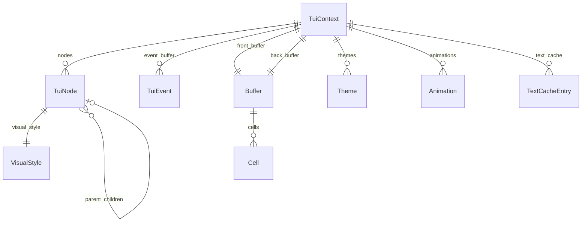

# Technical Specification (TechSpec.md)

## Kraken TUI

**Version**: 5.0
**Status**: Draft (v3)
**Date**: March 2026
**Source of Truth**: [Architecture.md](./Architecture.md), [PRD.md](./PRD.md)

**Scope note**: This document is intentionally v3-focused. The full v0-v2 narrative is compressed to reduce noise. v2 behavior remains the compatibility baseline unless explicitly changed here.

**Changelog (succinct)**:

- v5.0 (v3 planning): Added ADR-T24..T31, v3 FFI additions, runner contract, throughput/cache gates, and distribution matrix.
- v4.1 (v2 complete): Accessibility and choreography finalized; stable baseline = 96 FFI symbols.
- v4.0 and earlier: See git history for full historical narrative.

---

## 1. STACK SPECIFICATION (BILL OF MATERIALS)

### Native Core

| Component          | Choice               | Version       | Rationale                                                     |
| ------------------ | -------------------- | ------------- | ------------------------------------------------------------- |
| Language           | Rust                 | Stable 1.93.x | Performance engine and state owner per architecture invariant |
| Edition            | Rust 2021            | 2021          | Matches current crate and toolchain                           |
| Build Target       | cdylib               | -             | Shared library for Bun FFI consumption                        |
| Layout Engine      | taffy                | 0.9.x         | Flexbox layout in Rust                                        |
| Terminal Backend   | crossterm            | 0.29.x        | Cross-platform terminal I/O                                   |
| Markdown Parser    | pulldown-cmark       | 0.13.x        | Native markdown parsing                                       |
| Syntax Highlighter | syntect              | 5.3.x         | Native code highlighting                                      |
| Text Width         | unicode-width        | 0.2.x         | Correct display-cell width                                    |
| Grapheme Handling  | unicode-segmentation | 1.12.x        | Cursor/edit semantics for Unicode graphemes                   |
| Attribute Flags    | bitflags             | 2.x           | Compact cell style flags                                      |

### Host Language Bindings

| Component     | Choice               | Version            | Rationale                               |
| ------------- | -------------------- | ------------------ | --------------------------------------- |
| Runtime       | Bun                  | >= 1.0 (dev 1.3.x) | Native FFI and TS execution             |
| Language      | TypeScript           | 5.x                | Type-safe host API                      |
| FFI Mechanism | bun:ffi              | built-in           | Thin host surface, no external bridge   |
| Reactivity    | @preact/signals-core | ^1.8.0             | Lightweight reactive reconciler support |

### Build Artifacts

| Artifact     | Format                       | Output                 |
| ------------ | ---------------------------- | ---------------------- |
| Native Core  | libkraken_tui.{so,dylib,dll} | native/target/release/ |
| Host Package | TypeScript source            | ts/src/                |

### CI and Tooling

| Tool           | Location             | Purpose                         |
| -------------- | -------------------- | ------------------------------- |
| rustfmt        | Rust toolchain       | formatting                      |
| clippy         | Rust toolchain       | linting                         |
| bun test       | ts/                  | FFI and TS tests                |
| cargo bench    | native/              | throughput and cache benchmarks |
| GitHub Actions | .github/workflows/\* | matrix CI, gates, packaging     |

---

## 2. ARCHITECTURE DECISION RECORDS

### 2.1 Inherited Baseline (Concise)

The following ADRs are retained from v2 and remain active contract baseline.

| ADR             | Retained Decision                                              | Why it remains                                    |
| --------------- | -------------------------------------------------------------- | ------------------------------------------------- |
| T01             | Buffer-poll event drain (`tui_read_input` + `tui_next_event`)  | Keeps FFI boundary simple and deterministic       |
| T02             | Layout and style APIs are separated                            | Preserves module boundaries and SRP               |
| T03             | `catch_unwind` and error-code contract on every FFI entrypoint | Prevents panic crossing C ABI                     |
| T04             | Read-modify-write style/layout mutations                       | Prevents accidental property clobbering           |
| T05             | `TerminalBackend` trait abstraction                            | Enables MockBackend tests and backend swap path   |
| T06             | Custom struct packing in TS                                    | Keeps critical FFI path dependency-light          |
| T07             | Unicode width measurement in native                            | Correct layout and cursor semantics               |
| T12 + T21       | Theme mask resolution + per-node-type defaults                 | Explicit styles win, theme fills gaps             |
| T13 + T14 + T22 | Host-driven animation with render offsets                      | Keeps timing explicit and layout decoupled        |
| T16             | `OnceLock<RwLock<TuiContext>>` global state                    | Soundness and future-safe synchronization         |
| T17 + T18       | `destroy_subtree` and `insert_child`                           | Reconciler-grade tree mutation primitives         |
| T19             | TextArea baseline                                              | Multi-line editor foundation                      |
| T20             | JSX factory + signals reconciler                               | Lightweight declarative mode over imperative core |
| T23             | Accessibility foundation                                       | Roles/labels/descriptions + accessibility event   |

### 2.2 v3 Decisions

### ADR-T24: Terminal Writer Throughput

**Context:** Current per-cell emission spends too many bytes/ops on cursor/style commands under heavy diffs.

**Decision:** Add run compaction and a stateful writer stage (`WriterState`) after cell diffing and before terminal emission.

**Emission rules:**

1. Deterministic row-major ordering.
2. Cursor move only when position is non-contiguous.
3. Style commands only on style delta.
4. Frame-end attribute reset, not per-cell reset.
5. Emit contiguous same-style cells as one run payload.

**Consequences:**

- (+) Lower write bytes and control-sequence count.
- (+) No C ABI expansion required.
- (-) Writer complexity increases.

### ADR-T25: Rich Text and Wrap Cache

**Context:** Markdown/highlight parse and wrap work is repeated for stable content and width.

**Decision:** Add bounded native LRU cache keyed by `(content_hash, format, language_hash, wrap_width, style_fingerprint)`.

**Defaults:**

- Global text cache cap: 8 MiB.
- Eviction: LRU by access tick.
- Capacity is hard bounded and accounted toward PRD memory budget.

**Consequences:**

- (+) Significant parse/wrap reduction for unchanged content.
- (+) Native ownership of CPU-intensive text pipeline preserved.
- (-) Invalidation and memory accounting complexity.

### ADR-T26: Runner API (TypeScript, no native thread)

**Context:** Manual event-loop wiring repeats lifecycle and cleanup glue.

**Decision:** Add host-level `app.run(options)` and `app.stop()` on `Kraken` instances. Keep native render model synchronous.

**Modes:**

- `onChange` (default): render when work exists.
- `continuous`: fixed-fps loop for animation-heavy workloads.

**Consequences:**

- (+) Better time-to-hello-world.
- (+) No hidden native async model.
- (-) Host-side policy code must stay deterministic across Bun versions.

### ADR-T27: Dashboard Staple Widgets in Native Core

**Context:** Missing table/list/tabs/overlay forces users to hand-roll common dashboard UX.

**Decision:** Add node types and native rendering/state for `Table`, `List`, `Tabs`, and `Overlay`.

**Consequences:**

- (+) Closes major adoption gap for dashboard workloads.
- (+) Keeps high-frequency rendering in Rust.
- (-) FFI surface increases.

### ADR-T28: Editor-Grade TextArea Extensions

**Context:** v2 TextArea lacks selection, search, and history controls.

**Decision:** Extend TextArea with selection, selected-text extraction, find-next, and bounded undo/redo.

**Defaults:**

- Undo/redo limit: 256 operations per TextArea.

**Consequences:**

- (+) Practical editor workflows become first-class.
- (+) Clipboard integration stays host-owned (no OS coupling in native).
- (-) TextArea state model grows.

### ADR-T29: Distribution UX with Prebuilt Artifacts

**Context:** Build-from-source install path is fragile on fresh machines.

**Decision:** Publish prebuilt native artifacts for primary runtime triples, with source-build fallback.

**Minimum target matrix:**

- linux-x64-gnu
- linux-arm64-gnu
- darwin-arm64
- darwin-x64
- win32-x64-msvc

**Consequences:**

- (+) Lower install friction and faster onboarding.
- (-) Release pipeline complexity (artifact integrity and matrix validation).

### ADR-T30: Deterministic Golden Tests and Benchmark Gates

**Context:** Existing tests are strong but do not enforce writer/cache performance regressions.

**Decision:** Add deterministic golden snapshots (MockBackend text fixtures) and `cargo bench`-based CI gates.

**Consequences:**

- (+) Regressions are measurable and enforceable.
- (-) Golden fixture updates require explicit workflow discipline.

### ADR-T31: Background Render Thread is Conditional Only

**Context:** Architecture Risk 7 descoped background rendering; synchronous pipeline is canonical.

**Decision:** Keep synchronous rendering as default contract. Background render thread is experiment-only and opt-in.

**Promotion criteria:**

1. Benchmark win on canonical workloads.
2. No event-order or state-visibility semantic drift.
3. Shutdown and terminal restore parity with synchronous mode.

**Consequences:**

- (+) Protects maintainability and mental model.
- (-) Requires strict gate discipline if experiment is pursued.

---

## 3. DATA MODEL (CURRENT v3)

### 3.1 In-Memory ERD


```mermaid
erDiagram
    TuiContext ||--o{ TuiNode : nodes
    TuiContext ||--o{ TuiEvent : event_buffer
    TuiContext ||--|| Buffer : front_buffer
    TuiContext ||--|| Buffer : back_buffer
    TuiContext ||--o{ Theme : themes
    TuiContext ||--o{ Animation : animations
    TuiContext ||--o{ TextCacheEntry : text_cache
    TuiNode ||--|| VisualStyle : visual_style
    TuiNode }o--o| TuiNode : parent_children
    Buffer ||--o{ Cell : cells
```

### 3.2 Enums

#### NodeType

```rust
#[repr(u8)]
pub enum NodeType {
    Box = 0,
    Text = 1,
    Input = 2,
    Select = 3,
    ScrollBox = 4,
    TextArea = 5,
    Table = 6,
    List = 7,
    Tabs = 8,
    Overlay = 9,
}
```

#### ContentFormat

```rust
#[repr(u8)]
pub enum ContentFormat {
    Plain = 0,
    Markdown = 1,
    Code = 2,
}
```

#### TuiEventType

```rust
#[repr(u32)]
pub enum TuiEventType {
    None = 0,
    Key = 1,
    Mouse = 2,
    Resize = 3,
    FocusChange = 4,
    Change = 5,
    Submit = 6,
    Accessibility = 7,
}
```

#### WrapMode

```rust
#[repr(u8)]
pub enum WrapMode {
    Off = 0,
    Soft = 1,
    Hard = 2,
}
```

#### Easing

```rust
#[repr(u8)]
pub enum Easing {
    Linear = 0,
    EaseIn = 1,
    EaseOut = 2,
    EaseInOut = 3,
    CubicIn = 4,
    CubicOut = 5,
    Elastic = 6,
    Bounce = 7,
}
```

### 3.3 Structs

#### VisualStyle

```rust
pub struct VisualStyle {
    pub fg_color: u32,
    pub bg_color: u32,
    pub border_style: BorderStyle,
    pub border_color: u32,
    pub attrs: CellAttrs,
    pub opacity: f32,
    pub style_mask: u8,
}
```

#### TuiNode

```rust
pub struct TuiNode {
    pub node_type: NodeType,
    pub taffy_node: taffy::NodeId,
    pub content: String,
    pub content_format: ContentFormat,
    pub code_language: Option<String>,

    pub children: Vec<u32>,
    pub parent: Option<u32>,

    pub visual_style: VisualStyle,
    pub dirty: bool,
    pub focusable: bool,
    pub visible: bool,

    pub scroll_x: i32,
    pub scroll_y: i32,
    pub render_offset: (f32, f32),
    pub z_index: i32,

    // TextArea baseline and v3 extensions
    pub cursor_row: u32,
    pub cursor_col: u32,
    pub wrap_mode: u8,
    pub selection_anchor: Option<(u32, u32)>,
    pub selection_focus: Option<(u32, u32)>,
    pub history_limit: u32,

    // Optional v3 widget state
    pub table_state: Option<TableState>,
    pub list_state: Option<ListState>,
    pub tabs_state: Option<TabsState>,
    pub overlay_state: Option<OverlayState>,

    // Accessibility
    pub role: Option<AccessibilityRole>,
    pub label: Option<String>,
    pub description: Option<String>,
}
```

#### v3 Widget and Cache State

```rust
pub struct TableState {
    pub columns: Vec<TableColumn>,
    pub rows: Vec<Vec<String>>,
    pub selected_row: Option<u32>,
    pub header_visible: bool,
}

pub struct TableColumn {
    pub label: String,
    pub width_value: u16,
    pub width_unit: u8, // 0=fixed, 1=percent, 2=flex
}

pub struct ListState {
    pub items: Vec<String>,
    pub selected: Option<u32>,
    pub viewport_offset: u32,
    pub virtualized: bool,
}

pub struct TabsState {
    pub labels: Vec<String>,
    pub active_index: u32,
}

pub struct OverlayState {
    pub open: bool,
    pub modal: bool,
    pub clear_under: bool,
    pub dismiss_on_escape: bool,
}

pub struct WriterState {
    pub cursor_x: u16,
    pub cursor_y: u16,
    pub fg: u32,
    pub bg: u32,
    pub attrs: CellAttrs,
    pub has_cursor: bool,
}

pub struct TextCacheKey {
    pub content_hash: u64,
    pub format: ContentFormat,
    pub language_hash: u64,
    pub wrap_width: u16,
    pub style_fingerprint: u64,
}

pub struct TextCacheEntry {
    pub spans: Vec<StyledSpan>,
    pub wrapped_lines: Vec<String>,
    pub byte_size: u32,
    pub last_access_tick: u64,
}

pub struct TextCache {
    pub entries: HashMap<TextCacheKey, TextCacheEntry>,
    pub lru_order: VecDeque<TextCacheKey>,
    pub max_bytes: u32,
    pub used_bytes: u32,
}
```

#### TuiContext

```rust
pub struct TuiContext {
    pub tree: TaffyTree<()>,
    pub nodes: HashMap<u32, TuiNode>,
    pub next_handle: u32,
    pub root: Option<u32>,

    pub event_buffer: Vec<TuiEvent>,
    pub focused: Option<u32>,

    pub front_buffer: Buffer,
    pub back_buffer: Buffer,
    pub backend: Box<dyn TerminalBackend>,

    pub syntax_set: syntect::parsing::SyntaxSet,
    pub theme_set: syntect::highlighting::ThemeSet,
    pub text_cache: TextCache,
    pub writer_state: WriterState,

    pub themes: HashMap<u32, Theme>,
    pub theme_bindings: HashMap<u32, u32>,
    pub next_theme_handle: u32,

    pub animations: Vec<Animation>,
    pub next_anim_handle: u32,
    pub last_render_time: Option<Instant>,
    pub choreo_groups: HashMap<u32, ChoreoGroup>,
    pub next_choreo_handle: u32,

    pub last_error: String,
    pub debug_mode: bool,

    // perf counters
    pub perf_layout_us: u64,
    pub perf_render_us: u64,
    pub perf_diff_cells: u32,
    pub perf_write_bytes_estimate: u64,
    pub perf_write_runs: u32,
    pub perf_style_deltas: u32,
    pub perf_text_parse_us: u64,
    pub perf_text_wrap_us: u64,
    pub perf_text_cache_hits: u32,
    pub perf_text_cache_misses: u32,
}
```

---

## 4. FFI CONTRACT (C ABI)

### 4.1 Conventions

- Prefix: `tui_`
- ABI: `extern "C"` + `#[no_mangle]`
- Handles: `u32`, with `0` invalid sentinel
- String-in: `(*const u8 ptr, u32 len)`; Rust copies
- String-out: caller-provided `(*mut u8 buffer, u32 len)`
- Return codes: `0` success, `-1` error, `-2` panic
- Panic safety: all entry points wrapped in `catch_unwind`
- Error retrieval: `tui_get_last_error()`

### 4.2 Baseline Inheritance Policy

All v2.1 + Epic M symbols remain valid and unchanged unless explicitly superseded below. This includes lifecycle, tree, layout, style, focus, animation, theme, and accessibility foundations.

### 4.3 v3 Additions (New Symbols)

### 4.3.1 Scroll Enhancements (+3)

| Function                         | Signature                         | Returns | Description                                  |
| -------------------------------- | --------------------------------- | ------- | -------------------------------------------- |
| `tui_scroll_set_show_scrollbar`  | `(u32 handle, u8 enabled) -> i32` | 0 / -1  | Enable or disable native scrollbar rendering |
| `tui_scroll_set_scrollbar_side`  | `(u32 handle, u8 side) -> i32`    | 0 / -1  | 0=right, 1=left                              |
| `tui_scroll_set_scrollbar_width` | `(u32 handle, u8 width) -> i32`   | 0 / -1  | Width in cells, valid `1..=3`                |

### 4.3.2 TextArea Editor Extensions (+8)

| Function                             | Signature                                                                  | Returns    | Description                         |
| ------------------------------------ | -------------------------------------------------------------------------- | ---------- | ----------------------------------- |
| `tui_textarea_set_selection`         | `(u32 handle, u32 s_row, u32 s_col, u32 e_row, u32 e_col) -> i32`          | 0 / -1     | Set active selection range          |
| `tui_textarea_clear_selection`       | `(u32 handle) -> i32`                                                      | 0 / -1     | Clear active selection              |
| `tui_textarea_get_selected_text_len` | `(u32 handle) -> i32`                                                      | len / -1   | Selected text byte length           |
| `tui_textarea_get_selected_text`     | `(u32 handle, *mut u8 buffer, u32 buffer_len) -> i32`                      | bytes / -1 | Copy selected text to caller buffer |
| `tui_textarea_find_next`             | `(u32 handle, *const u8 ptr, u32 len, u8 case_sensitive, u8 regex) -> i32` | 1/0/-1     | Find next match from cursor         |
| `tui_textarea_undo`                  | `(u32 handle) -> i32`                                                      | 0 / -1     | Undo last edit                      |
| `tui_textarea_redo`                  | `(u32 handle) -> i32`                                                      | 0 / -1     | Redo reverted edit                  |
| `tui_textarea_set_history_limit`     | `(u32 handle, u32 limit) -> i32`                                           | 0 / -1     | Set undo/redo history bound         |

### 4.3.3 Table Widget (+10)

| Function                       | Signature                                                                                            | Returns    | Description                           |
| ------------------------------ | ---------------------------------------------------------------------------------------------------- | ---------- | ------------------------------------- |
| `tui_table_set_column_count`   | `(u32 handle, u32 count) -> i32`                                                                     | 0 / -1     | Resize column schema                  |
| `tui_table_set_column`         | `(u32 handle, u32 index, *const u8 label_ptr, u32 label_len, u16 width_value, u8 width_unit) -> i32` | 0 / -1     | Set column metadata                   |
| `tui_table_insert_row`         | `(u32 handle, u32 index) -> i32`                                                                     | 0 / -1     | Insert row (append on overflow index) |
| `tui_table_remove_row`         | `(u32 handle, u32 index) -> i32`                                                                     | 0 / -1     | Remove row                            |
| `tui_table_clear_rows`         | `(u32 handle) -> i32`                                                                                | 0 / -1     | Clear all rows                        |
| `tui_table_set_cell`           | `(u32 handle, u32 row, u32 col, *const u8 ptr, u32 len) -> i32`                                      | 0 / -1     | Set one cell content                  |
| `tui_table_get_cell`           | `(u32 handle, u32 row, u32 col, *mut u8 buffer, u32 buffer_len) -> i32`                              | bytes / -1 | Copy one cell content                 |
| `tui_table_set_selected_row`   | `(u32 handle, i32 row) -> i32`                                                                       | 0 / -1     | `-1` clears selection                 |
| `tui_table_get_selected_row`   | `(u32 handle) -> i32`                                                                                | row / -1   | Read selected row                     |
| `tui_table_set_header_visible` | `(u32 handle, u8 visible) -> i32`                                                                    | 0 / -1     | Show or hide header                   |

### 4.3.4 List Widget (+7)

| Function                | Signature                                                        | Returns    | Description           |
| ----------------------- | ---------------------------------------------------------------- | ---------- | --------------------- |
| `tui_list_add_item`     | `(u32 handle, *const u8 ptr, u32 len) -> i32`                    | 0 / -1     | Append item           |
| `tui_list_remove_item`  | `(u32 handle, u32 index) -> i32`                                 | 0 / -1     | Remove item           |
| `tui_list_clear_items`  | `(u32 handle) -> i32`                                            | 0 / -1     | Clear items           |
| `tui_list_get_count`    | `(u32 handle) -> i32`                                            | count / -1 | Get item count        |
| `tui_list_get_item`     | `(u32 handle, u32 index, *mut u8 buffer, u32 buffer_len) -> i32` | bytes / -1 | Copy item text        |
| `tui_list_set_selected` | `(u32 handle, i32 index) -> i32`                                 | 0 / -1     | `-1` clears selection |
| `tui_list_get_selected` | `(u32 handle) -> i32`                                            | index / -1 | Read selected index   |

### 4.3.5 Tabs Widget (+6)

| Function              | Signature                                     | Returns    | Description      |
| --------------------- | --------------------------------------------- | ---------- | ---------------- |
| `tui_tabs_add_tab`    | `(u32 handle, *const u8 ptr, u32 len) -> i32` | 0 / -1     | Append tab label |
| `tui_tabs_remove_tab` | `(u32 handle, u32 index) -> i32`              | 0 / -1     | Remove tab       |
| `tui_tabs_clear_tabs` | `(u32 handle) -> i32`                         | 0 / -1     | Clear tabs       |
| `tui_tabs_get_count`  | `(u32 handle) -> i32`                         | count / -1 | Get tab count    |
| `tui_tabs_set_active` | `(u32 handle, u32 index) -> i32`              | 0 / -1     | Set active tab   |
| `tui_tabs_get_active` | `(u32 handle) -> i32`                         | index / -1 | Read active tab  |

### 4.3.6 Overlay Widget (+4)

| Function                      | Signature                             | Returns | Description                       |
| ----------------------------- | ------------------------------------- | ------- | --------------------------------- |
| `tui_overlay_set_open`        | `(u32 handle, u8 open) -> i32`        | 0 / -1  | Open or close overlay             |
| `tui_overlay_get_open`        | `(u32 handle) -> i32`                 | 1/0/-1  | Read open state                   |
| `tui_overlay_set_modal`       | `(u32 handle, u8 modal) -> i32`       | 0 / -1  | Enable or disable modal behavior  |
| `tui_overlay_set_clear_under` | `(u32 handle, u8 clear_under) -> i32` | 0 / -1  | Clear underlay region before draw |

### 4.4 Event Payload (v3 additions)

| Event Type      | `target`       | `data[0]`        | `data[1]`    | Notes                                       |
| --------------- | -------------- | ---------------- | ------------ | ------------------------------------------- |
| Change on List  | list handle    | selected index   | 0            | Read item via `tui_list_get_item`           |
| Change on Tabs  | tabs handle    | active tab index | 0            | Read with `tui_tabs_get_active`             |
| Change on Table | table handle   | selected row     | selected col | Optional cell read via `tui_table_get_cell` |
| Accessibility   | focused handle | role code        | 0            | unchanged baseline from Epic M              |

### 4.5 Diagnostics Counters

| ID  | Counter                         | Unit   |
| --- | ------------------------------- | ------ |
| 0   | last layout duration            | us     |
| 1   | last render duration            | us     |
| 2   | last diff cell count            | cells  |
| 3   | current event buffer depth      | events |
| 4   | total node count                | nodes  |
| 5   | dirty node count                | nodes  |
| 6   | active animation count          | anims  |
| 7   | last terminal write bytes (estimated) | bytes  |
| 8   | last terminal write run count   | runs   |
| 9   | last terminal style delta count | ops    |
| 10  | last text parse duration        | us     |
| 11  | last text wrap duration         | us     |
| 12  | text cache hits (frame)         | hits   |
| 13  | text cache misses (frame)       | misses |

### 4.6 Symbol Count

- Baseline at end of v2 + Epic M: **96**
- v3 additions in this spec: **+38**
- Projected total after v3: **134**

Breakdown of v3 additions:

- Scroll: +3
- TextArea editor extensions: +8
- Table: +10
- List: +7
- Tabs: +6
- Overlay: +4

### 4.7 Host Runner Contract (TS-only, no new C ABI)

```ts
app.run({
  mode: "onChange" | "continuous",
  fps?: number,
  idleTimeout?: number,
  onEvent?: (event) => void,
  onTick?: () => void,
  debugOverlay?: boolean,
}): Promise<void>

app.stop(): void
```

Implementation source: `ts/src/app.ts` and `ts/src/loop.ts`, composed from existing FFI lifecycle/input/render APIs.

---

## 5. IMPLEMENTATION GUIDELINES

### 5.1 Project Structure (v3 target)

```text
kraken-tui/
|- native/
|  |- Cargo.toml
|  `- src/
|     |- lib.rs
|     |- context.rs
|     |- types.rs
|     |- tree.rs
|     |- layout.rs
|     |- style.rs
|     |- render.rs
|     |- writer.rs          # v3
|     |- terminal.rs
|     |- text.rs
|     |- text_cache.rs      # v3
|     |- event.rs
|     |- scroll.rs
|     |- theme.rs
|     `- animation.rs
|- ts/
|  |- package.json
|  |- check-bundle.ts
|  |- bench-render.ts       # v3
|  |- test-ffi.test.ts
|  |- test-jsx.test.ts
|  `- src/
|     |- app.ts
|     |- loop.ts
|     |- ffi.ts
|     |- ffi/structs.ts
|     |- widget.ts
|     |- widgets/
|     |  |- box.ts
|     |  |- text.ts
|     |  |- input.ts
|     |  |- select.ts
|     |  |- scrollbox.ts
|     |  |- textarea.ts
|     |  |- table.ts       # v3
|     |  |- list.ts        # v3
|     |  |- tabs.ts        # v3
|     |  `- overlay.ts     # v3
|     |- jsx/
|     `- effect/
`- docs/
```

### 5.2 Module Responsibilities (v3 focus)

| Module       | File(s)                            | Responsibility                                            |
| ------------ | ---------------------------------- | --------------------------------------------------------- |
| Render       | `render.rs`                        | Compute frame buffers and cell diff                       |
| Writer       | `writer.rs`                        | Build runs, emit cursor/style deltas, track write metrics |
| Text + Cache | `text.rs`, `text_cache.rs`         | Parse/highlight/wrap and bounded cache management         |
| Widgets      | `tree.rs`, `event.rs`, `render.rs` | Behavior and rendering for baseline + v3 widgets          |
| TS Runner    | `app.ts`, `loop.ts`                | lifecycle, loop policy, cleanup, event dispatch           |

### 5.3 Coding Standards

**Rust**

- `lib.rs` contains FFI entrypoints only; no business logic.
- Every FFI function uses `catch_unwind` and returns error codes per contract.
- No `unwrap()` in production path; use `Result` and explicit error propagation.
- Preserve batched-synchronous render contract unless ADR-T31 criteria are met.

**TypeScript**

- Thin command wrapper only; no state ownership drift from Rust.
- `strict: true` TypeScript.
- Runtime deps are restricted to `bun:ffi` and `@preact/signals-core`.
- Keep host bundle under PRD budget (< 50KB).

### 5.4 Build and Verification Commands

```bash
# Native build
cargo build --release --manifest-path native/Cargo.toml

# Native tests
cargo test --manifest-path native/Cargo.toml

# Native benchmark gates
cargo bench --manifest-path native/Cargo.toml

# TS tests and bundle guard
cd ts && bun test
cd ts && bun run check-bundle.ts

# TS benchmark harness
cd ts && bun run bench-render.ts
```

### 5.5 Performance and Quality Gates

| Constraint            | Target                                             | Gate                               |
| --------------------- | -------------------------------------------------- | ---------------------------------- |
| Render budget         | < 16ms per pass                                    | benchmark median and p95           |
| Input latency         | < 50ms                                             | synthetic key-to-render test       |
| FFI overhead          | < 1ms per call                                     | microbench and perf counters       |
| Memory budget         | < 20MB for 100 widgets                             | stress fixture and memory snapshot |
| Host bundle           | < 50KB                                             | `check-bundle.ts`                  |
| Writer throughput     | >= 35% fewer style/cursor ops vs per-cell baseline | counters 8 and 9                   |
| Text cache efficiency | >= 80% hits on unchanged-content rerender          | counters 12 and 13                 |

### 5.6 Runtime Pattern

**Preferred (v3):**

```ts
import { Kraken } from "kraken-tui";

const app = Kraken.init();

await app.run({
	mode: "onChange",
	idleTimeout: 100,
	onEvent: (event) => {
		if (event.type === "key" && event.keyCode === 0x010e) app.stop();
	},
});
```

**Manual fallback (fully supported):**

```ts
let running = true;
while (running) {
	app.readInput(16);
	for (const event of app.drainEvents()) {
		if (event.type === "key" && event.keyCode === 0x010e) running = false;
	}
	app.render();
}
app.shutdown();
```

---

## Appendix A: Legacy Summary

| Version | Scope Summary                                                                                                                            |
| ------- | ---------------------------------------------------------------------------------------------------------------------------------------- |
| v0      | core widgets, layout, style, input, scroll, terminal abstraction, rich text                                                              |
| v1      | animation primitives/chaining and theme foundation                                                                                       |
| v2      | safe state, tree ops for reconciler, TextArea, theme inheritance, position animation, choreography, reconciler, accessibility foundation |

## Appendix B: v3 Execution Order

1. V3-A terminal writer throughput (ADR-T24)
2. V3-B rich text and wrap cache (ADR-T25)
3. V3-C runner API (ADR-T26)
4. V3-D dashboard staples (ADR-T27)
5. V3-E editor-grade TextArea (ADR-T28)
6. V3-F distribution UX (ADR-T29)
7. V3-G golden tests and benchmark gates (ADR-T30)
8. V3-H background render thread experiment (ADR-T31, conditional only)

Exit criteria for v3 completion:

- All v3 symbols implemented and covered by FFI tests.
- Benchmark and golden gates pass in CI for all required targets.
- Bundle and performance budgets remain within PRD constraints.
